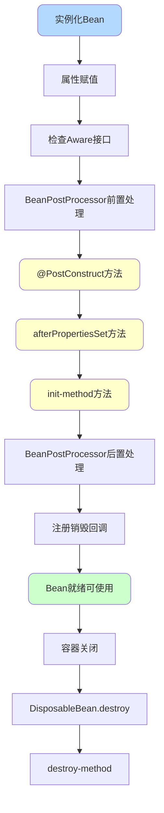
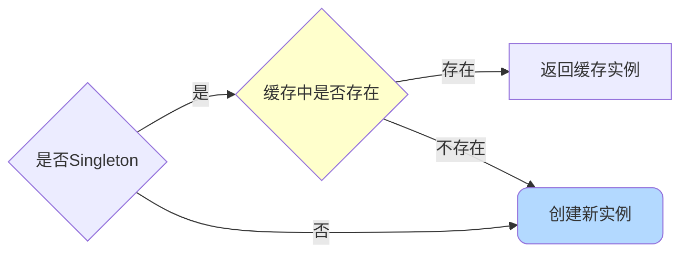
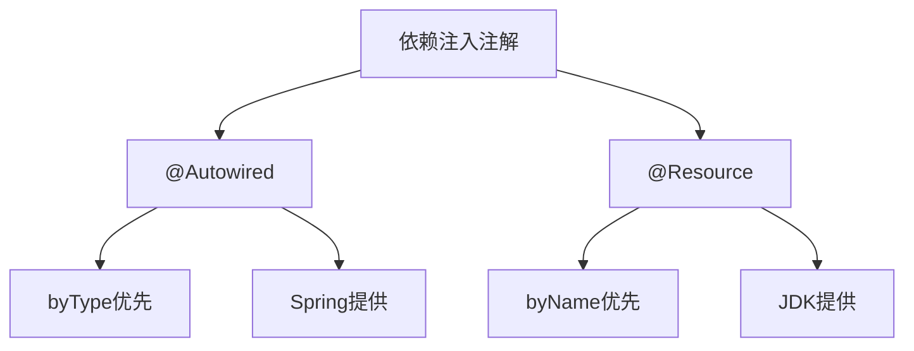

# Bean生命周期与依赖注入

## Bean的生命周期

Spring Bean的生命周期可以分为三个大阶段:**创建、使用、销毁**,细分为五个小阶段:**实例化、初始化、注册销毁回调、正常使用、销毁**。



### 一、实例化阶段

Spring容器通过反射API创建Bean实例,主要步骤:

1. 解析Bean的类,确保类已加载
2. 检查访问权限
3. 选择创建方式:
   - 工厂方法
   - 构造函数(自动装配或默认)

```java
// 实例化示例
@Component
public class OrderService {
    
    private InventoryService inventoryService;
    
    // Spring会调用构造函数创建实例
    public OrderService() {
        System.out.println("OrderService实例化");
    }
}
```

**单例检查**:对于singleton作用域的Bean,实例化前会先检查缓存中是否已存在。



### 二、初始化阶段

初始化包含多个关键步骤,在`AbstractAutowireCapableBeanFactory`的`initializeBean`方法中完成。

#### 1. 属性赋值

通过`populateBean`方法注入依赖的属性:

```java
@Service
public class OrderService {
    
    @Autowired
    private InventoryService inventoryService;  // 属性注入
    
    @Value("${order.timeout}")
    private int timeout;  // 配置注入
}
```

支持的注入方式:

- 自动装配(byName、byType)
- @Autowired注解
- @Value注解
- 构造器注入
- Setter注入

#### 2. 检查Aware接口

如果Bean实现了特定的Aware接口,Spring会调用相应的方法:

```java
@Component
public class ApplicationContextProvider implements BeanNameAware, ApplicationContextAware {
    
    private String beanName;
    private ApplicationContext applicationContext;
    
    @Override
    public void setBeanName(String name) {
        this.beanName = name;
        System.out.println("Bean名称:" + name);
    }
    
    @Override
    public void setApplicationContext(ApplicationContext context) {
        this.applicationContext = context;
        System.out.println("注入ApplicationContext");
    }
}
```

常用Aware接口:

- `BeanNameAware`:获取Bean名称
- `BeanClassLoaderAware`:获取类加载器
- `BeanFactoryAware`:获取BeanFactory引用
- `ApplicationContextAware`:获取ApplicationContext引用

#### 3. BeanPostProcessor前置处理

在Bean初始化前,允许对Bean进行定制化处理:

```java
@Component
public class CustomBeanPostProcessor implements BeanPostProcessor {
    
    @Override
    public Object postProcessBeforeInitialization(Object bean, String beanName) {
        System.out.println("Bean初始化前处理:" + beanName);
        return bean;
    }
}
```

#### 4. 初始化方法调用

Spring支持三种初始化方法,执行顺序为:**@PostConstruct → afterPropertiesSet → init-method**


**(1) @PostConstruct**

```java
@Service
public class DataInitService {
    
    @PostConstruct
    public void init() {
        System.out.println("@PostConstruct执行 - 初始化数据");
        // 初始化缓存数据
    }
}
```

@PostConstruct在`CommonAnnotationBeanPostProcessor`的前置处理中被调用。

**(2) InitializingBean.afterPropertiesSet**

```java
@Service
public class CacheService implements InitializingBean {
    
    @Override
    public void afterPropertiesSet() {
        System.out.println("afterPropertiesSet执行 - 预热缓存");
        // 预热缓存
    }
}
```

**(3) init-method**

```java
@Configuration
public class AppConfig {
    
    @Bean(initMethod = "customInit")
    public ConfigService configService() {
        return new ConfigService();
    }
}

public class ConfigService {
    public void customInit() {
        System.out.println("init-method执行 - 加载配置");
        // 加载配置文件
    }
}
```

**执行顺序示例**:

```java
@Service
public class InitOrderDemo implements InitializingBean {
    
    public InitOrderDemo() {
        System.out.println("1. 构造函数执行");
    }
    
    @PostConstruct
    public void postConstruct() {
        System.out.println("2. @PostConstruct执行");
    }
    
    @Override
    public void afterPropertiesSet() {
        System.out.println("3. afterPropertiesSet执行");
    }
    
    public void initMethod() {
        System.out.println("4. init-method执行");
    }
}
```

#### 5. BeanPostProcessor后置处理

Bean初始化完成后的处理,AOP代理就是在这一步创建的:

```java
@Component
public class CustomBeanPostProcessor implements BeanPostProcessor {
    
    @Override
    public Object postProcessAfterInitialization(Object bean, String beanName) {
        System.out.println("Bean初始化后处理:" + beanName);
        // 这里可以返回代理对象
        return bean;
    }
}
```

`AnnotationAwareAspectJAutoProxyCreator`在后置处理中完成AOP代理的创建。

### 三、注册销毁回调

在Bean创建过程中注册销毁回调,确保容器关闭时能正确清理资源:

```java
@Service
public class ConnectionService implements DisposableBean {
    
    private Connection connection;
    
    @PostConstruct
    public void init() {
        // 创建连接
        connection = createConnection();
    }
    
    @Override
    public void destroy() {
        // 关闭连接
        if (connection != null) {
            connection.close();
        }
    }
}
```

### 四、Bean的正常使用

Bean完成初始化后进入就绪状态,可以被应用程序使用。

### 五、销毁阶段

容器关闭时,执行销毁逻辑,顺序为:**DisposableBean.destroy → destroy-method**

```java
@Service
public class ResourceService implements DisposableBean {
    
    @PreDestroy
    public void preDestroy() {
        System.out.println("@PreDestroy执行 - 释放资源");
    }
    
    @Override
    public void destroy() {
        System.out.println("DisposableBean.destroy执行");
    }
    
    public void customDestroy() {
        System.out.println("destroy-method执行");
    }
}
```

## Bean的创建方式

### 1. 注解方式(@Component系列)

最常用的方式,通过注解标注类:

```java
// Service层
@Service
public class UserService {
    public User findById(Long id) {
        return userRepository.findById(id);
    }
}

// Repository层
@Repository
public class UserRepository {
    public User findById(Long id) {
        // 数据库查询
    }
}

// Controller层
@Controller
public class UserController {
    @Autowired
    private UserService userService;
}

// 通用组件
@Component
public class MessageHandler {
    // 消息处理逻辑
}
```

### 2. @Bean注解

在配置类中定义Bean,适合封装第三方类:

```java
@Configuration
public class AppConfig {
    
    @Bean
    public DataSource dataSource() {
        DruidDataSource ds = new DruidDataSource();
        ds.setUrl("jdbc:mysql://localhost:3306/db");
        ds.setUsername("root");
        ds.setPassword("password");
        return ds;
    }
    
    @Bean(initMethod = "init", destroyMethod = "close")
    public RedisClient redisClient() {
        return new RedisClient("localhost", 6379);
    }
}
```

### 3. XML配置(不推荐)

Spring Boot流行后使用较少:

```xml
<beans>
    <bean id="userService" class="com.example.service.UserServiceImpl"/>
    
    <bean id="dataSource" class="com.alibaba.druid.pool.DruidDataSource" 
          init-method="init" destroy-method="close">
        <property name="url" value="jdbc:mysql://localhost:3306/db"/>
        <property name="username" value="root"/>
    </bean>
</beans>
```

### 4. @Import注解

快速导入类到IoC容器:

```java
@Configuration
@Import({RedisConfig.class, KafkaConfig.class})
public class AppConfig {
    // 自动导入RedisConfig和KafkaConfig
}
```

### 5. 第三方框架集成

框架通过自定义注解和BeanDefinitionRegistryPostProcessor实现:

```java
// Dubbo服务提供者
@DubboService(version = "1.0.0")
public class UserRemoteService implements UserFacade {
    @Override
    public User getUser(Long id) {
        // 远程服务实现
    }
}
```

Dubbo通过扫描@DubboService注解,动态创建Bean定义并注册到Spring容器。

## Bean的注入方式

### 1. 字段注入(不推荐)

```java
@Service
public class OrderService {
    @Autowired
    private InventoryService inventoryService;
}
```

**不推荐原因**:

- 违反单一职责原则(依赖过多不易察觉)
- 可能产生NPE(在构造器中使用会报错)
- 隐藏依赖关系(破坏封装性)
- 不利于单元测试(必须启动Spring容器)

### 2. 构造器注入(推荐)

```java
@Service
public class OrderService {
    
    private final InventoryService inventoryService;
    private final PaymentService paymentService;
    
    // Spring 4.3+单个构造器可省略@Autowired
    public OrderService(InventoryService inventoryService, 
                       PaymentService paymentService) {
        this.inventoryService = inventoryService;
        this.paymentService = paymentService;
    }
}
```

**优势**:

- 依赖完整性:确保必需依赖在对象创建时注入
- 不可变性:可使用final关键字
- 测试便利:可直接传入Mock对象
- 依赖显式化:构造器参数过多时提醒重构

### 3. Setter注入

```java
@Service
public class OrderService {
    
    private NotificationService notificationService;
    
    @Autowired
    public void setNotificationService(NotificationService notificationService) {
        this.notificationService = notificationService;
    }
}
```

适合可选依赖,可以有默认值或运行时动态设置。

### 4. 使用@Resource和@Inject

```java
@Service
public class OrderService {
    
    @Resource(name = "inventoryServiceImpl")
    private InventoryService inventoryService;
    
    @Inject
    private PaymentService paymentService;
}
```

### 5. 集合类型注入

Spring支持注入List、Map、Set等集合:

```java
@Service
public class PaymentFactory {
    
    // 注入所有PaymentService实现
    @Autowired
    private List<PaymentService> paymentServices;
    
    // Map的key是bean名称,value是bean实例
    @Autowired
    private Map<String, PaymentService> paymentServiceMap;
    
    public PaymentService getPaymentService(String type) {
        return paymentServiceMap.get(type);
    }
}
```

## @Autowired vs @Resource

### 区别对比



**@Autowired**:

- Spring提供(`org.springframework.beans.factory.annotation`)
- 默认**byType注入**,找到多个再byName
- 支持构造器、字段、Setter方法、方法参数
- 可通过`@Qualifier`指定名称
- 可设置`required=false`表示非必需

**@Resource**:

- JDK提供(`jakarta.annotation`或`javax.annotation`)
- 默认**byName注入**,找不到再byType
- 主要用于字段和Setter方法
- 可通过`name`属性指定名称
- 不支持`required`属性

### 使用示例

```java
// @Autowired - byType优先
@Service
public class OrderService {
    
    // 报错:找到多个PaymentService类型的Bean
    @Autowired
    private PaymentService paymentService;
    
    // 正确:字段名匹配Bean名称
    @Autowired
    private PaymentService aliPaymentService;
    
    // 正确:通过@Qualifier指定
    @Autowired
    @Qualifier("aliPaymentService")
    private PaymentService paymentService;
}

// @Resource - byName优先
@Service
public class OrderService {
    
    // 报错:byName找不到,byType找到多个
    @Resource
    private PaymentService paymentService;
    
    // 正确:字段名匹配Bean名称
    @Resource
    private PaymentService aliPaymentService;
    
    // 正确:通过name属性指定
    @Resource(name = "aliPaymentService")
    private PaymentService paymentService;
}
```

**推荐使用**:

- `@Resource`:语义更清晰,减少对Spring的耦合
- `@Autowired`配合构造器注入:实现依赖的不可变性
