# Spring事件机制详解

## 事件驱动架构概述

Spring事件机制是基于**观察者模式**实现的一种解耦通信方式。当某个事件发生时，事件发布者发布事件，所有订阅该事件的监听器都会收到通知并执行相应的处理逻辑。

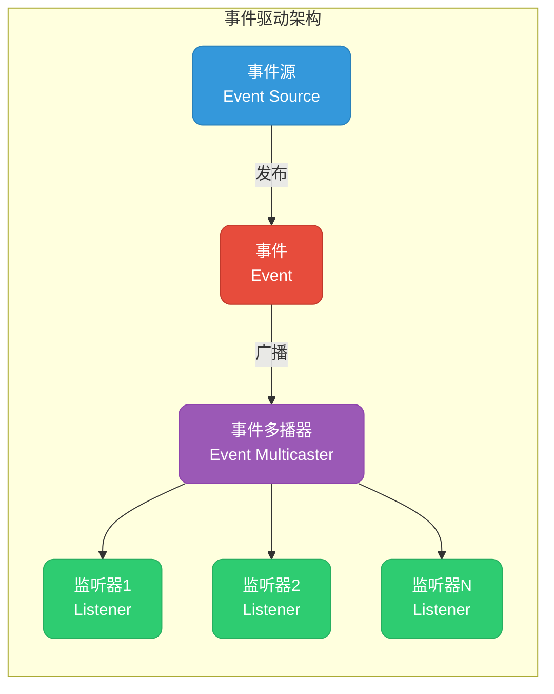

### 为什么需要事件机制

在传统的同步调用中，服务之间存在强耦合：

```java
// 传统方式：强耦合
@Service
public class OrderService {
    @Autowired
    private NotificationService notificationService;
    @Autowired
    private InventoryService inventoryService;
    @Autowired
    private PointsService pointsService;
    
    public void createOrder(Order order) {
        // 1. 保存订单
        orderRepository.save(order);
        
        // 2. 直接调用各个服务（强耦合）
        notificationService.sendNotification(order);
        inventoryService.deductStock(order);
        pointsService.addPoints(order);
    }
}
```

**问题**：OrderService必须知道所有需要通知的服务，新增服务时需要修改OrderService代码。

使用事件机制后，实现了**松耦合**：

```java
// 事件驱动方式：松耦合
@Service
public class OrderService {
    @Autowired
    private ApplicationEventPublisher eventPublisher;
    
    public void createOrder(Order order) {
        // 1. 保存订单
        orderRepository.save(order);
        
        // 2. 发布事件（解耦）
        eventPublisher.publishEvent(new OrderCreatedEvent(this, order));
    }
}
```

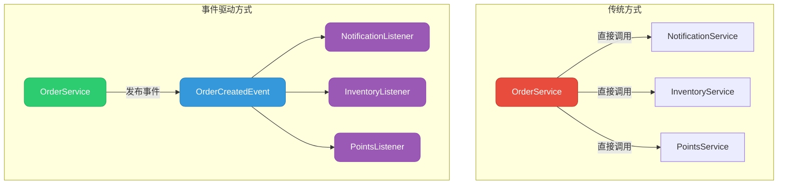

## 核心组件详解

Spring事件机制由四个核心组件组成：

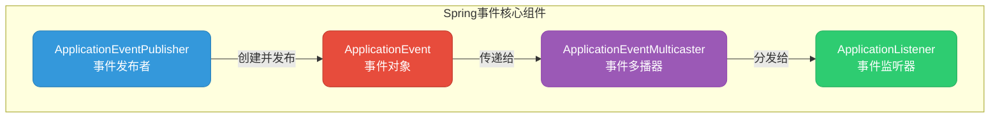

### ApplicationEvent - 事件对象

`ApplicationEvent`是所有Spring事件的基类，继承自JDK的`EventObject`。

```java
public abstract class ApplicationEvent extends EventObject {
    
    /** 事件发生的时间戳 */
    private final long timestamp;

    public ApplicationEvent(Object source) {
        super(source);
        this.timestamp = System.currentTimeMillis();
    }

    public ApplicationEvent(Object source, Clock clock) {
        super(source);
        this.timestamp = clock.millis();
    }

    public final long getTimestamp() {
        return this.timestamp;
    }
}
```

**关键属性说明**：

| 属性 | 说明 |
|------|------|
| `source` | 事件源对象，表示事件的发起者（继承自EventObject） |
| `timestamp` | 事件发生的时间戳 |

### ApplicationEventPublisher - 事件发布者

`ApplicationEventPublisher`是事件发布的核心接口，`ApplicationContext`实现了该接口。

```java
@FunctionalInterface
public interface ApplicationEventPublisher {
    
    // 发布ApplicationEvent类型的事件
    default void publishEvent(ApplicationEvent event) {
        publishEvent((Object) event);
    }
    
    // 发布任意对象作为事件（Spring 4.2+）
    void publishEvent(Object event);
}
```

从Spring 4.2开始，可以发布任意对象作为事件，Spring会自动将其包装为`PayloadApplicationEvent`。

### ApplicationListener - 事件监听器

事件监听器是处理事件的核心组件，有两种实现方式：

```java
// 方式一：实现ApplicationListener接口
@FunctionalInterface
public interface ApplicationListener<E extends ApplicationEvent> 
        extends EventListener {
    
    void onApplicationEvent(E event);
    
    // 创建泛型事件监听器（Spring 5.3+）
    static <T> ApplicationListener<PayloadApplicationEvent<T>> forPayload(
            Consumer<T> consumer) {
        return event -> consumer.accept(event.getPayload());
    }
}
```

### ApplicationEventMulticaster - 事件多播器

事件多播器负责将事件分发给所有匹配的监听器。

```java
public interface ApplicationEventMulticaster {
    
    // 添加监听器
    void addApplicationListener(ApplicationListener<?> listener);
    
    // 添加监听器Bean名称
    void addApplicationListenerBean(String listenerBeanName);
    
    // 移除监听器
    void removeApplicationListener(ApplicationListener<?> listener);
    
    // 广播事件
    void multicastEvent(ApplicationEvent event);
    
    void multicastEvent(ApplicationEvent event, 
                        @Nullable ResolvableType eventType);
}
```

Spring默认使用`SimpleApplicationEventMulticaster`实现类：

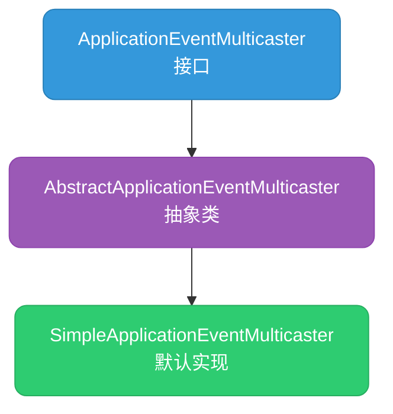

## Spring内置事件

Spring容器在生命周期的不同阶段会发布内置事件：

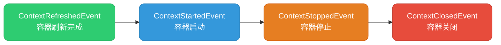

### 内置事件详解

| 事件类型 | 触发时机 | 常见用途 |
|---------|---------|---------|
| `ContextRefreshedEvent` | 容器初始化或刷新完成后 | 执行初始化任务、预热缓存 |
| `ContextStartedEvent` | 调用`start()`方法后 | 启动后台任务 |
| `ContextStoppedEvent` | 调用`stop()`方法后 | 暂停后台任务 |
| `ContextClosedEvent` | 容器关闭时 | 释放资源、优雅停机 |
| `RequestHandledEvent` | HTTP请求处理完成后 | 记录请求日志、统计 |

### SpringBoot额外事件

SpringBoot在启动过程中发布了更多事件：

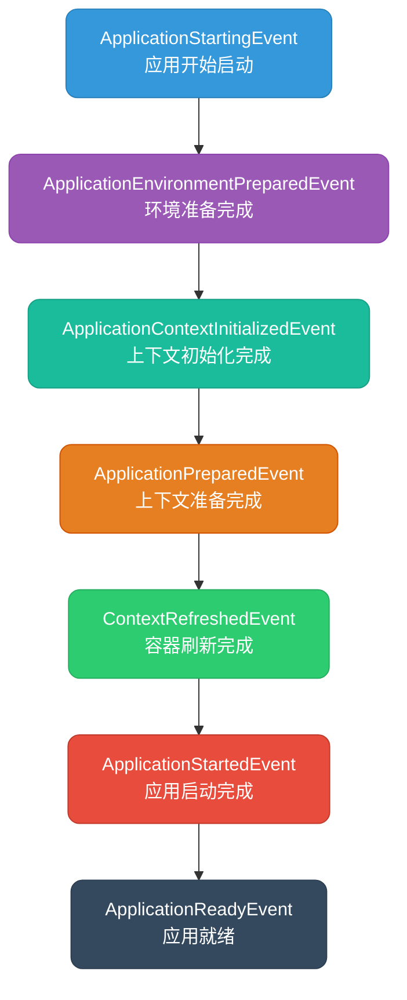

```java
// 监听应用就绪事件
@Component
public class AppReadyListener implements ApplicationListener<ApplicationReadyEvent> {
    
    @Override
    public void onApplicationEvent(ApplicationReadyEvent event) {
        System.out.println("应用已就绪，可以接收请求");
        // 执行初始化任务：预热缓存、注册服务等
    }
}
```

## 自定义事件开发

### 定义事件类

自定义事件需要继承`ApplicationEvent`：

```java
/**
 * 订单创建事件
 */
public class OrderCreatedEvent extends ApplicationEvent {
    
    private final Order order;
    private final LocalDateTime createTime;
    
    public OrderCreatedEvent(Object source, Order order) {
        super(source);
        this.order = order;
        this.createTime = LocalDateTime.now();
    }
    
    public Order getOrder() {
        return order;
    }
    
    public LocalDateTime getCreateTime() {
        return createTime;
    }
}
```

**设计建议**：

```java
/**
 * 事件基类 - 携带通用信息
 */
public abstract class BaseEvent extends ApplicationEvent {
    
    /** 事件ID，用于追踪 */
    private final String eventId;
    
    /** 事件发生时间 */
    private final LocalDateTime occurredTime;
    
    /** 操作用户 */
    private final String operator;
    
    public BaseEvent(Object source, String operator) {
        super(source);
        this.eventId = UUID.randomUUID().toString();
        this.occurredTime = LocalDateTime.now();
        this.operator = operator;
    }
    
    // getters...
}

/**
 * 订单事件 - 继承基类
 */
public class OrderCreatedEvent extends BaseEvent {
    
    private final Order order;
    
    public OrderCreatedEvent(Object source, Order order, String operator) {
        super(source, operator);
        this.order = order;
    }
    
    public Order getOrder() {
        return order;
    }
}
```

### 发布事件

使用`ApplicationEventPublisher`发布事件：

```java
@Service
@Slf4j
public class OrderService {
    
    @Autowired
    private OrderRepository orderRepository;
    
    @Autowired
    private ApplicationEventPublisher eventPublisher;
    
    @Transactional
    public Order createOrder(CreateOrderRequest request) {
        // 1. 创建订单
        Order order = new Order();
        order.setOrderNo(generateOrderNo());
        order.setUserId(request.getUserId());
        order.setAmount(request.getAmount());
        order.setStatus(OrderStatus.CREATED);
        
        // 2. 保存订单
        orderRepository.save(order);
        log.info("订单创建成功: {}", order.getOrderNo());
        
        // 3. 发布订单创建事件
        eventPublisher.publishEvent(new OrderCreatedEvent(this, order));
        
        return order;
    }
}
```

### 监听事件

#### 方式一：实现ApplicationListener接口

```java
@Component
@Slf4j
public class OrderCreatedNotificationListener 
        implements ApplicationListener<OrderCreatedEvent> {
    
    @Autowired
    private NotificationService notificationService;
    
    @Override
    public void onApplicationEvent(OrderCreatedEvent event) {
        Order order = event.getOrder();
        log.info("收到订单创建事件，订单号: {}", order.getOrderNo());
        
        // 发送通知
        notificationService.sendOrderNotification(order);
    }
}
```

#### 方式二：使用@EventListener注解（推荐）

```java
@Component
@Slf4j
public class OrderEventHandler {
    
    @Autowired
    private InventoryService inventoryService;
    
    @Autowired
    private PointsService pointsService;
    
    /**
     * 处理订单创建事件 - 扣减库存
     */
    @EventListener
    public void handleOrderCreated(OrderCreatedEvent event) {
        Order order = event.getOrder();
        log.info("扣减库存，订单号: {}", order.getOrderNo());
        inventoryService.deductStock(order.getItems());
    }
    
    /**
     * 处理订单支付事件 - 增加积分
     */
    @EventListener
    public void handleOrderPaid(OrderPaidEvent event) {
        Order order = event.getOrder();
        log.info("增加积分，用户: {}", order.getUserId());
        pointsService.addPoints(order.getUserId(), 
                               calculatePoints(order.getAmount()));
    }
}
```

#### @EventListener高级用法

```java
@Component
@Slf4j
public class AdvancedEventHandler {
    
    /**
     * 条件监听 - 只处理金额大于1000的订单
     */
    @EventListener(condition = "#event.order.amount > 1000")
    public void handleLargeOrder(OrderCreatedEvent event) {
        log.info("处理大额订单: {}", event.getOrder().getOrderNo());
    }
    
    /**
     * 监听多个事件类型
     */
    @EventListener({OrderCreatedEvent.class, OrderPaidEvent.class})
    public void handleOrderEvents(ApplicationEvent event) {
        log.info("收到订单事件: {}", event.getClass().getSimpleName());
    }
    
    /**
     * 返回新事件 - 事件链
     */
    @EventListener
    public OrderProcessedEvent onOrderCreated(OrderCreatedEvent event) {
        log.info("订单创建处理完成");
        // 返回新事件，会自动发布
        return new OrderProcessedEvent(this, event.getOrder());
    }
}
```

## 异步事件处理

默认情况下，事件处理是**同步**的，所有监听器在同一个线程中顺序执行。对于耗时操作，建议使用异步处理。

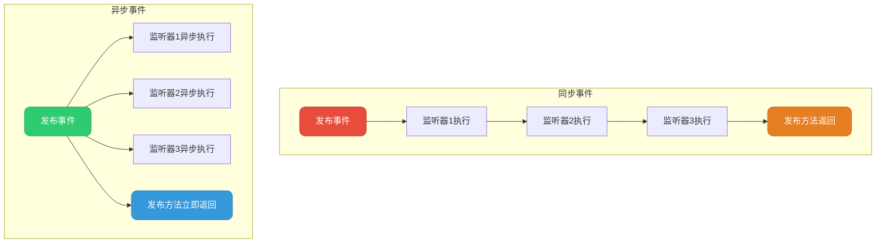

### 启用异步事件

**步骤一：开启异步支持**

```java
@Configuration
@EnableAsync
public class AsyncConfig implements AsyncConfigurer {
    
    @Override
    public Executor getAsyncExecutor() {
        ThreadPoolTaskExecutor executor = new ThreadPoolTaskExecutor();
        executor.setCorePoolSize(5);
        executor.setMaxPoolSize(20);
        executor.setQueueCapacity(200);
        executor.setThreadNamePrefix("event-async-");
        executor.setRejectedExecutionHandler(new CallerRunsPolicy());
        executor.initialize();
        return executor;
    }
    
    @Override
    public AsyncUncaughtExceptionHandler getAsyncUncaughtExceptionHandler() {
        return (ex, method, params) -> {
            log.error("异步事件处理异常, method: {}", method.getName(), ex);
        };
    }
}
```

**步骤二：在监听器方法上添加@Async注解**

```java
@Component
@Slf4j
public class AsyncOrderEventHandler {
    
    /**
     * 异步发送邮件通知
     */
    @Async
    @EventListener
    public void sendEmailNotification(OrderCreatedEvent event) {
        log.info("异步发送邮件通知，线程: {}", Thread.currentThread().getName());
        // 耗时的邮件发送操作
        emailService.sendOrderEmail(event.getOrder());
    }
    
    /**
     * 异步同步到ES
     */
    @Async
    @EventListener
    public void syncToElasticsearch(OrderCreatedEvent event) {
        log.info("异步同步到ES，线程: {}", Thread.currentThread().getName());
        esService.indexOrder(event.getOrder());
    }
}
```

### 全局异步事件多播器

如果希望所有事件默认异步处理，可以自定义事件多播器：

```java
@Configuration
public class EventConfig {
    
    @Bean
    public ApplicationEventMulticaster applicationEventMulticaster() {
        SimpleApplicationEventMulticaster multicaster = 
                new SimpleApplicationEventMulticaster();
        
        ThreadPoolTaskExecutor executor = new ThreadPoolTaskExecutor();
        executor.setCorePoolSize(10);
        executor.setMaxPoolSize(50);
        executor.setQueueCapacity(500);
        executor.setThreadNamePrefix("global-event-");
        executor.initialize();
        
        multicaster.setTaskExecutor(executor);
        multicaster.setErrorHandler(t -> {
            log.error("事件处理异常", t);
        });
        
        return multicaster;
    }
}
```

## 事件监听器排序

当多个监听器处理同一事件时，可以通过`@Order`注解控制执行顺序：

```java
@Component
@Order(1)  // 优先级最高
public class FirstListener implements ApplicationListener<OrderCreatedEvent> {
    
    @Override
    public void onApplicationEvent(OrderCreatedEvent event) {
        System.out.println("第一个执行");
    }
}

@Component
@Order(2)
public class SecondListener implements ApplicationListener<OrderCreatedEvent> {
    
    @Override
    public void onApplicationEvent(OrderCreatedEvent event) {
        System.out.println("第二个执行");
    }
}

// 使用@EventListener时
@Component
public class OrderedEventHandler {
    
    @EventListener
    @Order(1)
    public void first(OrderCreatedEvent event) {
        System.out.println("第一个执行");
    }
    
    @EventListener
    @Order(2)
    public void second(OrderCreatedEvent event) {
        System.out.println("第二个执行");
    }
}
```

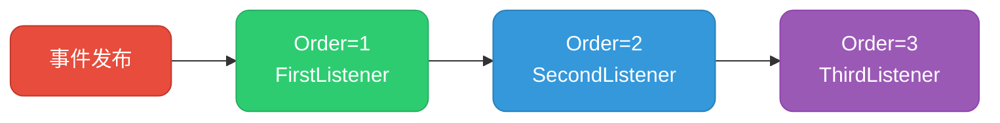

## 事务与事件

在事务场景中，事件发布时机非常重要。如果事务回滚，但事件已经被处理，会导致数据不一致。

### @TransactionalEventListener

Spring提供了`@TransactionalEventListener`注解，可以在事务的特定阶段处理事件：

```java
@Component
@Slf4j
public class TransactionalOrderHandler {
    
    /**
     * 事务提交后执行（默认）
     */
    @TransactionalEventListener(phase = TransactionPhase.AFTER_COMMIT)
    public void afterCommit(OrderCreatedEvent event) {
        log.info("事务已提交，发送通知");
        notificationService.sendNotification(event.getOrder());
    }
    
    /**
     * 事务完成后执行（无论成功或失败）
     */
    @TransactionalEventListener(phase = TransactionPhase.AFTER_COMPLETION)
    public void afterCompletion(OrderCreatedEvent event) {
        log.info("事务已完成");
    }
    
    /**
     * 事务回滚后执行
     */
    @TransactionalEventListener(phase = TransactionPhase.AFTER_ROLLBACK)
    public void afterRollback(OrderCreatedEvent event) {
        log.error("事务已回滚，清理数据");
        cleanupService.cleanup(event.getOrder());
    }
    
    /**
     * 事务提交前执行
     */
    @TransactionalEventListener(phase = TransactionPhase.BEFORE_COMMIT)
    public void beforeCommit(OrderCreatedEvent event) {
        log.info("事务即将提交，执行校验");
    }
}
```

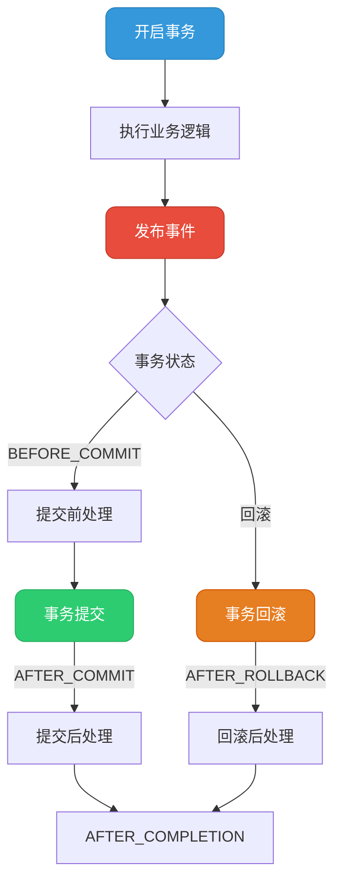

### 事务事件的注意事项

```java
@Service
public class OrderService {
    
    @Transactional
    public void createOrder(Order order) {
        orderRepository.save(order);
        
        // 发布事件 - 此时事务尚未提交
        eventPublisher.publishEvent(new OrderCreatedEvent(this, order));
        
        // 如果这里抛异常，事务回滚
        // 但如果使用普通@EventListener，事件可能已经被处理了
    }
}

// 解决方案：使用@TransactionalEventListener
@Component
public class SafeOrderHandler {
    
    @TransactionalEventListener  // 默认AFTER_COMMIT，事务成功后才执行
    public void handleOrderCreated(OrderCreatedEvent event) {
        // 只有事务成功提交后才会执行
        sendNotification(event.getOrder());
    }
}
```

## 泛型事件

Spring支持带泛型参数的事件，使事件更加灵活：

```java
/**
 * 泛型实体事件
 */
public class EntityCreatedEvent<T> extends ApplicationEvent {
    
    private final T entity;
    
    public EntityCreatedEvent(Object source, T entity) {
        super(source);
        this.entity = entity;
    }
    
    public T getEntity() {
        return entity;
    }
}

// 发布不同类型的实体事件
@Service
public class EntityService {
    
    @Autowired
    private ApplicationEventPublisher publisher;
    
    public void createUser(User user) {
        userRepository.save(user);
        publisher.publishEvent(new EntityCreatedEvent<>(this, user));
    }
    
    public void createProduct(Product product) {
        productRepository.save(product);
        publisher.publishEvent(new EntityCreatedEvent<>(this, product));
    }
}

// 监听特定类型的泛型事件
@Component
public class EntityEventHandler {
    
    @EventListener
    public void handleUserCreated(EntityCreatedEvent<User> event) {
        User user = event.getEntity();
        System.out.println("用户创建: " + user.getName());
    }
    
    @EventListener
    public void handleProductCreated(EntityCreatedEvent<Product> event) {
        Product product = event.getEntity();
        System.out.println("商品创建: " + product.getName());
    }
}
```

## 事件机制源码解析

### 事件发布流程

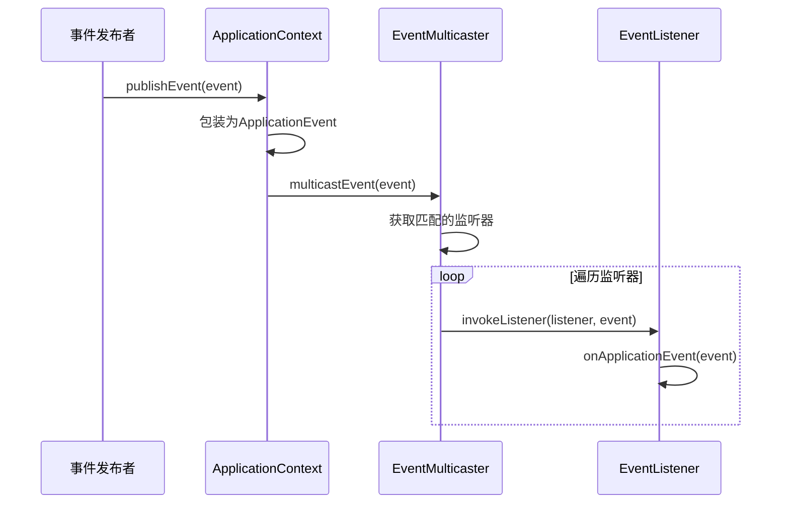

### 核心源码分析

**AbstractApplicationContext#publishEvent**：

```java
protected void publishEvent(Object event, @Nullable ResolvableType eventType) {
    Assert.notNull(event, "Event must not be null");

    // 1. 将普通对象包装为ApplicationEvent
    ApplicationEvent applicationEvent;
    if (event instanceof ApplicationEvent) {
        applicationEvent = (ApplicationEvent) event;
    } else {
        // 非ApplicationEvent对象包装为PayloadApplicationEvent
        applicationEvent = new PayloadApplicationEvent<>(this, event);
        if (eventType == null) {
            eventType = ((PayloadApplicationEvent<?>) applicationEvent)
                    .getResolvableType();
        }
    }

    // 2. 处理早期事件（容器初始化阶段）
    if (this.earlyApplicationEvents != null) {
        this.earlyApplicationEvents.add(applicationEvent);
    } else {
        // 3. 通过多播器广播事件
        getApplicationEventMulticaster()
                .multicastEvent(applicationEvent, eventType);
    }

    // 4. 向父容器传播事件
    if (this.parent != null) {
        if (this.parent instanceof AbstractApplicationContext) {
            ((AbstractApplicationContext) this.parent)
                    .publishEvent(event, eventType);
        } else {
            this.parent.publishEvent(event);
        }
    }
}
```

**SimpleApplicationEventMulticaster#multicastEvent**：

```java
@Override
public void multicastEvent(final ApplicationEvent event, 
                           @Nullable ResolvableType eventType) {
    ResolvableType type = (eventType != null ? eventType : 
            resolveDefaultEventType(event));
    Executor executor = getTaskExecutor();
    
    // 获取所有匹配的监听器
    for (ApplicationListener<?> listener : 
            getApplicationListeners(event, type)) {
        
        if (executor != null) {
            // 异步执行（如果配置了线程池）
            executor.execute(() -> invokeListener(listener, event));
        } else {
            // 同步执行
            invokeListener(listener, event);
        }
    }
}

protected void invokeListener(ApplicationListener<?> listener, 
                              ApplicationEvent event) {
    ErrorHandler errorHandler = getErrorHandler();
    if (errorHandler != null) {
        try {
            doInvokeListener(listener, event);
        } catch (Throwable err) {
            errorHandler.handleError(err);
        }
    } else {
        doInvokeListener(listener, event);
    }
}

private void doInvokeListener(ApplicationListener listener, 
                              ApplicationEvent event) {
    try {
        // 调用监听器的onApplicationEvent方法
        listener.onApplicationEvent(event);
    } catch (ClassCastException ex) {
        // 处理类型不匹配的情况
        // ...
    }
}
```

## 实战应用场景

### 订单状态流转

```java
/**
 * 订单状态变更事件
 */
@Getter
public class OrderStatusChangedEvent extends ApplicationEvent {
    
    private final Order order;
    private final OrderStatus fromStatus;
    private final OrderStatus toStatus;
    
    public OrderStatusChangedEvent(Object source, Order order, 
            OrderStatus fromStatus, OrderStatus toStatus) {
        super(source);
        this.order = order;
        this.fromStatus = fromStatus;
        this.toStatus = toStatus;
    }
}

/**
 * 订单服务
 */
@Service
@Slf4j
public class OrderService {
    
    @Autowired
    private ApplicationEventPublisher eventPublisher;
    
    @Transactional
    public void updateOrderStatus(Long orderId, OrderStatus newStatus) {
        Order order = orderRepository.findById(orderId).orElseThrow();
        OrderStatus oldStatus = order.getStatus();
        
        order.setStatus(newStatus);
        orderRepository.save(order);
        
        // 发布状态变更事件
        eventPublisher.publishEvent(
            new OrderStatusChangedEvent(this, order, oldStatus, newStatus));
    }
}

/**
 * 订单状态监听器
 */
@Component
@Slf4j
public class OrderStatusHandler {
    
    @TransactionalEventListener
    public void handleStatusChange(OrderStatusChangedEvent event) {
        OrderStatus toStatus = event.getToStatus();
        Order order = event.getOrder();
        
        switch (toStatus) {
            case PAID:
                handleOrderPaid(order);
                break;
            case SHIPPED:
                handleOrderShipped(order);
                break;
            case COMPLETED:
                handleOrderCompleted(order);
                break;
            case CANCELLED:
                handleOrderCancelled(order);
                break;
        }
    }
    
    private void handleOrderPaid(Order order) {
        log.info("订单已支付: {}", order.getOrderNo());
        // 通知仓库发货、增加积分等
    }
    
    private void handleOrderShipped(Order order) {
        log.info("订单已发货: {}", order.getOrderNo());
        // 发送物流通知
    }
    
    private void handleOrderCompleted(Order order) {
        log.info("订单已完成: {}", order.getOrderNo());
        // 结算佣金、更新统计等
    }
    
    private void handleOrderCancelled(Order order) {
        log.info("订单已取消: {}", order.getOrderNo());
        // 退还库存、退款等
    }
}
```

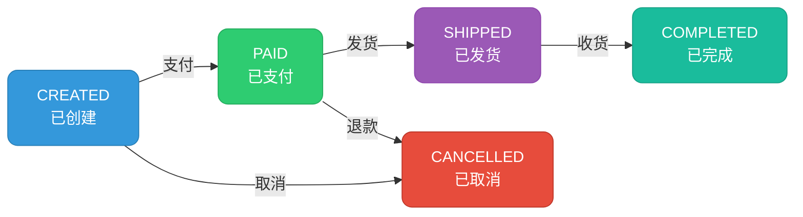

### 用户行为追踪

```java
/**
 * 用户行为事件
 */
@Getter
public class UserBehaviorEvent extends ApplicationEvent {
    
    private final Long userId;
    private final String action;
    private final Map<String, Object> properties;
    private final LocalDateTime timestamp;
    
    public UserBehaviorEvent(Object source, Long userId, String action, 
            Map<String, Object> properties) {
        super(source);
        this.userId = userId;
        this.action = action;
        this.properties = properties;
        this.timestamp = LocalDateTime.now();
    }
}

/**
 * 行为追踪处理器
 */
@Component
@Slf4j
public class BehaviorTrackingHandler {
    
    @Autowired
    private AnalyticsService analyticsService;
    
    @Autowired
    private UserProfileService userProfileService;
    
    @Async
    @EventListener
    public void trackBehavior(UserBehaviorEvent event) {
        // 1. 记录到分析系统
        analyticsService.track(event.getUserId(), event.getAction(), 
                              event.getProperties());
        
        // 2. 更新用户画像
        userProfileService.updateProfile(event.getUserId(), 
                                         event.getAction());
    }
}
```

### 缓存同步

```java
/**
 * 数据变更事件
 */
@Getter
public class DataChangedEvent extends ApplicationEvent {
    
    private final String entityType;
    private final Object entityId;
    private final ChangeType changeType;
    
    public enum ChangeType { CREATE, UPDATE, DELETE }
    
    public DataChangedEvent(Object source, String entityType, 
            Object entityId, ChangeType changeType) {
        super(source);
        this.entityType = entityType;
        this.entityId = entityId;
        this.changeType = changeType;
    }
}

/**
 * 缓存同步监听器
 */
@Component
@Slf4j
public class CacheSyncHandler {
    
    @Autowired
    private RedisTemplate<String, Object> redisTemplate;
    
    @TransactionalEventListener
    public void syncCache(DataChangedEvent event) {
        String cacheKey = event.getEntityType() + ":" + event.getEntityId();
        
        switch (event.getChangeType()) {
            case CREATE:
            case UPDATE:
                // 删除缓存，下次查询时重新加载
                redisTemplate.delete(cacheKey);
                log.info("缓存已失效: {}", cacheKey);
                break;
            case DELETE:
                redisTemplate.delete(cacheKey);
                log.info("缓存已删除: {}", cacheKey);
                break;
        }
    }
}
```

## 最佳实践与注意事项

### 设计原则

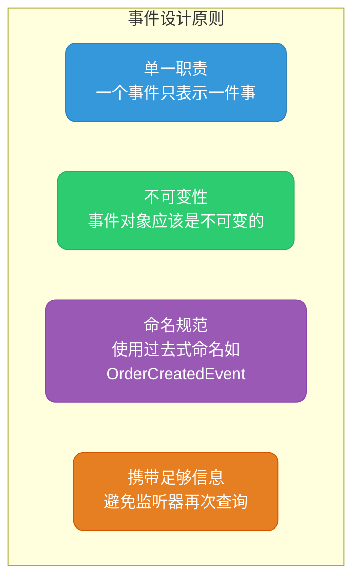

### 常见问题与解决方案

| 问题 | 原因 | 解决方案 |
|-----|------|---------|
| 监听器没有执行 | 监听器未被Spring管理 | 添加@Component注解 |
| 事务回滚后事件仍被处理 | 使用普通@EventListener | 使用@TransactionalEventListener |
| 监听器执行顺序不确定 | 未指定顺序 | 使用@Order注解 |
| 同步事件阻塞主线程 | 默认同步执行 | 使用@Async异步处理 |
| 异步事件无法回滚 | 异步线程无事务上下文 | 确保业务逻辑幂等 |

### 代码规范建议

```java
/**
 * 1. 事件类命名：使用过去式 + Event后缀
 */
public class OrderCreatedEvent extends ApplicationEvent { }
public class UserRegisteredEvent extends ApplicationEvent { }
public class PaymentCompletedEvent extends ApplicationEvent { }

/**
 * 2. 监听器类命名：使用Handler或Listener后缀
 */
@Component
public class OrderCreatedHandler { }

@Component  
public class PaymentEventListener { }

/**
 * 3. 事件对象设计为不可变
 */
public class OrderCreatedEvent extends ApplicationEvent {
    
    private final Order order;  // 使用final修饰
    
    public OrderCreatedEvent(Object source, Order order) {
        super(source);
        this.order = order;
    }
    
    public Order getOrder() {
        return order;  // 只提供getter，不提供setter
    }
}

/**
 * 4. 异步监听器要处理异常
 */
@Component
@Slf4j
public class AsyncEventHandler {
    
    @Async
    @EventListener
    public void handleEvent(OrderCreatedEvent event) {
        try {
            // 业务处理
            processOrder(event.getOrder());
        } catch (Exception e) {
            log.error("事件处理失败，订单号: {}", 
                     event.getOrder().getOrderNo(), e);
            // 可以发送告警或重试
            alertService.sendAlert("事件处理失败", e);
        }
    }
}
```

## 与消息队列对比

| 特性 | Spring事件 | 消息队列(MQ) |
|-----|-----------|-------------|
| 适用范围 | 单个JVM内部 | 跨JVM/跨服务 |
| 可靠性 | 无持久化 | 支持持久化 |
| 性能 | 极高（内存操作） | 较高（网络IO） |
| 重试机制 | 需自行实现 | 内置支持 |
| 事务支持 | @TransactionalEventListener | 事务消息 |
| 使用场景 | 模块解耦 | 系统解耦 |

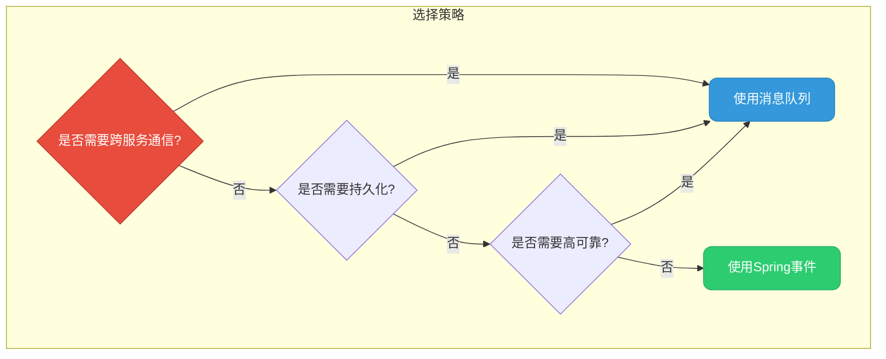

## 面试高频问题

### Spring事件机制的实现原理是什么？

Spring事件机制基于观察者模式实现，核心组件包括：
1. **ApplicationEvent**：事件对象基类
2. **ApplicationEventPublisher**：事件发布接口，ApplicationContext实现了该接口
3. **ApplicationListener**：事件监听器接口
4. **ApplicationEventMulticaster**：事件多播器，负责管理监听器并分发事件

发布流程：`publishEvent()` → 包装事件 → `multicastEvent()` → 遍历监听器 → 调用`onApplicationEvent()`

### @EventListener和ApplicationListener有什么区别？

| 方面 | @EventListener | ApplicationListener |
|-----|---------------|---------------------|
| 实现方式 | 注解方式 | 接口实现方式 |
| 灵活性 | 可在任意方法使用 | 需要实现整个接口 |
| 条件监听 | 支持condition属性 | 需要在代码中判断 |
| 多事件监听 | 一个方法可监听多个事件 | 一个类只能监听一种事件 |

### 如何保证事件处理和数据库事务的一致性？

使用`@TransactionalEventListener`注解，配置`phase = TransactionPhase.AFTER_COMMIT`，确保只有事务成功提交后才处理事件。

### 异步事件需要注意什么？

1. 需要开启`@EnableAsync`
2. 异步线程没有事务上下文
3. 需要处理异常，避免静默失败
4. 业务逻辑要保证幂等性

