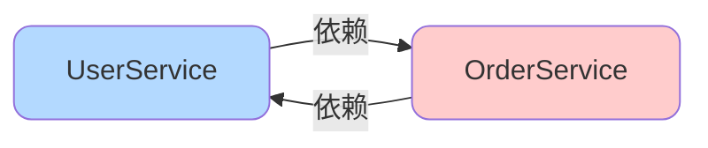
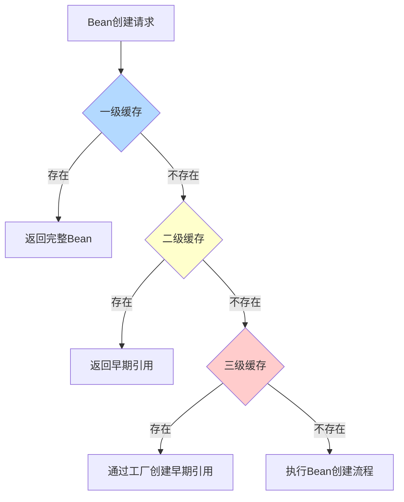
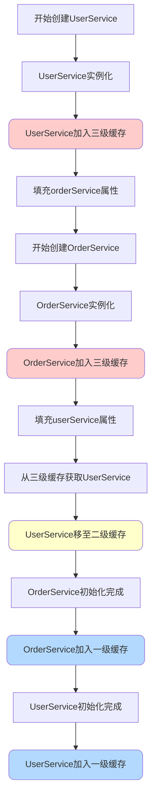
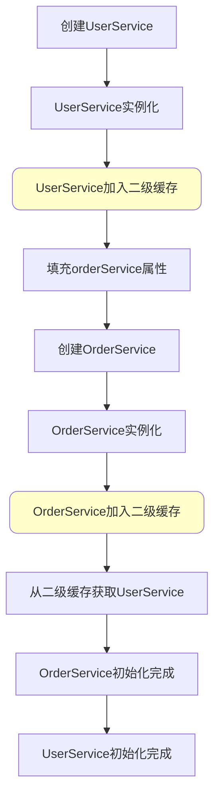
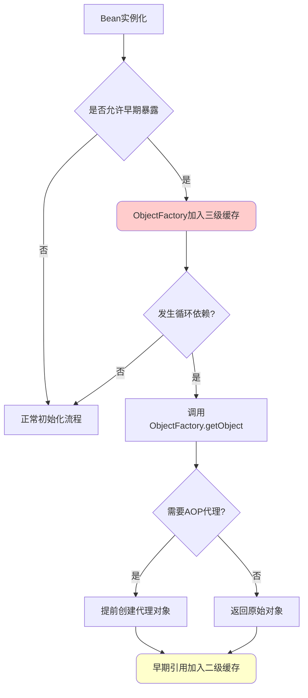
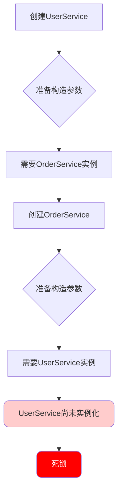
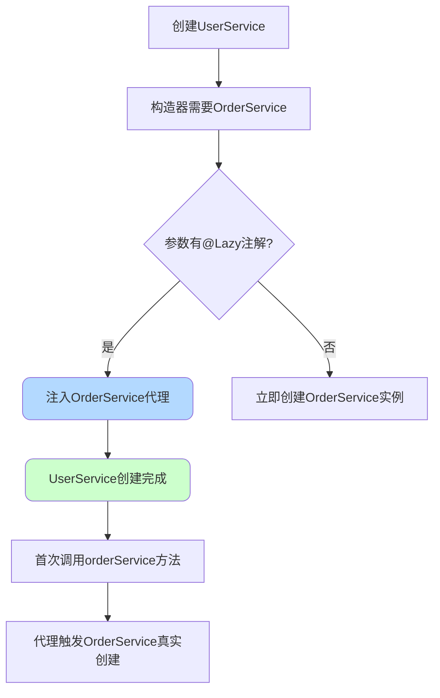
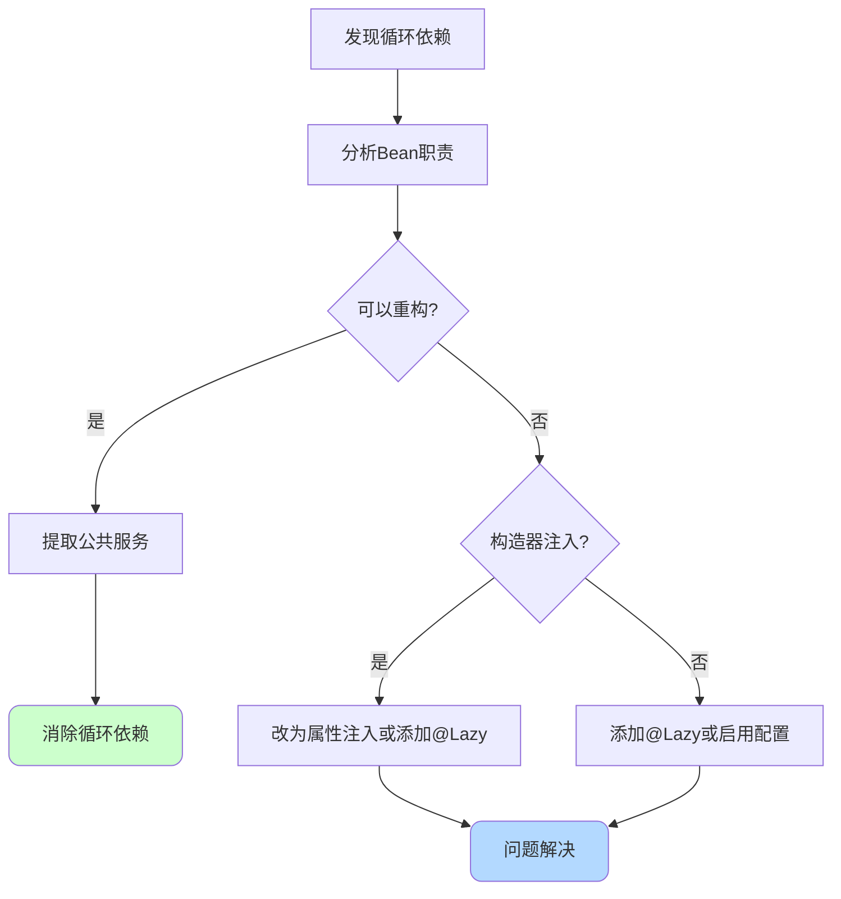

# Spring循环依赖解决方案详解

## 循环依赖概述

### 什么是循环依赖

在Spring框架中，循环依赖是指两个或多个Bean之间形成相互依赖的闭环关系。当Bean A依赖Bean B，同时Bean B又依赖Bean A时，就形成了最简单的循环依赖场景。如果不进行处理，这种情况会导致应用程序启动失败。

举例说明，假设我们有用户服务和订单服务：

```java
@Service
public class UserService {
    @Autowired
    private OrderService orderService;
    
    public void processUser() {
        // 用户业务逻辑中需要调用订单服务
        orderService.getUserOrders();
    }
}

@Service
public class OrderService {
    @Autowired
    private UserService userService;
    
    public void getUserOrders() {
        // 订单业务逻辑中需要调用用户服务
        userService.processUser();
    }
}
```

这种情况下，两个Bean就发生了相互依赖，形成了循环引用。



### 循环依赖的限制条件

Spring虽然提供了循环依赖的解决方案，但并非所有场景都能自动处理。循环依赖的解决存在以下限制：

- **必须是单例Bean**：互相依赖的Bean必须都是单例作用域（Singleton）
- **不能全是构造器注入**：依赖注入方式不能都是构造函数注入方式

这些限制的存在有其技术原因，我们将在后续章节详细说明。

## Spring三级缓存机制

### 三级缓存的定义

Spring通过三级缓存机制来解决循环依赖问题。在Spring的`DefaultSingletonBeanRegistry`类中，维护了三个Map结构作为缓存：

```java
public class DefaultSingletonBeanRegistry extends SimpleAliasRegistry 
    implements SingletonBeanRegistry {
    
    // 一级缓存：存储完全初始化的Bean实例
    private final Map<String, Object> singletonObjects = new ConcurrentHashMap<>(256);
    
    // 二级缓存：存储早期的Bean引用（半成品对象）
    private final Map<String, Object> earlySingletonObjects = new ConcurrentHashMap<>(16);
    
    // 三级缓存：存储Bean的对象工厂
    private final Map<String, ObjectFactory<?>> singletonFactories = new HashMap<>(16);
}
```

**一级缓存singletonObjects**：保存完全创建好的单例Bean对象。当Bean完成实例化、属性填充和初始化后，会被放入一级缓存。其他Bean获取依赖时，优先从一级缓存中查找。

**二级缓存earlySingletonObjects**：存储早期暴露的Bean引用，即已完成实例化但尚未完成属性填充和初始化的"半成品"对象。当发生循环依赖时，通过二级缓存可以提前获取到Bean的早期引用。

**三级缓存singletonFactories**：存储创建Bean的对象工厂（ObjectFactory）。在Bean实例化后，会将该Bean的创建工厂放入三级缓存。当需要提前暴露Bean时，通过工厂的getObject方法生成早期引用。



### Bean创建的两个阶段

理解三级缓存的工作原理，需要先了解Spring中Bean的创建过程分为两个关键阶段：

**实例化阶段（Instantiation）**：调用构造函数创建对象实例，为对象分配内存空间。此时对象已经存在，但属性值均为默认值（null或基本类型默认值）。

**初始化阶段（Initialization）**：对对象的属性进行赋值，包括依赖注入、调用初始化方法等。完成初始化后，Bean才能正常使用。

Spring能够解决循环依赖的关键在于：对象的初始化可以延后。当创建UserService时，可以先完成实例化，然后在初始化orderService属性之前，将UserService的早期引用暴露出去。


处于实例化完成但初始化未完成状态的对象，称为**半成品对象**。半成品对象只是Bean的一个空壳，属性尚未注入，但已经可以作为引用被其他Bean使用。

## 三级缓存解决循环依赖的流程

### 完整解决流程

以UserService和OrderService的循环依赖为例，详细说明三级缓存的工作流程：

```java
@Service
public class UserService {
    @Autowired
    private OrderService orderService;
}

@Service
public class OrderService {
    @Autowired
    private UserService userService;
}
```

**流程步骤**：

- **创建UserService**：Spring容器开始创建UserService，调用构造函数完成实例化
- **暴露早期引用**：将UserService的ObjectFactory放入三级缓存，标记UserService正在创建中
- **填充orderService属性**：发现需要注入OrderService依赖
- **创建OrderService**：Spring容器开始创建OrderService，调用构造函数完成实例化
- **暴露早期引用**：将OrderService的ObjectFactory放入三级缓存
- **填充userService属性**：发现需要注入UserService依赖
- **从缓存获取UserService**：依次查找一级缓存（无）、二级缓存（无）、三级缓存（有）
- **生成早期引用**：调用三级缓存中的ObjectFactory创建UserService的早期引用，放入二级缓存，移除三级缓存
- **完成OrderService创建**：将UserService早期引用注入OrderService，完成OrderService的初始化，放入一级缓存
- **完成UserService创建**：将完整的OrderService注入UserService，完成UserService的初始化，放入一级缓存



### 源码解析

Spring获取单例Bean的核心方法是`DefaultSingletonBeanRegistry`类的`getSingleton`方法：

```java
@Nullable
protected Object getSingleton(String beanName, boolean allowEarlyReference) {
    // 第一步：从一级缓存获取完整Bean
    Object singletonObject = this.singletonObjects.get(beanName);
    
    if (singletonObject == null && isSingletonCurrentlyInCreation(beanName)) {
        // 第二步：一级缓存没有且Bean正在创建中，从二级缓存获取早期引用
        singletonObject = this.earlySingletonObjects.get(beanName);
        
        if (singletonObject == null && allowEarlyReference) {
            // 第三步：二级缓存也没有且允许早期引用，尝试从三级缓存获取
            synchronized (this.singletonObjects) {
                // 双重检查锁
                singletonObject = this.singletonObjects.get(beanName);
                if (singletonObject == null) {
                    singletonObject = this.earlySingletonObjects.get(beanName);
                    if (singletonObject == null) {
                        // 从三级缓存获取ObjectFactory
                        ObjectFactory<?> singletonFactory = this.singletonFactories.get(beanName);
                        if (singletonFactory != null) {
                            // 调用工厂方法创建早期引用
                            singletonObject = singletonFactory.getObject();
                            // 放入二级缓存
                            this.earlySingletonObjects.put(beanName, singletonObject);
                            // 从三级缓存移除
                            this.singletonFactories.remove(beanName);
                        }
                    }
                }
            }
        }
    }
    return singletonObject;
}
```

该方法体现了三级缓存的查找顺序和升级策略：优先使用完整对象，其次使用早期引用，最后通过工厂创建早期引用。

## 为什么需要三级缓存

### 二级缓存能否解决问题

从理论上讲，使用二级缓存也能解决循环依赖问题。我们可以在Bean实例化后，直接将半成品对象放入二级缓存，当发生循环依赖时，直接从二级缓存获取即可。



但这种方案存在一个问题：无法优雅地处理AOP代理。

### AOP代理的挑战

在Spring中，如果Bean需要被AOP增强，最终注入到其他Bean中的应该是代理对象，而不是原始对象。按照Spring的设计原则，AOP代理的创建是在Bean初始化完成后，通过`AnnotationAwareAspectJAutoProxyCreator`后置处理器在`postProcessAfterInitialization`方法中完成的。

如果只使用二级缓存，Spring面临两个选择：

- **方案一**：不管是否有循环依赖，都在实例化后立即创建代理对象并放入二级缓存。这样虽然简单，但违背了Spring AOP的设计原则，会导致所有Bean都提前进行代理，影响性能。

- **方案二**：仍然在初始化后创建代理，但这样无法解决循环依赖中的代理问题。因为当发生循环依赖时，从二级缓存中获取的是原始对象，而不是代理对象。

### 三级缓存的优势

Spring引入三级缓存，巧妙地解决了这个问题。三级缓存中存储的不是具体对象，而是`ObjectFactory`对象工厂：

```java
public abstract class AbstractAutowireCapableBeanFactory extends AbstractBeanFactory
    implements AutowireCapableBeanFactory {
    
    protected Object doCreateBean(String beanName, RootBeanDefinition mbd, 
                                   @Nullable Object[] args) throws BeanCreationException {
        // Bean实例化
        // ...
        
        // 判断是否需要提前暴露（单例 && 允许循环引用 && 正在创建中）
        boolean earlySingletonExposure = (mbd.isSingleton() && 
                                          this.allowCircularReferences &&
                                          isSingletonCurrentlyInCreation(beanName));
        
        if (earlySingletonExposure) {
            // 将ObjectFactory加入三级缓存
            addSingletonFactory(beanName, 
                () -> getEarlyBeanReference(beanName, mbd, bean));
        }
        
        // 属性填充和初始化
        // ...
    }
}
```

`ObjectFactory`是一个函数式接口，其`getObject`方法会调用`getEarlyBeanReference`方法。该方法会判断Bean是否需要AOP代理：

- 如果不需要代理，返回原始的半成品对象
- 如果需要代理，提前创建代理对象并返回

这样，Spring实现了：

- **没有循环依赖时**：AOP代理在初始化后创建，符合设计原则
- **有循环依赖且需要代理时**：通过三级缓存的ObjectFactory提前创建代理对象，解决循环依赖



## 循环依赖的特殊情况

### 为什么只支持单例Bean

Spring的循环依赖解决方案依赖于对象的提前暴露和缓存复用。对于单例Bean，整个应用生命周期中只有一个实例，容器启动时创建并缓存，依赖关系在运行期间保持不变。因此可以通过提前暴露半成品对象的方式解决循环依赖。

相比之下，原型（Prototype）Bean每次获取都会创建新的实例，不存在缓存机制。如果原型Bean存在循环依赖：

```java
@Component
@Scope("prototype")
public class PrototypeUserService {
    @Autowired
    private PrototypeOrderService orderService;
}

@Component
@Scope("prototype")
public class PrototypeOrderService {
    @Autowired
    private PrototypeUserService userService;
}
```

每次请求PrototypeUserService时，都需要创建新的PrototypeOrderService实例，而创建PrototypeOrderService又需要新的PrototypeUserService实例，形成无限递归。即使提前暴露半成品对象，也无法保证后续创建的实例能够复用，因此Spring无法为原型Bean解决循环依赖。


### 为什么不支持构造器注入

Spring无法解决构造器注入的循环依赖，根本原因在于对象实例化的时机。

在构造器注入中，依赖关系在构造函数参数中声明：

```java
@Component
public class ConstructorUserService {
    private final ConstructorOrderService orderService;
    
    @Autowired
    public ConstructorUserService(ConstructorOrderService orderService) {
        this.orderService = orderService;
    }
}

@Component
public class ConstructorOrderService {
    private final ConstructorUserService userService;
    
    @Autowired
    public ConstructorOrderService(ConstructorUserService userService) {
        this.userService = userService;
    }
}
```

创建ConstructorUserService实例时，必须先准备好构造函数的参数（ConstructorOrderService实例）。而创建ConstructorOrderService实例，又必须先准备好ConstructorUserService实例。这形成了逻辑上的死锁：

- 要实例化A，必须先有B的实例
- 要实例化B，必须先有A的实例

由于对象还未完成实例化，连半成品对象都不存在，无法通过提前暴露来解决。



而在属性注入或Setter注入中，对象的实例化和属性填充是分离的：

```java
@Component
public class PropertyUserService {
    @Autowired
    private PropertyOrderService orderService;  // 属性注入
}
```

先调用无参构造函数创建对象实例，此时对象已经存在（虽然orderService属性为null），可以将其暴露到缓存中。然后再通过反射为orderService属性赋值。这种分离的机制使得循环依赖的解决成为可能。

## 循环依赖的解决方案

### Spring Boot版本差异

需要注意的是，Spring对循环依赖的默认支持在不同版本中有所变化：

- **Spring Boot 2.6之前**：默认支持循环依赖，通过三级缓存自动处理
- **Spring Boot 2.6及之后**：默认禁用循环依赖支持，启动时会抛出异常

Spring团队认为循环依赖本身是不合理的设计，因此在新版本中默认关闭了支持。如果在Spring Boot 2.6+版本中出现循环依赖，会看到类似错误：

```
The dependencies of some of the beans in the application context form a cycle:

   orderService (field private com.example.UserService)
      ↓
   userService (field private com.example.OrderService)
      ↓
   orderService
```

### 配置文件启用

如果确实需要在Spring Boot 2.6+版本中使用循环依赖，可以通过配置文件启用：

```yaml
spring:
  main:
    allow-circular-references: true
```

或在properties文件中：

```properties
spring.main.allow-circular-references=true
```

但应谨慎使用该配置，更好的做法是优化设计消除循环依赖。

### 使用@Lazy注解

`@Lazy`注解可以延迟Bean的初始化时机，从而打破循环依赖链。当使用`@Lazy`时，Spring不会在启动时立即创建Bean，而是在首次使用时才创建。

**解决属性注入的循环依赖**：

```java
@Service
public class LazyUserService {
    @Autowired
    @Lazy
    private LazyOrderService orderService;
    
    public void processUser() {
        // 首次调用orderService方法时才会真正创建OrderService实例
        orderService.getUserOrders();
    }
}

@Service
public class LazyOrderService {
    @Autowired
    private LazyUserService userService;
}
```

添加`@Lazy`后，UserService创建时不会立即注入OrderService实例，而是注入一个代理对象。当真正调用orderService的方法时，才触发OrderService的创建。此时UserService已经创建完成，不存在循环依赖。

**解决构造器注入的循环依赖**：

```java
@Component
public class LazyConstructorUserService {
    private final LazyConstructorOrderService orderService;
    
    @Autowired
    public LazyConstructorUserService(@Lazy LazyConstructorOrderService orderService) {
        this.orderService = orderService;
    }
}

@Component
public class LazyConstructorOrderService {
    private final LazyConstructorUserService userService;
    
    @Autowired
    public LazyConstructorOrderService(LazyConstructorUserService userService) {
        this.userService = userService;
    }
}
```

在构造器参数上使用`@Lazy`，Spring会注入一个代理对象而非真实对象。代理对象的创建不需要目标Bean实例化完成，从而打破了构造器注入的循环依赖死锁。



**@Lazy的使用位置**：

`@Lazy`既可以用在Bean定义上，也可以用在依赖注入点：

```java
// 方式1：Bean定义上使用
@Component
@Lazy
public class GlobalLazyBean {
    // 该Bean在整个应用中都是延迟加载的
}

// 方式2：注入点使用（推荐）
@Component
public class SomeService {
    @Autowired
    @Lazy  // 仅在此处延迟注入
    private GlobalLazyBean lazyBean;
}
```

推荐在注入点使用`@Lazy`，这样可以精确控制哪些依赖需要延迟加载，而不影响Bean在其他地方的使用。

### 重构代码消除循环依赖

虽然Spring提供了循环依赖的解决方案，但循环依赖本身通常意味着设计存在问题。以下是几种常见的重构方法：

**方法一：提取公共服务**

将循环依赖的公共逻辑提取到第三个服务中：

```java
// 重构前：UserService和OrderService互相依赖
@Service
public class UserService {
    @Autowired
    private OrderService orderService;
}

@Service
public class OrderService {
    @Autowired
    private UserService userService;
}

// 重构后：提取公共逻辑到新服务
@Service
public class UserService {
    @Autowired
    private BusinessService businessService;
}

@Service
public class OrderService {
    @Autowired
    private BusinessService businessService;
}

@Service
public class BusinessService {
    // 包含原本分散在UserService和OrderService中的公共逻辑
}
```

**方法二：使用事件机制**

通过Spring的事件发布-订阅机制解耦：

```java
@Service
public class UserService {
    @Autowired
    private ApplicationEventPublisher eventPublisher;
    
    public void createUser() {
        // 用户创建逻辑
        // 发布事件而非直接调用OrderService
        eventPublisher.publishEvent(new UserCreatedEvent(userId));
    }
}

@Service
public class OrderService {
    @EventListener
    public void handleUserCreated(UserCreatedEvent event) {
        // 处理用户创建事件
    }
}
```

**方法三：改为Setter注入**

如果是构造器注入导致的循环依赖，可以改为Setter注入：

```java
// 构造器注入（有循环依赖问题）
@Component
public class UserService {
    private final OrderService orderService;
    
    @Autowired
    public UserService(OrderService orderService) {
        this.orderService = orderService;
    }
}

// 改为Setter注入（可自动解决）
@Component
public class UserService {
    private OrderService orderService;
    
    @Autowired
    public void setOrderService(OrderService orderService) {
        this.orderService = orderService;
    }
}
```

## 最佳实践建议

### 设计原则

- **单一职责**：每个Bean应该只负责一个明确的职责，避免因功能耦合导致循环依赖
- **依赖倒置**：依赖抽象而非具体实现，通过接口解耦
- **优先组合**：使用组合代替继承，将共享逻辑提取到独立的服务中

### 使用建议

- **避免循环依赖**：循环依赖通常是设计缺陷的信号，应优先通过重构消除
- **谨慎使用@Lazy**：虽然@Lazy可以解决循环依赖，但会使Bean的初始化时机变得不可预测
- **优先属性注入**：在无法避免循环依赖时，使用属性注入或Setter注入而非构造器注入
- **启用循环检查**：在开发环境中保持循环依赖检查开启，及时发现设计问题

### 排查方法

当遇到循环依赖问题时，可以按以下步骤排查：

- 查看异常堆栈，识别形成循环的Bean链路
- 分析各Bean的职责，判断是否违反单一职责原则
- 评估是否可以通过提取公共服务、事件机制等方式解耦
- 如必须保留循环依赖，优先考虑改为属性注入或使用@Lazy



通过合理的设计和适当的技术手段，可以有效避免和解决Spring应用中的循环依赖问题，提升代码的可维护性和健壮性。
