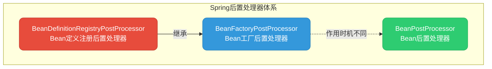

import PaidCTA from '@site/src/components/PaidCTA';

# Spring后置处理器详解

## 后置处理器概述

在Spring框架中，后置处理器（Post Processor）是一种**扩展机制**，允许开发者在Bean创建和容器初始化的不同阶段介入，对Bean定义或Bean实例进行自定义处理。

Spring提供了三个核心后置处理器接口，它们在容器生命周期的不同阶段发挥作用：

### 三者的核心区别

<PaidCTA />