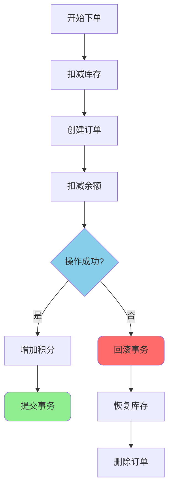
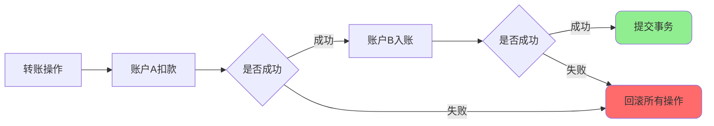
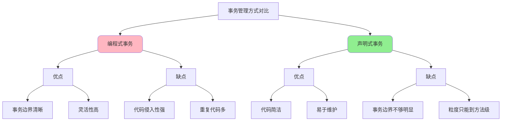
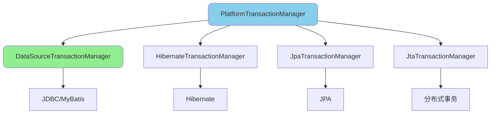
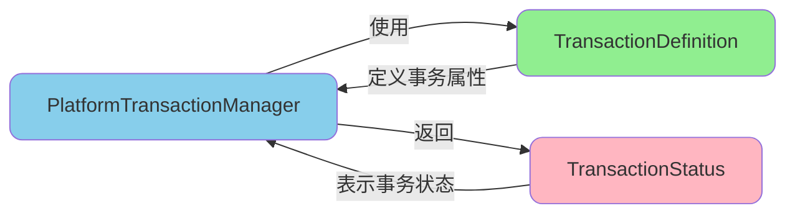
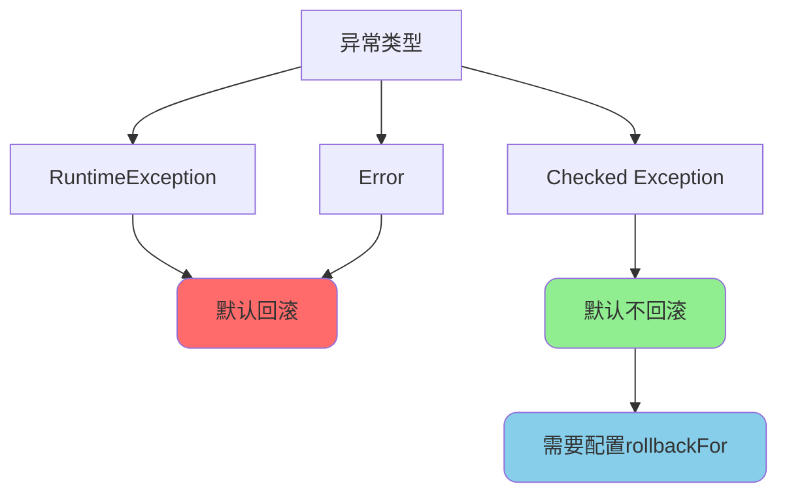

# Spring事务管理核心详解

## 事务基础概念

### 什么是事务

事务是数据库操作的最小执行单元,它将一组相关操作打包成一个不可分割的整体。**事务中的所有操作要么全部成功,要么全部失败回滚**,确保数据的一致性。

在实际业务开发中,一个业务方法往往包含多个数据库操作步骤。例如电商系统中的下单流程:

```java
public class OrderProcessor {
    public void placeOrder(Order order) {
        // 1. 扣减商品库存
        productService.decreaseStock(order.getProductId(), order.getQuantity());
        
        // 2. 创建订单记录
        orderRepository.createOrder(order);
        
        // 3. 扣减用户余额
        accountService.deductBalance(order.getUserId(), order.getTotalAmount());
        
        // 4. 增加积分
        pointService.addPoints(order.getUserId(), order.getPoints());
    }
}
```

以上四个操作必须保证原子性,任何一步失败都需要回滚所有已执行的操作,否则会造成数据不一致。



:::tip 重要提示
事务能否生效的前提是数据库引擎支持事务。例如MySQL的InnoDB引擎支持事务,但MyISAM引擎不支持。
:::

### 事务的ACID特性

事务必须满足ACID四大特性,这是保证数据一致性的基础:

#### 原子性 (Atomicity)

事务是最小的执行单位,不允许分割。事务中的所有操作要么全部完成,要么完全不起作用。



MySQL通过**回滚日志(undo log)**实现原子性。所有事务进行的修改都会先记录到undo log中,然后再执行实际操作。如果执行过程中遇到异常,直接利用undo log中的信息将数据回滚到修改之前的状态。

#### 一致性 (Consistency)

执行事务前后,数据保持一致。例如转账业务中,无论事务是否成功,转账双方的总金额应该保持不变。

**一致性是目的,原子性、隔离性、持久性是手段**。只有保证了AID三个特性,才能达到一致性。

#### 隔离性 (Isolation)

并发访问数据库时,一个用户的事务不被其他事务所干扰,各并发事务之间相互独立。

隔离性通过数据库的隔离级别来实现,不同的隔离级别能防止不同的并发问题(脏读、不可重复读、幻读)。

#### 持久性 (Durability)

事务一旦提交,它对数据库中数据的改变就是永久性的,即使数据库发生故障也不会丢失。

MySQL通过**重做日志(redo log)**实现持久性,事务提交后会先将数据写入redo log,即使系统崩溃也能通过redo log恢复数据。

### 事务管理方式

Spring提供了两种事务管理方式:编程式事务和声明式事务。

```mermaid
graph TB
    A[Spring事务管理] --> B[编程式事务]
    A --> C[声明式事务]
    B --> D[TransactionTemplate]
    B --> E[PlatformTransactionManager]
    C --> F[@Transactional注解]
    C --> G[XML配置]
    
    style C fill:#90EE90,rx:10,ry:10
    style B fill:#FFB6C1,rx:10,ry:10
```

## 编程式事务管理

编程式事务需要开发者在代码中手动管理事务的开启、提交、回滚等操作。

### 使用TransactionTemplate

TransactionTemplate是Spring提供的简化编程式事务的模板类:

```java
@Service
public class PaymentService {
    
    @Autowired
    private TransactionTemplate transactionTemplate;
    
    @Autowired
    private OrderRepository orderRepository;
    
    @Autowired
    private AccountRepository accountRepository;
    
    // 有返回值的事务操作
    public PaymentResult processPayment(PaymentRequest request) {
        return transactionTemplate.execute(status -> {
            try {
                // 创建支付记录
                Payment payment = orderRepository.createPayment(request);
                
                // 扣减账户余额
                accountRepository.deductBalance(request.getAccountId(), request.getAmount());
                
                return new PaymentResult(payment.getId(), "SUCCESS");
            } catch (Exception e) {
                // 标记回滚
                status.setRollbackOnly();
                return new PaymentResult(null, "FAILED");
            }
        });
    }
    
    // 无返回值的事务操作
    public void refundPayment(String paymentId) {
        transactionTemplate.execute(new TransactionCallbackWithoutResult() {
            @Override
            protected void doInTransactionWithoutResult(TransactionStatus status) {
                try {
                    Payment payment = orderRepository.getPayment(paymentId);
                    accountRepository.addBalance(payment.getAccountId(), payment.getAmount());
                    orderRepository.updatePaymentStatus(paymentId, "REFUNDED");
                } catch (Exception e) {
                    status.setRollbackOnly();
                }
            }
        });
    }
}
```

### 使用PlatformTransactionManager

PlatformTransactionManager提供了更底层的事务控制能力:

```java
@Service
public class InventoryService {
    
    @Autowired
    private PlatformTransactionManager transactionManager;
    
    @Autowired
    private ProductRepository productRepository;
    
    @Autowired
    private StockLogRepository stockLogRepository;
    
    public void adjustStock(Long productId, int quantity) {
        // 定义事务属性
        DefaultTransactionDefinition definition = new DefaultTransactionDefinition();
        definition.setPropagationBehavior(TransactionDefinition.PROPAGATION_REQUIRED);
        definition.setIsolationLevel(TransactionDefinition.ISOLATION_READ_COMMITTED);
        definition.setTimeout(30);
        
        // 获取事务状态
        TransactionStatus status = transactionManager.getTransaction(definition);
        
        try {
            // 调整库存
            productRepository.updateStock(productId, quantity);
            
            // 记录库存变更日志
            stockLogRepository.insertLog(productId, quantity, "ADJUSTMENT");
            
            // 提交事务
            transactionManager.commit(status);
        } catch (Exception e) {
            // 回滚事务
            transactionManager.rollback(status);
            throw new RuntimeException("库存调整失败", e);
        }
    }
}
```

## 声明式事务管理

声明式事务是Spring推荐的事务管理方式,通过AOP机制实现,对业务代码无侵入。

### 使用@Transactional注解

最简单的声明式事务使用方式是通过@Transactional注解:

```java
@Service
public class MemberService {
    
    @Autowired
    private MemberRepository memberRepository;
    
    @Autowired
    private PointRepository pointRepository;
    
    /**
     * 会员注册
     * 包含创建会员记录和初始化积分两个操作
     */
    @Transactional(rollbackFor = Exception.class)
    public Member registerMember(MemberDTO memberDTO) {
        // 创建会员记录
        Member member = new Member();
        member.setName(memberDTO.getName());
        member.setPhone(memberDTO.getPhone());
        memberRepository.save(member);
        
        // 初始化积分账户
        Point point = new Point();
        point.setMemberId(member.getId());
        point.setBalance(100); // 注册赠送100积分
        pointRepository.save(point);
        
        return member;
    }
}
```

### 编程式与声明式对比



**声明式事务的优势:**

1. **低侵入性** - 通过注解配置,业务代码保持纯粹
2. **易于维护** - 事务配置集中管理,修改方便
3. **基于AOP** - 利用Spring AOP的强大功能

**编程式事务的适用场景:**

1. 需要精确控制事务边界
2. 同一方法中需要不同的事务策略
3. 需要在事务中执行特殊逻辑

## Spring事务管理核心接口

Spring的事务管理主要通过三个核心接口实现:

### PlatformTransactionManager

PlatformTransactionManager是Spring事务管理的核心接口,不同的持久化技术有不同的实现:



接口定义了三个核心方法:

```java
public interface PlatformTransactionManager {
    // 获取事务
    TransactionStatus getTransaction(TransactionDefinition definition) 
        throws TransactionException;
    
    // 提交事务
    void commit(TransactionStatus status) throws TransactionException;
    
    // 回滚事务
    void rollback(TransactionStatus status) throws TransactionException;
}
```

**为什么要抽象出这个接口?**

这是典型的策略模式应用,将事务管理的行为抽象出来,不同的持久化技术提供不同的实现。这样做的好处是:

1. **统一接口** - 对外提供一致的事务管理API
2. **易于扩展** - 新增持久化技术时只需实现该接口
3. **代码解耦** - 业务代码不依赖具体的事务管理实现

### TransactionDefinition

TransactionDefinition定义了事务的属性信息,包括:

- **传播行为** - 事务方法之间的调用如何传播事务
- **隔离级别** - 控制并发事务的隔离程度
- **超时时间** - 事务的最长执行时间
- **只读标识** - 是否为只读事务
- **回滚规则** - 哪些异常导致回滚

```java
public interface TransactionDefinition {
    // 传播行为常量
    int PROPAGATION_REQUIRED = 0;
    int PROPAGATION_SUPPORTS = 1;
    int PROPAGATION_MANDATORY = 2;
    int PROPAGATION_REQUIRES_NEW = 3;
    int PROPAGATION_NOT_SUPPORTED = 4;
    int PROPAGATION_NEVER = 5;
    int PROPAGATION_NESTED = 6;
    
    // 隔离级别常量
    int ISOLATION_DEFAULT = -1;
    int ISOLATION_READ_UNCOMMITTED = 1;
    int ISOLATION_READ_COMMITTED = 2;
    int ISOLATION_REPEATABLE_READ = 4;
    int ISOLATION_SERIALIZABLE = 8;
    
    // 获取传播行为
    int getPropagationBehavior();
    
    // 获取隔离级别
    int getIsolationLevel();
    
    // 获取超时时间
    int getTimeout();
    
    // 是否只读
    boolean isReadOnly();
}
```

### TransactionStatus

TransactionStatus接口表示事务的运行状态,提供了查询和控制事务状态的方法:

```java
public interface TransactionStatus {
    // 是否是新事务
    boolean isNewTransaction();
    
    // 是否有保存点
    boolean hasSavepoint();
    
    // 设置为只回滚
    void setRollbackOnly();
    
    // 是否为只回滚
    boolean isRollbackOnly();
    
    // 是否已完成
    boolean isCompleted();
}
```

这三个接口的协作关系:



## 事务属性配置

### 超时时间 (timeout)

事务超时是指一个事务允许执行的最长时间,超过该时间限制事务自动回滚。默认值为-1,表示没有超时限制。

```java
@Service
public class ReportService {
    
    /**
     * 生成报表 - 设置30秒超时
     * 防止长时间执行的查询占用连接
     */
    @Transactional(timeout = 30)
    public Report generateMonthlyReport(String month) {
        // 复杂的统计查询
        List<OrderData> orders = orderRepository.queryOrdersByMonth(month);
        List<SalesData> sales = salesRepository.querySalesByMonth(month);
        
        // 生成报表
        return reportGenerator.generate(orders, sales);
    }
}
```

### 只读属性 (readOnly)

只读事务用于查询操作,可以进行一些优化:

```java
@Service
public class ProductQueryService {
    
    /**
     * 查询商品列表 - 只读事务
     * 数据库可以对只读事务进行优化
     */
    @Transactional(readOnly = true)
    public List<Product> queryProducts(ProductQuery query) {
        // 查询商品基本信息
        List<Product> products = productRepository.findByConditions(query);
        
        // 查询库存信息
        for (Product product : products) {
            Stock stock = stockRepository.findByProductId(product.getId());
            product.setStock(stock);
        }
        
        return products;
    }
}
```

:::tip 为什么要标记为只读事务?
- MySQL在autocommit模式下,每个SQL都会开启单独的事务
- 标记为只读事务后,多个查询SQL会在同一个事务中执行,保证读一致性
- 数据库可以对只读事务进行优化,如不加锁、使用快照读等
:::

### 回滚规则 (rollbackFor)

Spring默认只对RuntimeException和Error进行回滚,对于检查型异常(Checked Exception)不会回滚。

```java
@Service
public class FileUploadService {
    
    @Autowired
    private FileRepository fileRepository;
    
    /**
     * 上传文件
     * 指定IOException也要回滚事务
     */
    @Transactional(rollbackFor = Exception.class)
    public FileInfo uploadFile(MultipartFile file) throws IOException {
        // 保存文件信息到数据库
        FileInfo fileInfo = new FileInfo();
        fileInfo.setFileName(file.getOriginalFilename());
        fileInfo.setSize(file.getSize());
        fileRepository.save(fileInfo);
        
        // 上传文件到存储服务
        // 如果IO异常,也需要回滚数据库操作
        String url = storageService.upload(file.getInputStream());
        fileInfo.setUrl(url);
        
        return fileInfo;
    }
}
```



## 总结

Spring事务管理提供了灵活而强大的功能:

1. **编程式事务**适合需要精确控制事务边界的场景
2. **声明式事务**是推荐方式,通过注解实现,代码简洁
3. **三大核心接口**构成了Spring事务管理的基础框架
4. **事务属性配置**可以灵活控制事务的行为

理解Spring事务管理的核心原理,能帮助我们在实际项目中正确使用事务,保证数据的一致性和完整性。
