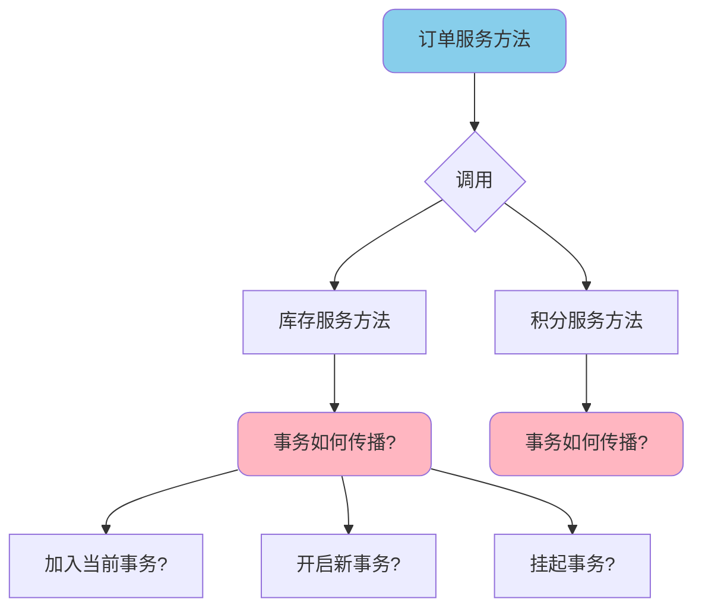
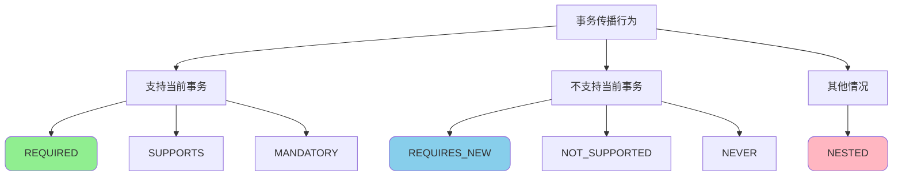
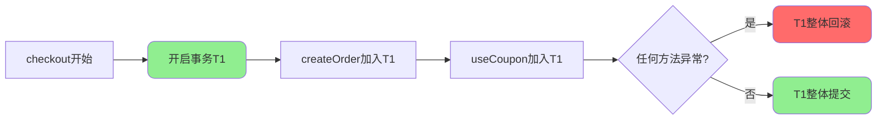
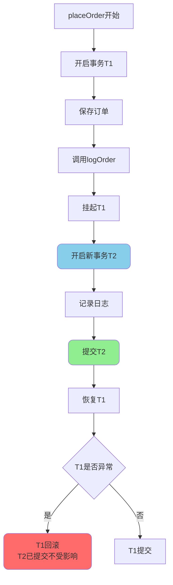
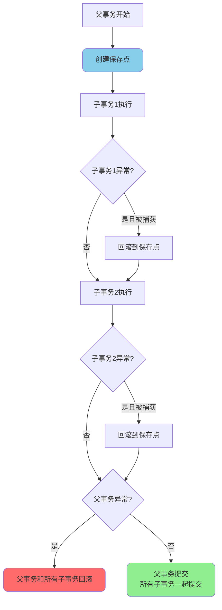
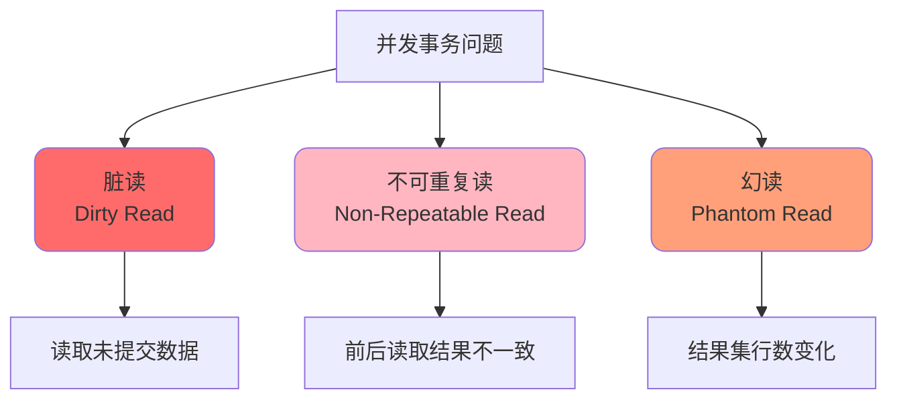
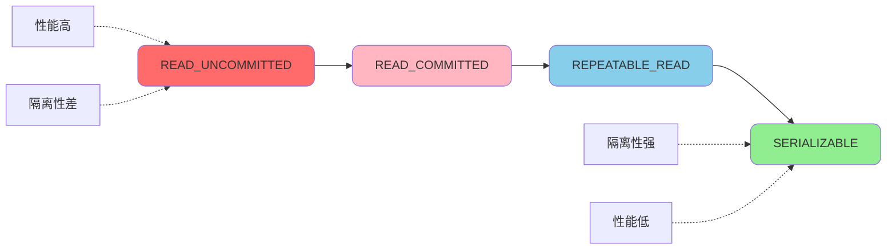

# Spring事务传播机制与隔离级别

## 事务传播机制概述

### 什么是事务传播机制

事务传播机制用于控制在多个事务方法相互调用时事务的行为。当一个事务方法被另一个事务方法调用时,必须明确指定事务应该如何传播。

在复杂的业务场景中,多个事务方法之间的调用可能会导致事务的不一致,使用事务传播机制可以避免数据丢失、重复提交等问题,保证事务的一致性和完整性。



### 传播机制使用场景

假设有两个业务方法ServiceA和ServiceB,方法ServiceA在方法ServiceB中被调用:

```java
@Service
public class OrderService {
    
    @Autowired
    private InventoryService inventoryService;
    
    @Transactional
    public void createOrder(OrderRequest request) {
        // 创建订单
        orderRepository.save(request);
        
        // 调用库存服务扣减库存
        inventoryService.decreaseStock(request.getProductId(), request.getQuantity());
    }
}

@Service  
public class InventoryService {
    
    @Transactional(propagation = Propagation.???)
    public void decreaseStock(Long productId, int quantity) {
        // 扣减库存逻辑
    }
}
```

此时就需要考虑:decreaseStock方法使用什么传播行为?如果decreaseStock发生异常需要回滚,createOrder是否也要回滚?

## 七种传播行为详解

Spring定义了7种事务传播行为,默认为**REQUIRED**:



### REQUIRED (默认)

**如果当前存在事务,则加入该事务;如果当前没有事务,则创建一个新的事务。**

这是最常用的传播行为,能够保证多个方法在同一个事务中执行。

```java
@Service
public class ShoppingService {
    
    @Autowired
    private OrderService orderService;
    
    @Autowired
    private CouponService couponService;
    
    @Transactional(propagation = Propagation.REQUIRED)
    public void checkout(CheckoutRequest request) {
        // 创建订单
        orderService.createOrder(request);
        
        // 使用优惠券
        couponService.useCoupon(request.getCouponId());
    }
}

@Service
public class OrderService {
    
    @Transactional(propagation = Propagation.REQUIRED)
    public void createOrder(CheckoutRequest request) {
        // 订单创建逻辑
        orderRepository.save(request);
    }
}

@Service
public class CouponService {
    
    @Transactional(propagation = Propagation.REQUIRED)
    public void useCoupon(Long couponId) {
        // 使用优惠券
        couponRepository.updateStatus(couponId, "USED");
    }
}
```

**执行流程:**



:::tip 关键点
- 三个方法使用同一个事务
- 任何一个方法抛出异常,整个事务回滚
- 如果外部方法没有事务,内部方法会新建事务
:::

### REQUIRES_NEW

**创建一个新的事务,如果当前存在事务,则把当前事务挂起。**

不管外部方法是否有事务,该方法都会开启自己独立的事务。

```java
@Service
public class OrderService {
    
    @Autowired
    private OrderLogService orderLogService;
    
    @Transactional(propagation = Propagation.REQUIRED)
    public void placeOrder(OrderRequest request) {
        try {
            // 创建订单
            orderRepository.save(request);
            
            // 记录日志(独立事务)
            orderLogService.logOrder(request);
            
            // 模拟业务异常
            if (request.getAmount() > 10000) {
                throw new BusinessException("金额超限");
            }
        } catch (Exception e) {
            // 订单回滚,但日志已提交
            throw e;
        }
    }
}

@Service
public class OrderLogService {
    
    /**
     * 使用新事务记录日志
     * 即使外部事务回滚,日志也要保留
     */
    @Transactional(propagation = Propagation.REQUIRES_NEW)
    public void logOrder(OrderRequest request) {
        OrderLog log = new OrderLog();
        log.setOrderId(request.getOrderId());
        log.setOperation("CREATE");
        orderLogRepository.save(log);
    }
}
```

**执行流程:**



:::warning 注意事项
- 内部方法的异常如果没有被捕获,会导致外部事务也回滚
- 外部事务回滚不影响内部事务的提交
- 会频繁开启新事务,性能开销较大
:::

### NESTED

**如果当前存在事务,则创建一个嵌套事务; 如果当前没有事务,则等同于REQUIRED。**

嵌套事务是父子关系,子事务不会独立提交,依赖于父事务。

```java
@Service
public class BatchImportService {
    
    @Autowired
    private ProductService productService;
    
    @Transactional(propagation = Propagation.REQUIRED)
    public ImportResult batchImport(List<ProductDTO> products) {
        ImportResult result = new ImportResult();
        
        for (ProductDTO product : products) {
            try {
                // 每个商品导入使用嵌套事务
                productService.importProduct(product);
                result.incrementSuccess();
            } catch (Exception e) {
                // 单个商品导入失败不影响其他商品
                result.incrementFailed();
                result.addError(product.getName(), e.getMessage());
            }
        }
        
        return result;
    }
}

@Service
public class ProductService {
    
    /**
     * 嵌套事务导入单个商品
     * 失败时只回滚当前商品,不影响批次事务
     */
    @Transactional(propagation = Propagation.NESTED)
    public void importProduct(ProductDTO product) {
        // 保存商品信息
        productRepository.save(product);
        
        // 初始化库存
        stockRepository.initStock(product.getId(), product.getInitStock());
        
        // 如果商品编码重复,抛出异常
        if (productRepository.existsByCode(product.getCode())) {
            throw new DuplicateException("商品编码重复");
        }
    }
}
```

**嵌套事务特点:**



:::tip NESTED与REQUIRES_NEW的区别
| 特性 | NESTED | REQUIRES_NEW |
|------|--------|--------------|
| 事务关系 | 父子关系 | 平级关系 |
| 提交时机 | 父事务提交时一起提交 | 立即提交 |
| 父事务回滚 | 子事务一起回滚 | 不受影响 |
| 子事务回滚 | 不影响父事务(需捕获异常) | 不影响外部事务 |
:::

### SUPPORTS

**如果当前存在事务,则加入该事务; 如果当前没有事务,则以非事务方式执行。**

```java
@Service
public class ReportService {
    
    @Autowired
    private DataQueryService dataQueryService;
    
    @Transactional
    public void generateReport() {
        // 当前有事务
        List<Data> data = dataQueryService.queryData();
        // queryData会加入当前事务
    }
    
    public void exportData() {
        // 当前无事务
        List<Data> data = dataQueryService.queryData();
        // queryData以非事务方式执行
    }
}

@Service
public class DataQueryService {
    
    @Transactional(propagation = Propagation.SUPPORTS)
    public List<Data> queryData() {
        return dataRepository.findAll();
    }
}
```

### MANDATORY

**如果当前存在事务,则加入该事务; 如果当前没有事务,则抛出异常。**

强制要求必须在事务中执行。

```java
@Service
public class AccountService {
    
    /**
     * 扣款操作必须在事务中执行
     */
    @Transactional(propagation = Propagation.MANDATORY)
    public void deduct(Long accountId, BigDecimal amount) {
        Account account = accountRepository.findById(accountId);
        if (account.getBalance().compareTo(amount) < 0) {
            throw new InsufficientBalanceException("余额不足");
        }
        account.setBalance(account.getBalance().subtract(amount));
        accountRepository.save(account);
    }
}
```

### NOT_SUPPORTED

**以非事务方式运行,如果当前存在事务,则把当前事务挂起。**

```java
@Service
public class NotificationService {
    
    /**
     * 发送通知不需要事务
     * 即使在事务中调用也会挂起事务
     */
    @Transactional(propagation = Propagation.NOT_SUPPORTED)
    public void sendNotification(String userId, String message) {
        // 调用第三方推送服务
        pushService.send(userId, message);
    }
}
```

### NEVER

**以非事务方式运行,如果当前存在事务,则抛出异常。**

```java
@Service
public class CacheService {
    
    /**
     * 缓存操作禁止在事务中执行
     */
    @Transactional(propagation = Propagation.NEVER)
    public void updateCache(String key, Object value) {
        redisTemplate.opsForValue().set(key, value);
    }
}
```

## 事务隔离级别

事务隔离级别定义了一个事务可能受其他并发事务影响的程度。

### 并发事务问题



**脏读示例:**

```java
// 事务A
@Transactional(isolation = Isolation.READ_UNCOMMITTED)
public void processOrder() {
    // 读取账户余额(可能读到事务B未提交的修改)
    BigDecimal balance = accountRepository.getBalance(userId);
    
    if (balance.compareTo(orderAmount) >= 0) {
        // 创建订单
        orderRepository.save(order);
    }
}

// 事务B(可能回滚)
@Transactional
public void recharge() {
    // 充值操作
    accountRepository.addBalance(userId, amount);
    
    // 后续可能回滚
    throw new RuntimeException("充值失败");
}
```

**不可重复读示例:**

```java
@Transactional(isolation = Isolation.READ_COMMITTED)
public void calculateDiscount() {
    // 第一次读取会员等级
    String level = memberRepository.getLevel(memberId);  // VIP
    
    // ... 其他操作
    
    // 第二次读取会员等级(可能被其他事务修改了)
    String level2 = memberRepository.getLevel(memberId); // SVIP
    
    // level != level2,导致计算错误
}
```

**幻读示例:**

```java
@Transactional(isolation = Isolation.REPEATABLE_READ)  
public void auditOrders() {
    // 第一次查询订单数量
    int count1 = orderRepository.countByStatus("PENDING"); // 10条
    
    // ... 其他操作
    
    // 第二次查询订单数量(其他事务插入了新订单)
    int count2 = orderRepository.countByStatus("PENDING"); // 12条
    
    // count1 != count2
}
```

### 四种隔离级别

Spring定义了五个表示隔离级别的常量:

```java
public enum Isolation {
    DEFAULT(-1),                    // 使用数据库默认隔离级别
    READ_UNCOMMITTED(1),            // 读未提交
    READ_COMMITTED(2),              // 读已提交
    REPEATABLE_READ(4),             // 可重复读
    SERIALIZABLE(8);                // 串行化
}
```

**隔离级别对比:**

| 隔离级别 | 脏读 | 不可重复读 | 幻读 | 性能 |
|---------|------|-----------|------|------|
| READ_UNCOMMITTED | ✓ | ✓ | ✓ | 最高 |
| READ_COMMITTED | ✗ | ✓ | ✓ | 较高 |
| REPEATABLE_READ | ✗ | ✗ | ✓ | 较低 |
| SERIALIZABLE | ✗ | ✗ | ✗ | 最低 |



### 隔离级别使用示例

```java
@Service
public class TransferService {
    
    /**
     * 转账操作使用可重复读隔离级别
     * 防止转账过程中余额被其他事务修改
     */
    @Transactional(
        isolation = Isolation.REPEATABLE_READ,
        rollbackFor = Exception.class
    )
    public void transfer(Long fromAccount, Long toAccount, BigDecimal amount) {
        // 查询转出账户余额
        BigDecimal balance = accountRepository.getBalance(fromAccount);
        
        // 验证余额充足
        if (balance.compareTo(amount) < 0) {
            throw new InsufficientBalanceException("余额不足");
        }
        
        // 扣款
        accountRepository.deduct(fromAccount, amount);
        
        // 入账
        accountRepository.deposit(toAccount, amount);
    }
    
    /**
     * 生成报表使用读已提交隔离级别
     * 只读取已提交的数据,性能较好
     */
    @Transactional(
        isolation = Isolation.READ_COMMITTED,
        readOnly = true
    )
    public Report generateReport(String startDate, String endDate) {
        List<Transaction> transactions = 
            transactionRepository.findByDateRange(startDate, endDate);
        return reportGenerator.generate(transactions);
    }
}
```

### MySQL默认隔离级别

MySQL InnoDB存储引擎默认使用**REPEATABLE_READ**(可重复读),并通过Next-Key Locks机制解决了幻读问题。

Oracle数据库默认使用**READ_COMMITTED**(读已提交)。

## 传播机制实战场景

### 场景一: 读写分离下的事务传播

在读写分离架构中,读操作和写操作需要不同的传播机制:

```java
@Service
public class OrderProcessService {
    
    /**
     * 长事务方法,包含读和写操作
     */
    @Transactional(rollbackFor = Exception.class)
    public void processOrder(Long orderId) {
        // 写操作: 更新订单状态
        orderRepository.updateStatus(orderId, "PROCESSING");
        
        // 写操作: 扣减库存
        inventoryRepository.decreaseStock(orderId);
        
        // 读操作: 查询商品信息(最后一步)
        // 使用NOT_SUPPORTED,避免读失败导致前面的写操作回滚
        productService.getProductInfo(orderId);
    }
}

@Service
public class ProductService {
    
    @Transactional(propagation = Propagation.NOT_SUPPORTED, readOnly = true)
    public ProductInfo getProductInfo(Long orderId) {
        // 从读库查询商品信息
        return productRepository.findById(orderId);
    }
}
```

**如果读操作在中间步骤:**

```java
@Transactional(rollbackFor = Exception.class)
public void processOrderV2(Long orderId) {
    // 写操作: 更新订单状态
    orderRepository.updateStatus(orderId, "PROCESSING");
    
    // 读操作: 查询商品信息(中间步骤)
    // 使用REQUIRED,读失败需要让前面的写操作回滚
    ProductInfo product = productService.getProductInfoWithTx(orderId);
    
    // 写操作: 根据商品信息扣减库存
    inventoryRepository.decreaseStock(product.getId(), product.getQuantity());
}
```

### 场景二: 批量操作的事务控制

```java
@Service
public class DataMigrationService {
    
    /**
     * 批量迁移数据
     * 每批数据使用独立事务,失败不影响其他批次
     */
    @Transactional(propagation = Propagation.REQUIRED)
    public MigrationResult migrateData(List<DataDTO> dataList) {
        MigrationResult result = new MigrationResult();
        
        // 按100条一批进行处理
        List<List<DataDTO>> batches = Lists.partition(dataList, 100);
        
        for (List<DataDTO> batch : batches) {
            try {
                // 每批使用新事务
                batchProcessor.processBatch(batch);
                result.incrementSuccess(batch.size());
            } catch (Exception e) {
                result.incrementFailed(batch.size());
                result.addError(e.getMessage());
            }
        }
        
        return result;
    }
}

@Service
public class BatchProcessor {
    
    /**
     * 处理单批数据
     * 使用新事务,与外部事务隔离
     */
    @Transactional(propagation = Propagation.REQUIRES_NEW)
    public void processBatch(List<DataDTO> batch) {
        for (DataDTO data : batch) {
            dataRepository.save(data);
        }
    }
}
```

## 总结

Spring事务传播机制和隔离级别是事务管理的核心:

1. **传播机制**控制事务方法之间的调用关系
   - REQUIRED: 最常用,保证多方法在同一事务
   - REQUIRES_NEW: 开启独立事务,适合日志记录
   - NESTED: 嵌套事务,适合批量操作

2. **隔离级别**控制并发事务的隔离程度
   - 隔离级别越高,数据一致性越好,但性能越差
   - 需要根据业务场景权衡一致性和性能

3. **实战应用**需要考虑
   - 读写分离场景下的传播机制选择
   - 批量操作的事务控制策略
   - 异常处理与事务回滚的配合

理解并正确使用事务传播机制和隔离级别,能够有效避免数据不一致问题,提升系统的可靠性。
