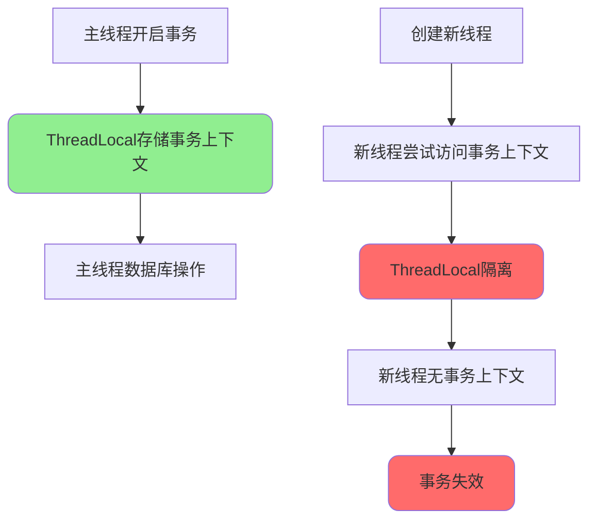
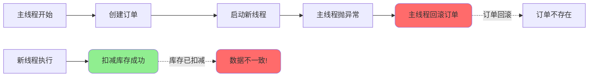
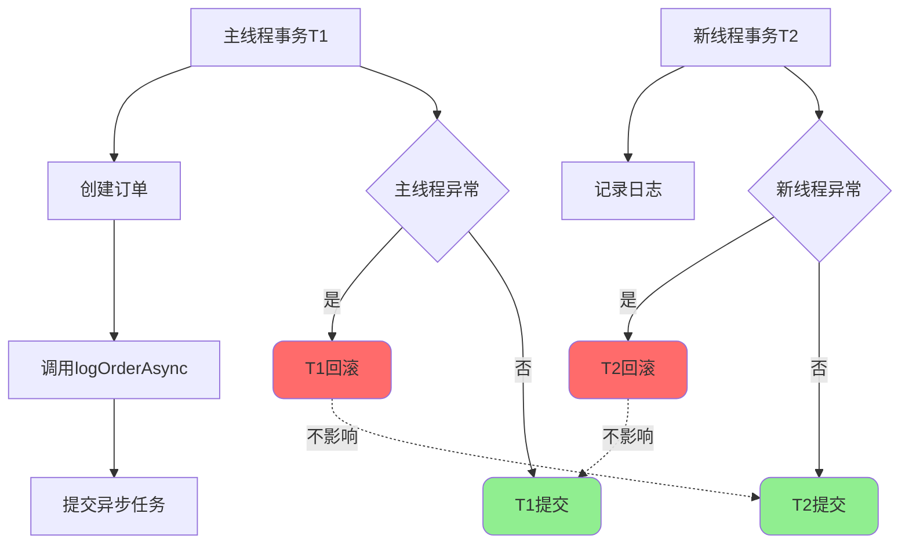
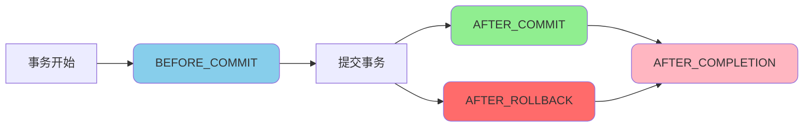
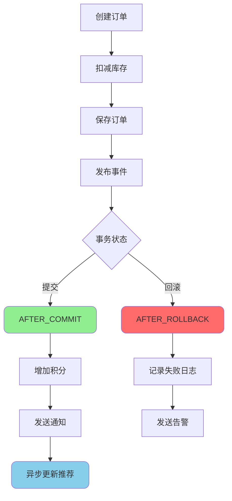

# Spring事务高级应用场景

## 多线程环境下的事务处理

### 问题背景

Spring的@Transactional事务管理使用ThreadLocal机制存储事务上下文,每个线程都有独立的事务上下文副本。在多线程环境下,新线程无法访问主线程的事务上下文,导致事务失效。



### 声明式事务在多线程下失效

```java
@Service
public class OrderService {
    
    @Autowired
    private OrderRepository orderRepository;
    
    @Autowired
    private StockRepository stockRepository;
    
    /**
     * 多线程场景下事务失效示例
     */
    @Transactional(rollbackFor = Exception.class)
    public void createOrderWithMultiThread(OrderRequest request) {
        // 主线程: 创建订单
        Order order = new Order();
        order.setUserId(request.getUserId());
        order.setAmount(request.getAmount());
        orderRepository.save(order);
        
        // 新线程: 扣减库存
        new Thread(() -> {
            // ❌ 新线程中没有事务上下文
            // 即使主线程回滚,库存扣减操作也不会回滚!
            stockRepository.decreaseStock(
                request.getProductId(), 
                request.getQuantity()
            );
        }).start();
        
        // 模拟异常
        if (request.getAmount() > 10000) {
            throw new BusinessException("金额超限");
        }
        // 主线程回滚,但新线程的库存扣减已执行且不会回滚
    }
}
```

**执行结果分析:**



### 解决方案: 编程式事务

在新线程中使用编程式事务,手动管理事务生命周期:

```java
@Service
public class OrderService {
    
    @Autowired
    private PlatformTransactionManager transactionManager;
    
    @Autowired
    private OrderRepository orderRepository;
    
    @Autowired
    private StockRepository stockRepository;
    
    /**
     * 使用编程式事务处理多线程场景
     */
    public void createOrderWithTransactionTemplate(OrderRequest request) 
            throws InterruptedException, ExecutionException {
        
        // 主线程事务
        DefaultTransactionDefinition mainDef = new DefaultTransactionDefinition();
        TransactionStatus mainStatus = transactionManager.getTransaction(mainDef);
        
        try {
            // 创建订单
            Order order = new Order();
            order.setUserId(request.getUserId());
            order.setAmount(request.getAmount());
            orderRepository.save(order);
            
            // 使用CompletableFuture在新线程中执行
            CompletableFuture<Void> future = CompletableFuture.runAsync(() -> {
                // 新线程中开启独立事务
                DefaultTransactionDefinition stockDef = new DefaultTransactionDefinition();
                TransactionStatus stockStatus = transactionManager.getTransaction(stockDef);
                
                try {
                    // 扣减库存
                    stockRepository.decreaseStock(
                        request.getProductId(), 
                        request.getQuantity()
                    );
                    // 提交新线程事务
                    transactionManager.commit(stockStatus);
                } catch (Exception e) {
                    // 回滚新线程事务
                    transactionManager.rollback(stockStatus);
                    throw new RuntimeException("库存扣减失败", e);
                }
            });
            
            // 等待新线程完成
            future.get();
            
            // 提交主线程事务
            transactionManager.commit(mainStatus);
            
        } catch (Exception e) {
            // 回滚主线程事务
            transactionManager.rollback(mainStatus);
            throw new BusinessException("订单创建失败", e);
        }
    }
}
```

### TransactionTemplate方式

使用TransactionTemplate简化编程式事务代码:

```java
@Service
public class OrderService {
    
    @Autowired
    private TransactionTemplate transactionTemplate;
    
    @Autowired
    private OrderRepository orderRepository;
    
    @Autowired
    private StockRepository stockRepository;
    
    @Autowired
    private ExecutorService executorService;
    
    /**
     * 使用TransactionTemplate处理多线程事务
     */
    public void createOrderWithTemplate(OrderRequest request) 
            throws InterruptedException, ExecutionException {
        
        // 主线程事务
        Boolean mainResult = transactionTemplate.execute(status -> {
            try {
                // 创建订单
                Order order = new Order();
                order.setUserId(request.getUserId());
                order.setAmount(request.getAmount());
                orderRepository.save(order);
                
                // 新线程事务
                Future<Boolean> future = executorService.submit(() -> {
                    return transactionTemplate.execute(innerStatus -> {
                        try {
                            // 扣减库存
                            stockRepository.decreaseStock(
                                request.getProductId(), 
                                request.getQuantity()
                            );
                            return true;
                        } catch (Exception e) {
                            // 标记回滚
                            innerStatus.setRollbackOnly();
                            return false;
                        }
                    });
                });
                
                // 等待新线程完成
                Boolean stockResult = future.get();
                if (!stockResult) {
                    // 新线程失败,主线程也回滚
                    status.setRollbackOnly();
                    return false;
                }
                
                return true;
            } catch (Exception e) {
                status.setRollbackOnly();
                return false;
            }
        });
        
        if (!mainResult) {
            throw new BusinessException("订单创建失败");
        }
    }
}
```

## @Transactional与@Async混合使用

### 场景一: 同一方法上同时使用

当@Transactional与@Async同时标注在一个方法上时,事务是生效的。

```java
@Service
public class NotificationService {
    
    @Autowired
    private MessageRepository messageRepository;
    
    @Autowired
    private EmailService emailService;
    
    /**
     * 同一方法上同时使用@Transactional和@Async
     * 事务会生效
     */
    @Transactional(rollbackFor = Exception.class)
    @Async
    public void sendNotificationAsync(Long userId, String content) {
        // 保存消息记录
        Message message = new Message();
        message.setUserId(userId);
        message.setContent(content);
        messageRepository.save(message);
        
        // 发送邮件
        emailService.send(userId, content);
        
        // 如果这里抛出异常,会回滚
        if (content.length() > 1000) {
            throw new BusinessException("内容过长");
        }
    }
}
```

**执行流程:**

```mermaid
graph TB
    A[调用sendNotificationAsync] --> B[@Async生成异步任务]
    B --> C[提交到线程池]
    C --> D[新线程执行方法]
    D --> E[@Transactional开启事务]
    E --> F[保存消息]
    F --> G[发送邮件]
    G --> H{是否异常}
    H -->|是| I[回滚事务]
    H -->|否| J[提交事务]
    
    style E fill:#90EE90,rx:10,ry:10
    style I fill:#FF6B6B,rx:10,ry:10
    style J fill:#90EE90,rx:10,ry:10
```

### 场景二: @Transactional方法调用@Async方法

当事务方法A调用异步方法B时,A和B在不同的线程中,属于不同的事务。

```java
@Service
public class OrderService {
    
    @Autowired
    private OrderRepository orderRepository;
    
    @Autowired
    private LogService logService;
    
    /**
     * 事务方法调用异步方法
     * A抛异常: A回滚,B不回滚
     * B抛异常: B不影响A
     */
    @Transactional(rollbackFor = Exception.class)
    public void createOrder(OrderRequest request) {
        // 主线程: 创建订单
        Order order = new Order();
        order.setUserId(request.getUserId());
        orderRepository.save(order);
        
        // 调用异步方法记录日志(新线程执行)
        logService.logOrderAsync(order);
        
        // 如果这里抛出异常
        if (request.getAmount() > 10000) {
            throw new BusinessException("金额超限");
        }
        // 主线程回滚,但logOrderAsync已在新线程中执行(不回滚)
    }
}

@Service
public class LogService {
    
    @Async
    @Transactional(rollbackFor = Exception.class)
    public void logOrderAsync(Order order) {
        // 新线程中有独立的事务
        OrderLog log = new OrderLog();
        log.setOrderId(order.getId());
        log.setOperation("CREATE");
        orderLogRepository.save(log);
        
        // 如果这里抛出异常,只回滚日志,不影响主线程的订单
        throw new RuntimeException("日志记录失败");
    }
}
```

**事务隔离分析:**



### 场景三: @Async方法调用@Transactional方法

异步方法A调用事务方法B时,B在新线程中有自己的事务。

```java
@Service
public class BatchService {
    
    @Autowired
    private DataService dataService;
    
    /**
     * 异步方法调用事务方法
     * A抛异常: B不受影响(已提交)
     * B抛异常: B自己回滚
     */
    @Async
    public void processBatchDataAsync(List<DataDTO> dataList) {
        for (DataDTO data : dataList) {
            try {
                // 调用事务方法处理单条数据
                dataService.processData(data);
            } catch (Exception e) {
                // 单条失败不影响其他数据
                logger.error("数据处理失败: {}", data.getId(), e);
            }
        }
        
        // 如果这里异常,不影响已处理的数据(已提交)
        throw new RuntimeException("批处理完成后发生异常");
    }
}

@Service
public class DataService {
    
    @Transactional(rollbackFor = Exception.class)
    public void processData(DataDTO data) {
        // 每条数据都有独立的事务
        dataRepository.save(data);
        dataRepository.updateStatus(data.getId(), "PROCESSED");
        
        // 如果异常,当前数据回滚
        if (data.isInvalid()) {
            throw new BusinessException("数据无效");
        }
    }
}
```

### 最佳实践建议

```java
@Service
public class BestPracticeService {
    
    @Autowired
    private OrderRepository orderRepository;
    
    @Autowired
    private NotificationService notificationService;
    
    /**
     * 推荐: 事务操作和异步操作分离
     */
    @Transactional(rollbackFor = Exception.class)
    public Order createOrder(OrderRequest request) {
        // 事务中只做数据库操作
        Order order = new Order();
        order.setUserId(request.getUserId());
        order.setAmount(request.getAmount());
        orderRepository.save(order);
        
        return order;
    }
    
    /**
     * 业务编排方法
     */
    public void createOrderAndNotify(OrderRequest request) {
        // 1. 先完成事务操作
        Order order = createOrder(request);
        
        // 2. 事务提交后再异步发送通知
        notificationService.sendNotificationAsync(order);
    }
}
```

## Spring事务事件

### @TransactionalEventListener概述

@TransactionalEventListener是Spring提供的事务事件监听器,可以在事务的不同阶段触发事件处理。



### 事务事件阶段

**四种事件阶段:**

| 阶段 | 触发时机 | 事务状态 | 用途 |
|------|---------|---------|------|
| BEFORE_COMMIT | 事务提交前 | 未提交 | 最后的数据校验 |
| AFTER_COMMIT | 事务提交后 | 已提交 | 发送通知、更新缓存 |
| AFTER_ROLLBACK | 事务回滚后 | 已回滚 | 记录失败日志 |
| AFTER_COMPLETION | 事务完成后 | 已完成 | 清理资源 |

### 基础使用示例

```java
// 定义事件
public class UserRegistrationEvent {
    private User user;
    private String source;
    
    public UserRegistrationEvent(User user, String source) {
        this.user = user;
        this.source = source;
    }
    
    // getter/setter
}

// 发布事件
@Service
public class UserService {
    
    @Autowired
    private ApplicationEventPublisher eventPublisher;
    
    @Autowired
    private UserRepository userRepository;
    
    /**
     * 用户注册并发布事件
     */
    @Transactional(rollbackFor = Exception.class)
    public User registerUser(UserDTO userDTO) {
        // 创建用户
        User user = new User();
        user.setName(userDTO.getName());
        user.setPhone(userDTO.getPhone());
        userRepository.save(user);
        
        // 发布注册事件
        UserRegistrationEvent event = new UserRegistrationEvent(user, "WEB");
        eventPublisher.publishEvent(event);
        
        return user;
    }
}

// 监听事件
@Component
public class UserEventListener {
    
    @Autowired
    private EmailService emailService;
    
    @Autowired
    private CouponService couponService;
    
    /**
     * 事务提交后发送欢迎邮件
     * 默认阶段是AFTER_COMMIT
     */
    @TransactionalEventListener
    public void handleUserRegistration(UserRegistrationEvent event) {
        User user = event.getUser();
        
        // 发送欢迎邮件
        emailService.sendWelcomeEmail(user.getEmail());
        
        // 赠送新人优惠券
        couponService.grantNewUserCoupon(user.getId());
    }
}
```

### 不同阶段的应用场景

```java
@Component
public class OrderEventListener {
    
    /**
     * BEFORE_COMMIT: 事务提交前的最后校验
     */
    @TransactionalEventListener(phase = TransactionPhase.BEFORE_COMMIT)
    public void beforeCommit(OrderCreatedEvent event) {
        Order order = event.getOrder();
        
        // 最后的库存校验
        if (!stockService.checkStock(order.getProductId(), order.getQuantity())) {
            throw new BusinessException("库存不足");
        }
        
        // 如果抛出异常,整个事务会回滚
    }
    
    /**
     * AFTER_COMMIT: 事务提交成功后执行
     * 适合发送通知、更新缓存等操作
     */
    @TransactionalEventListener(phase = TransactionPhase.AFTER_COMMIT)
    public void afterCommit(OrderCreatedEvent event) {
        Order order = event.getOrder();
        
        // 发送订单确认短信
        smsService.sendOrderConfirmation(order.getUserId(), order.getId());
        
        // 更新用户订单缓存
        cacheService.updateUserOrderCache(order.getUserId());
        
        // 这里的操作不影响事务(已提交)
    }
    
    /**
     * AFTER_ROLLBACK: 事务回滚后执行
     * 适合记录失败日志、发送告警等
     */
    @TransactionalEventListener(phase = TransactionPhase.AFTER_ROLLBACK)
    public void afterRollback(OrderCreatedEvent event) {
        Order order = event.getOrder();
        
        // 记录订单创建失败日志
        logger.error("订单创建失败: userId={}, productId={}", 
            order.getUserId(), order.getProductId());
        
        // 发送告警通知
        alertService.sendAlert("订单创建失败", order.toString());
    }
    
    /**
     * AFTER_COMPLETION: 事务完成后执行(无论成功还是失败)
     * 适合清理资源、统计信息等
     */
    @TransactionalEventListener(phase = TransactionPhase.AFTER_COMPLETION)
    public void afterCompletion(OrderCreatedEvent event) {
        // 清理临时数据
        tempDataService.cleanup(event.getOrder().getId());
        
        // 统计订单创建次数
        statisticsService.incrementOrderCount();
    }
}
```

### 事件监听条件控制

```java
@Component
public class ConditionalEventListener {
    
    /**
     * 条件监听: 只处理特定来源的事件
     */
    @TransactionalEventListener(
        phase = TransactionPhase.AFTER_COMMIT,
        condition = "#event.source == 'APP'"
    )
    public void handleAppRegistration(UserRegistrationEvent event) {
        // 只处理来自APP的注册
        User user = event.getUser();
        appPushService.sendWelcome(user.getId());
    }
    
    /**
     * 条件监听: 只处理VIP用户
     */
    @TransactionalEventListener(
        phase = TransactionPhase.AFTER_COMMIT,
        condition = "#event.user.level == 'VIP'"
    )
    public void handleVipOrder(OrderCreatedEvent event) {
        // 只处理VIP用户的订单
        Order order = event.getOrder();
        vipService.applyVipDiscount(order);
    }
}
```

### 实战案例: 订单流程

```java
// 订单服务
@Service
public class OrderService {
    
    @Autowired
    private ApplicationEventPublisher eventPublisher;
    
    @Autowired
    private OrderRepository orderRepository;
    
    @Autowired
    private StockRepository stockRepository;
    
    /**
     * 创建订单完整流程
     */
    @Transactional(rollbackFor = Exception.class)
    public Order createOrder(OrderRequest request) {
        // 1. 扣减库存
        stockRepository.decreaseStock(
            request.getProductId(), 
            request.getQuantity()
        );
        
        // 2. 创建订单
        Order order = new Order();
        order.setUserId(request.getUserId());
        order.setProductId(request.getProductId());
        order.setQuantity(request.getQuantity());
        order.setAmount(request.getAmount());
        order.setStatus("CREATED");
        orderRepository.save(order);
        
        // 3. 发布订单创建事件
        OrderCreatedEvent event = new OrderCreatedEvent(order);
        eventPublisher.publishEvent(event);
        
        return order;
    }
}

// 订单事件监听器
@Component
public class OrderEventListener {
    
    @Autowired
    private PointService pointService;
    
    @Autowired
    private NotificationService notificationService;
    
    @Autowired
    private RecommendService recommendService;
    
    /**
     * 事务提交后: 增加积分
     */
    @TransactionalEventListener(phase = TransactionPhase.AFTER_COMMIT)
    @Order(1)
    public void addPoints(OrderCreatedEvent event) {
        Order order = event.getOrder();
        int points = order.getAmount().intValue();
        pointService.addPoints(order.getUserId(), points);
    }
    
    /**
     * 事务提交后: 发送订单通知
     */
    @TransactionalEventListener(phase = TransactionPhase.AFTER_COMMIT)
    @Order(2)
    public void sendNotification(OrderCreatedEvent event) {
        Order order = event.getOrder();
        notificationService.sendOrderCreated(order);
    }
    
    /**
     * 事务提交后: 更新推荐数据
     */
    @TransactionalEventListener(phase = TransactionPhase.AFTER_COMMIT)
    @Order(3)
    @Async
    public void updateRecommend(OrderCreatedEvent event) {
        Order order = event.getOrder();
        // 异步更新推荐数据
        recommendService.updateUserPreference(order.getUserId(), order.getProductId());
    }
    
    /**
     * 事务回滚后: 记录失败信息
     */
    @TransactionalEventListener(phase = TransactionPhase.AFTER_ROLLBACK)
    public void handleFailure(OrderCreatedEvent event) {
        Order order = event.getOrder();
        logger.error("订单创建失败: {}", order);
        
        // 发送告警
        alertService.sendOrderFailureAlert(order);
    }
}
```

**执行流程图:**



## 总结

Spring事务的高级应用场景需要特别注意:

1. **多线程环境**
   - 声明式事务在多线程下会失效
   - 需要使用编程式事务手动管理
   - TransactionTemplate可以简化编程式事务

2. **@Transactional与@Async混合使用**
   - 同一方法上: 事务生效
   - 事务方法调用异步方法: 各自独立事务
   - 异步方法调用事务方法: 事务方法有独立事务

3. **事务事件**
   - BEFORE_COMMIT: 提交前最后校验
   - AFTER_COMMIT: 发送通知、更新缓存
   - AFTER_ROLLBACK: 记录失败、发送告警
   - AFTER_COMPLETION: 清理资源、统计

理解这些高级场景的处理方式,能够帮助我们在复杂业务中正确使用Spring事务,保证系统的可靠性和数据一致性。
