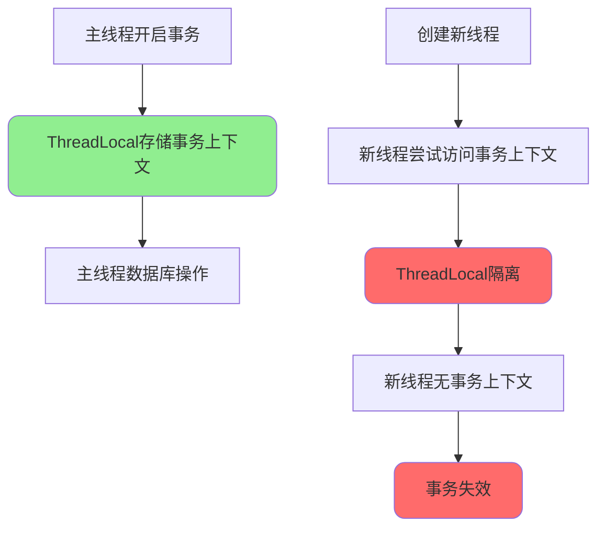
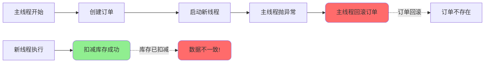

import PaidCTA from '@site/src/components/PaidCTA';

# Spring事务高级应用场景

## 多线程环境下的事务处理

### 问题背景

Spring的@Transactional事务管理使用ThreadLocal机制存储事务上下文,每个线程都有独立的事务上下文副本。在多线程环境下,新线程无法访问主线程的事务上下文,导致事务失效。



### 声明式事务在多线程下失效

```java
@Service
public class OrderService {
    
    @Autowired
    private OrderRepository orderRepository;
    
    @Autowired
    private StockRepository stockRepository;
    
    /**
     * 多线程场景下事务失效示例
     */
    @Transactional(rollbackFor = Exception.class)
    public void createOrderWithMultiThread(OrderRequest request) {
        // 主线程: 创建订单
        Order order = new Order();
        order.setUserId(request.getUserId());
        order.setAmount(request.getAmount());
        orderRepository.save(order);
        
        // 新线程: 扣减库存
        new Thread(() -> {
            // ❌ 新线程中没有事务上下文
            // 即使主线程回滚,库存扣减操作也不会回滚!
            stockRepository.decreaseStock(
                request.getProductId(), 
                request.getQuantity()
            );
        }).start();
        
        // 模拟异常
        if (request.getAmount() > 10000) {
            throw new BusinessException("金额超限");
        }
        // 主线程回滚,但新线程的库存扣减已执行且不会回滚
    }
}
```

**执行结果分析:**



### 解决方案: 编程式事务

在新线程中使用编程式事务,手动管理事务生命周期:

<PaidCTA />