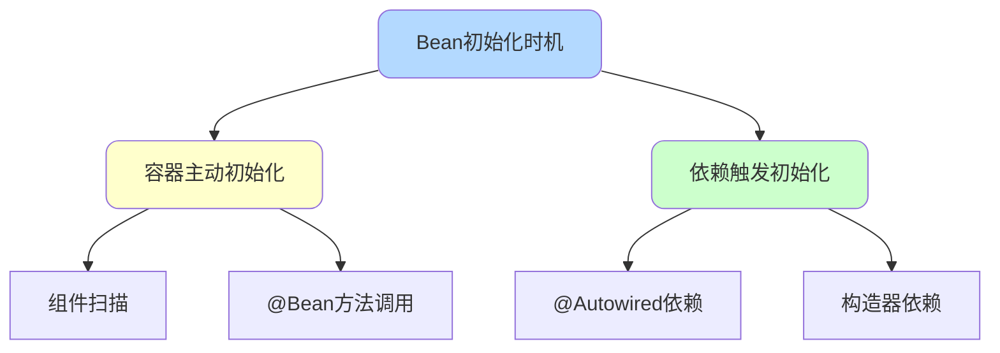
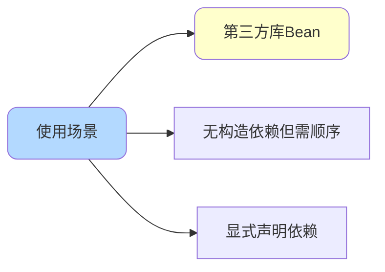

import PaidCTA from '@site/src/components/PaidCTA';

# SpringBoot Bean加载顺序控制

## Bean初始化时机

### Bean初始化的两种方式

在Spring容器中,Bean的初始化有两个时机:



**方式一:容器主动初始化**

Spring容器启动时扫描到Bean定义,主动创建Bean实例。

```java
@Component
public class LogService {
    public LogService() {
        System.out.println("LogService初始化");
    }
}
```

**方式二:依赖触发初始化**

其他Bean依赖该Bean时,容器会先初始化被依赖的Bean。

```java
@Component
public class OrderService {
    
    @Autowired
    private InventoryService inventoryService;  // 触发InventoryService初始化
    
    public OrderService() {
        System.out.println("OrderService初始化");
    }
}
```

**初始化顺序**:

```
InventoryService初始化
OrderService初始化
```

## 方式一:直接依赖控制

### 通过构造器依赖

最直接的方式是在构造器中注入依赖:

```java
@Component
public class PaymentService {
    
    private final NotificationService notificationService;
    
    // NotificationService会先于PaymentService初始化
    public PaymentService(NotificationService notificationService) {
        this.notificationService = notificationService;
        System.out.println("PaymentService初始化");
    }
}

@Component
public class NotificationService {
    public NotificationService() {
        System.out.println("NotificationService初始化");
    }
}
```

**输出顺序**:

```
NotificationService初始化
PaymentService初始化
```

**优点**:

- 依赖关系明确
- 支持final字段
- 便于单元测试

### 通过字段依赖

使用`@Autowired`注解字段:

```java
@Component
public class OrderService {
    
    @Autowired
    private ProductService productService;  // ProductService先初始化
    
    @Autowired
    private PriceService priceService;  // PriceService先初始化
}
```

**注意**:多个字段依赖的初始化顺序是不确定的。

## 方式二:@DependsOn注解

### 适用场景

当无法修改外部库代码,或需要显式声明依赖关系时,使用`@DependsOn`。



### @Bean方法上使用

```java
@Configuration
public class CacheConfiguration {
    
    @Bean
    public RedisTemplate<String, Object> redisTemplate(RedisConnectionFactory factory) {
        System.out.println("创建RedisTemplate");
        RedisTemplate<String, Object> template = new RedisTemplate<>();
        template.setConnectionFactory(factory);
        return template;
    }
    
    @Bean
    @DependsOn("redisTemplate")  // 确保RedisTemplate先初始化
    public CacheManager cacheManager(RedisConnectionFactory factory) {
        System.out.println("创建CacheManager");
        RedisCacheManager cacheManager = RedisCacheManager.builder(factory)
            .cacheDefaults(RedisCacheConfiguration.defaultCacheConfig())
            .build();
        return cacheManager;
    }
}
```

**输出顺序**:

```
创建RedisTemplate
创建CacheManager
```

### @Component类上使用

```java
@Component
public class DataSourceInitializer {
    public DataSourceInitializer() {
        System.out.println("初始化数据源配置");
    }
}

@Component
@DependsOn("dataSourceInitializer")  // 指定依赖的Bean名称
public class DatabaseMigration {
    public DatabaseMigration() {
        System.out.println("执行数据库迁移");
    }
}
```

### 多个依赖

```java
@Component
@DependsOn({"configLoader", "licenseValidator", "systemChecker"})
public class ApplicationBootstrap {
    public ApplicationBootstrap() {
        System.out.println("应用启动完成");
    }
}
```

**初始化顺序**:

```
configLoader初始化
licenseValidator初始化  
systemChecker初始化
ApplicationBootstrap初始化
```

### 注意事项

**循环依赖会报错**:

```java
@Component
@DependsOn("serviceB")
public class ServiceA {
}

@Component
@DependsOn("serviceA")  // 循环依赖!
public class ServiceB {
}
```

**错误信息**:

```
Circular depends-on relationship between 'serviceA' and 'serviceB'
```

## 方式三:BeanFactoryPostProcessor

<PaidCTA />