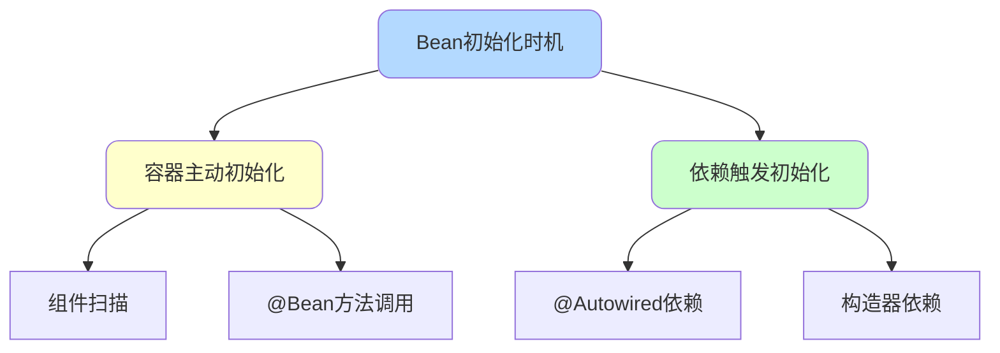
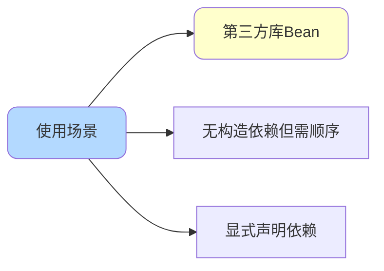
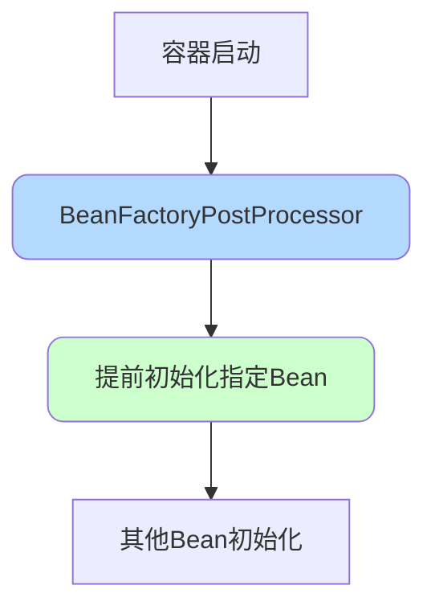
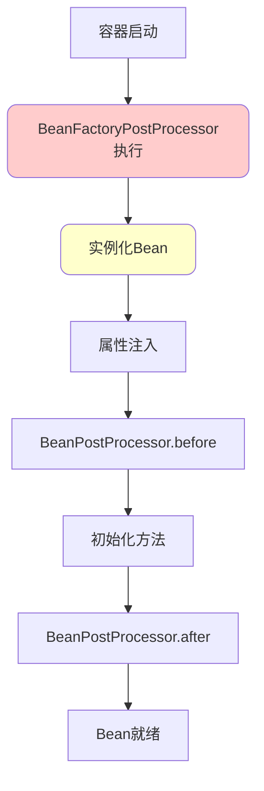
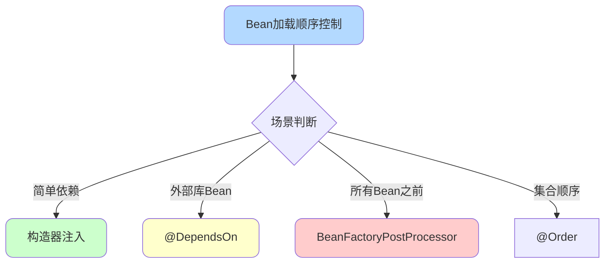
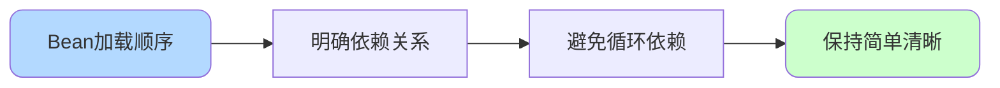

# SpringBoot Bean加载顺序控制

## Bean初始化时机

### Bean初始化的两种方式

在Spring容器中,Bean的初始化有两个时机:



**方式一:容器主动初始化**

Spring容器启动时扫描到Bean定义,主动创建Bean实例。

```java
@Component
public class LogService {
    public LogService() {
        System.out.println("LogService初始化");
    }
}
```

**方式二:依赖触发初始化**

其他Bean依赖该Bean时,容器会先初始化被依赖的Bean。

```java
@Component
public class OrderService {
    
    @Autowired
    private InventoryService inventoryService;  // 触发InventoryService初始化
    
    public OrderService() {
        System.out.println("OrderService初始化");
    }
}
```

**初始化顺序**:

```
InventoryService初始化
OrderService初始化
```

## 方式一:直接依赖控制

### 通过构造器依赖

最直接的方式是在构造器中注入依赖:

```java
@Component
public class PaymentService {
    
    private final NotificationService notificationService;
    
    // NotificationService会先于PaymentService初始化
    public PaymentService(NotificationService notificationService) {
        this.notificationService = notificationService;
        System.out.println("PaymentService初始化");
    }
}

@Component
public class NotificationService {
    public NotificationService() {
        System.out.println("NotificationService初始化");
    }
}
```

**输出顺序**:

```
NotificationService初始化
PaymentService初始化
```

**优点**:

- 依赖关系明确
- 支持final字段
- 便于单元测试

### 通过字段依赖

使用`@Autowired`注解字段:

```java
@Component
public class OrderService {
    
    @Autowired
    private ProductService productService;  // ProductService先初始化
    
    @Autowired
    private PriceService priceService;  // PriceService先初始化
}
```

**注意**:多个字段依赖的初始化顺序是不确定的。

## 方式二:@DependsOn注解

### 适用场景

当无法修改外部库代码,或需要显式声明依赖关系时,使用`@DependsOn`。



### @Bean方法上使用

```java
@Configuration
public class CacheConfiguration {
    
    @Bean
    public RedisTemplate<String, Object> redisTemplate(RedisConnectionFactory factory) {
        System.out.println("创建RedisTemplate");
        RedisTemplate<String, Object> template = new RedisTemplate<>();
        template.setConnectionFactory(factory);
        return template;
    }
    
    @Bean
    @DependsOn("redisTemplate")  // 确保RedisTemplate先初始化
    public CacheManager cacheManager(RedisConnectionFactory factory) {
        System.out.println("创建CacheManager");
        RedisCacheManager cacheManager = RedisCacheManager.builder(factory)
            .cacheDefaults(RedisCacheConfiguration.defaultCacheConfig())
            .build();
        return cacheManager;
    }
}
```

**输出顺序**:

```
创建RedisTemplate
创建CacheManager
```

### @Component类上使用

```java
@Component
public class DataSourceInitializer {
    public DataSourceInitializer() {
        System.out.println("初始化数据源配置");
    }
}

@Component
@DependsOn("dataSourceInitializer")  // 指定依赖的Bean名称
public class DatabaseMigration {
    public DatabaseMigration() {
        System.out.println("执行数据库迁移");
    }
}
```

### 多个依赖

```java
@Component
@DependsOn({"configLoader", "licenseValidator", "systemChecker"})
public class ApplicationBootstrap {
    public ApplicationBootstrap() {
        System.out.println("应用启动完成");
    }
}
```

**初始化顺序**:

```
configLoader初始化
licenseValidator初始化  
systemChecker初始化
ApplicationBootstrap初始化
```

### 注意事项

**循环依赖会报错**:

```java
@Component
@DependsOn("serviceB")
public class ServiceA {
}

@Component
@DependsOn("serviceA")  // 循环依赖!
public class ServiceB {
}
```

**错误信息**:

```
Circular depends-on relationship between 'serviceA' and 'serviceB'
```

## 方式三:BeanFactoryPostProcessor

### 适用场景

需要某个Bean在**所有其他Bean之前**初始化时使用。



### Spring Bean生命周期回顾



### 实现示例

```java
@Component
public class ConfigurationBean {
    public ConfigurationBean() {
        System.out.println("ConfigurationBean初始化");
    }
    
    public Map<String, String> loadConfig() {
        // 加载配置
        Map<String, String> config = new HashMap<>();
        config.put("app.name", "order-service");
        config.put("app.version", "1.0.0");
        return config;
    }
}

@Component
public class EarlyBeanInitializer implements BeanFactoryPostProcessor {
    
    @Override
    public void postProcessBeanFactory(ConfigurableListableBeanFactory beanFactory) 
            throws BeansException {
        System.out.println("BeanFactoryPostProcessor执行");
        
        // 提前初始化ConfigurationBean
        ConfigurationBean configBean = beanFactory.getBean(ConfigurationBean.class);
        Map<String, String> config = configBean.loadConfig();
        
        System.out.println("提前加载配置: " + config);
    }
}

@Component
public class OrderService {
    public OrderService() {
        System.out.println("OrderService初始化");
    }
}
```

**输出顺序**:

```
BeanFactoryPostProcessor执行
ConfigurationBean初始化
提前加载配置: {app.name=order-service, app.version=1.0.0}
OrderService初始化
```

### 实际应用场景

**场景一:加载外部配置**

```java
@Component
public class DynamicConfigLoader implements BeanFactoryPostProcessor {
    
    @Override
    public void postProcessBeanFactory(ConfigurableListableBeanFactory beanFactory) 
            throws BeansException {
        // 从配置中心加载配置
        ConfigCenterClient client = beanFactory.getBean(ConfigCenterClient.class);
        Properties props = client.loadProperties();
        
        // 注册到环境中
        ConfigurableEnvironment environment = 
            (ConfigurableEnvironment) beanFactory.getBean("environment");
        environment.getPropertySources()
            .addFirst(new PropertiesPropertySource("dynamic", props));
    }
}
```

**场景二:许可证验证**

```java
@Component
public class LicenseValidator implements BeanFactoryPostProcessor {
    
    @Override
    public void postProcessBeanFactory(ConfigurableListableBeanFactory beanFactory) 
            throws BeansException {
        LicenseChecker checker = beanFactory.getBean(LicenseChecker.class);
        
        if (!checker.validate()) {
            throw new IllegalStateException("许可证验证失败,应用无法启动");
        }
        
        System.out.println("许可证验证通过");
    }
}
```

## 方式四:@Order注解的误区

### @Order的真正作用

很多人认为`@Order`可以控制Bean的初始化顺序,**这是错误的**!

```java
// 错误理解:以为BeanA会先于BeanB初始化
@Order(1)
@Component
public class BeanA {
}

@Order(2)
@Component
public class BeanB {
}
```

**实际上**:`@Order`只控制**同一类型Bean集合**中的顺序,不控制初始化顺序。

### @Order的正确用法

**场景:过滤器链排序**

```java
public interface DataFilter {
    void filter(Data data);
}

@Order(1)
@Component
public class ValidationFilter implements DataFilter {
    @Override
    public void filter(Data data) {
        System.out.println("1. 数据校验");
    }
}

@Order(2)
@Component
public class EncryptionFilter implements DataFilter {
    @Override
    public void filter(Data data) {
        System.out.println("2. 数据加密");
    }
}

@Order(3)
@Component
public class CompressionFilter implements DataFilter {
    @Override
    public void filter(Data data) {
        System.out.println("3. 数据压缩");
    }
}

@Component
public class DataProcessor {
    
    private final List<DataFilter> filters;
    
    // Spring会按@Order顺序注入
    public DataProcessor(List<DataFilter> filters) {
        this.filters = filters;
    }
    
    public void process(Data data) {
        for (DataFilter filter : filters) {
            filter.filter(data);
        }
    }
}
```

**输出顺序**:

```
1. 数据校验
2. 数据加密
3. 数据压缩
```

### 集合注入顺序

```java
@Component
public class PaymentProcessor {
    
    private final List<PaymentChannel> channels;
    
    // channels中的顺序由@Order决定
    public PaymentProcessor(List<PaymentChannel> channels) {
        this.channels = channels;
        System.out.println("支付渠道顺序:");
        channels.forEach(ch -> System.out.println("  - " + ch.getName()));
    }
}

@Order(1)
@Component
public class AlipayChannel implements PaymentChannel {
    @Override
    public String getName() {
        return "支付宝";
    }
}

@Order(2)
@Component
public class WechatChannel implements PaymentChannel {
    @Override
    public String getName() {
        return "微信支付";
    }
}

@Order(3)
@Component
public class BankCardChannel implements PaymentChannel {
    @Override
    public String getName() {
        return "银行卡";
    }
}
```

**输出**:

```
支付渠道顺序:
  - 支付宝
  - 微信支付
  - 银行卡
```

## 综合示例

### 需求场景

电商系统启动时需要按以下顺序初始化:

1. 配置加载器(最先)
2. 数据库连接池
3. 缓存管理器
4. 业务服务

### 实现方案

```java
// 1. 配置加载器 - 使用BeanFactoryPostProcessor优先初始化
@Component
public class ConfigLoader implements BeanFactoryPostProcessor {
    
    @Override
    public void postProcessBeanFactory(ConfigurableListableBeanFactory beanFactory) 
            throws BeansException {
        System.out.println("1. 加载系统配置");
    }
}

// 2. 数据库连接池
@Configuration
public class DataSourceConfig {
    
    @Bean
    public DataSource dataSource() {
        System.out.println("2. 初始化数据库连接池");
        HikariDataSource dataSource = new HikariDataSource();
        dataSource.setJdbcUrl("jdbc:mysql://localhost:3306/shop");
        return dataSource;
    }
}

// 3. 缓存管理器 - 依赖数据源
@Configuration
public class CacheConfig {
    
    @Bean
    @DependsOn("dataSource")
    public CacheManager cacheManager() {
        System.out.println("3. 初始化缓存管理器");
        return new ConcurrentMapCacheManager("products", "orders");
    }
}

// 4. 业务服务 - 通过构造器依赖
@Service
public class ProductService {
    
    private final CacheManager cacheManager;
    private final DataSource dataSource;
    
    public ProductService(CacheManager cacheManager, DataSource dataSource) {
        this.cacheManager = cacheManager;
        this.dataSource = dataSource;
        System.out.println("4. 初始化商品服务");
    }
}
```

**启动输出**:

```
1. 加载系统配置
2. 初始化数据库连接池
3. 初始化缓存管理器
4. 初始化商品服务
```

## 最佳实践建议

### 选择合适的方式



**推荐优先级**:

1. **构造器注入**(最推荐):依赖关系清晰,支持不可变对象
2. **@DependsOn**:无法修改代码时使用
3. **BeanFactoryPostProcessor**:必须最先初始化时使用
4. **@Order**:仅用于集合排序,不控制初始化顺序

### 避免的错误

**错误一:过度使用@DependsOn**

```java
// 不推荐:能用构造器依赖就用构造器
@Component
@DependsOn("logService")
public class OrderService {
    @Autowired
    private LogService logService;
}

// 推荐
@Component
public class OrderService {
    private final LogService logService;
    
    public OrderService(LogService logService) {
        this.logService = logService;
    }
}
```

**错误二:循环@DependsOn**

```java
// 错误:会导致启动失败
@Component
@DependsOn("serviceB")
public class ServiceA {}

@Component
@DependsOn("serviceA")
public class ServiceB {}
```

**错误三:误用@Order控制初始化**

```java
// 错误:@Order不控制初始化顺序
@Order(1)
@Component
public class FirstBean {}

@Order(2)
@Component
public class SecondBean {}
```

### 调试技巧

**开启Bean创建日志**:

```yaml
logging:
  level:
    org.springframework.beans.factory.support.DefaultListableBeanFactory: DEBUG
```

**输出示例**:

```
Creating shared instance of singleton bean 'dataSource'
Creating shared instance of singleton bean 'cacheManager'
Creating shared instance of singleton bean 'productService'
```

## 总结

控制Bean加载顺序的四种方式:

| 方式 | 适用场景 | 优先级 |
|------|----------|--------|
| 构造器依赖 | 显式依赖关系 | ⭐⭐⭐⭐⭐ |
| @DependsOn | 第三方Bean、无构造依赖 | ⭐⭐⭐⭐ |
| BeanFactoryPostProcessor | 必须最先初始化 | ⭐⭐⭐ |
| @Order | 集合元素排序 | ⭐⭐ |

**核心原则**:优先使用构造器依赖,其次使用@DependsOn,特殊场景才使用BeanFactoryPostProcessor。


