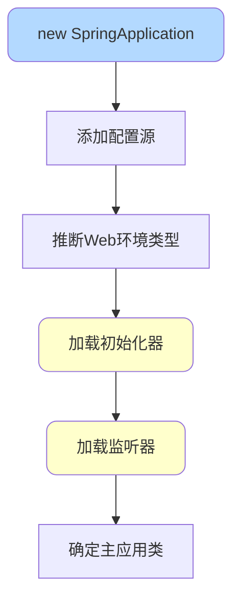
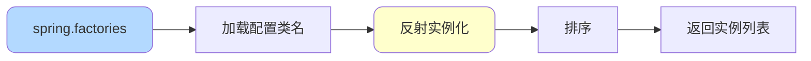
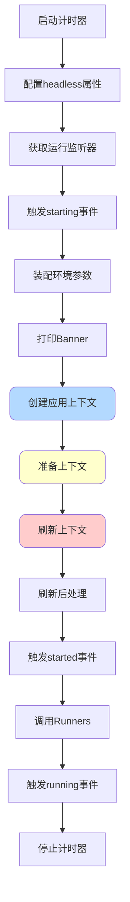
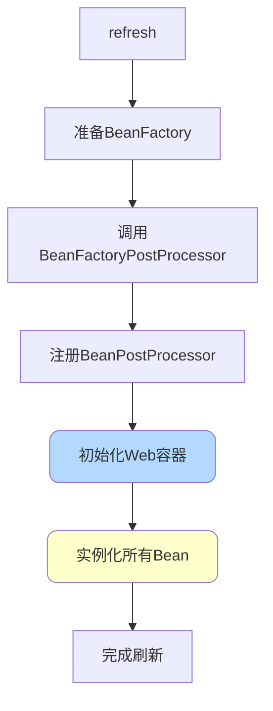
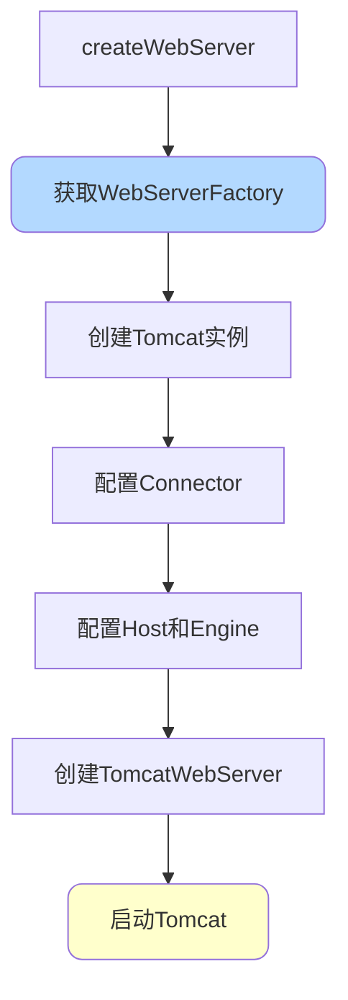
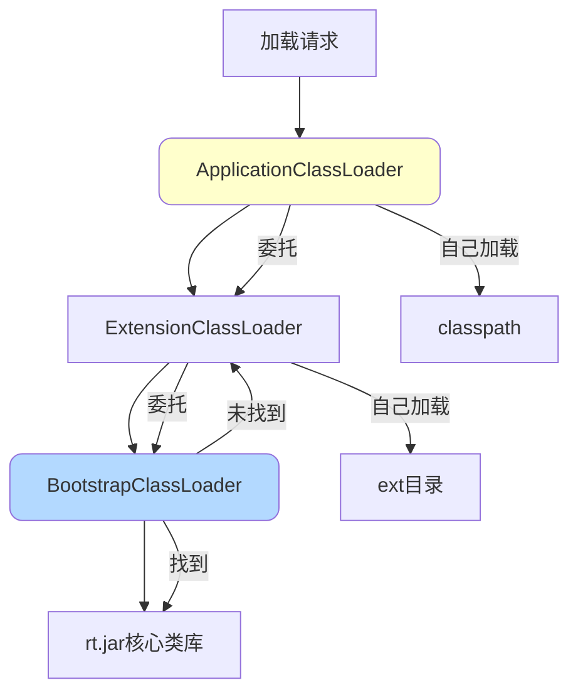
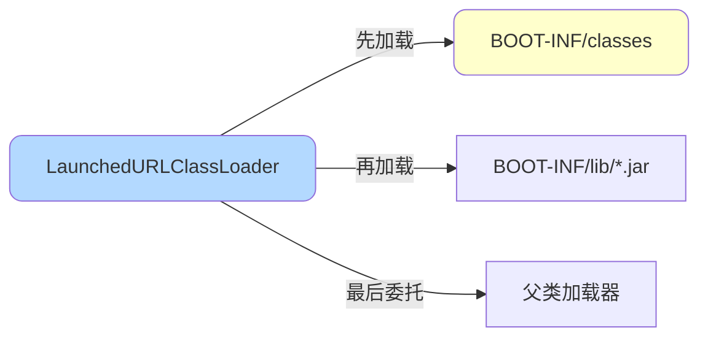
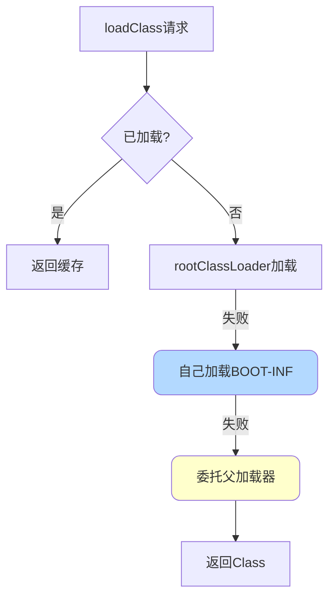
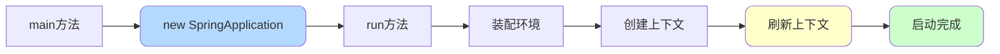

# SpringBoot启动原理

## SpringBoot启动流程

SpringBoot应用的启动入口非常简洁:

```java
@SpringBootApplication
public class Application {
    public static void main(String[] args) {
        SpringApplication.run(Application.class, args);
    }
}
```

核心代码:`new SpringApplication(sources).run(args)`

启动过程分为两个阶段:**SpringApplication初始化**和**run方法执行**。

## 一、SpringApplication初始化



### 初始化流程详解

```java
private void initialize(Object[] sources) {
    // 1. 添加配置源
    if (sources != null && sources.length > 0) {
        this.sources.addAll(Arrays.asList(sources));
    }
    
    // 2. 推断Web环境类型
    this.webEnvironment = deduceWebEnvironment();
    
    // 3. 从spring.factories加载ApplicationContextInitializer
    setInitializers(getSpringFactoriesInstances(ApplicationContextInitializer.class));
    
    // 4. 从spring.factories加载ApplicationListener
    setListeners(getSpringFactoriesInstances(ApplicationListener.class));
    
    // 5. 确定主应用类(包含main方法的类)
    this.mainApplicationClass = deduceMainApplicationClass();
}
```

### 关键步骤:加载spring.factories

```java
private <T> Collection<? extends T> getSpringFactoriesInstances(Class<T> type) {
    // 1. 获取类加载器
    ClassLoader classLoader = Thread.currentThread().getContextClassLoader();
    
    // 2. 从META-INF/spring.factories加载配置
    Set<String> names = new LinkedHashSet<>(
        SpringFactoriesLoader.loadFactoryNames(type, classLoader)
    );
    
    // 3. 实例化加载的类
    List<T> instances = createSpringFactoriesInstances(type, classLoader, names);
    
    // 4. 排序
    AnnotationAwareOrderComparator.sort(instances);
    
    return instances;
}
```

这是SpringBoot自动配置的核心机制,通过SPI机制加载配置类。



## 二、run方法执行



### 详细流程

```java
public ConfigurableApplicationContext run(String... args) {
    // 1. 启动计时
    StopWatch stopWatch = new StopWatch();
    stopWatch.start();
    
    ConfigurableApplicationContext context = null;
    
    // 2. 配置headless属性
    configureHeadlessProperty();
    
    // 3. 获取并启动监听器
    SpringApplicationRunListeners listeners = getRunListeners(args);
    listeners.starting();
    
    try {
        // 4. 装配环境参数
        ApplicationArguments applicationArguments = new DefaultApplicationArguments(args);
        ConfigurableEnvironment environment = prepareEnvironment(listeners, applicationArguments);
        
        // 5. 打印Banner
        Banner printedBanner = printBanner(environment);
        
        // 6. 创建应用上下文
        context = createApplicationContext();
        
        // 7. 准备上下文
        prepareContext(context, environment, listeners, applicationArguments, printedBanner);
        
        // 8. 刷新上下文(核心)
        refreshContext(context);
        
        // 9. 刷新后处理
        afterRefresh(context, applicationArguments);
        
        // 10. 停止计时
        stopWatch.stop();
        
        // 11. 触发started事件
        listeners.started(context);
        
        // 12. 调用CommandLineRunner和ApplicationRunner
        callRunners(context, applicationArguments);
        
        // 13. 触发running事件
        listeners.running(context);
        
        return context;
    } catch (Throwable ex) {
        handleRunFailure(context, listeners, ex);
        throw new IllegalStateException(ex);
    }
}
```

### 关键步骤详解

#### 1. 装配环境参数

加载application.properties/yml配置:

```java
private ConfigurableEnvironment prepareEnvironment(
        SpringApplicationRunListeners listeners,
        ApplicationArguments applicationArguments) {
    
    // 创建环境对象
    ConfigurableEnvironment environment = getOrCreateEnvironment();
    
    // 配置环境(加载配置文件、环境变量等)
    configureEnvironment(environment, applicationArguments.getSourceArgs());
    
    // 通知监听器环境已准备
    listeners.environmentPrepared(environment);
    
    return environment;
}
```

#### 2. 打印Banner

```
  .   ____          _            __ _ _
 /\\ / ___'_ __ _ _(_)_ __  __ _ \ \ \ \
( ( )\___ | '_ | '_| | '_ \/ _` | \ \ \ \
 \\/  ___)| |_)| | | | | || (_| |  ) ) ) )
  '  |____| .__|_| |_|_| |_\__, | / / / /
 =========|_|==============|___/=/_/_/_/
 :: Spring Boot ::                (v3.1.5)
```

#### 3. 准备上下文

```java
private void prepareContext(ConfigurableApplicationContext context,
                           ConfigurableEnvironment environment,
                           SpringApplicationRunListeners listeners,
                           ApplicationArguments applicationArguments,
                           Banner printedBanner) {
    
    // 1. 设置环境
    context.setEnvironment(environment);
    
    // 2. 后处理应用上下文
    postProcessApplicationContext(context);
    
    // 3. 应用所有ApplicationContextInitializer
    applyInitializers(context);
    
    // 4. 通知监听器上下文已准备
    listeners.contextPrepared(context);
    
    // 5. 打印启动日志
    if (this.logStartupInfo) {
        logStartupInfo(context.getParent() == null);
        logStartupProfileInfo(context);
    }
    
    // 6. 注册特殊的单例Bean
    context.getBeanFactory().registerSingleton("springApplicationArguments", applicationArguments);
    if (printedBanner != null) {
        context.getBeanFactory().registerSingleton("springBootBanner", printedBanner);
    }
    
    // 7. 加载配置源
    Set<Object> sources = getSources();
    load(context, sources.toArray(new Object[sources.size()]));
    
    // 8. 通知监听器上下文已加载
    listeners.contextLoaded(context);
}
```

启动日志示例:

```
2023-11-18 09:00:00.123  INFO 12345 --- [main] com.example.Application : Starting Application v0.1.0
```

#### 4. 刷新上下文(最核心)

这一步执行Spring容器的刷新,完成Bean的实例化和初始化:

```java
@Override
public void refresh() throws BeansException, IllegalStateException {
    synchronized (this.startupShutdownMonitor) {
        // 1. 准备刷新
        prepareRefresh();
        
        // 2. 获取BeanFactory
        ConfigurableListableBeanFactory beanFactory = obtainFreshBeanFactory();
        
        // 3. 准备BeanFactory
        prepareBeanFactory(beanFactory);
        
        try {
            // 4. BeanFactory后处理
            postProcessBeanFactory(beanFactory);
            
            // 5. 调用BeanFactoryPostProcessor
            invokeBeanFactoryPostProcessors(beanFactory);
            
            // 6. 注册BeanPostProcessor
            registerBeanPostProcessors(beanFactory);
            
            // 7. 初始化消息源
            initMessageSource();
            
            // 8. 初始化事件多播器
            initApplicationEventMulticaster();
            
            // 9. 初始化其他特殊Bean(如启动Web容器)
            onRefresh();
            
            // 10. 注册监听器
            registerListeners();
            
            // 11. 实例化所有非懒加载的单例Bean
            finishBeanFactoryInitialization(beanFactory);
            
            // 12. 完成刷新,发布事件
            finishRefresh();
        } catch (BeansException ex) {
            destroyBeans();
            cancelRefresh(ex);
            throw ex;
        }
    }
}
```



#### 5. Web容器启动(Tomcat)

在`onRefresh()`阶段启动内嵌的Web容器:

```java
@Override
protected void onRefresh() {
    super.onRefresh();
    try {
        createWebServer();  // 创建Web服务器
    } catch (Throwable ex) {
        throw new ApplicationContextException("Unable to start web server", ex);
    }
}

private void createWebServer() {
    WebServer webServer = this.webServer;
    if (webServer == null) {
        // 获取Web服务器工厂(默认TomcatServletWebServerFactory)
        ServletWebServerFactory factory = getWebServerFactory();
        
        // 创建Web服务器
        this.webServer = factory.getWebServer(getSelfInitializer());
        
        // 注册优雅关闭生命周期Bean
        getBeanFactory().registerSingleton("webServerGracefulShutdown",
                new WebServerGracefulShutdownLifecycle(this.webServer));
    }
}
```

TomcatServletWebServerFactory创建Tomcat:

```java
@Override
public WebServer getWebServer(ServletContextInitializer... initializers) {
    // 1. 创建Tomcat实例
    Tomcat tomcat = new Tomcat();
    
    // 2. 设置工作目录
    File baseDir = createTempDir("tomcat");
    tomcat.setBaseDir(baseDir.getAbsolutePath());
    
    // 3. 创建连接器(Connector)
    Connector connector = new Connector(this.protocol);
    connector.setThrowOnFailure(true);
    tomcat.getService().addConnector(connector);
    
    // 4. 配置连接器
    customizeConnector(connector);
    tomcat.setConnector(connector);
    
    // 5. 配置Host
    tomcat.getHost().setAutoDeploy(false);
    configureEngine(tomcat.getEngine());
    
    // 6. 准备Servlet上下文
    prepareContext(tomcat.getHost(), initializers);
    
    // 7. 创建并启动TomcatWebServer
    return getTomcatWebServer(tomcat);
}

protected TomcatWebServer getTomcatWebServer(Tomcat tomcat) {
    return new TomcatWebServer(tomcat, getPort() >= 0, getShutdown());
}
```

TomcatWebServer构造器中启动Tomcat:

```java
public TomcatWebServer(Tomcat tomcat, boolean autoStart, Shutdown shutdown) {
    this.tomcat = tomcat;
    this.autoStart = autoStart;
    this.gracefulShutdown = (shutdown == Shutdown.GRACEFUL) ? new GracefulShutdown(tomcat) : null;
    initialize();  // 初始化并启动Tomcat
}

private void initialize() {
    // 启动Tomcat
    this.tomcat.start();
    
    // 等待Tomcat启动完成
    startDaemonAwaitThread();
}
```



## SpringBoot类加载机制

### 传统双亲委派模型



### SpringBoot的类加载

SpringBoot打破了传统双亲委派,使用`LaunchedURLClassLoader`支持Fat JAR:



**为什么需要自定义类加载器?**

传统的ApplicationClassLoader只能从外部classpath加载类,无法加载JAR包内嵌的其他JAR(Fat JAR结构)。

**LaunchedURLClassLoader源码**:

```java
@Override
protected Class<?> loadClass(String name, boolean resolve) throws ClassNotFoundException {
    synchronized (LaunchedURLClassLoader.LOCK_PROVIDER.getLock(this, name)) {
        // 检查是否已加载
        Class<?> loadedClass = findLoadedClass(name);
        if (loadedClass == null) {
            loadedClass = doLoadClass(name);
        }
        if (resolve) {
            resolveClass(loadedClass);
        }
        return loadedClass;
    }
}

private Class<?> doLoadClass(String name) throws ClassNotFoundException {
    // 1. 尝试从rootClassLoader加载
    try {
        if (this.rootClassLoader != null) {
            return this.rootClassLoader.loadClass(name);
        }
    } catch (Exception ex) {
        // 忽略,继续
    }
    
    // 2. 尝试自己加载(BOOT-INF/classes和BOOT-INF/lib)
    try {
        findPackage(name);
        Class<?> cls = findClass(name);  // 先自己加载
        return cls;
    } catch (Exception ex) {
        // 忽略,继续
    }
    
    // 3. 委托父类加载器
    return super.loadClass(name, false);  // 最后才委托
}
```

**关键点**:先自己加载(findClass),找不到再委托父类加载器(super.loadClass),这就打破了双亲委派。



## 总结

SpringBoot启动流程核心步骤:

1. **初始化SpringApplication**:加载初始化器和监听器
2. **装配环境参数**:加载配置文件
3. **创建应用上下文**:准备Spring容器
4. **刷新上下文**:实例化Bean,启动Web容器
5. **调用Runners**:执行自定义启动逻辑



关键技术点:

- SPI机制(spring.factories)实现自动配置
- 事件监听机制贯穿启动全流程
- 在refresh阶段启动内嵌Web容器
- 自定义类加载器支持Fat JAR运行
