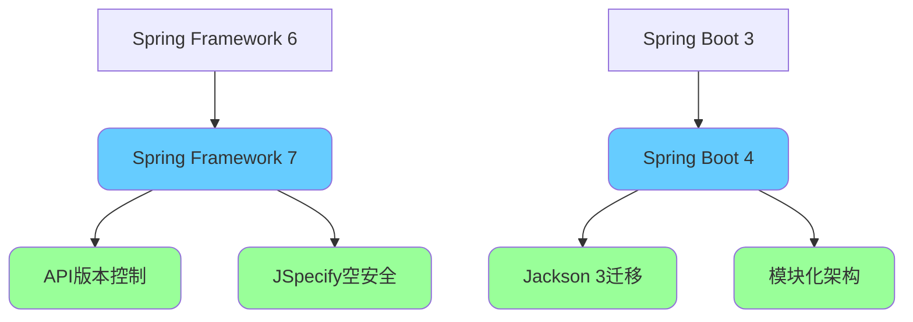
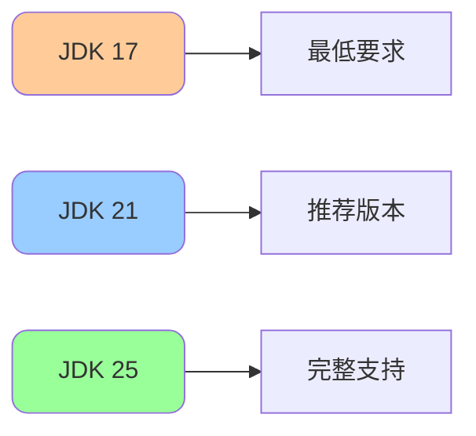
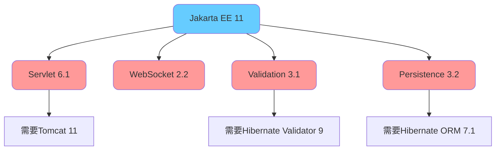

import PaidCTA from '@site/src/components/PaidCTA';

# SpringBoot4与Spring7新特性

## 版本演进概述

### 新一代框架的里程碑

2025年11月，Spring团队正式发布了**Spring Framework 7.0**和**Spring Boot 4.0**，这是继Spring 6和Spring Boot 3之后的又一次重大版本升级。此次更新带来了API版本控制、JSpecify空安全注解、内置弹性特性等革命性功能。

### 核心更新一览

| 特性分类 | Spring Framework 7 | Spring Boot 4 |
|---------|-------------------|---------------|
| API版本控制 | 原生支持 | 自动配置 |
| 空安全 | JSpecify注解 | 全面集成 |
| 弹性特性 | @Retryable内置 | 开箱即用 |
| JSON处理 | Jackson 3支持 | 默认Jackson 3 |
| 模块化 | - | 自动配置模块化 |
| JDK支持 | JDK 17-25 | JDK 17-25 |

## 基线要求与依赖更新

### JDK版本要求

Spring Framework 7保持**JDK 17基线**不变，同时全面拥抱**JDK 25**的所有新特性。这意味着开发者可以继续使用JDK 17，但建议升级到JDK 25以获得最佳体验。

### Jakarta EE 11基线

Spring Framework 7将Jakarta EE基线从版本9升级到**版本11**，带来以下变化：

**重要变更**：由于Undertow尚未兼容Servlet 6.1，Spring Boot 4暂时**不支持Undertow**作为内嵌Web服务器。

### 第三方依赖升级

<PaidCTA />