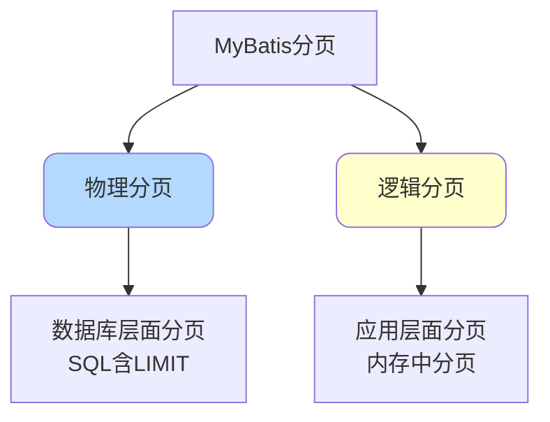
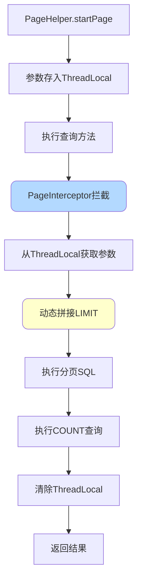
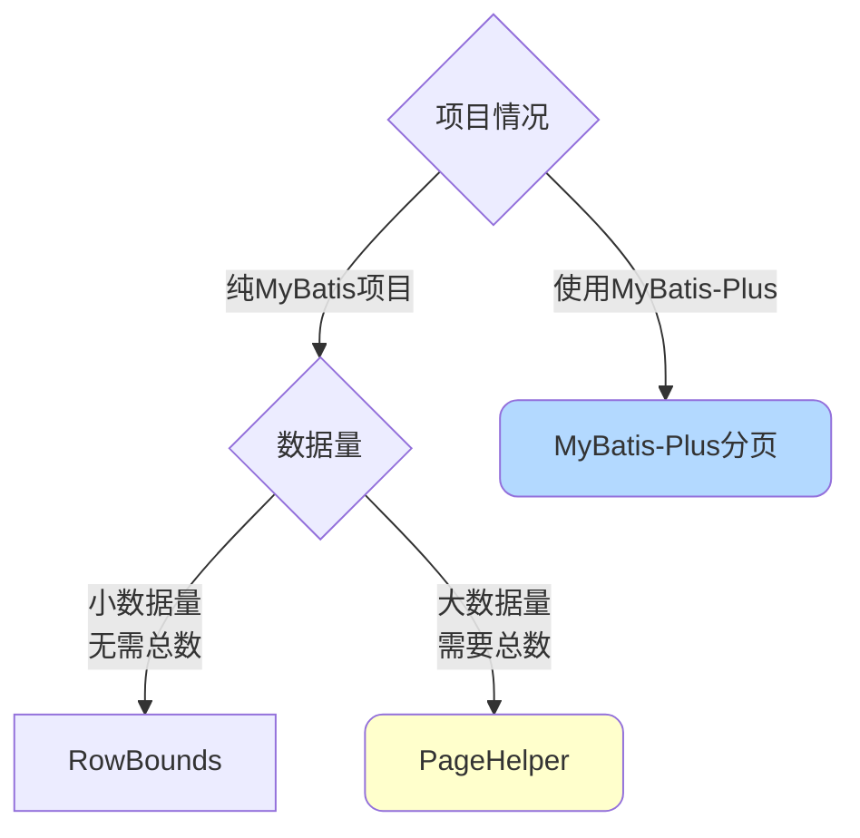

# MyBatis分页实现方案

## 分页概述

在MyBatis中实现分页有两种基本方式：物理分页和逻辑分页。



### 物理分页

**定义**：在SQL语句中添加分页关键字（如LIMIT），数据库只返回指定范围的数据。

**特点**：
- ✅ 减少内存占用
- ✅ 减轻数据库负载
- ✅ 适合大数据量场景
- ❌ 无法对结果进行二次处理

### 逻辑分页

**定义**：查询全部数据后，在应用内存中进行分页处理。

**特点**：
- ✅ 可以对结果进行二次过滤、排序
- ✅ 实现简单
- ❌ 内存占用大
- ❌ 查询性能差
- ❌ 只适合小数据量

## 四种分页实现方式

### 方式一：手动LIMIT分页

直接在SQL语句中编写LIMIT子句。

**Mapper XML配置**：

```xml
<select id="findProducts" resultType="Product">
    SELECT id, name, price, stock, category_id
    FROM product
    <where>
        <if test="categoryId != null">
            AND category_id = #{categoryId}
        </if>
        <if test="name != null and name != ''">
            AND name LIKE CONCAT('%', #{name}, '%')
        </if>
    </where>
    ORDER BY create_time DESC
    LIMIT #{offset}, #{pageSize}
</select>
```

**Java代码**：

```java
public PageResult<Product> findProducts(ProductQuery query, int pageNum, int pageSize) {
    // 计算偏移量
    int offset = (pageNum - 1) * pageSize;
    
    Map<String, Object> params = new HashMap<>();
    params.put("categoryId", query.getCategoryId());
    params.put("name", query.getName());
    params.put("offset", offset);
    params.put("pageSize", pageSize);
    
    // 查询数据
    List<Product> products = productMapper.findProducts(params);
    
    // 查询总数
    int total = productMapper.countProducts(query);
    
    return new PageResult<>(pageNum, pageSize, total, products);
}
```

**总数查询**：

```xml
<select id="countProducts" resultType="int">
    SELECT COUNT(*) FROM product
    <where>
        <if test="categoryId != null">
            AND category_id = #{categoryId}
        </if>
        <if test="name != null and name != ''">
            AND name LIKE CONCAT('%', #{name}, '%')
        </if>
    </where>
</select>
```

**优点**：
- 实现简单直接
- 完全可控

**缺点**：
- 需要手动编写LIMIT
- 需要单独查询总数
- 代码重复度高

### 方式二：PageHelper插件

PageHelper是MyBatis最流行的分页插件，使用ThreadLocal实现分页参数传递。

**添加依赖**：

```xml
<dependency>
    <groupId>com.github.pagehelper</groupId>
    <artifactId>pagehelper-spring-boot-starter</artifactId>
    <version>1.4.7</version>
</dependency>
```

**配置插件**：

```java
@Configuration
public class MyBatisConfig {
    @Bean
    public PageInterceptor pageInterceptor() {
        PageInterceptor interceptor = new PageInterceptor();
        Properties properties = new Properties();
        properties.setProperty("helperDialect", "mysql");
        properties.setProperty("reasonable", "true");
        properties.setProperty("supportMethodsArguments", "true");
        interceptor.setProperties(properties);
        return interceptor;
    }
}
```

**Mapper接口**（无需LIMIT）：

```xml
<select id="findProducts" resultType="Product">
    SELECT id, name, price, stock, category_id
    FROM product
    <where>
        <if test="categoryId != null">
            AND category_id = #{categoryId}
        </if>
    </where>
    ORDER BY create_time DESC
</select>
```

**Java代码**：

```java
public PageInfo<Product> findProducts(ProductQuery query, int pageNum, int pageSize) {
    // 设置分页参数（存入ThreadLocal）
    PageHelper.startPage(pageNum, pageSize);
    
    // 执行查询
    List<Product> products = productMapper.findProducts(query);
    
    // 封装分页结果
    PageInfo<Product> pageInfo = new PageInfo<>(products);
    return pageInfo;
}
```

**工作原理**：



**核心流程**：

```java
// PageHelper源码简化版
public class PageHelper {
    private static final ThreadLocal<Page> LOCAL_PAGE = new ThreadLocal<>();
    
    public static <E> Page<E> startPage(int pageNum, int pageSize) {
        Page<E> page = new Page<>(pageNum, pageSize);
        // 存储到ThreadLocal
        LOCAL_PAGE.set(page);
        return page;
    }
    
    public static Page getLocalPage() {
        return LOCAL_PAGE.get();
    }
    
    public static void clearPage() {
        LOCAL_PAGE.remove();
    }
}
```

**拦截器实现**：

```java
public class PageInterceptor implements Interceptor {
    
    @Override
    public Object intercept(Invocation invocation) throws Throwable {
        // 1. 获取分页参数
        Page page = PageHelper.getLocalPage();
        if (page == null) {
            return invocation.proceed();
        }
        
        try {
            MappedStatement ms = (MappedStatement) invocation.getArgs()[0];
            Object parameter = invocation.getArgs()[1];
            BoundSql boundSql = ms.getBoundSql(parameter);
            String originalSql = boundSql.getSql();
            
            // 2. 生成COUNT SQL
            String countSql = "SELECT COUNT(*) FROM (" + originalSql + ") tmp";
            int total = executeCount(countSql, parameter);
            page.setTotal(total);
            
            // 3. 拼接分页SQL
            String pageSql = originalSql + 
                           " LIMIT " + page.getOffset() + ", " + page.getPageSize();
            
            // 4. 修改SQL并执行
            BoundSql newBoundSql = new BoundSql(
                ms.getConfiguration(), pageSql, 
                boundSql.getParameterMappings(), parameter);
            
            invocation.getArgs()[1] = newBoundSql;
            return invocation.proceed();
            
        } finally {
            // 5. 清除ThreadLocal
            PageHelper.clearPage();
        }
    }
}
```

**优点**：
- 使用简单，代码简洁
- 自动生成COUNT查询
- 自动拼接LIMIT语句
- 支持多种数据库

**缺点**：
- 依赖ThreadLocal，需注意线程安全
- 异步场景下可能失效

### 方式三：RowBounds逻辑分页

RowBounds是MyBatis内置的分页对象，实现逻辑分页。

**Mapper接口**：

```java
public interface ProductMapper {
    List<Product> findProducts(@Param("query") ProductQuery query, RowBounds rowBounds);
}
```

**Mapper XML**（不含LIMIT）：

```xml
<select id="findProducts" resultType="Product">
    SELECT id, name, price, stock
    FROM product
    <where>
        <if test="query.name != null">
            AND name LIKE CONCAT('%', #{query.name}, '%')
        </if>
    </where>
    ORDER BY id
</select>
```

**Java代码**：

```java
public List<Product> findProductsWithPage(ProductQuery query, int pageNum, int pageSize) {
    // 计算偏移量
    int offset = (pageNum - 1) * pageSize;
    
    // 创建RowBounds对象
    RowBounds rowBounds = new RowBounds(offset, pageSize);
    
    // 执行查询
    List<Product> products = productMapper.findProducts(query, rowBounds);
    return products;
}
```

**工作原理**：


**源码实现**：

```java
public class DefaultResultSetHandler {
    
    private void handleRowValuesForSimpleResultMap(
            ResultSetWrapper rsw, ResultMap resultMap, 
            ResultHandler<?> resultHandler, RowBounds rowBounds) {
        
        DefaultResultContext<Object> resultContext = new DefaultResultContext<>();
        ResultSet resultSet = rsw.getResultSet();
        
        // 跳过offset条记录
        skipRows(resultSet, rowBounds);
        
        // 只处理pageSize条记录
        while (shouldProcessMoreRows(resultContext, rowBounds) 
               && !resultSet.isClosed() 
               && resultSet.next()) {
            // 处理当前行
            Object rowValue = getRowValue(rsw, resultMap, null);
            storeObject(resultHandler, resultContext, rowValue);
        }
    }
    
    private void skipRows(ResultSet rs, RowBounds rowBounds) throws SQLException {
        // 跳过指定的行数
        if (rs.getType() != ResultSet.TYPE_FORWARD_ONLY) {
            if (rowBounds.getOffset() != RowBounds.NO_ROW_OFFSET) {
                rs.absolute(rowBounds.getOffset());
            }
        } else {
            // 对于只能向前的ResultSet，逐条跳过
            for (int i = 0; i < rowBounds.getOffset(); i++) {
                if (!rs.next()) {
                    break;
                }
            }
        }
    }
    
    private boolean shouldProcessMoreRows(
            ResultContext<?> context, RowBounds rowBounds) {
        // 判断是否应该继续处理
        return !context.isStopped() 
               && context.getResultCount() < rowBounds.getLimit();
    }
}
```

**优点**：
- MyBatis原生支持
- 无需额外依赖

**缺点**：
- 逻辑分页，性能差
- 查询全部数据，内存占用大
- 不适合大数据量
- 不返回总数

**适用场景**：
- 数据量很小（几百条以内）
- 不需要显示总数
- 简单的分页需求

### 方式四：MyBatis-Plus分页

MyBatis-Plus提供了更强大的分页功能，支持物理分页。

**添加依赖**：

```xml
<dependency>
    <groupId>com.baomidou</groupId>
    <artifactId>mybatis-plus-boot-starter</artifactId>
    <version>3.5.3</version>
</dependency>
```

**配置分页插件**：

```java
@Configuration
public class MybatisPlusConfig {
    
    @Bean
    public MybatisPlusInterceptor mybatisPlusInterceptor() {
        MybatisPlusInterceptor interceptor = new MybatisPlusInterceptor();
        
        // 添加分页插件
        PaginationInnerInterceptor paginationInterceptor = 
            new PaginationInnerInterceptor(DbType.MYSQL);
        
        // 设置最大单页限制数量
        paginationInterceptor.setMaxLimit(500L);
        
        interceptor.addInnerInterceptor(paginationInterceptor);
        return interceptor;
    }
}
```

**Mapper接口**（继承BaseMapper）：

```java
public interface ProductMapper extends BaseMapper<Product> {
    // 自定义分页查询
    IPage<ProductVO> selectProductPage(Page<ProductVO> page, 
                                       @Param("query") ProductQuery query);
}
```

**Mapper XML**：

```xml
<select id="selectProductPage" resultType="com.example.vo.ProductVO">
    SELECT 
        p.id, p.name, p.price, p.stock,
        c.name as categoryName
    FROM product p
    LEFT JOIN category c ON p.category_id = c.id
    <where>
        <if test="query.name != null">
            AND p.name LIKE CONCAT('%', #{query.name}, '%')
        </if>
        <if test="query.categoryId != null">
            AND p.category_id = #{query.categoryId}
        </if>
    </where>
    ORDER BY p.create_time DESC
</select>
```

**Java代码**：

```java
// 方式1：使用BaseMapper的默认分页
public IPage<Product> findProducts(int pageNum, int pageSize) {
    Page<Product> page = new Page<>(pageNum, pageSize);
    
    QueryWrapper<Product> wrapper = new QueryWrapper<>();
    wrapper.eq("status", 1)
           .orderByDesc("create_time");
    
    IPage<Product> result = productMapper.selectPage(page, wrapper);
    return result;
}

// 方式2：自定义分页查询
public IPage<ProductVO> findProductsWithCategory(ProductQuery query, 
                                                 int pageNum, int pageSize) {
    Page<ProductVO> page = new Page<>(pageNum, pageSize);
    IPage<ProductVO> result = productMapper.selectProductPage(page, query);
    return result;
}
```

**分页原理**：

```java
// PaginationInnerInterceptor核心代码
@Override
public void beforeQuery(Executor executor, MappedStatement ms, 
                       Object parameter, RowBounds rowBounds, 
                       ResultHandler resultHandler, BoundSql boundSql) {
    
    // 1. 查找分页参数
    IPage<?> page = ParameterUtils.findPage(parameter).orElse(null);
    if (page == null) {
        return;
    }
    
    // 2. 处理orderBy
    String buildSql = boundSql.getSql();
    List<OrderItem> orders = page.orders();
    if (CollectionUtils.isNotEmpty(orders)) {
        buildSql = this.concatOrderBy(buildSql, orders);
    }
    
    // 3. 构建分页SQL（不同数据库不同实现）
    IDialect dialect = findIDialect(executor);
    DialectModel model = dialect.buildPaginationSql(
        buildSql, page.offset(), page.getSize());
    
    // 4. 替换原SQL
    PluginUtils.MPBoundSql mpBoundSql = PluginUtils.mpBoundSql(boundSql);
    mpBoundSql.sql(model.getDialectSql());
}
```

**MySQL方言实现**：

```java
public class MySqlDialect implements IDialect {
    
    @Override
    public DialectModel buildPaginationSql(String originalSql, 
                                          long offset, long limit) {
        StringBuilder sql = new StringBuilder(originalSql);
        sql.append(" LIMIT ").append(FIRST_MARK);
        
        if (offset != 0L) {
            // LIMIT offset, limit
            sql.append(", ").append(SECOND_MARK);
            return new DialectModel(sql.toString(), offset, limit);
        } else {
            // LIMIT limit
            return new DialectModel(sql.toString(), limit);
        }
    }
}
```

**优点**：
- 功能强大，支持复杂查询
- 自动处理COUNT查询
- 支持多种数据库
- 与MyBatis-Plus其他功能集成好

**缺点**：
- 需要引入MyBatis-Plus依赖
- 学习成本相对较高

## 分页方案对比

| 方案 | 分页类型 | 性能 | 总数查询 | 复杂度 | 推荐度 |
|------|---------|------|---------|--------|--------|
| 手动LIMIT | 物理分页 | ⭐⭐⭐⭐ | 需手动实现 | ⭐⭐ | ⭐⭐⭐ |
| PageHelper | 物理分页 | ⭐⭐⭐⭐⭐ | 自动 | ⭐⭐⭐⭐ | ⭐⭐⭐⭐⭐ |
| RowBounds | 逻辑分页 | ⭐ | 不支持 | ⭐⭐⭐⭐⭐ | ⭐ |
| MyBatis-Plus | 物理分页 | ⭐⭐⭐⭐⭐ | 自动 | ⭐⭐⭐⭐ | ⭐⭐⭐⭐⭐ |

## 选择建议



**推荐方案**：

1. **已使用MyBatis-Plus**：直接使用MyBatis-Plus分页插件
2. **纯MyBatis项目**：使用PageHelper插件
3. **数据量很小**：可以使用RowBounds或手动LIMIT
4. **特殊需求**：手动编写LIMIT，完全可控

## 最佳实践

### 合理设置分页大小

```java
public class PageConstants {
    public static final int DEFAULT_PAGE_SIZE = 10;
    public static final int MAX_PAGE_SIZE = 100;
    
    public static int validatePageSize(int pageSize) {
        if (pageSize <= 0) {
            return DEFAULT_PAGE_SIZE;
        }
        return Math.min(pageSize, MAX_PAGE_SIZE);
    }
}
```

### 防止深分页问题

```java
// 限制最大页码
public class PageHelper {
    private static final int MAX_PAGE_NUM = 1000;
    
    public static void checkPageNum(int pageNum, int total, int pageSize) {
        int maxPage = (int) Math.ceil((double) total / pageSize);
        
        if (pageNum > MAX_PAGE_NUM) {
            throw new BusinessException("页码过大，请使用其他查询方式");
        }
        
        if (pageNum > maxPage) {
            throw new BusinessException("超出最大页数: " + maxPage);
        }
    }
}
```

### 优化COUNT查询

```java
// 缓存总数（适用于数据变化不频繁的场景）
@Service
public class ProductService {
    
    @Cacheable(value = "product:count", key = "#query.hashCode()")
    public int getProductCount(ProductQuery query) {
        return productMapper.countProducts(query);
    }
}
```

### 分页结果封装

```java
@Data
public class PageResult<T> {
    private int pageNum;        // 当前页码
    private int pageSize;       // 每页大小
    private long total;         // 总记录数
    private int totalPages;     // 总页数
    private List<T> records;    // 数据列表
    private boolean hasNext;    // 是否有下一页
    private boolean hasPrevious;// 是否有上一页
    
    public PageResult(int pageNum, int pageSize, long total, List<T> records) {
        this.pageNum = pageNum;
        this.pageSize = pageSize;
        this.total = total;
        this.records = records;
        this.totalPages = (int) Math.ceil((double) total / pageSize);
        this.hasNext = pageNum < totalPages;
        this.hasPrevious = pageNum > 1;
    }
}
```

通过合理选择分页方案并遵循最佳实践，可以在保证性能的同时提供良好的用户体验。
