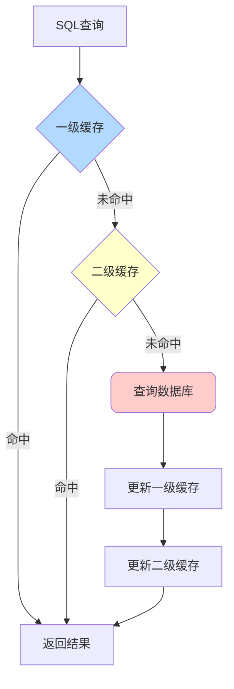
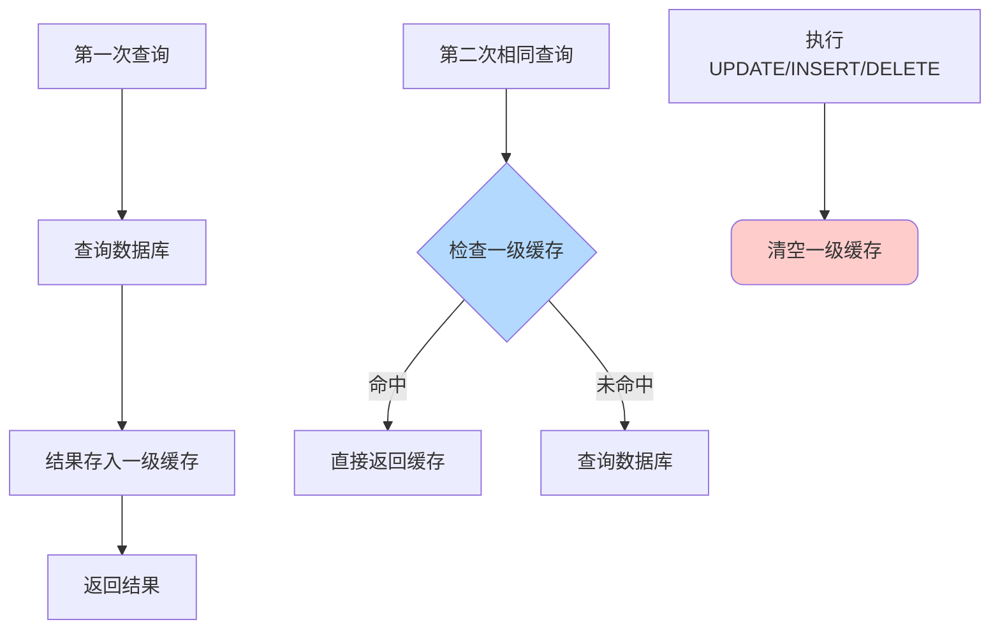
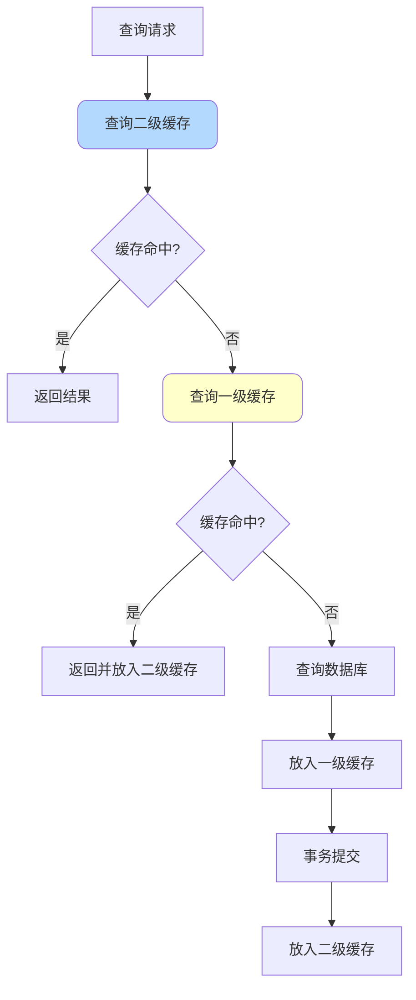

import PaidCTA from '@site/src/components/PaidCTA';

# MyBatis缓存机制详解

## 缓存概述

MyBatis提供了两级缓存机制来提升查询性能，减少数据库访问次数。



## 一级缓存

### 基本特性

一级缓存是SqlSession级别的缓存，默认开启且无法关闭。

**核心特点**：
- 作用域：SqlSession内部
- 实现：PerpetualCache（基于HashMap）
- 生命周期：与SqlSession相同
- 清空时机：执行update/delete/insert或手动清空

### 工作流程



### 使用示例

```java
@Test
public void testFirstLevelCache() {
    SqlSession session = sqlSessionFactory.openSession();
    try {
        ProductMapper mapper = session.getMapper(ProductMapper.class);
        
        // 第一次查询 - 访问数据库
        Product product1 = mapper.findById(1001L);
        System.out.println("First query: " + product1);
        
        // 第二次查询 - 命中一级缓存，不访问数据库
        Product product2 = mapper.findById(1001L);
        System.out.println("Second query: " + product2);
        
        // 两次查询返回同一个对象
        assert product1 == product2;
        
        // 执行更新操作 - 清空一级缓存
        Product updateProduct = new Product();
        updateProduct.setId(1002L);
        updateProduct.setPrice(new BigDecimal("999"));
        mapper.updateProduct(updateProduct);
        
        // 再次查询 - 重新访问数据库
        Product product3 = mapper.findById(1001L);
        System.out.println("Third query: " + product3);
        
    } finally {
        session.close();
    }
}
```

### 源码实现

```java
public class PerpetualCache implements Cache {
    private final String id;
    private final Map<Object, Object> cache = new HashMap<>();
    
    @Override
    public void putObject(Object key, Object value) {
        cache.put(key, value);
    }
    
    @Override
    public Object getObject(Object key) {
        return cache.get(key);
    }
    
    @Override
    public Object removeObject(Object key) {
        return cache.remove(key);
    }
    
    @Override
    public void clear() {
        cache.clear();
    }
}
```

### 缓存Key生成

一级缓存的Key由多个因素组成：

```java
public class CacheKey implements Cloneable, Serializable {
    
    private static final int DEFAULT_MULTIPLIER = 37;
    private static final int DEFAULT_HASHCODE = 17;
    
    private int multiplier;
    private int hashcode;
    private long checksum;
    private int count;
    private List<Object> updateList;
    
    public void update(Object object) {
        // 更新hashcode和checksum
        int baseHashCode = object == null ? 1 : ArrayUtil.hashCode(object);
        count++;
        checksum += baseHashCode;
        baseHashCode *= count;
        hashcode = multiplier * hashcode + baseHashCode;
        updateList.add(object);
    }
}
```

CacheKey包含以下信息：
- MappedStatement的id
- RowBounds的offset和limit
- SQL语句
- 参数值
- Environment的id

### 一级缓存的问题

**1. 作用域限制**

```java
// 问题场景：不同SqlSession无法共享缓存
SqlSession session1 = sqlSessionFactory.openSession();
SqlSession session2 = sqlSessionFactory.openSession();

ProductMapper mapper1 = session1.getMapper(ProductMapper.class);
ProductMapper mapper2 = session2.getMapper(ProductMapper.class);

// session1查询，缓存在session1中
Product p1 = mapper1.findById(1001L);

// session1更新数据
p1.setPrice(new BigDecimal("999"));
mapper1.updateProduct(p1);
session1.commit();

// session2查询 - 仍然返回旧数据（脏数据）
Product p2 = mapper2.findById(1001L);
```

**2. 容量无限制**

```java
// 一级缓存没有容量限制，可能导致内存溢出
for (int i = 0; i < 100000; i++) {
    mapper.findById((long) i); // 每次查询都缓存
}
```

### 配置说明

可以通过`localCacheScope`设置缓存级别：

```xml
<settings>
    <!-- SESSION: SqlSession级别（默认） -->
    <!-- STATEMENT: 语句级别（查询后立即清空，相当于禁用） -->
    <setting name="localCacheScope" value="STATEMENT"/>
</settings>
```

## 二级缓存

### 基本特性

二级缓存是namespace级别的缓存，需要手动开启。

**核心特点**：
- 作用域：namespace（Mapper）
- 跨SqlSession共享
- 需要手动配置开启
- 支持多种缓存实现
- 装饰器模式实现

### 开启二级缓存

**步骤1：全局配置**

```xml
<settings>
    <setting name="cacheEnabled" value="true"/>
</settings>
```

**步骤2：Mapper配置**

```xml
<mapper namespace="com.example.mapper.ProductMapper">
    <!-- 开启二级缓存 -->
    <cache 
        eviction="LRU"
        flushInterval="60000"
        size="512"
        readOnly="false"/>
        
    <select id="findById" resultType="Product" useCache="true">
        SELECT * FROM product WHERE id = #{id}
    </select>
</mapper>
```

**配置属性说明**：

- `eviction`: 缓存回收策略
  - LRU（默认）：最近最少使用
  - FIFO：先进先出
  - SOFT：软引用
  - WEAK：弱引用
- `flushInterval`: 刷新间隔（毫秒）
- `size`: 缓存对象数量（默认1024）
- `readOnly`: 是否只读
  - true：返回缓存对象的同一实例（性能好，但不安全）
  - false：返回缓存对象的副本（安全，但性能差）

**步骤3：实体类实现Serializable**

```java
public class Product implements Serializable {
    private static final long serialVersionUID = 1L;
    
    private Long id;
    private String name;
    private BigDecimal price;
    // ...
}
```

### 工作流程



### 装饰器模式实现

MyBatis使用装饰器模式增强缓存功能：

<PaidCTA />