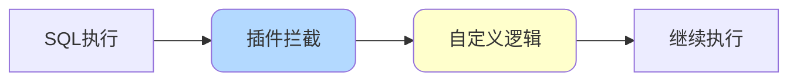
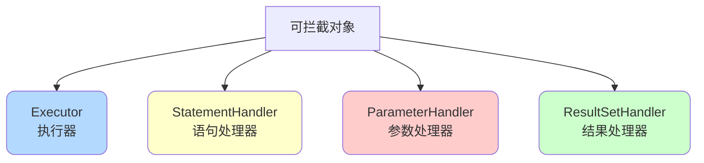

# MyBatis插件机制与拦截器

## 插件机制概述

MyBatis允许在SQL执行的关键节点进行拦截，实现自定义功能扩展，如分页、性能监控、数据权限控制等。



## 核心接口

### Interceptor接口

所有MyBatis插件都需要实现`Interceptor`接口：

```java
public interface Interceptor {
    // 拦截逻辑
    Object intercept(Invocation invocation) throws Throwable;
    
    // 生成代理对象
    default Object plugin(Object target) {
        return Plugin.wrap(target, this);
    }
    
    // 设置属性
    default void setProperties(Properties properties) {
    }
}
```

### 可拦截的四大对象

MyBatis允许拦截以下四个核心对象：



**1. Executor（执行器）**

```java
public interface Executor {
    // 更新操作
    int update(MappedStatement ms, Object parameter);
    
    // 查询操作
    <E> List<E> query(MappedStatement ms, Object parameter, 
                     RowBounds rowBounds, ResultHandler resultHandler);
    
    // 提交事务
    void commit(boolean required);
    
    // 回滚事务
    void rollback(boolean required);
}
```

**2. StatementHandler（SQL语句处理器）**

```java
public interface StatementHandler {
    // 准备Statement
    Statement prepare(Connection connection, Integer transactionTimeout);
    
    // 参数化
    void parameterize(Statement statement);
    
    // 批量操作
    void batch(Statement statement);
    
    // 查询
    <E> List<E> query(Statement statement, ResultHandler resultHandler);
}
```

**3. ParameterHandler（参数处理器）**

```java
public interface ParameterHandler {
    Object getParameterObject();
    
    void setParameters(PreparedStatement ps);
}
```

**4. ResultSetHandler（结果集处理器）**

```java
public interface ResultSetHandler {
    <E> List<E> handleResultSets(Statement stmt);
    
    <E> Cursor<E> handleCursorResultSets(Statement stmt);
    
    void handleOutputParameters(CallableStatement cs);
}
```

## 运行原理

### 责任链模式

MyBatis插件采用责任链模式，多个插件依次执行：


### 执行流程

```java
// 1. 注册插件时，为目标对象生成代理
for (Interceptor interceptor : interceptors) {
    target = interceptor.plugin(target);
}

// 2. 调用方法时，进入拦截器链
public Object invoke(Object proxy, Method method, Object[] args) {
    // 判断是否需要拦截
    if (需要拦截) {
        Invocation invocation = new Invocation(target, method, args);
        return interceptor.intercept(invocation);
    }
    // 不需要拦截，直接执行
    return method.invoke(target, args);
}
```

## 插件开发实战

### 示例1：SQL性能监控插件

```java
@Intercepts({
    @Signature(
        type = StatementHandler.class,
        method = "query",
        args = {Statement.class, ResultHandler.class}
    ),
    @Signature(
        type = StatementHandler.class,
        method = "update",
        args = {Statement.class}
    )
})
public class PerformanceInterceptor implements Interceptor {
    
    private static final Logger logger = LoggerFactory.getLogger(PerformanceInterceptor.class);
    
    // 慢查询阈值（毫秒）
    private long slowSqlThreshold = 1000;
    
    @Override
    public Object intercept(Invocation invocation) throws Throwable {
        long startTime = System.currentTimeMillis();
        
        try {
            // 执行SQL
            return invocation.proceed();
        } finally {
            long endTime = System.currentTimeMillis();
            long executionTime = endTime - startTime;
            
            // 记录慢SQL
            if (executionTime >= slowSqlThreshold) {
                StatementHandler handler = (StatementHandler) invocation.getTarget();
                BoundSql boundSql = handler.getBoundSql();
                String sql = boundSql.getSql();
                
                logger.warn("慢SQL告警 - 执行时间: {}ms, SQL: {}", 
                           executionTime, sql);
            } else {
                logger.info("SQL执行时间: {}ms", executionTime);
            }
        }
    }
    
    @Override
    public void setProperties(Properties properties) {
        String threshold = properties.getProperty("slowSqlThreshold");
        if (threshold != null) {
            this.slowSqlThreshold = Long.parseLong(threshold);
        }
    }
}
```

### 示例2：数据权限控制插件

```java
@Intercepts({
    @Signature(
        type = Executor.class,
        method = "query",
        args = {MappedStatement.class, Object.class, RowBounds.class, ResultHandler.class}
    )
})
public class DataPermissionInterceptor implements Interceptor {
    
    @Override
    public Object intercept(Invocation invocation) throws Throwable {
        Object[] args = invocation.getArgs();
        MappedStatement ms = (MappedStatement) args[0];
        Object parameter = args[1];
        
        // 获取当前用户
        UserContext currentUser = SecurityUtils.getCurrentUser();
        
        // 获取BoundSql
        BoundSql boundSql = ms.getBoundSql(parameter);
        String originalSql = boundSql.getSql();
        
        // 根据用户权限修改SQL
        String newSql = appendDataPermission(originalSql, currentUser);
        
        // 创建新的BoundSql
        BoundSql newBoundSql = new BoundSql(
            ms.getConfiguration(), newSql,
            boundSql.getParameterMappings(), parameter);
        
        // 创建新的MappedStatement
        MappedStatement newMs = copyMappedStatement(ms, new BoundSqlSqlSource(newBoundSql));
        args[0] = newMs;
        
        return invocation.proceed();
    }
    
    private String appendDataPermission(String sql, UserContext user) {
        // 根据用户角色添加数据权限条件
        if (user.isAdmin()) {
            return sql; // 管理员查看所有数据
        } else {
            // 普通用户只能查看自己的数据
            return sql + " AND user_id = " + user.getId();
        }
    }
}
```

### 示例3：数据脱敏插件

```java
@Intercepts({
    @Signature(
        type = ResultSetHandler.class,
        method = "handleResultSets",
        args = {Statement.class}
    )
})
public class DataMaskingInterceptor implements Interceptor {
    
    @Override
    public Object intercept(Invocation invocation) throws Throwable {
        // 获取查询结果
        Object result = invocation.proceed();
        
        if (result instanceof List) {
            List<?> list = (List<?>) result;
            for (Object item : list) {
                maskSensitiveData(item);
            }
        } else {
            maskSensitiveData(result);
        }
        
        return result;
    }
    
    private void maskSensitiveData(Object obj) {
        if (obj == null) {
            return;
        }
        
        Field[] fields = obj.getClass().getDeclaredFields();
        for (Field field : fields) {
            // 检查是否有脱敏注解
            if (field.isAnnotationPresent(Sensitive.class)) {
                field.setAccessible(true);
                try {
                    Object value = field.get(obj);
                    if (value instanceof String) {
                        String maskedValue = maskString((String) value);
                        field.set(obj, maskedValue);
                    }
                } catch (IllegalAccessException e) {
                    logger.error("数据脱敏失败", e);
                }
            }
        }
    }
    
    private String maskString(String str) {
        if (str == null || str.length() <= 3) {
            return "***";
        }
        // 保留前1后1，中间用*代替
        return str.charAt(0) + "***" + str.charAt(str.length() - 1);
    }
}

// 脱敏注解
@Retention(RetentionPolicy.RUNTIME)
@Target(ElementType.FIELD)
public @interface Sensitive {
}

// 使用示例
public class User {
    private Long id;
    private String name;
    
    @Sensitive
    private String phone;  // 手机号脱敏
    
    @Sensitive
    private String idCard; // 身份证脱敏
}
```

### 示例4：多数据源切换插件

```java
@Intercepts({
    @Signature(
        type = Executor.class,
        method = "update",
        args = {MappedStatement.class, Object.class}
    ),
    @Signature(
        type = Executor.class,
        method = "query",
        args = {MappedStatement.class, Object.class, RowBounds.class, ResultHandler.class}
    )
})
public class DynamicDataSourceInterceptor implements Interceptor {
    
    @Override
    public Object intercept(Invocation invocation) throws Throwable {
        MappedStatement ms = (MappedStatement) invocation.getArgs()[0];
        String namespace = ms.getId().substring(0, ms.getId().lastIndexOf("."));
        
        // 根据不同Mapper使用不同数据源
        if (namespace.contains("order")) {
            DataSourceContextHolder.setDataSource("orderDB");
        } else if (namespace.contains("product")) {
            DataSourceContextHolder.setDataSource("productDB");
        } else {
            DataSourceContextHolder.setDataSource("default");
        }
        
        try {
            return invocation.proceed();
        } finally {
            DataSourceContextHolder.clearDataSource();
        }
    }
}
```

## 插件注册

### 方式1：XML配置

```xml
<plugins>
    <plugin interceptor="com.example.plugin.PerformanceInterceptor">
        <property name="slowSqlThreshold" value="2000"/>
    </plugin>
    <plugin interceptor="com.example.plugin.DataPermissionInterceptor"/>
</plugins>
```

### 方式2：Java配置

```java
@Configuration
public class MyBatisConfig {
    
    @Bean
    public ConfigurationCustomizer configurationCustomizer() {
        return configuration -> {
            // 添加性能监控插件
            PerformanceInterceptor performanceInterceptor = new PerformanceInterceptor();
            Properties props = new Properties();
            props.setProperty("slowSqlThreshold", "1000");
            performanceInterceptor.setProperties(props);
            configuration.addInterceptor(performanceInterceptor);
            
            // 添加数据权限插件
            configuration.addInterceptor(new DataPermissionInterceptor());
        };
    }
}
```

### 方式3：Spring Boot自动配置

```java
@Component
public class MyBatisInterceptorConfig {
    
    @Autowired
    public void addInterceptor(List<SqlSessionFactory> sqlSessionFactoryList) {
        Interceptor interceptor = new PerformanceInterceptor();
        for (SqlSessionFactory sqlSessionFactory : sqlSessionFactoryList) {
            sqlSessionFactory.getConfiguration().addInterceptor(interceptor);
        }
    }
}
```

## 最佳实践

### 插件执行顺序

```java
// 插件执行顺序：后注册的先执行（栈结构）
configuration.addInterceptor(plugin1); // 第3个执行
configuration.addInterceptor(plugin2); // 第2个执行
configuration.addInterceptor(plugin3); // 第1个执行
```


### 性能考虑

```java
// ✅ 推荐：精确拦截需要的方法
@Intercepts({
    @Signature(
        type = StatementHandler.class,
        method = "query",
        args = {Statement.class, ResultHandler.class}
    )
})

// ❌ 不推荐：拦截过多方法
@Intercepts({
    @Signature(type = Executor.class, method = "query", args = {...}),
    @Signature(type = Executor.class, method = "update", args = {...}),
    @Signature(type = StatementHandler.class, method = "prepare", args = {...}),
    // 太多拦截点会影响性能
})
```

### 线程安全

```java
// ❌ 错误：使用实例变量（线程不安全）
public class BadInterceptor implements Interceptor {
    private int counter = 0; // 多线程问题
    
    @Override
    public Object intercept(Invocation invocation) {
        counter++; // 不安全
        return invocation.proceed();
    }
}

// ✅ 正确：使用ThreadLocal或局部变量
public class GoodInterceptor implements Interceptor {
    private static final ThreadLocal<Integer> counter = new ThreadLocal<>();
    
    @Override
    public Object intercept(Invocation invocation) {
        Integer count = counter.get();
        if (count == null) {
            count = 0;
        }
        counter.set(count + 1);
        return invocation.proceed();
    }
}
```

## 总结

MyBatis插件机制提供了强大的扩展能力：

**核心概念**：
- 基于JDK动态代理
- 责任链模式
- 可拦截四大对象

**常见应用**：
- 分页插件（PageHelper）
- 性能监控
- SQL审计
- 数据权限
- 数据脱敏
- 多数据源切换

**注意事项**：
- 精确指定拦截点
- 注意线程安全
- 避免过度拦截影响性能
