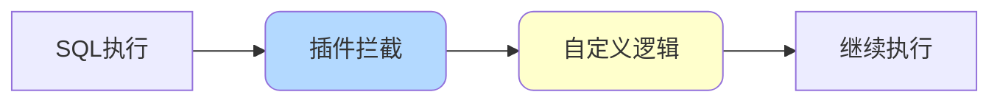
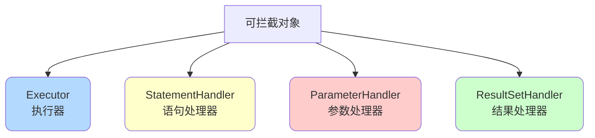
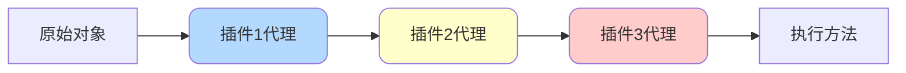

import PaidCTA from '@site/src/components/PaidCTA';

# MyBatis插件机制与拦截器

## 插件机制概述

MyBatis允许在SQL执行的关键节点进行拦截，实现自定义功能扩展，如分页、性能监控、数据权限控制等。



## 核心接口

### Interceptor接口

所有MyBatis插件都需要实现`Interceptor`接口：

```java
public interface Interceptor {
    // 拦截逻辑
    Object intercept(Invocation invocation) throws Throwable;
    
    // 生成代理对象
    default Object plugin(Object target) {
        return Plugin.wrap(target, this);
    }
    
    // 设置属性
    default void setProperties(Properties properties) {
    }
}
```

### 可拦截的四大对象

MyBatis允许拦截以下四个核心对象：



**1. Executor（执行器）**

```java
public interface Executor {
    // 更新操作
    int update(MappedStatement ms, Object parameter);
    
    // 查询操作
    <E> List<E> query(MappedStatement ms, Object parameter, 
                     RowBounds rowBounds, ResultHandler resultHandler);
    
    // 提交事务
    void commit(boolean required);
    
    // 回滚事务
    void rollback(boolean required);
}
```

**2. StatementHandler（SQL语句处理器）**

```java
public interface StatementHandler {
    // 准备Statement
    Statement prepare(Connection connection, Integer transactionTimeout);
    
    // 参数化
    void parameterize(Statement statement);
    
    // 批量操作
    void batch(Statement statement);
    
    // 查询
    <E> List<E> query(Statement statement, ResultHandler resultHandler);
}
```

**3. ParameterHandler（参数处理器）**

```java
public interface ParameterHandler {
    Object getParameterObject();
    
    void setParameters(PreparedStatement ps);
}
```

**4. ResultSetHandler（结果集处理器）**

```java
public interface ResultSetHandler {
    <E> List<E> handleResultSets(Statement stmt);
    
    <E> Cursor<E> handleCursorResultSets(Statement stmt);
    
    void handleOutputParameters(CallableStatement cs);
}
```

## 运行原理

### 责任链模式

MyBatis插件采用责任链模式，多个插件依次执行：



### 执行流程

```java
// 1. 注册插件时，为目标对象生成代理
for (Interceptor interceptor : interceptors) {
    target = interceptor.plugin(target);
}

// 2. 调用方法时，进入拦截器链
public Object invoke(Object proxy, Method method, Object[] args) {
    // 判断是否需要拦截
    if (需要拦截) {
        Invocation invocation = new Invocation(target, method, args);
        return interceptor.intercept(invocation);
    }
    // 不需要拦截，直接执行
    return method.invoke(target, args);
}
```

## 插件开发实战

### 示例1：SQL性能监控插件

<PaidCTA />