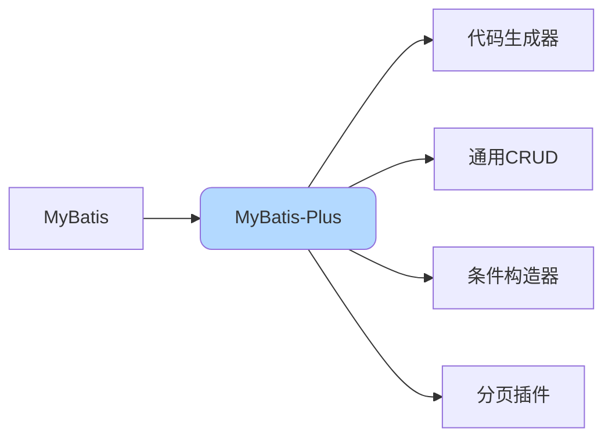

# MyBatis-Plus增强特性详解

## MyBatis-Plus概述

MyBatis-Plus（简称MP）是MyBatis的增强工具，在MyBatis的基础上只做增强不做改变，为简化开发、提高效率而生。



**官网**：https://baomidou.com/

## 核心特性

### 1. 无侵入设计

只做增强不做改变，引入MP不会对现有工程产生影响，可以与MyBatis共存。

### 2. 损耗小

启动即会自动注入基本CRUD，性能基本无损耗，直接面向对象操作。

### 3. 强大的CRUD操作

内置通用Mapper、通用Service，仅通过少量配置即可实现单表大部分CRUD操作。

### 4. 支持Lambda形式

通过Lambda表达式编写查询条件，避免字段名写错。

### 5. 支持主键自动生成

支持多达4种主键策略（含分布式唯一ID生成器Sequence），可自由配置。

### 6. 支持ActiveRecord模式

实体类只需继承Model类即可进行强大的CRUD操作。

### 7. 支持自定义全局通用操作

支持全局通用方法注入。

### 8. 内置代码生成器

采用代码或Maven插件可快速生成Mapper、Model、Service、Controller层代码。

### 9. 内置分页插件

基于MyBatis物理分页，开发者无需关心具体操作。

### 10. 内置性能分析插件

可输出SQL语句以及其执行时间，建议开发测试时启用。

## 快速入门

### 添加依赖

```xml
<dependency>
    <groupId>com.baomidou</groupId>
    <artifactId>mybatis-plus-boot-starter</artifactId>
    <version>3.5.3</version>
</dependency>
```

### 实体类配置

```java
@Data
@TableName("t_product")  // 指定表名
public class Product {
    
    @TableId(type = IdType.AUTO)  // 主键自增
    private Long id;
    
    private String name;
    
    private BigDecimal price;
    
    private Integer stock;
    
    @TableField("category_id")  // 指定字段名
    private Long categoryId;
    
    @TableField(fill = FieldFill.INSERT)  // 插入时自动填充
    private Date createTime;
    
    @TableField(fill = FieldFill.INSERT_UPDATE)  // 插入和更新时填充
    private Date updateTime;
    
    @TableLogic  // 逻辑删除
    private Integer deleted;
    
    @Version  // 乐观锁
    private Integer version;
}
```

### Mapper接口

```java
// 继承BaseMapper，获得通用CRUD能力
public interface ProductMapper extends BaseMapper<Product> {
    // 无需编写任何代码，即可使用以下方法：
    // insert、deleteById、updateById、selectById
    // selectList、selectPage等
}
```

### Service层

```java
// Service接口
public interface IProductService extends IService<Product> {
    // 继承IService，获得通用Service方法
}

// Service实现类
@Service
public class ProductServiceImpl 
    extends ServiceImpl<ProductMapper, Product> 
    implements IProductService {
    
    // 无需编写基础CRUD代码
}
```

## 通用Mapper方法

### 插入操作

```java
// 插入一条记录
Product product = new Product();
product.setName("新款手机");
product.setPrice(new BigDecimal("2999"));
product.setStock(100);
productMapper.insert(product);
// 自动回填主键到product.id
```

### 删除操作

```java
// 根据ID删除
productMapper.deleteById(1001L);

// 根据条件删除
Map<String, Object> params = new HashMap<>();
params.put("stock", 0);
productMapper.deleteByMap(params);

// 批量删除
List<Long> ids = Arrays.asList(1L, 2L, 3L);
productMapper.deleteBatchIds(ids);
```

### 更新操作

```java
// 根据ID更新
Product product = new Product();
product.setId(1001L);
product.setPrice(new BigDecimal("2699"));
productMapper.updateById(product);

// 根据条件更新
UpdateWrapper<Product> wrapper = new UpdateWrapper<>();
wrapper.eq("category_id", 10)
       .set("stock", 0);
productMapper.update(null, wrapper);
```

### 查询操作

```java
// 根据ID查询
Product product = productMapper.selectById(1001L);

// 批量查询
List<Long> ids = Arrays.asList(1L, 2L, 3L);
List<Product> products = productMapper.selectBatchIds(ids);

// 条件查询
Map<String, Object> params = new HashMap<>();
params.put("category_id", 10);
List<Product> products = productMapper.selectByMap(params);

// 查询所有
List<Product> all = productMapper.selectList(null);

// 分页查询
Page<Product> page = new Page<>(1, 10);
Page<Product> result = productMapper.selectPage(page, null);
```

## 条件构造器

### QueryWrapper

用于构造查询条件：

```java
QueryWrapper<Product> wrapper = new QueryWrapper<>();

// 基本条件
wrapper.eq("category_id", 10)           // category_id = 10
       .ne("stock", 0)                   // AND stock != 0
       .gt("price", 1000)                // AND price > 1000
       .lt("price", 5000)                // AND price < 5000
       .like("name", "手机")              // AND name LIKE '%手机%'
       .orderByDesc("create_time");      // ORDER BY create_time DESC

List<Product> products = productMapper.selectList(wrapper);
```

**常用方法**：

```java
// 比较运算
wrapper.eq("字段", 值)              // 等于 =
       .ne("字段", 值)              // 不等于 <>
       .gt("字段", 值)              // 大于 >
       .ge("字段", 值)              // 大于等于 >=
       .lt("字段", 值)              // 小于 <
       .le("字段", 值)              // 小于等于 <=
       .between("字段", 值1, 值2)   // BETWEEN 值1 AND 值2
       .notBetween("字段", 值1, 值2);

// 模糊查询
wrapper.like("字段", 值)            // LIKE '%值%'
       .notLike("字段", 值)         // NOT LIKE '%值%'
       .likeLeft("字段", 值)        // LIKE '%值'
       .likeRight("字段", 值);      // LIKE '值%'

// 空值判断
wrapper.isNull("字段")              // IS NULL
       .isNotNull("字段");          // IS NOT NULL

// IN查询
wrapper.in("字段", 值1, 值2, 值3)
       .notIn("字段", 集合);

// 排序
wrapper.orderByAsc("字段1", "字段2")
       .orderByDesc("字段");

// 分组
wrapper.groupBy("字段")
       .having("SUM(price) > {0}", 1000);

// 指定查询字段
wrapper.select("id", "name", "price");
```

### LambdaQueryWrapper

使用Lambda表达式，避免字段名写错：

```java
LambdaQueryWrapper<Product> wrapper = new LambdaQueryWrapper<>();
wrapper.eq(Product::getCategoryId, 10)
       .gt(Product::getPrice, new BigDecimal("1000"))
       .like(Product::getName, "手机")
       .orderByDesc(Product::getCreateTime);

List<Product> products = productMapper.selectList(wrapper);
```

### UpdateWrapper

用于构造更新条件：

```java
UpdateWrapper<Product> wrapper = new UpdateWrapper<>();
wrapper.eq("category_id", 10)
       .set("stock", 0)              // SET stock = 0
       .set("update_time", new Date());  // SET update_time = NOW()

productMapper.update(null, wrapper);
```

### LambdaUpdateWrapper

```java
LambdaUpdateWrapper<Product> wrapper = new LambdaUpdateWrapper<>();
wrapper.eq(Product::getCategoryId, 10)
       .set(Product::getStock, 0)
       .set(Product::getUpdateTime, new Date());

productMapper.update(null, wrapper);
```

## 分页插件

### 配置分页插件

```java
@Configuration
public class MybatisPlusConfig {
    
    @Bean
    public MybatisPlusInterceptor mybatisPlusInterceptor() {
        MybatisPlusInterceptor interceptor = new MybatisPlusInterceptor();
        
        // 添加分页插件
        PaginationInnerInterceptor paginationInterceptor = 
            new PaginationInnerInterceptor(DbType.MYSQL);
        
        // 设置最大单页限制数量，默认500条，-1不受限制
        paginationInterceptor.setMaxLimit(500L);
        
        // 溢出总页数后是否进行处理
        paginationInterceptor.setOverflow(false);
        
        interceptor.addInnerInterceptor(paginationInterceptor);
        return interceptor;
    }
}
```

### 使用分页

**方式1：Mapper方法分页**

```java
// 创建分页对象
Page<Product> page = new Page<>(1, 10);  // 第1页，每页10条

// 构造查询条件
QueryWrapper<Product> wrapper = new QueryWrapper<>();
wrapper.eq("category_id", 10)
       .orderByDesc("create_time");

// 执行分页查询
Page<Product> result = productMapper.selectPage(page, wrapper);

System.out.println("总记录数: " + result.getTotal());
System.out.println("总页数: " + result.getPages());
System.out.println("当前页: " + result.getCurrent());
System.out.println("每页大小: " + result.getSize());
List<Product> records = result.getRecords();
```

**方式2：Service方法分页**

```java
@Service
public class ProductServiceImpl 
    extends ServiceImpl<ProductMapper, Product> 
    implements IProductService {
    
    public IPage<Product> pageQuery(int pageNum, int pageSize, String name) {
        Page<Product> page = new Page<>(pageNum, pageSize);
        
        LambdaQueryWrapper<Product> wrapper = new LambdaQueryWrapper<>();
        wrapper.like(StringUtils.isNotBlank(name), Product::getName, name)
               .orderByDesc(Product::getCreateTime);
        
        return this.page(page, wrapper);
    }
}
```

## 代码生成器

### 添加依赖

```xml
<dependency>
    <groupId>com.baomidou</groupId>
    <artifactId>mybatis-plus-generator</artifactId>
    <version>3.5.3</version>
</dependency>

<dependency>
    <groupId>org.freemarker</groupId>
    <artifactId>freemarker</artifactId>
    <version>2.3.32</version>
</dependency>
```

### 生成代码

```java
public class CodeGenerator {
    
    public static void main(String[] args) {
        // 数据源配置
        DataSourceConfig.Builder dataSourceConfig = new DataSourceConfig.Builder(
            "jdbc:mysql://localhost:3306/shop",
            "root",
            "123456"
        );
        
        // 全局配置
        GlobalConfig.Builder globalConfig = new GlobalConfig.Builder()
            .author("张三")
            .outputDir(System.getProperty("user.dir") + "/src/main/java")
            .disableOpenDir();  // 禁止打开输出目录
        
        // 包配置
        PackageConfig.Builder packageConfig = new PackageConfig.Builder()
            .parent("com.example")
            .entity("entity")
            .mapper("mapper")
            .service("service")
            .serviceImpl("service.impl")
            .controller("controller");
        
        // 策略配置
        StrategyConfig.Builder strategyConfig = new StrategyConfig.Builder()
            .addInclude("t_product", "t_category")  // 指定表名
            .entityBuilder()
            .enableLombok()             // 启用Lombok
            .enableTableFieldAnnotation()  // 启用字段注解
            .logicDeleteColumnName("deleted")  // 逻辑删除字段
            .versionColumnName("version")      // 乐观锁字段
            .controllerBuilder()
            .enableRestStyle();         // 生成@RestController
        
        // 执行生成
        AutoGenerator generator = new AutoGenerator(dataSourceConfig.build());
        generator.global(globalConfig.build());
        generator.packageInfo(packageConfig.build());
        generator.strategy(strategyConfig.build());
        generator.execute();
    }
}
```

## 高级功能

### 自动填充

```java
// 1. 实体类字段标注
@Data
public class Product {
    @TableField(fill = FieldFill.INSERT)
    private Date createTime;
    
    @TableField(fill = FieldFill.INSERT_UPDATE)
    private Date updateTime;
    
    @TableField(fill = FieldFill.INSERT)
    private String createBy;
    
    @TableField(fill = FieldFill.INSERT_UPDATE)
    private String updateBy;
}

// 2. 实现填充处理器
@Component
public class MyMetaObjectHandler implements MetaObjectHandler {
    
    @Override
    public void insertFill(MetaObject metaObject) {
        this.strictInsertFill(metaObject, "createTime", Date.class, new Date());
        this.strictInsertFill(metaObject, "updateTime", Date.class, new Date());
        this.strictInsertFill(metaObject, "createBy", String.class, getCurrentUser());
        this.strictInsertFill(metaObject, "updateBy", String.class, getCurrentUser());
    }
    
    @Override
    public void updateFill(MetaObject metaObject) {
        this.strictUpdateFill(metaObject, "updateTime", Date.class, new Date());
        this.strictUpdateFill(metaObject, "updateBy", String.class, getCurrentUser());
    }
    
    private String getCurrentUser() {
        // 获取当前用户
        return "system";
    }
}
```

### 逻辑删除

```java
// 1. 配置
mybatis-plus:
  global-config:
    db-config:
      logic-delete-field: deleted  # 全局逻辑删除字段
      logic-delete-value: 1        # 删除后的值
      logic-not-delete-value: 0    # 未删除的值

// 2. 实体类标注
@TableLogic
private Integer deleted;

// 3. 使用（自动转换为UPDATE）
productMapper.deleteById(1001L);
// 实际执行：UPDATE t_product SET deleted=1 WHERE id=1001 AND deleted=0

// 4. 查询自动过滤已删除数据
productMapper.selectList(null);
// 实际执行：SELECT * FROM t_product WHERE deleted=0
```

### 乐观锁

```java
// 1. 配置插件
@Bean
public MybatisPlusInterceptor mybatisPlusInterceptor() {
    MybatisPlusInterceptor interceptor = new MybatisPlusInterceptor();
    interceptor.addInnerInterceptor(new OptimisticLockerInnerInterceptor());
    return interceptor;
}

// 2. 实体类标注
@Version
private Integer version;

// 3. 使用
Product product = productMapper.selectById(1001L);
product.setPrice(new BigDecimal("2699"));
productMapper.updateById(product);
// 实际执行：UPDATE t_product SET price=2699, version=2 
//          WHERE id=1001 AND version=1
```

## MyBatis-Plus优缺点

### 优点

✅ **开发效率高**：无需编写基础CRUD代码
✅ **代码简洁**：通过Wrapper构造复杂查询
✅ **功能丰富**：分页、逻辑删除、乐观锁等开箱即用
✅ **性能优秀**：基于MyBatis，性能损耗小
✅ **易于扩展**：提供丰富的插件接口

### 缺点

❌ **学习成本**：需要学习MP的API和注解
❌ **版本依赖**：依赖MyBatis版本，需注意兼容性
❌ **自动映射限制**：复杂场景可能不够灵活
❌ **生成代码调整**：代码生成器生成的代码可能需要手动调整

## 最佳实践

### 合理使用通用方法

```java
// ✅ 推荐：简单查询使用通用方法
Product product = productMapper.selectById(1001L);

// ✅ 推荐：复杂查询自定义SQL
@Select("SELECT p.*, c.name as categoryName FROM t_product p " +
        "LEFT JOIN t_category c ON p.category_id = c.id " +
        "WHERE p.id = #{id}")
ProductVO selectProductDetail(@Param("id") Long id);
```

### Wrapper使用建议

```java
// ✅ 推荐：使用Lambda表达式
LambdaQueryWrapper<Product> wrapper = new LambdaQueryWrapper<>();
wrapper.eq(Product::getCategoryId, 10);

// ❌ 不推荐：字符串字段名（容易写错）
QueryWrapper<Product> wrapper = new QueryWrapper<>();
wrapper.eq("categoryId", 10);  // 字段名可能写错
```

### 分批处理大量数据

```java
// 批量插入
List<Product> products = ...; // 1000条数据
int batchSize = 500;

for (int i = 0; i < products.size(); i += batchSize) {
    int end = Math.min(i + batchSize, products.size());
    List<Product> batch = products.subList(i, end);
    productService.saveBatch(batch);
}
```

## 总结

MyBatis-Plus是MyBatis的强大增强工具：

**核心特性**：
- 通用CRUD
- 条件构造器
- 代码生成器
- 分页插件

**适用场景**：
- 单表CRUD操作频繁
- 需要快速开发
- 团队技术栈统一

**注意事项**：
- 复杂查询建议自定义SQL
- 注意版本兼容性
- 合理使用Lambda表达式

通过合理使用MyBatis-Plus，可以显著提升开发效率。
