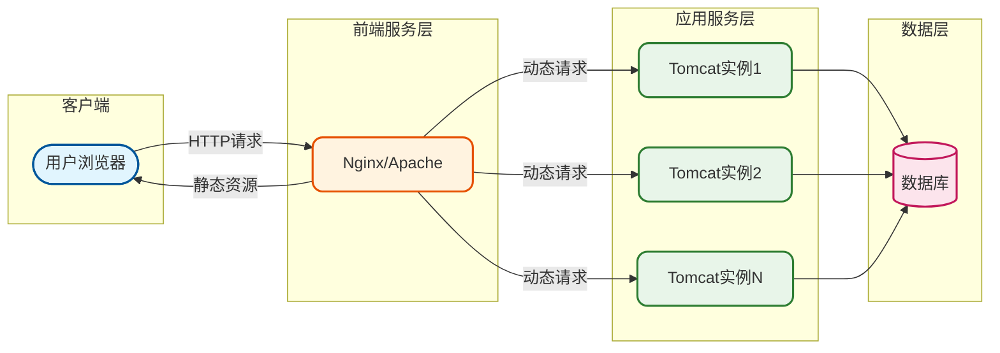
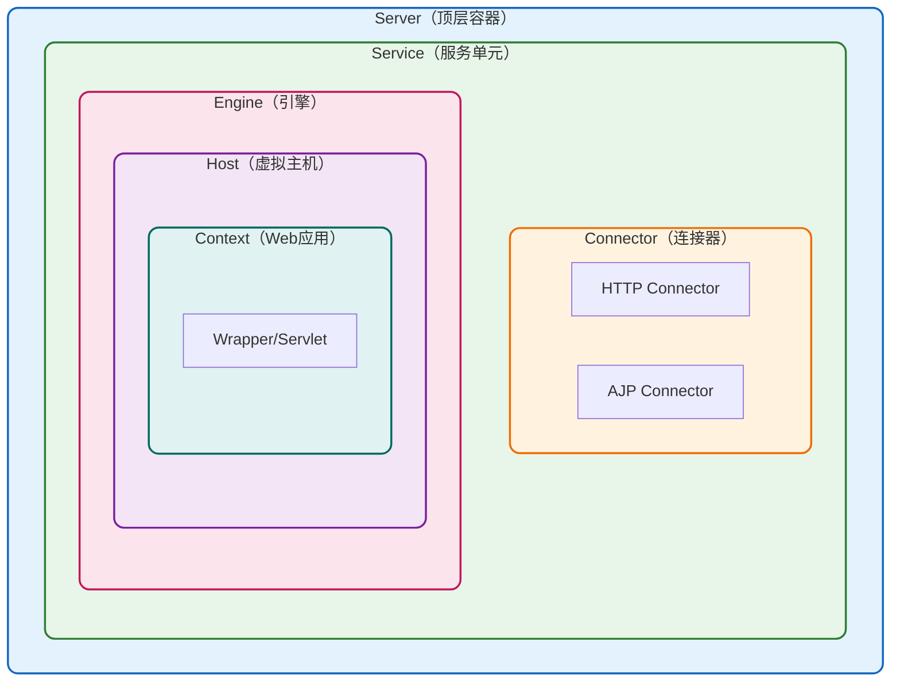
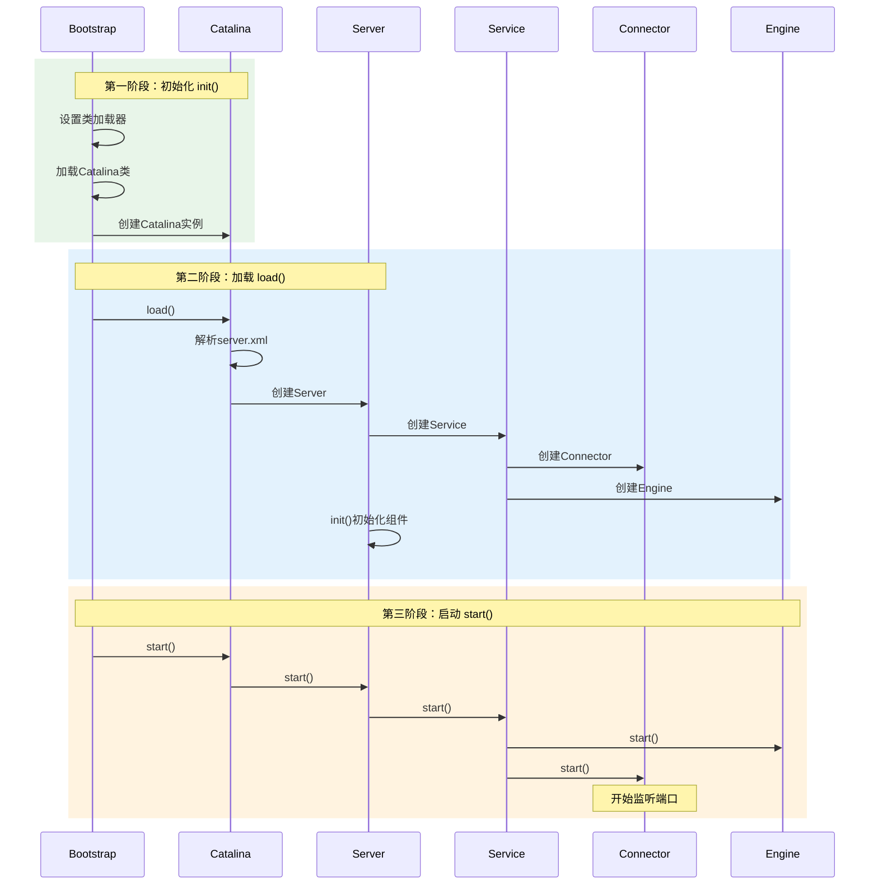
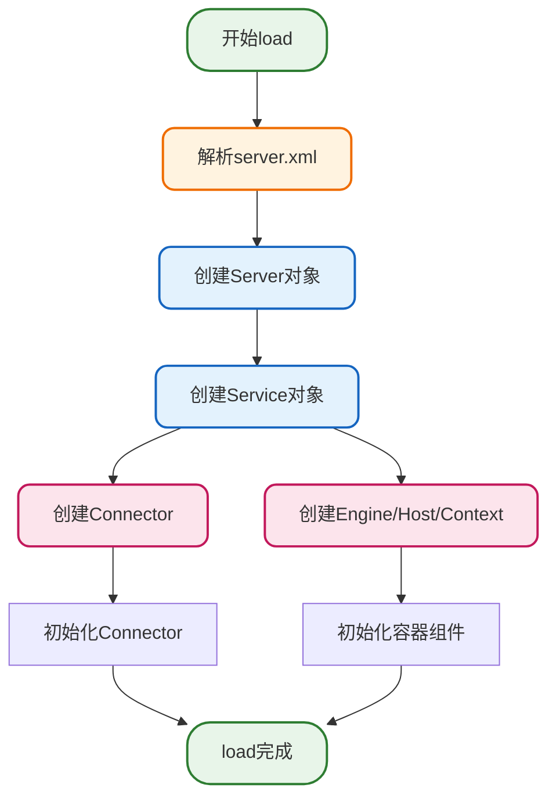
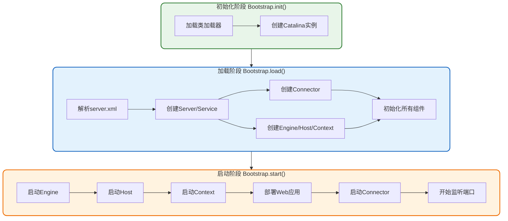
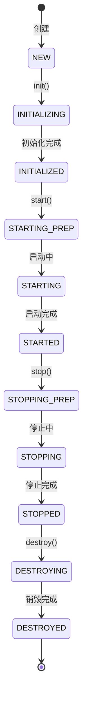

# Tomcat核心架构与启动流程

## Tomcat简介与定位

Tomcat是Apache软件基金会开发的一款开源**Java Servlet容器**和**JSP引擎**，它实现了Java Servlet和JSP规范，为Java Web应用程序提供运行环境。作为一款轻量级的Web应用服务器，Tomcat在中小型系统和并发访问量不高的场景下被广泛使用。

### Tomcat的核心功能

Tomcat主要提供以下核心能力：

- **Servlet容器**：管理和执行Java Servlet，处理动态请求
- **JSP引擎**：编译和执行JSP页面，将其转换为Servlet
- **HTTP服务器**：内置HTTP协议支持，可独立处理HTTP请求
- **连接池管理**：提供数据库连接池和线程池管理

## Tomcat与Web服务器的协作架构

在企业级应用中，Tomcat通常不会单独对外提供服务，而是与专业的Web服务器（如Nginx、Apache HTTP Server）配合使用，构建高性能的应用服务架构。

### 典型的联合部署架构



### 分工协作模式

在这种架构下，前端Web服务器和Tomcat各司其职：

| 组件 | 主要职责 | 处理内容 |
|------|----------|----------|
| Nginx/Apache | 反向代理、负载均衡 | 静态资源（HTML、CSS、JS、图片） |
| Tomcat | 应用服务器 | 动态请求（Servlet、JSP） |

**这种架构的优势：**

1. **性能优化**：前端服务器擅长处理高并发的静态请求，Tomcat专注于动态业务逻辑
2. **安全隔离**：前端服务器作为屏障，可以实现IP黑名单、访问控制等安全策略
3. **负载均衡**：可以将请求分发到多个Tomcat实例，提升系统承载能力
4. **灵活扩展**：应用层可以独立水平扩展，不影响前端服务

### 通信协议

前端服务器与Tomcat之间的通信主要采用两种协议：

- **HTTP协议**：标准的超文本传输协议，配置简单，兼容性好
- **AJP协议**（Apache JServ Protocol）：二进制协议，传输效率更高，适合内网通信

## Tomcat内部架构

要深入理解Tomcat的启动流程，首先需要了解其内部组件架构。

### 核心组件层次结构



### 组件职责说明

| 组件 | 层级 | 职责描述 |
|------|------|----------|
| **Server** | 顶层 | 整个Tomcat实例，管理所有Service |
| **Service** | 二层 | 将Connector和Engine组合，提供完整服务 |
| **Connector** | 连接层 | 监听端口，接收请求，支持不同协议 |
| **Engine** | 容器层 | 请求处理引擎，管理多个虚拟主机 |
| **Host** | 容器层 | 虚拟主机，对应一个域名 |
| **Context** | 容器层 | 一个Web应用程序 |
| **Wrapper** | 底层 | 封装单个Servlet |

## Tomcat启动流程详解

Tomcat的启动入口是`Bootstrap`类，整个启动过程可以分为三个核心阶段：**初始化（init）**、**加载（load）** 和 **启动（start）**。

### 启动流程时序图



### 第一阶段：初始化（init）

Bootstrap的init方法主要完成以下工作：

```java
// 模拟Bootstrap初始化过程
public class ServerBootstrap {
    
    private ClassLoader commonLoader;
    private ClassLoader serverLoader;
    private Object catalinaInstance;
    
    public void init() throws Exception {
        // 1. 初始化类加载器
        initClassLoaders();
        
        // 2. 设置线程上下文类加载器
        Thread.currentThread().setContextClassLoader(commonLoader);
        
        // 3. 加载并实例化Catalina
        Class<?> catalinaClass = commonLoader.loadClass(
            "org.apache.catalina.startup.Catalina");
        catalinaInstance = catalinaClass.getDeclaredConstructor().newInstance();
        
        // 4. 设置Catalina的父类加载器
        Method setParentClassLoader = catalinaClass.getMethod(
            "setParentClassLoader", ClassLoader.class);
        setParentClassLoader.invoke(catalinaInstance, serverLoader);
    }
    
    private void initClassLoaders() {
        // 创建Common类加载器
        commonLoader = createClassLoader("common", null);
        // 创建Server类加载器
        serverLoader = createClassLoader("server", commonLoader);
    }
}
```

**关键步骤解析：**

1. **创建类加载器**：构建Tomcat专用的类加载器层次结构
2. **加载Catalina类**：Catalina是Tomcat的核心启动类
3. **创建Catalina实例**：通过反射创建实例，便于类加载器隔离

### 第二阶段：加载（load）

load阶段主要完成配置解析和组件初始化：



**配置文件说明：**

| 配置文件 | 位置 | 作用 |
|----------|------|------|
| server.xml | conf/ | 定义服务器结构、端口、线程池等 |
| web.xml | conf/ | 全局Web应用配置，Servlet映射等 |
| context.xml | conf/ | 上下文配置，数据源等 |

### 第三阶段：启动（start）

start阶段按照组件层次逐级启动：

```java
// 模拟服务启动过程
public class ApplicationServer {
    
    private List<ServiceUnit> services = new ArrayList<>();
    
    public void start() {
        // 1. 启动所有Service
        for (ServiceUnit service : services) {
            service.start();
        }
        
        // 2. 注册关闭钩子
        Runtime.getRuntime().addShutdownHook(new Thread(this::stop));
        
        // 3. 等待关闭信号
        await();
    }
}

public class ServiceUnit {
    private RequestEngine engine;
    private List<ProtocolConnector> connectors;
    
    public void start() {
        // 先启动Engine（包含Host和Context）
        engine.start();
        
        // 再启动Connector开始接收请求
        for (ProtocolConnector connector : connectors) {
            connector.start();
            System.out.println("Connector started on port: " + connector.getPort());
        }
    }
}
```

**启动顺序的重要性：**

1. **先启动Engine**：确保所有Web应用已经就绪
2. **后启动Connector**：避免在应用未就绪时接收请求

### 完整启动流程图



## 生命周期管理机制

Tomcat的所有组件都实现了统一的`Lifecycle`接口，提供了标准化的生命周期管理。

### 生命周期状态流转



### 生命周期接口设计

```java
// 生命周期接口示例
public interface ComponentLifecycle {
    
    void init() throws LifecycleException;
    
    void start() throws LifecycleException;
    
    void stop() throws LifecycleException;
    
    void destroy() throws LifecycleException;
    
    LifecycleState getState();
    
    void addLifecycleListener(LifecycleListener listener);
}
```

这种统一的生命周期管理机制带来了以下好处：

- **状态可控**：所有组件状态统一管理，便于监控
- **级联操作**：父组件可以统一管理子组件的生命周期
- **事件通知**：状态变化时可以通知监听器执行相应逻辑

## 小结

本文深入分析了Tomcat的核心架构和启动流程：

1. **架构定位**：Tomcat作为Servlet容器，通常与Nginx等Web服务器配合使用
2. **组件层次**：Server → Service → Connector + Engine → Host → Context
3. **启动三阶段**：init（初始化类加载器）→ load（解析配置创建组件）→ start（启动服务）
4. **生命周期管理**：统一的Lifecycle接口确保组件状态可控

理解这些内容对于Tomcat的调优、故障排查和深入开发都有重要意义。
