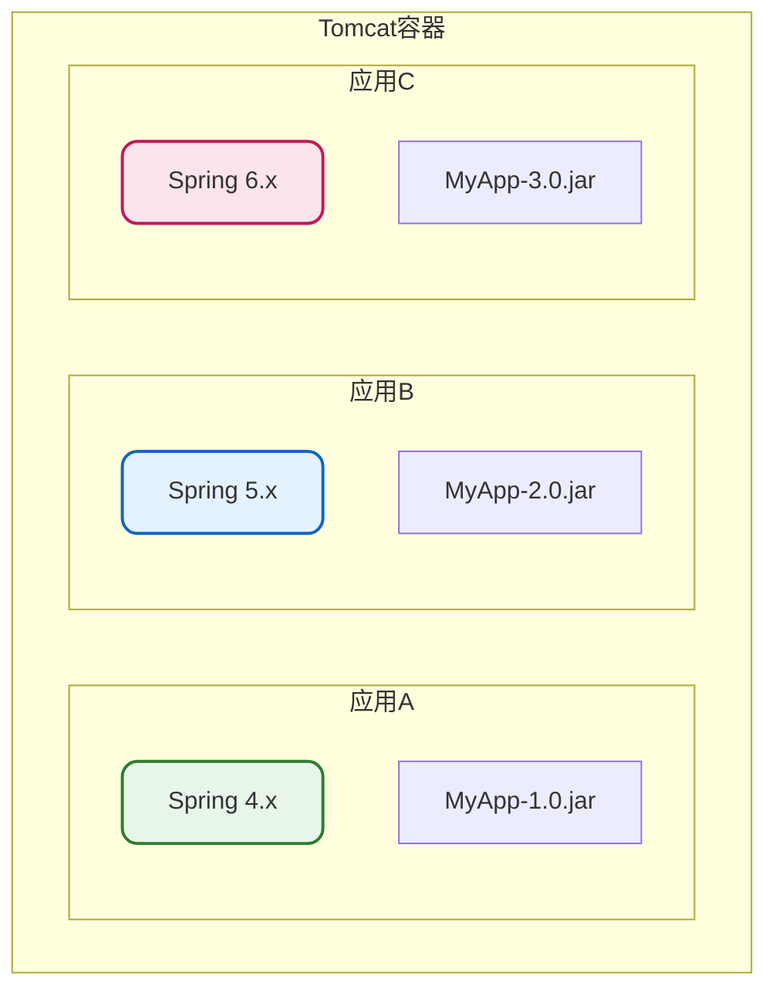
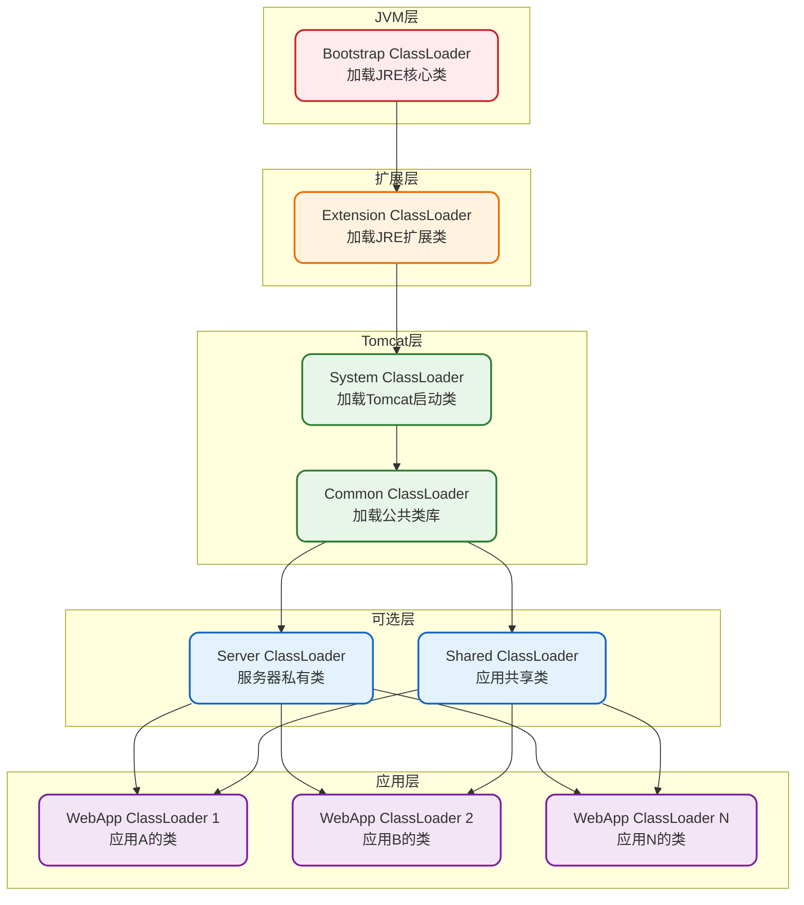
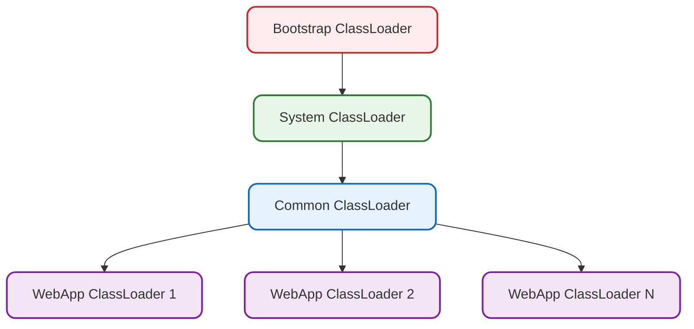
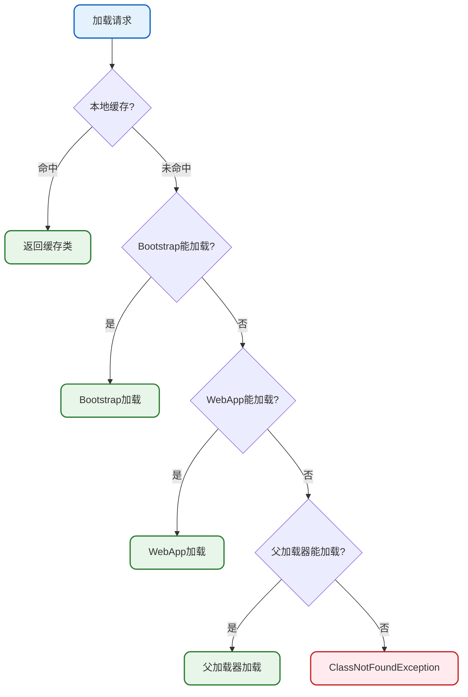
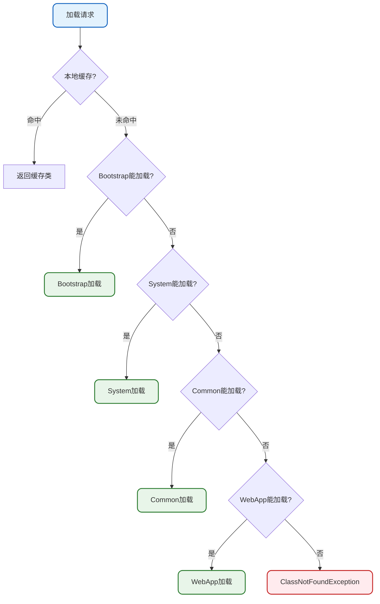
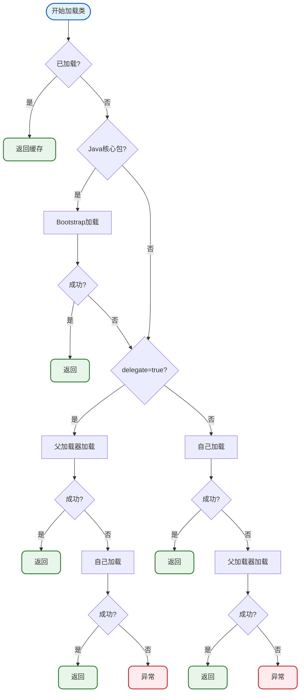
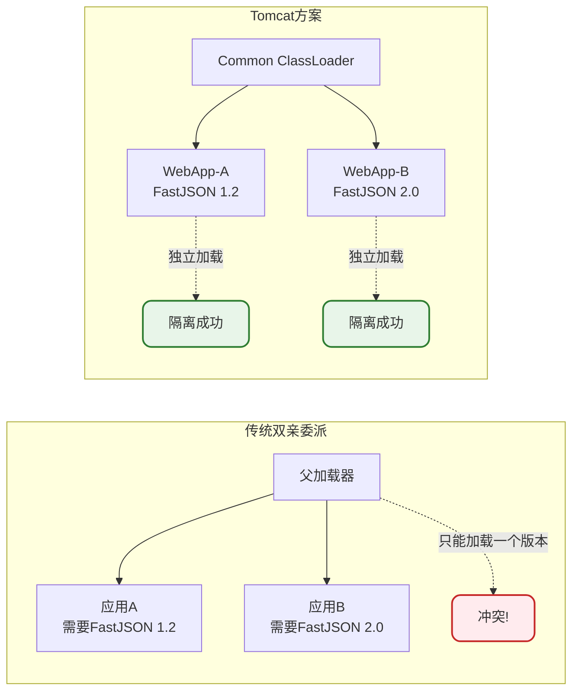
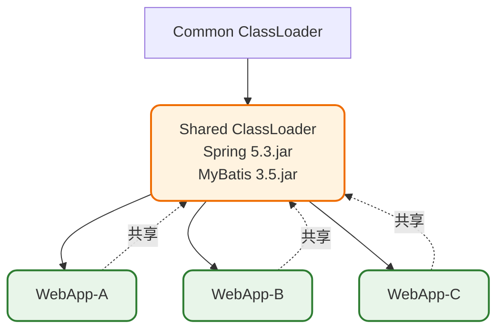

# Tomcat类加载器与类加载机制

## 概述

Tomcat作为一个支持多Web应用同时运行的Servlet容器，需要解决一个核心问题：**如何实现不同Web应用之间的类隔离**。为此，Tomcat设计了一套独特的类加载器层次结构，并对传统的双亲委派机制进行了改造。

## 为什么需要特殊的类加载机制

在深入了解Tomcat类加载机制之前，先理解其设计背景：

### 多应用隔离需求



**面临的问题：**

| 问题 | 描述 | 传统方式的困境 |
|------|------|----------------|
| 版本冲突 | 不同应用依赖同一类库的不同版本 | 双亲委派只会加载一个版本 |
| 类污染 | 一个应用的类影响其他应用 | 共享类加载器导致相互影响 |
| 热部署 | 更新某个应用不影响其他应用 | 类加载器不支持卸载类 |

## Tomcat类加载器层次结构

### 完整层次结构图



### 核心类加载器说明

#### Bootstrap ClassLoader（启动类加载器）

由JVM实现，负责加载Java核心类库：

- **加载路径**：`$JAVA_HOME/lib` 及 `lib/ext`
- **加载内容**：`java.lang.*`、`java.util.*` 等核心类
- **特点**：由C++实现，在Java中表现为null

#### System ClassLoader（系统类加载器）

负责加载Tomcat启动所需的类：

- **加载路径**：`$CATALINA_HOME/bin`
- **加载内容**：
  - `bootstrap.jar` - 启动入口类
  - `tomcat-juli.jar` - 日志组件
  - `commons-daemon.jar` - 守护进程支持

#### Common ClassLoader（公共类加载器）

加载Tomcat和所有Web应用都可以访问的公共类：

- **加载路径**：`$CATALINA_HOME/lib`
- **加载内容**：
  - `servlet-api.jar` - Servlet规范API
  - `jsp-api.jar` - JSP规范API
  - `catalina.jar` - Tomcat核心
  - 其他公共库

#### WebApp ClassLoader（Web应用类加载器）

每个Web应用独立拥有的类加载器：

- **加载路径**：
  - `WEB-INF/classes` - 应用编译的类
  - `WEB-INF/lib` - 应用依赖的jar包
- **特点**：应用间完全隔离

### 简化的实际层次

在默认配置下，Server ClassLoader和Shared ClassLoader是未启用的，实际的类加载器层次更加简洁：



## 类加载机制详解

Tomcat的类加载机制并非简单地遵循或违反双亲委派，而是采用了一种灵活的策略。

### 默认加载流程（delegate=false）

在默认配置下，WebAppClassLoader的类加载顺序如下：



**加载顺序解析：**

1. **检查缓存**：首先检查该类是否已经加载过
2. **Bootstrap优先**：尝试让Bootstrap加载，防止核心类被覆盖
3. **WebApp自己加载**：先尝试从WEB-INF加载应用自己的类
4. **向上委派**：如果自己加载失败，再委派给父加载器

### 严格双亲委派模式（delegate=true）

通过配置`delegate=true`，可以让WebAppClassLoader严格遵循双亲委派：



### 两种模式对比

| 特性 | delegate=false（默认） | delegate=true |
|------|------------------------|---------------|
| 加载顺序 | Bootstrap → WebApp → 父加载器 | Bootstrap → 父加载器 → WebApp |
| 双亲委派 | 部分打破 | 严格遵循 |
| 隔离性 | 更好 | 较差 |
| 适用场景 | 多应用部署 | 特殊需求 |

## 源码级别的类加载实现

下面通过简化的代码来理解Tomcat的类加载逻辑：

```java
/**
 * Web应用类加载器实现
 * 模拟Tomcat WebappClassLoaderBase的核心逻辑
 */
public class WebApplicationClassLoader extends URLClassLoader {
    
    // 是否严格遵循双亲委派
    private boolean delegate = false;
    
    // 类加载器名称（用于日志）
    private String name;
    
    public WebApplicationClassLoader(URL[] urls, ClassLoader parent, String name) {
        super(urls, parent);
        this.name = name;
    }
    
    @Override
    public Class<?> loadClass(String className, boolean resolve) 
            throws ClassNotFoundException {
        
        synchronized (getClassLoadingLock(className)) {
            Class<?> loadedClass = null;
            
            // 第一步：检查是否已经加载过
            loadedClass = findLoadedClass(className);
            if (loadedClass != null) {
                log("从缓存返回: " + className);
                return resolveIfNeeded(loadedClass, resolve);
            }
            
            // 第二步：尝试使用Bootstrap加载JDK核心类
            // 这是必须的，防止应用覆盖java.lang.String等核心类
            if (isJavaPackage(className)) {
                try {
                    loadedClass = getSystemClassLoader().loadClass(className);
                    if (loadedClass != null) {
                        log("Bootstrap加载: " + className);
                        return resolveIfNeeded(loadedClass, resolve);
                    }
                } catch (ClassNotFoundException e) {
                    // 忽略，继续尝试其他方式
                }
            }
            
            // 第三步：根据delegate配置决定加载策略
            boolean delegateFirst = this.delegate || isFilteredClass(className);
            
            if (delegateFirst) {
                // 严格双亲委派模式：先委派给父加载器
                loadedClass = tryParentFirst(className);
            } else {
                // 默认模式：先尝试自己加载
                loadedClass = trySelfFirst(className);
            }
            
            if (loadedClass == null) {
                throw new ClassNotFoundException(className);
            }
            
            return resolveIfNeeded(loadedClass, resolve);
        }
    }
    
    /**
     * 自己优先加载策略
     */
    private Class<?> trySelfFirst(String className) {
        Class<?> loadedClass = null;
        
        // 先尝试从WEB-INF/classes和WEB-INF/lib加载
        try {
            loadedClass = findClass(className);
            log("WebApp加载: " + className);
            return loadedClass;
        } catch (ClassNotFoundException e) {
            // 自己加载失败，委派给父加载器
        }
        
        // 委派给父加载器
        try {
            loadedClass = getParent().loadClass(className);
            log("父加载器加载: " + className);
            return loadedClass;
        } catch (ClassNotFoundException e) {
            // 父加载器也加载失败
        }
        
        return null;
    }
    
    /**
     * 父加载器优先加载策略
     */
    private Class<?> tryParentFirst(String className) {
        Class<?> loadedClass = null;
        
        // 先委派给父加载器
        try {
            loadedClass = getParent().loadClass(className);
            log("父加载器加载: " + className);
            return loadedClass;
        } catch (ClassNotFoundException e) {
            // 父加载器加载失败，尝试自己加载
        }
        
        // 尝试自己加载
        try {
            loadedClass = findClass(className);
            log("WebApp加载: " + className);
            return loadedClass;
        } catch (ClassNotFoundException e) {
            // 自己也加载失败
        }
        
        return null;
    }
    
    /**
     * 判断是否是Java核心包
     */
    private boolean isJavaPackage(String className) {
        return className.startsWith("java.") 
            || className.startsWith("javax.")
            || className.startsWith("sun.");
    }
    
    /**
     * 判断是否是需要过滤的类（必须由父加载器加载）
     */
    private boolean isFilteredClass(String className) {
        // Servlet API等必须由Common ClassLoader加载
        return className.startsWith("jakarta.servlet.")
            || className.startsWith("javax.servlet.")
            || className.startsWith("org.apache.catalina.");
    }
    
    private Class<?> resolveIfNeeded(Class<?> clazz, boolean resolve) {
        if (resolve) {
            resolveClass(clazz);
        }
        return clazz;
    }
    
    private void log(String message) {
        System.out.println("[" + name + "] " + message);
    }
    
    public void setDelegate(boolean delegate) {
        this.delegate = delegate;
    }
}
```

### 类加载决策流程图



## 为什么打破双亲委派

### 应用隔离的必要性



### 隔离带来的好处

1. **版本独立**：不同应用可以使用同一类库的不同版本
2. **互不干扰**：一个应用的类变更不影响其他应用
3. **热部署**：可以单独重新加载某个应用的类
4. **内存管理**：卸载应用时可以释放该应用的所有类

## 共享类的处理

### 使用Shared ClassLoader

对于多个应用都需要使用且版本相同的类库，可以配置Shared ClassLoader来避免重复加载：

```properties
# conf/catalina.properties
shared.loader="${catalina.base}/shared/lib/*.jar"
```



**注意事项：**
- 共享类的更新需要重启整个Tomcat
- 只有确定所有应用使用相同版本时才适合共享
- 可以节省内存，但降低了灵活性

## 类加载配置

### Context配置

在`context.xml`或应用的`META-INF/context.xml`中配置：

```xml
<Context>
    <!-- 使用严格双亲委派 -->
    <Loader delegate="true"/>
</Context>
```

### 类加载器属性

| 属性 | 默认值 | 说明 |
|------|--------|------|
| delegate | false | 是否严格双亲委派 |
| reloadable | false | 是否支持热加载 |
| searchExternalFirst | false | 外部类优先 |

## 常见问题与解决方案

### ClassNotFoundException

**问题**：应用启动时报ClassNotFoundException

**可能原因：**
1. JAR包未放置在正确位置
2. 类加载器顺序问题
3. 依赖冲突导致某些类未被加载

**解决方法：**

```java
// 诊断类加载问题
public class ClassLoaderDiagnostic {
    
    public static void diagnose(String className) {
        ClassLoader cl = Thread.currentThread().getContextClassLoader();
        
        System.out.println("当前线程类加载器: " + cl);
        System.out.println("类加载器层次:");
        
        while (cl != null) {
            System.out.println("  -> " + cl.getClass().getName());
            cl = cl.getParent();
        }
        
        try {
            Class<?> clazz = Class.forName(className);
            System.out.println("类加载成功，加载器: " + clazz.getClassLoader());
        } catch (ClassNotFoundException e) {
            System.out.println("类加载失败: " + e.getMessage());
        }
    }
}
```

### 类冲突问题

**问题**：NoSuchMethodError或LinkageError

**解决方法：**
1. 检查是否有重复的JAR包
2. 使用Maven的dependency:tree分析依赖
3. 确保正确的类加载顺序

## 小结

本文深入分析了Tomcat的类加载机制：

1. **层次结构**：Bootstrap → System → Common → WebApp，每层各司其职
2. **打破双亲委派**：默认情况下WebApp优先加载，实现应用隔离
3. **可配置性**：通过delegate属性可以切换加载策略
4. **核心保护**：无论如何配置，JDK核心类始终由Bootstrap加载

理解Tomcat的类加载机制，对于解决类冲突、部署问题和性能优化都有重要帮助。
