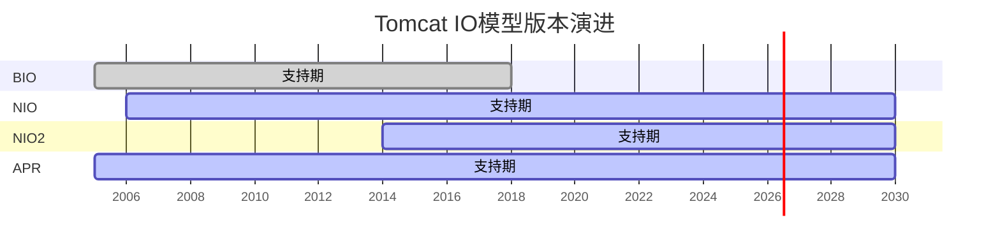
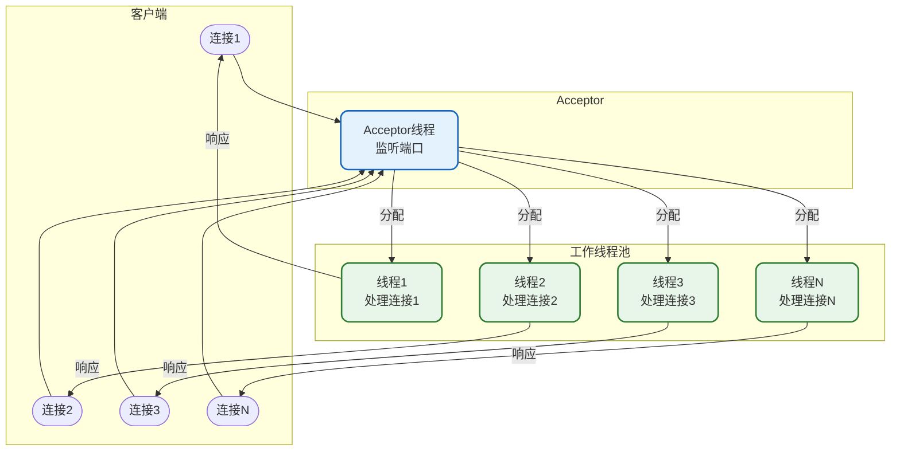
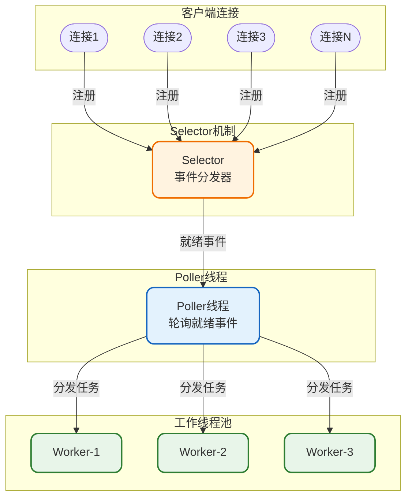
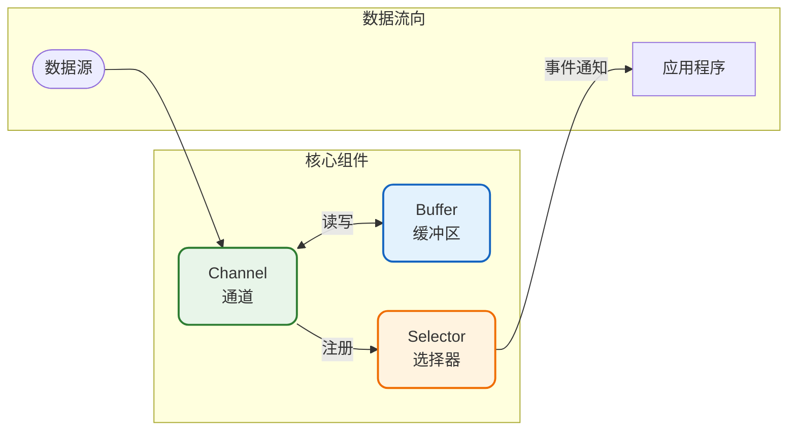
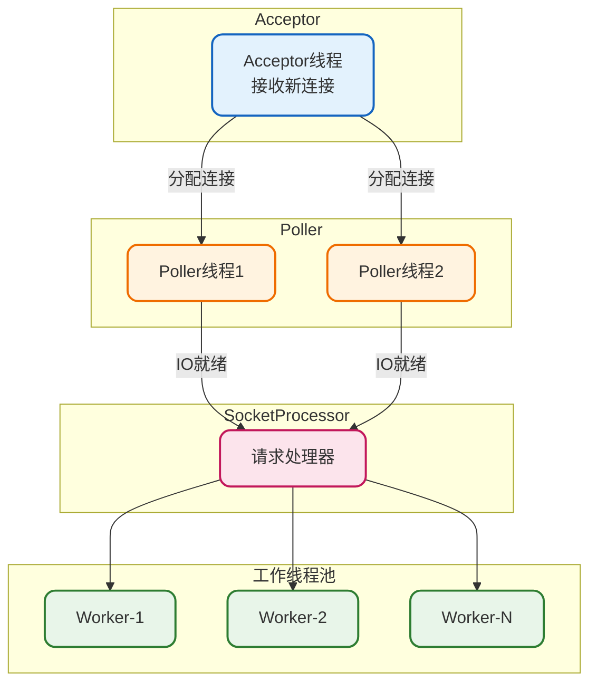
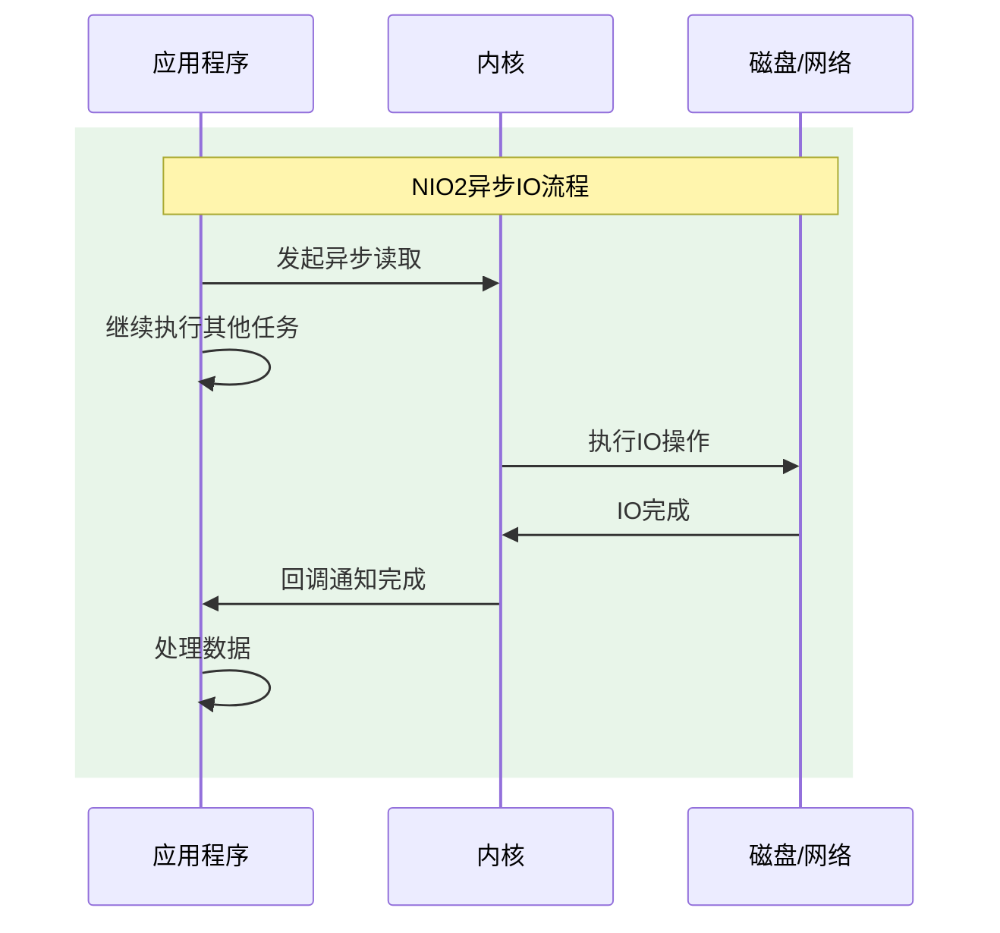
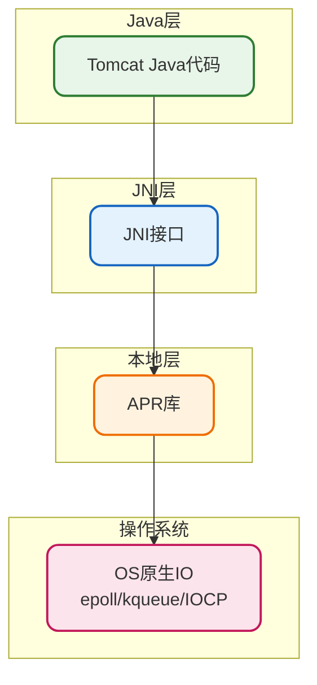
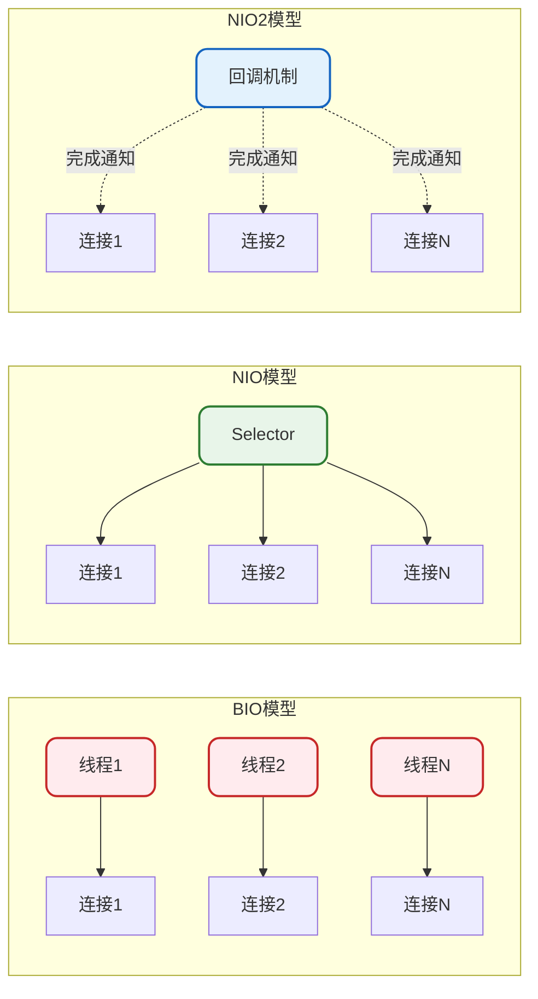
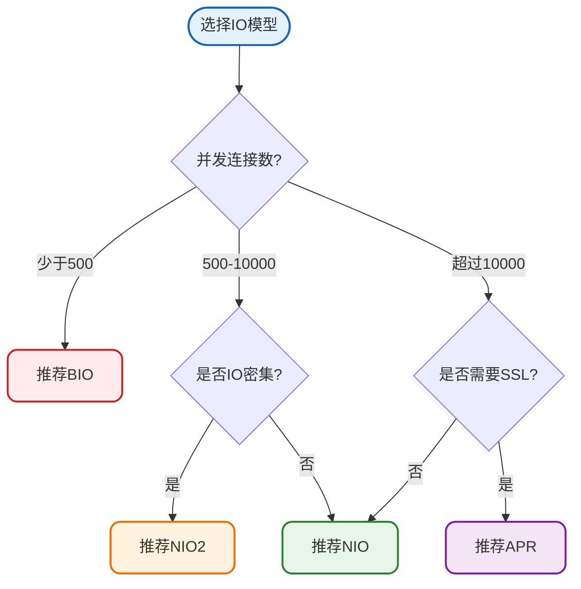

# Tomcat IO模型详解

## 概述

Tomcat作为一个Web服务器，需要处理大量的网络I/O操作。不同的I/O模型直接影响着Tomcat的并发处理能力和性能表现。本文将深入分析Tomcat支持的各种I/O模型，帮助你根据实际场景做出最佳选择。

## Tomcat支持的IO模型

Tomcat从早期版本发展至今，陆续支持了多种I/O模型：

### 各版本IO模型支持情况



| 版本 | BIO | NIO | NIO2 | APR |
|------|-----|-----|------|-----|
| Tomcat 6.x | 默认 | 支持 | 不支持 | 支持 |
| Tomcat 7.x | 默认 | 支持 | 不支持 | 支持 |
| Tomcat 8.0 | 支持 | 默认 | 支持 | 支持 |
| Tomcat 8.5+ | 移除 | 默认 | 支持 | 支持 |
| Tomcat 9.x | 移除 | 默认 | 支持 | 支持 |
| Tomcat 10.x | 移除 | 默认 | 支持 | 支持 |

## BIO模型（阻塞I/O）

### 工作原理

BIO（Blocking I/O）是最传统的I/O模型，采用"一请求一线程"的方式处理连接。



### BIO处理流程

```java
/**
 * BIO服务器模拟实现
 * 演示传统阻塞IO的工作方式
 */
public class BioHttpServer {
    
    private final int port;
    private final ExecutorService threadPool;
    private volatile boolean running = true;
    
    public BioHttpServer(int port, int maxThreads) {
        this.port = port;
        this.threadPool = Executors.newFixedThreadPool(maxThreads);
    }
    
    public void start() throws IOException {
        ServerSocket serverSocket = new ServerSocket(port);
        System.out.println("BIO服务器启动，监听端口: " + port);
        
        while (running) {
            // 阻塞等待连接
            Socket clientSocket = serverSocket.accept();
            
            // 为每个连接分配一个线程
            threadPool.submit(new ConnectionHandler(clientSocket));
        }
    }
    
    private class ConnectionHandler implements Runnable {
        private final Socket socket;
        
        public ConnectionHandler(Socket socket) {
            this.socket = socket;
        }
        
        @Override
        public void run() {
            try (BufferedReader reader = new BufferedReader(
                    new InputStreamReader(socket.getInputStream()));
                 PrintWriter writer = new PrintWriter(
                    socket.getOutputStream(), true)) {
                
                // 阻塞读取请求
                String requestLine = reader.readLine();
                System.out.println("收到请求: " + requestLine);
                
                // 处理业务逻辑（模拟耗时操作）
                processRequest(requestLine);
                
                // 发送响应
                writer.println("HTTP/1.1 200 OK");
                writer.println("Content-Type: text/html");
                writer.println();
                writer.println("<h1>Welcome to BIO Server</h1>");
                
            } catch (IOException e) {
                e.printStackTrace();
            }
        }
        
        private void processRequest(String request) {
            // 模拟业务处理
            try {
                Thread.sleep(100);
            } catch (InterruptedException e) {
                Thread.currentThread().interrupt();
            }
        }
    }
}
```

### BIO的特点

| 优点 | 缺点 |
|------|------|
| 编程模型简单直观 | 线程资源消耗大 |
| 每个连接独立处理 | 无法支持高并发 |
| 调试和排查容易 | 线程切换开销大 |

**适用场景**：连接数较少、短连接、对性能要求不高的场景。

## NIO模型（非阻塞I/O）

### 工作原理

NIO（Non-blocking I/O）使用Selector实现多路复用，一个线程可以处理多个连接。



### NIO核心组件



### NIO服务器实现

```java
/**
 * NIO服务器模拟实现
 * 演示Java NIO的工作方式
 */
public class NioHttpServer {
    
    private final int port;
    private Selector selector;
    private final ExecutorService workerPool;
    
    public NioHttpServer(int port, int workerCount) {
        this.port = port;
        this.workerPool = Executors.newFixedThreadPool(workerCount);
    }
    
    public void start() throws IOException {
        // 打开Selector
        selector = Selector.open();
        
        // 打开ServerSocketChannel
        ServerSocketChannel serverChannel = ServerSocketChannel.open();
        serverChannel.configureBlocking(false);
        serverChannel.bind(new InetSocketAddress(port));
        
        // 注册接受连接事件
        serverChannel.register(selector, SelectionKey.OP_ACCEPT);
        
        System.out.println("NIO服务器启动，监听端口: " + port);
        
        // 事件循环
        while (true) {
            // 非阻塞选择就绪的Channel
            int readyCount = selector.select(1000);
            
            if (readyCount == 0) {
                continue;
            }
            
            Set<SelectionKey> selectedKeys = selector.selectedKeys();
            Iterator<SelectionKey> iterator = selectedKeys.iterator();
            
            while (iterator.hasNext()) {
                SelectionKey key = iterator.next();
                iterator.remove();
                
                if (key.isAcceptable()) {
                    handleAccept(key);
                } else if (key.isReadable()) {
                    handleRead(key);
                }
            }
        }
    }
    
    private void handleAccept(SelectionKey key) throws IOException {
        ServerSocketChannel serverChannel = (ServerSocketChannel) key.channel();
        SocketChannel clientChannel = serverChannel.accept();
        
        if (clientChannel != null) {
            clientChannel.configureBlocking(false);
            // 注册读事件
            clientChannel.register(selector, SelectionKey.OP_READ);
            System.out.println("新连接: " + clientChannel.getRemoteAddress());
        }
    }
    
    private void handleRead(SelectionKey key) {
        SocketChannel channel = (SocketChannel) key.channel();
        
        // 提交到工作线程池处理
        workerPool.submit(() -> {
            try {
                ByteBuffer buffer = ByteBuffer.allocate(4096);
                int bytesRead = channel.read(buffer);
                
                if (bytesRead > 0) {
                    buffer.flip();
                    String request = new String(buffer.array(), 0, bytesRead);
                    System.out.println("收到请求: " + request.split("\n")[0]);
                    
                    // 处理请求并响应
                    String response = "HTTP/1.1 200 OK\r\n" +
                            "Content-Type: text/html\r\n\r\n" +
                            "<h1>Welcome to NIO Server</h1>";
                    
                    channel.write(ByteBuffer.wrap(response.getBytes()));
                }
                
                channel.close();
            } catch (IOException e) {
                e.printStackTrace();
            }
        });
    }
}
```

### Tomcat NIO架构



### NIO的特点

| 优点 | 缺点 |
|------|------|
| 高并发支持 | 编程模型复杂 |
| 线程资源利用率高 | 需要处理半包/粘包问题 |
| 非阻塞提升吞吐量 | 调试难度较大 |

## NIO2模型（异步I/O）

### 工作原理

NIO2（也称AIO）是Java 7引入的真正的异步I/O模型，基于回调或Future机制处理IO完成事件。



### NIO2服务器实现

```java
/**
 * NIO2/AIO服务器模拟实现
 * 演示异步IO的工作方式
 */
public class Nio2HttpServer {
    
    private final int port;
    private AsynchronousServerSocketChannel serverChannel;
    
    public Nio2HttpServer(int port) {
        this.port = port;
    }
    
    public void start() throws IOException {
        // 创建异步通道组
        AsynchronousChannelGroup channelGroup = 
            AsynchronousChannelGroup.withFixedThreadPool(
                Runtime.getRuntime().availableProcessors(),
                Executors.defaultThreadFactory()
            );
        
        // 打开异步服务器通道
        serverChannel = AsynchronousServerSocketChannel.open(channelGroup);
        serverChannel.bind(new InetSocketAddress(port));
        
        System.out.println("NIO2服务器启动，监听端口: " + port);
        
        // 异步接受连接
        acceptConnection();
        
        // 保持主线程运行
        try {
            Thread.currentThread().join();
        } catch (InterruptedException e) {
            Thread.currentThread().interrupt();
        }
    }
    
    private void acceptConnection() {
        serverChannel.accept(null, new CompletionHandler<AsynchronousSocketChannel, Void>() {
            
            @Override
            public void completed(AsynchronousSocketChannel clientChannel, Void attachment) {
                // 继续接受下一个连接
                acceptConnection();
                
                // 处理当前连接
                handleConnection(clientChannel);
            }
            
            @Override
            public void failed(Throwable exc, Void attachment) {
                exc.printStackTrace();
            }
        });
    }
    
    private void handleConnection(AsynchronousSocketChannel channel) {
        ByteBuffer buffer = ByteBuffer.allocate(4096);
        
        // 异步读取
        channel.read(buffer, buffer, new CompletionHandler<Integer, ByteBuffer>() {
            
            @Override
            public void completed(Integer bytesRead, ByteBuffer buf) {
                if (bytesRead > 0) {
                    buf.flip();
                    String request = new String(buf.array(), 0, bytesRead);
                    System.out.println("收到请求: " + request.split("\n")[0]);
                    
                    // 异步写入响应
                    String response = "HTTP/1.1 200 OK\r\n" +
                            "Content-Type: text/html\r\n\r\n" +
                            "<h1>Welcome to NIO2 Server</h1>";
                    
                    ByteBuffer responseBuffer = ByteBuffer.wrap(response.getBytes());
                    
                    channel.write(responseBuffer, null, 
                        new CompletionHandler<Integer, Void>() {
                            @Override
                            public void completed(Integer result, Void attachment) {
                                try {
                                    channel.close();
                                } catch (IOException e) {
                                    e.printStackTrace();
                                }
                            }
                            
                            @Override
                            public void failed(Throwable exc, Void attachment) {
                                exc.printStackTrace();
                            }
                        });
                }
            }
            
            @Override
            public void failed(Throwable exc, ByteBuffer buf) {
                exc.printStackTrace();
            }
        });
    }
}
```

### NIO2的特点

| 优点 | 缺点 |
|------|------|
| 真正的异步非阻塞 | 编程模型更复杂 |
| 系统资源利用率最高 | 回调嵌套难以维护 |
| 适合IO密集型应用 | 调试困难 |

## APR模型

### 工作原理

APR（Apache Portable Runtime）是Apache提供的一个跨平台本地库，直接调用操作系统的原生I/O能力。



### APR的特点

| 优点 | 缺点 |
|------|------|
| 最高性能 | 需要安装本地库 |
| 直接使用OS特性 | 跨平台需要不同编译 |
| SSL处理性能优异 | 部署复杂度高 |

## 四种IO模型对比

### 处理模式对比



### 性能对比表

| 指标 | BIO | NIO | NIO2 | APR |
|------|-----|-----|------|-----|
| 并发连接数 | 低（数百） | 高（数万） | 高（数万） | 最高 |
| 线程消耗 | 高 | 低 | 低 | 低 |
| CPU利用率 | 低 | 中 | 高 | 最高 |
| 编程复杂度 | 低 | 中 | 高 | 中 |
| 适用场景 | 小并发 | 通用 | IO密集 | 极致性能 |

### 选择建议



## Connector配置

### 配置方式

在`server.xml`中配置Connector来选择IO模型：

```xml
<!-- NIO模式（默认） -->
<Connector port="8080" 
           protocol="org.apache.coyote.http11.Http11NioProtocol"
           maxThreads="200"
           minSpareThreads="10"
           acceptCount="100"
           connectionTimeout="20000" />

<!-- NIO2模式 -->
<Connector port="8080" 
           protocol="org.apache.coyote.http11.Http11Nio2Protocol"
           maxThreads="200"
           minSpareThreads="10"
           acceptCount="100"
           connectionTimeout="20000" />

<!-- APR模式 -->
<Connector port="8080" 
           protocol="org.apache.coyote.http11.Http11AprProtocol"
           maxThreads="200"
           minSpareThreads="10"
           acceptCount="100"
           connectionTimeout="20000" />
```

### Protocol对应关系

| IO模型 | protocol配置值 |
|--------|----------------|
| NIO | `HTTP/1.1` 或 `org.apache.coyote.http11.Http11NioProtocol` |
| NIO2 | `org.apache.coyote.http11.Http11Nio2Protocol` |
| APR | `org.apache.coyote.http11.Http11AprProtocol` |

### 验证当前模式

启动Tomcat时，可以在日志中看到使用的IO模型：

```bash
# NIO模式
INFO: Starting ProtocolHandler ["http-nio-8080"]

# NIO2模式  
INFO: Starting ProtocolHandler ["http-nio2-8080"]

# APR模式
INFO: Starting ProtocolHandler ["http-apr-8080"]
```

## 关键配置参数

### 线程池配置

| 参数 | 默认值 | 说明 |
|------|--------|------|
| maxThreads | 200 | 最大工作线程数 |
| minSpareThreads | 10 | 最小空闲线程数 |
| maxConnections | 10000(NIO) | 最大连接数 |
| acceptCount | 100 | 连接等待队列长度 |

### 性能调优示例

```xml
<!-- 高并发场景配置 -->
<Connector port="8080" 
           protocol="org.apache.coyote.http11.Http11NioProtocol"
           maxThreads="500"
           minSpareThreads="50"
           maxConnections="20000"
           acceptCount="500"
           connectionTimeout="10000"
           keepAliveTimeout="15000"
           maxKeepAliveRequests="100"
           enableLookups="false"
           compression="on"
           compressionMinSize="2048" />
```

## 实践建议

### 场景选择指南

1. **普通Web应用**：使用默认的NIO模式即可满足大多数场景
2. **高并发API服务**：优先考虑NIO或NIO2
3. **大量SSL连接**：考虑使用APR获得更好的加解密性能
4. **长连接应用**：WebSocket等场景推荐NIO2

### 性能监控

```java
/**
 * 连接监控工具类
 * 用于监控Tomcat连接池状态
 */
public class ConnectorMonitor {
    
    public static void printConnectorStats() {
        MBeanServer mBeanServer = ManagementFactory.getPlatformMBeanServer();
        
        try {
            ObjectName name = new ObjectName(
                "Catalina:type=ThreadPool,name=\"http-nio-8080\"");
            
            Integer currentThreadCount = (Integer) mBeanServer
                .getAttribute(name, "currentThreadCount");
            Integer currentThreadsBusy = (Integer) mBeanServer
                .getAttribute(name, "currentThreadsBusy");
            Long connectionCount = (Long) mBeanServer
                .getAttribute(name, "connectionCount");
            
            System.out.println("当前线程数: " + currentThreadCount);
            System.out.println("繁忙线程数: " + currentThreadsBusy);
            System.out.println("连接数: " + connectionCount);
            
        } catch (Exception e) {
            e.printStackTrace();
        }
    }
}
```

## 小结

本文详细介绍了Tomcat支持的四种IO模型：

1. **BIO**：一请求一线程，简单但不适合高并发
2. **NIO**：基于Selector的多路复用，当前的默认选择
3. **NIO2**：真正的异步IO，适合IO密集型应用
4. **APR**：本地库支持，极致性能但部署复杂

选择IO模型时应考虑：
- 并发连接数量
- 请求处理特性（CPU密集/IO密集）
- 是否需要SSL
- 部署和运维复杂度

对于大多数应用，使用默认的NIO模式并合理配置线程池参数即可获得良好的性能表现。
