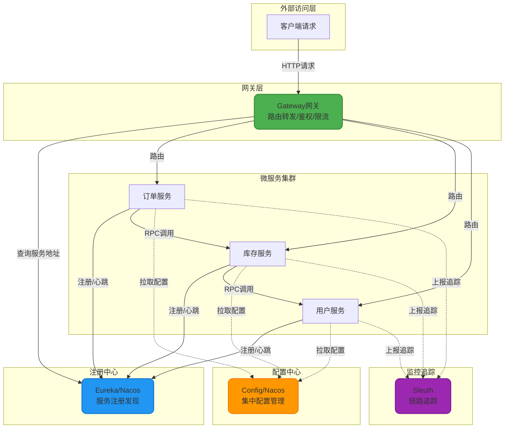
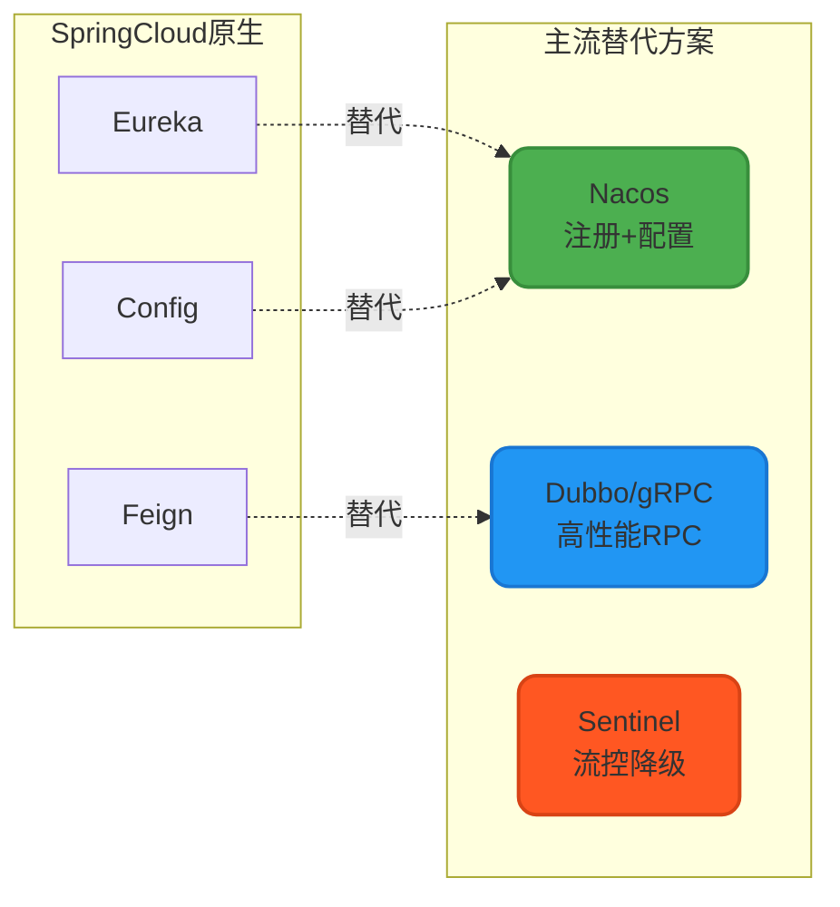
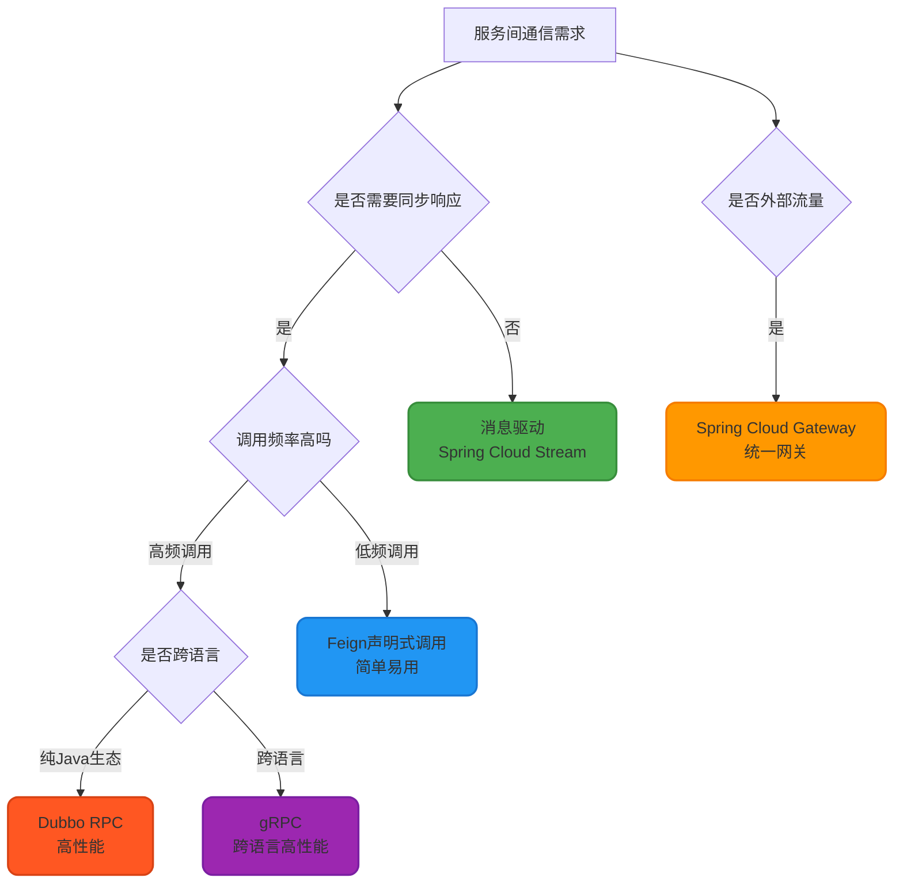
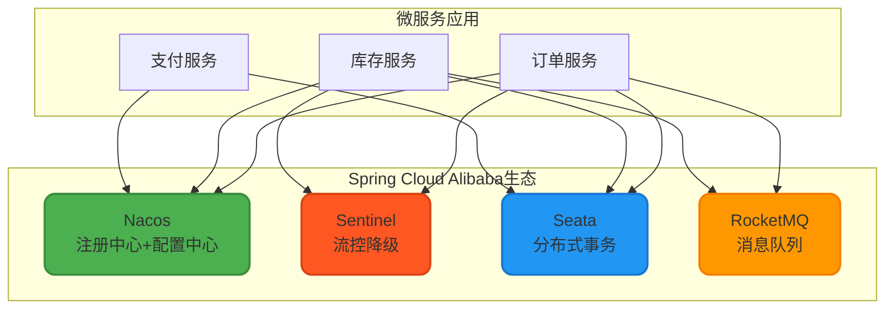

# SpringCloud核心概念与架构

## 什么是SpringCloud

SpringCloud是构建在Spring Boot基础之上的**微服务治理框架**,专门用于解决分布式系统开发中的常见挑战。它整合了众多成熟的分布式组件,提供了服务注册与发现、配置管理、负载均衡、熔断降级、消息总线等核心能力,让开发者能够快速搭建和管理云原生应用。

从技术选型的角度来看:
- **单体应用** → 使用Spring框架
- **快速开发、简化配置** → 使用Spring Boot
- **分布式、微服务架构** → 使用Spring Cloud

## SpringCloud核心组件解析

在微服务架构中,SpringCloud的各个组件各司其职,共同构建起完整的分布式治理体系。下面通过Mermaid图展示核心组件的作用和位置关系:



### 主流组件功能清单

#### 1. Eureka - 服务注册与发现中心

Eureka充当微服务的"电话簿"角色,服务提供者启动时会向Eureka注册自己的地址信息,服务消费者通过Eureka自动发现可用的服务实例。这种机制实现了服务间的解耦,避免了硬编码IP地址。

**核心价值**:
- 服务自动注册与心跳检测
- 动态服务发现,支持弹性扩缩容
- 故障实例自动剔除

#### 2. Ribbon - 客户端负载均衡

Ribbon在服务消费端实现负载均衡算法,从Eureka获取的服务列表中智能选择目标实例。它支持轮询、随机、加权响应时间等多种策略,让流量分配更加合理。

#### 3. OpenFeign - 声明式HTTP客户端

OpenFeign简化了服务间的HTTP调用编码,开发者只需定义接口并添加注解,框架会自动生成调用逻辑。它整合了Ribbon和Hystrix,提供了负载均衡和容错能力。

**注意**: OpenFeign已停止维护,建议迁移至Spring Cloud LoadBalancer + WebClient的组合方案。

#### 4. Hystrix - 熔断降级组件

Hystrix实现了断路器模式,当下游服务出现大量超时或失败时,自动熔断请求并执行降级逻辑,防止故障雪崩。它还提供了请求缓存、请求合并等高级特性。

**当前趋势**: Hystrix已进入维护模式,生产环境推荐使用Alibaba Sentinel替代,后者提供了更强大的流控和降级能力。

#### 5. Gateway - 第二代API网关

Spring Cloud Gateway基于Reactor响应式编程模型构建,具备更高的性能和更灵活的路由配置能力。它取代了第一代的Zuul网关,成为Spring Cloud官方推荐的网关解决方案。

**核心功能**:
- 动态路由匹配(路径、请求头、参数等)
- 统一鉴权与权限控制
- 全局限流与熔断
- 请求/响应过滤与转换

#### 6. Config - 分布式配置中心

Config将配置文件集中存储在Git/SVN等版本控制系统中,微服务启动时从配置中心拉取最新配置。支持配置的版本管理、灰度发布和动态刷新(配合Bus消息总线)。

#### 7. Bus - 消息总线

Bus基于消息中间件(RabbitMQ/Kafka)实现配置变更的实时推送。当配置中心的配置更新后,通过Bus广播通知所有微服务实例刷新本地配置,实现配置的热更新。

#### 8. Sleuth - 分布式链路追踪

Sleuth为每个请求生成全局唯一的TraceId,并在服务调用链路中传递,配合Zipkin等可视化工具,可以清晰呈现请求的完整调用路径和耗时分析,是排查分布式问题的利器。

#### 9. Security - OAuth2认证与授权

Spring Cloud Security简化了OAuth2和JWT的集成,提供了统一的身份认证和资源保护方案,支持单点登录(SSO)、令牌管理等企业级安全需求。

### 技术栈组合建议

实际项目中,我们通常不会完全使用SpringCloud原生组件,而是根据需求选择更优的开源方案:



**典型生产级技术栈**:
- **注册中心 + 配置中心**: Nacos (阿里开源,功能更强大)
- **RPC框架**: Dubbo/gRPC (性能优于Feign的HTTP)
- **流控降级**: Sentinel (国内主流选择)
- **网关**: Spring Cloud Gateway (官方推荐)
- **链路追踪**: SkyWalking/Zipkin + Sleuth

## 服务间通信方式详解

在微服务架构中,服务间的高效通信是系统稳定性的关键。SpringCloud支持多种通信模式,各有适用场景。

### RESTful HTTP调用

最基础的通信方式是通过HTTP协议进行服务间调用。服务提供者使用Spring MVC暴露REST接口,消费者使用`RestTemplate`或`WebClient`发起HTTP请求。

**代码示例** - 使用RestTemplate调用库存服务:

```java
@Service
public class InventoryClientService {
    
    @Autowired
    private RestTemplate restTemplate;
    
    /**
     * 查询商品库存
     * @param productId 商品ID
     * @return 库存数量
     */
    public Integer queryStock(Long productId) {
        String url = "http://inventory-service/api/stock/query?productId=" + productId;
        StockResponse response = restTemplate.getForObject(url, StockResponse.class);
        return response != null ? response.getStock() : 0;
    }
    
    /**
     * 扣减库存
     */
    public boolean deductStock(Long productId, Integer quantity) {
        String url = "http://inventory-service/api/stock/deduct";
        DeductRequest request = new DeductRequest(productId, quantity);
        Boolean result = restTemplate.postForObject(url, request, Boolean.class);
        return Boolean.TRUE.equals(result);
    }
}
```

**优势**: 实现简单,基于HTTP标准协议,跨语言支持好
**劣势**: 性能相对较低,需要手动处理负载均衡和容错

### Feign声明式调用

Feign将HTTP调用简化为接口方法调用,极大提升了开发效率。通过`@FeignClient`注解声明调用的目标服务,框架自动处理序列化、负载均衡等细节。

**代码示例** - 定义库存服务Feign客户端:

```java
@FeignClient(name = "inventory-service", fallback = InventoryFeignFallback.class)
public interface InventoryFeignClient {
    
    /**
     * 查询商品库存
     */
    @GetMapping("/api/stock/query")
    Integer queryStock(@RequestParam("productId") Long productId);
    
    /**
     * 批量扣减库存
     */
    @PostMapping("/api/stock/batchDeduct")
    BatchDeductResult batchDeduct(@RequestBody List<DeductItem> items);
}

/**
 * 降级处理类
 */
@Component
public class InventoryFeignFallback implements InventoryFeignClient {
    
    @Override
    public Integer queryStock(Long productId) {
        log.warn("库存服务调用失败,返回默认值");
        return 0;
    }
    
    @Override
    public BatchDeductResult batchDeduct(List<DeductItem> items) {
        return BatchDeductResult.failed("库存服务暂时不可用");
    }
}
```

**优势**: 代码简洁优雅,内置负载均衡和容错,学习成本低
**劣势**: 基于HTTP协议,性能不如RPC框架

### Spring Cloud Gateway统一网关

Gateway作为统一入口,接收外部请求并根据路由规则转发到后端微服务。它通常部署在最外层,承担流量分发、权限校验、限流熔断等职责。

**配置示例** - 路由配置:

```yaml
spring:
  cloud:
    gateway:
      routes:
        # 订单服务路由
        - id: order-service-route
          uri: lb://order-service
          predicates:
            - Path=/api/order/**
          filters:
            - StripPrefix=1
            - name: RequestRateLimiter
              args:
                redis-rate-limiter.replenishRate: 10  # 令牌桶每秒填充速率
                redis-rate-limiter.burstCapacity: 20  # 令牌桶容量
        
        # 支付服务路由
        - id: payment-service-route
          uri: lb://payment-service
          predicates:
            - Path=/api/payment/**
          filters:
            - StripPrefix=1
            - AddRequestHeader=X-Gateway-Version, 1.0
```

**工作流程**:
1. 客户端请求 → `http://gateway:8080/api/order/create`
2. Gateway匹配路由规则 → 识别为订单服务
3. 执行过滤器链 → 鉴权、限流、日志记录
4. 负载均衡 → 从Eureka获取order-service实例列表
5. 转发请求 → `http://order-service-instance/create`

**优势**: 统一管理横切关注点,与Spring Cloud LoadBalancer配合实现客户端负载均衡
**推荐场景**: 所有生产环境微服务架构的标配组件

### RPC高性能调用

对于内部服务间的高频调用,RPC框架能提供比HTTP更高的性能。Spring Cloud可以无缝集成Dubbo、gRPC等RPC框架。

**代码示例** - 使用Dubbo进行服务调用:

```java
// 服务提供者 - 用户服务
@DubboService(version = "1.0.0", timeout = 3000)
public class UserRpcServiceImpl implements UserRpcService {
    
    @Autowired
    private UserRepository userRepository;
    
    @Override
    public UserDTO getUserById(Long userId) {
        User user = userRepository.findById(userId)
            .orElseThrow(() -> new UserNotFoundException(userId));
        return UserDTO.from(user);
    }
    
    @Override
    public List<UserDTO> batchGetUsers(List<Long> userIds) {
        List<User> users = userRepository.findAllById(userIds);
        return users.stream()
            .map(UserDTO::from)
            .collect(Collectors.toList());
    }
}

// 服务消费者 - 订单服务
@Service
public class OrderService {
    
    @DubboReference(version = "1.0.0", check = false)
    private UserRpcService userRpcService;
    
    public OrderDetailVO getOrderDetail(Long orderId) {
        Order order = orderRepository.findById(orderId).orElseThrow();
        
        // RPC调用获取用户信息
        UserDTO user = userRpcService.getUserById(order.getUserId());
        
        return OrderDetailVO.builder()
            .orderId(order.getId())
            .userName(user.getName())
            .userPhone(user.getPhone())
            .orderAmount(order.getAmount())
            .build();
    }
}
```

**优势**: 
- 性能高,采用二进制序列化(Protobuf/Hessian)
- 支持多种通信协议(TCP/HTTP2)
- 内置服务治理能力

**劣势**: 跨语言支持较弱(gRPC除外),生态不如HTTP成熟

### 消息驱动通信

对于异步解耦的场景,基于消息中间件的通信更加合适。Spring Cloud Stream提供了统一的消息编程模型。

**代码示例** - 订单服务发布支付成功事件:

```java
// 消息发布者 - 支付服务
@Service
public class PaymentEventPublisher {
    
    @Autowired
    private StreamBridge streamBridge;
    
    /**
     * 发布支付成功事件
     */
    public void publishPaymentSuccess(PaymentSuccessEvent event) {
        boolean sent = streamBridge.send("payment-success-out-0", event);
        if (sent) {
            log.info("支付成功事件已发布: orderId={}, amount={}", 
                event.getOrderId(), event.getAmount());
        }
    }
}

// 消息消费者 - 订单服务
@Service
public class OrderEventListener {
    
    @Autowired
    private OrderService orderService;
    
    /**
     * 监听支付成功事件,更新订单状态
     */
    @Bean
    public Consumer<PaymentSuccessEvent> handlePaymentSuccess() {
        return event -> {
            log.info("接收到支付成功事件: {}", event);
            orderService.updateOrderStatus(event.getOrderId(), OrderStatus.PAID);
            
            // 触发后续业务流程
            orderService.notifyWarehouse(event.getOrderId());
        };
    }
}

// 配置文件
spring:
  cloud:
    stream:
      bindings:
        # 发布端配置
        payment-success-out-0:
          destination: payment.success.topic
          content-type: application/json
        # 消费端配置
        handlePaymentSuccess-in-0:
          destination: payment.success.topic
          group: order-service-group
      kafka:
        binder:
          brokers: localhost:9092
```

**优势**: 
- 服务解耦,异步处理提升性能
- 削峰填谷,应对流量波动
- 支持广播和订阅模式

**适用场景**: 事件通知、日志收集、数据同步等非实时场景

### 通信方式选型建议



## Spring Cloud生态扩展

### Spring Cloud Alibaba

阿里巴巴推出的微服务解决方案,在Spring Cloud标准之上提供了更丰富的企业级特性,特别适合国内生产环境。

**核心组件**:

1. **Nacos** - 服务注册发现 + 配置中心二合一
2. **Sentinel** - 流量控制、熔断降级、系统自适应保护
3. **RocketMQ** - 高性能分布式消息队列
4. **Seata** - 分布式事务解决方案,支持AT、TCC、SAGA模式
5. **Dubbo** - 高性能RPC框架集成
6. **OSS** - 阿里云对象存储服务
7. **SchedulerX** - 分布式任务调度平台

**架构图示**:



**典型应用场景**:
- 电商大促活动 → Sentinel实时流控
- 跨服务事务 → Seata保证数据一致性
- 配置动态调整 → Nacos配置热更新

### Spring Cloud Tencent

腾讯开源的微服务解决方案,基于腾讯内部海量服务治理经验打造。

**核心能力**:
1. **Polaris** - 服务注册发现与治理
2. **配置中心** - 动态配置管理
3. **限流熔断** - 分布式限流和熔断降级
4. **服务路由** - 灵活的路由策略(金丝雀发布、蓝绿部署)
5. **调用链追踪** - 全链路监控

**技术优势**:
- 支持跨注册中心服务发现(Polaris、Consul、Eureka互通)
- 提供控制台可视化管理
- 性能优化,适合大规模集群

## 总结

Spring Cloud提供了完整的微服务开发工具链,通过合理选择和组合各类组件,能够快速构建稳定可靠的分布式系统。实际项目中建议:

1. **注册配置**: 优先选择Nacos,功能强大且社区活跃
2. **RPC通信**: 高频调用使用Dubbo/gRPC,一般调用可用Feign
3. **流控降级**: Sentinel是国内主流选择,功能全面
4. **API网关**: Spring Cloud Gateway是官方标准,性能优秀
5. **链路追踪**: SkyWalking + Sleuth组合,监控能力强

根据业务规模和团队技术栈,灵活选型,避免过度设计,才能发挥Spring Cloud的最大价值。
