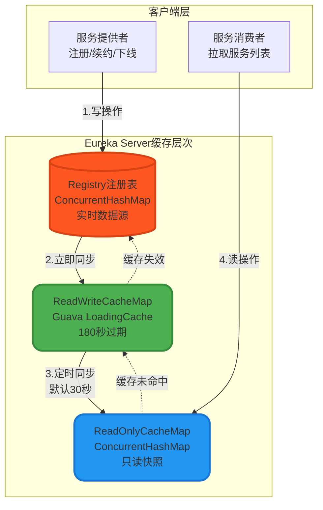
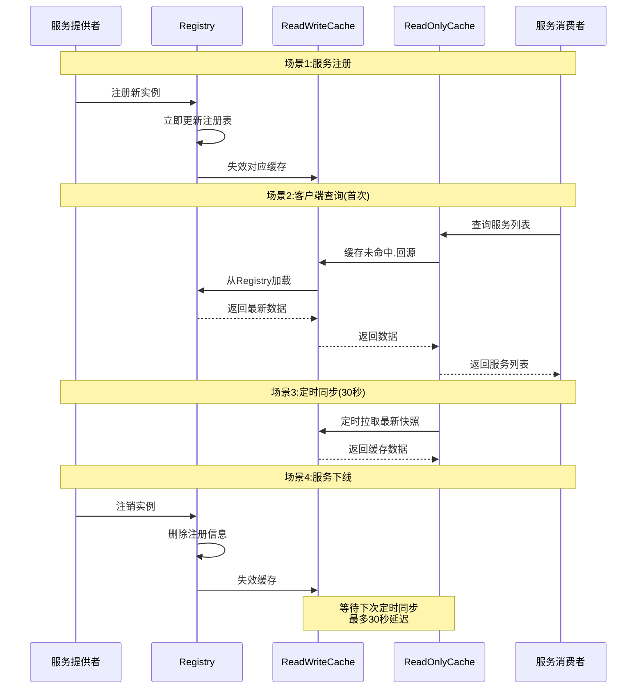
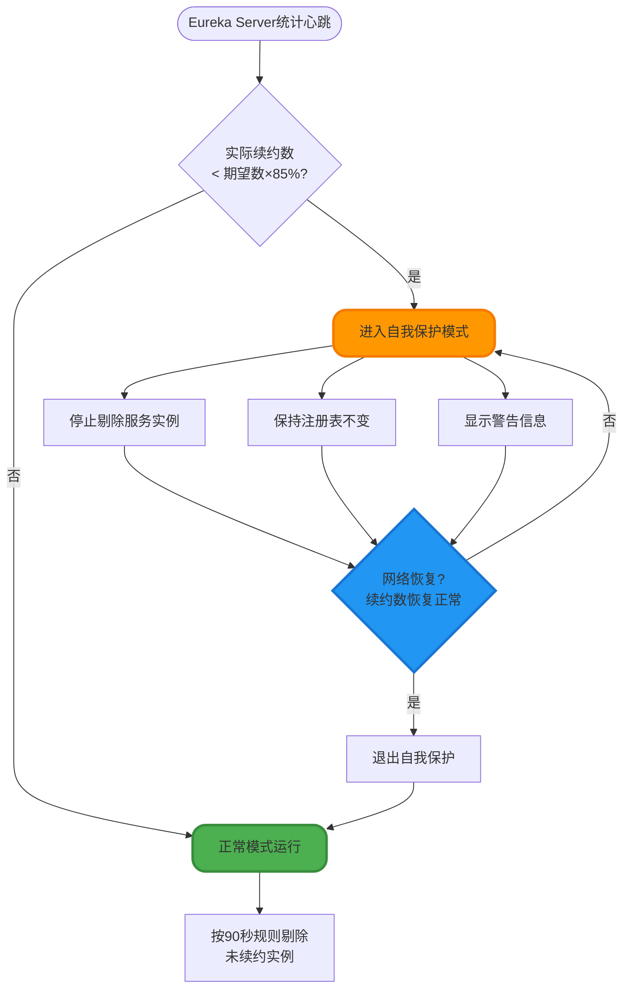
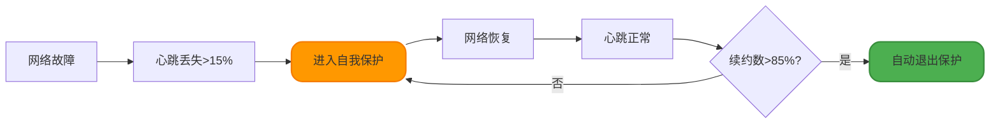
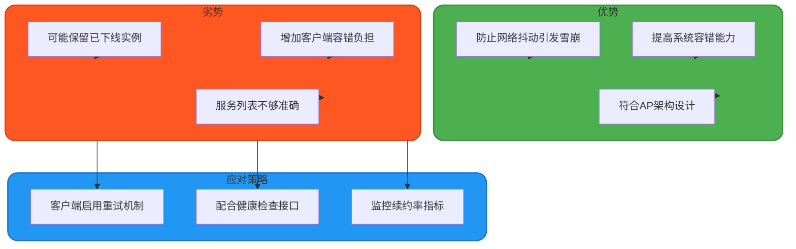
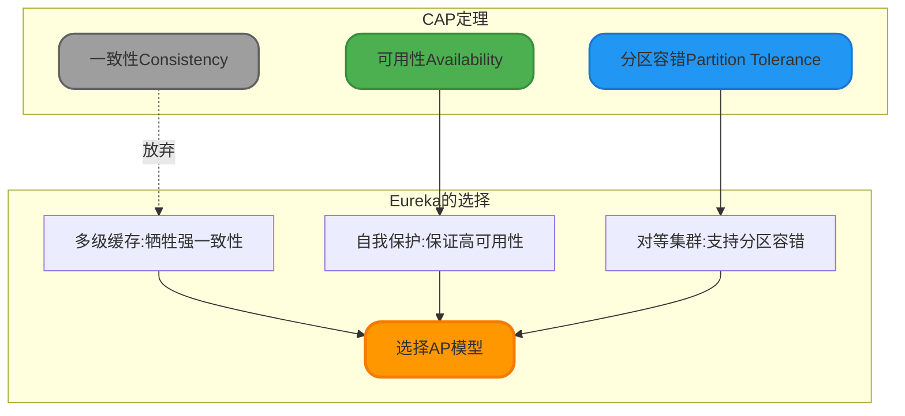

# Eureka核心机制深度解析

## Eureka架构概述

Eureka是Netflix开源的服务注册与发现组件,在SpringCloud微服务体系中扮演着"服务注册中心"的核心角色。它采用C/S架构设计,通过客户端与服务端的协同工作,实现了服务实例的自动注册、健康检测和动态发现功能。

在分布式环境中,Eureka面临着网络波动、节点故障等复杂场景的挑战。为了保证系统的高可用性,Eureka在设计上做了诸多权衡和优化,其中最核心的两个机制就是**多级缓存架构**和**自我保护模式**。

下面我们将深入剖析这两大核心机制的设计原理和实现细节。

## Eureka的多级缓存架构

### 为什么需要多级缓存

在大规模微服务集群中,服务发现的请求量往往非常巨大。假设有100个服务实例,每个实例每30秒拉取一次服务列表,那么Eureka Server每秒需要处理约3次请求。当服务规模扩展到上千个实例时,单纯依赖注册表的读写会成为性能瓶颈。

Eureka通过引入多级缓存机制,实现了读写分离和数据分层,在保证数据最终一致性的前提下,大幅提升了服务发现的响应速度,降低了注册中心的负载压力。

### 三层缓存的设计架构

Eureka的缓存体系由三个层次组成,从底层到上层分别是:注册表(Registry)、读写缓存(ReadWriteCacheMap)、只读缓存(ReadOnlyCacheMap)。



### 各层缓存的职责分工

#### 第一层:Registry注册表

Registry是整个Eureka Server的核心数据结构,存储着所有服务实例的完整信息,包括服务名称、主机地址、端口号、健康状态、元数据等。它采用`ConcurrentHashMap`实现,支持高并发的读写操作。

**核心特性**:
- **实时性保证**:当服务实例发起注册、续约(心跳)、注销操作时,Registry会立即更新
- **权威数据源**:所有其他缓存层的数据最终都来源于Registry
- **定期清理**:后台定时任务每隔90秒扫描一次,剔除超过90秒未续约的实例

**数据写入场景**:
```java
// 服务注册时的伪代码逻辑
public void register(InstanceInfo instance) {
    // 1. 写入Registry注册表
    registry.put(instance.getAppName(), instance);
    
    // 2. 触发缓存失效,强制ReadWriteCache从Registry重新加载
    invalidateCache(instance.getAppName());
    
    // 3. 记录最近变更队列,用于增量拉取
    recentChangeQueue.add(new RecentChange(instance, ADD));
}
```

#### 第二层:ReadWriteCacheMap读写缓存

ReadWriteCacheMap作为中间缓存层,基于Google Guava的`LoadingCache`实现。它的主要作用是减少对底层Registry的频繁访问,提供更快的数据读取能力。

**核心特性**:
- **自动加载**:当缓存未命中时,会自动从Registry加载最新数据
- **定时过期**:默认180秒后缓存失效,下次访问时重新加载
- **写入穿透**:Registry数据变更时,会主动失效对应的缓存条目

**缓存加载逻辑**:
```java
// LoadingCache的加载器配置
LoadingCache<Key, Value> readWriteCache = CacheBuilder.newBuilder()
    .expireAfterWrite(180, TimeUnit.SECONDS)  // 写入后180秒过期
    .build(new CacheLoader<Key, Value>() {
        @Override
        public Value load(Key key) throws Exception {
            // 从Registry加载最新数据
            return generatePayloadFromRegistry(key);
        }
    });
```

#### 第三层:ReadOnlyCacheMap只读缓存

ReadOnlyCacheMap是面向客户端查询的最外层缓存,使用`ConcurrentHashMap`存储服务列表的只读快照。

**核心特性**:
- **纯读操作**:客户端的服务发现请求直接读取该缓存,无任何写入操作
- **定时同步**:后台定时任务每隔30秒从ReadWriteCacheMap获取最新快照并更新
- **高性能**:避免了GuavaCache的复杂逻辑,提供极致的读取性能

**同步机制**:
```java
// 定时任务:每30秒执行一次
private void syncFromReadWriteCache() {
    for (Key key : readWriteCacheMap.keySet()) {
        Value cachedValue = readWriteCacheMap.get(key);
        Value currentValue = readOnlyCacheMap.get(key);
        
        // 只有数据变化时才更新
        if (!cachedValue.equals(currentValue)) {
            readOnlyCacheMap.put(key, cachedValue);
        }
    }
}
```

### 缓存层级对比总结

| 缓存层级 | 数据结构 | 更新时机 | 数据新鲜度 | 访问场景 |
|---------|---------|---------|-----------|---------|
| **Registry** | ConcurrentHashMap | 服务注册/续约/下线时实时更新 | 最新 | 写操作和缓存加载的数据源 |
| **ReadWriteCacheMap** | Guava LoadingCache | Registry变更时立即失效;<br/>180秒自动过期 | 较新 | ReadOnlyCache定期同步的数据源 |
| **ReadOnlyCacheMap** | ConcurrentHashMap | 定时任务每30秒同步一次 | 有30秒延迟 | 客户端服务发现请求 |

### 数据同步的完整时序



### 为什么选择最终一致性

Eureka的多级缓存设计牺牲了强一致性,换取了高可用性和高性能,这正是CAP定理中的AP选择(可用性 + 分区容错性)。

**一致性代价**:
- 服务注册后,消费者可能需要最多30秒才能感知到新实例(ReadOnlyCache同步周期)
- 服务下线后,可能仍会被消费者调用一段时间(缓存过期前)

**可接受的理由**:
1. **重试机制兜底**:Ribbon等客户端负载均衡组件具备重试能力,即使拿到过期实例也能快速切换
2. **心跳检测保障**:Eureka通过心跳机制,90秒内未续约的实例会被Registry剔除
3. **性能提升显著**:多级缓存使Eureka能轻松支撑上万实例的服务发现,QPS可达数万级别

## Eureka的自我保护模式

### 自我保护的设计初衷

在分布式系统中,网络分区(Network Partition)是一个常见但难以避免的问题。当Eureka Server与大量客户端之间出现网络抖动时,可能会出现以下误判场景:

- 实际情况:网络暂时不稳定,但服务实例都在正常运行
- Eureka误判:大量实例心跳超时,将其标记为故障并从注册表剔除
- 严重后果:本来健康的服务被错误下线,导致消费者无法调用,引发大面积故障

为了避免这种"宁可错杀一千"的激进策略,Eureka引入了**自我保护模式**(Self-Preservation Mode),在网络异常时选择"保守"策略——宁可保留可能已下线的实例,也不轻易剔除疑似故障的节点。

### 自我保护的触发条件

Eureka Server会实时统计最近一段时间内收到的心跳续约次数,并与期望值进行比较。当实际续约次数低于期望值的**85%**时,系统判定发生了网络分区,自动进入自我保护模式。

**触发阈值计算公式**:
```
期望续约次数 = 注册实例总数 × 2(每分钟2次心跳) × 续约百分比阈值(默认0.85)

示例:
- 注册实例数:100个
- 每分钟心跳:2次
- 阈值:85%
- 期望续约次数 = 100 × 2 × 0.85 = 170次/分钟
```

**判断逻辑可视化**:


### 自我保护模式下的行为表现

当Eureka进入自我保护模式后,会产生以下三种关键行为:

#### 1. 暂停服务实例剔除

在自我保护期间,即使某个实例长时间未发送心跳,Eureka Server也不会将其从注册表中移除。这意味着:
- 过期实例仍会出现在服务列表中
- 消费者可能会拿到已下线实例的地址
- 需要依赖客户端的容错机制(如Ribbon重试)来规避调用失败

**代码层面的体现**:
```java
// 伪代码:实例过期检测逻辑
public void evict() {
    if (!isInSelfPreservationMode()) {
        // 正常模式:剔除90秒未续约的实例
        for (InstanceInfo instance : registry.values()) {
            if (isExpired(instance)) {
                registry.remove(instance.getId());
            }
        }
    } else {
        // 自我保护模式:不执行任何剔除操作
        logger.warn("Server in self-preservation mode, renewals are lesser than threshold");
    }
}
```

#### 2. 保留完整的服务注册表

自我保护模式会冻结当前的服务注册表状态,确保:
- 所有历史注册的实例都保持可见
- 新实例仍可正常注册
- 已注销的实例不会立即生效(等待保护模式解除)

这种设计基于一个假设:在网络分区场景下,保留"可能有效"的服务信息,比丢失"可能可用"的服务更安全。

#### 3. 显示警告标识

Eureka Server的管理界面会显著展示自我保护状态的警告信息,提醒运维人员关注:

```
EMERGENCY! EUREKA MAY BE INCORRECTLY CLAIMING INSTANCES ARE UP WHEN THEY'RE NOT. 
RENEWALS ARE LESSER THAN THRESHOLD AND HENCE THE INSTANCES ARE NOT BEING EXPIRED 
JUST TO BE SAFE.
```

警告内容翻译:**紧急情况!Eureka可能错误地声称实例在线,实际上它们可能已下线。由于续约数低于阈值,为了安全起见,实例不会被剔除。**

### 自我保护的配置管理

Eureka提供了灵活的配置项来控制自我保护行为:

```yaml
# application.yml配置示例
eureka:
  server:
    # 是否开启自我保护模式(默认:true)
    enable-self-preservation: true
    
    # 触发自我保护的续约百分比阈值(默认:0.85)
    renewal-percent-threshold: 0.85
    
    # 期望续约间隔(默认:30秒)
    expected-client-renewal-interval-seconds: 30
    
    # 剔除间隔(默认:60秒)
    eviction-interval-timer-in-ms: 60000
```

**配置建议**:
- **生产环境**:强烈建议保持`enable-self-preservation: true`,避免网络抖动引发雪崩
- **测试环境**:可设置为`false`,方便快速测试实例上下线效果
- **阈值调整**:如果集群规模较小(少于5个实例),可适当降低`renewal-percent-threshold`至0.5

### 如何解除自我保护模式

当Eureka Server进入自我保护后,可以通过以下方式恢复正常:

#### 方法一:等待网络自愈(推荐)

自我保护是一种临时防御机制,当网络恢复稳定、心跳续约数回升到阈值以上时,Eureka会自动退出保护模式并恢复正常的实例剔除逻辑。



#### 方法二:检查客户端健康状态

如果自我保护持续时间过长,需要排查服务实例的运行情况:

```bash
# 1. 检查服务实例是否正常运行
ps aux | grep java

# 2. 验证实例与Eureka Server的网络连通性
telnet eureka-server-host 8761

# 3. 查看实例日志中的心跳发送记录
tail -f /var/log/app.log | grep "DiscoveryClient_"

# 4. 检查防火墙规则是否阻断了心跳端口
iptables -L -n | grep 8761
```

#### 方法三:调整触发阈值

如果业务场景下实例数量波动较大,可以临时降低保护阈值:

```yaml
eureka:
  server:
    # 降低到50%,适用于频繁扩缩容的场景
    renewal-percent-threshold: 0.5
```

#### 方法四:重启Eureka Server

**谨慎使用!** 重启会导致:
- 所有服务实例需要重新注册
- 短时间内服务发现不可用
- 可能触发客户端的failover切换

```bash
# 重启前务必评估影响范围
systemctl restart eureka-server
```

#### 方法五:临时关闭自我保护(仅限测试)

```yaml
eureka:
  server:
    # 警告:生产环境禁用!
    enable-self-preservation: false
```

**风险提示**:关闭自我保护后,网络抖动会导致大量服务被误剔除,引发雪崩效应。

### 自我保护的利弊权衡



**最佳实践**:
1. 生产环境保持自我保护开启
2. 客户端必须实现调用超时和重试逻辑
3. 配合Spring Boot Actuator的健康检查端点
4. 监控Eureka的`renewsLastMin`指标,提前预警

## CAP定理在Eureka中的体现

通过上述两大核心机制的分析,我们可以清晰地看到Eureka在CAP三角中的权衡选择:



**Eureka vs Zookeeper 对比**:

| 特性 | Eureka | Zookeeper |
|-----|--------|-----------|
| **CAP选择** | AP(可用性优先) | CP(一致性优先) |
| **数据一致性** | 最终一致性,存在延迟 | 强一致性,实时同步 |
| **网络分区处理** | 自我保护,保留旧数据 | 主节点失联,服务不可用 |
| **性能表现** | 高吞吐,低延迟 | 写入性能较低 |
| **适用场景** | 互联网高并发服务 | 金融等强一致性场景 |

## 总结与生产实践建议

Eureka通过**多级缓存**和**自我保护**两大核心机制,构建了一个高可用、高性能的服务注册中心。理解这些机制的设计原理,有助于我们在生产环境中做出正确的配置决策:

### 配置推荐清单

**Eureka Server端配置**:
```yaml
eureka:
  server:
    # 启用自我保护
    enable-self-preservation: true
    renewal-percent-threshold: 0.85
    
    # 缓存更新频率(默认30秒)
    response-cache-update-interval-ms: 30000
    
    # 是否启用只读缓存(建议开启)
    use-read-only-response-cache: true
    
  instance:
    # 服务实例续约间隔(默认30秒)
    lease-renewal-interval-in-seconds: 30
    
    # 服务实例过期时间(默认90秒)
    lease-expiration-duration-in-seconds: 90
```

**Eureka Client端配置**:
```yaml
eureka:
  client:
    # 从Server拉取注册表的频率(默认30秒)
    registry-fetch-interval-seconds: 30
    
    # 启用增量拉取(减少网络开销)
    disable-delta: false
    
  instance:
    # 启用健康检查
    health-check-url-path: /actuator/health
```

### 监控指标关注点

建议通过Prometheus + Grafana监控以下关键指标:

1. **续约率(Renews/min)**:低于阈值会触发自我保护
2. **注册实例数(Registered Instances)**:异常波动需排查
3. **可用区状态(Replicas)**:集群节点健康度
4. **缓存命中率**:ReadOnlyCache的性能表现

通过深入理解Eureka的内部机制,我们能够在享受其高可用特性的同时,规避潜在的一致性陷阱,构建更加稳定可靠的微服务体系。
