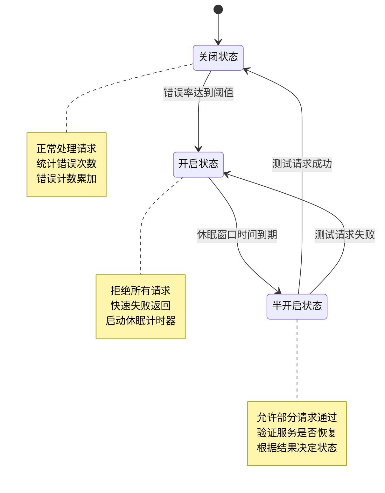
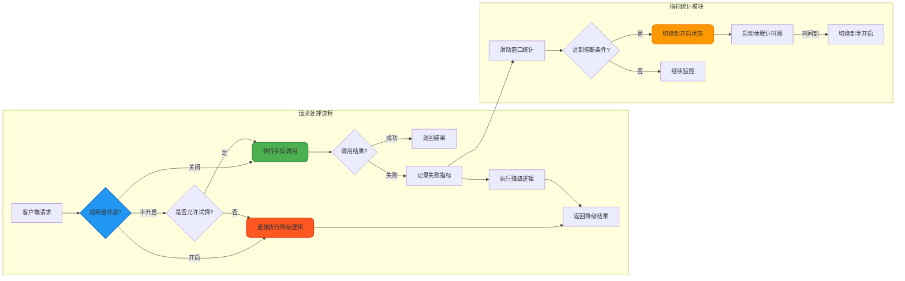
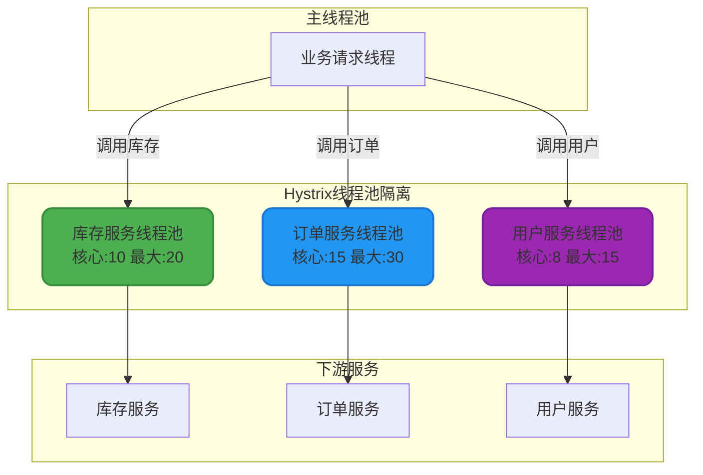
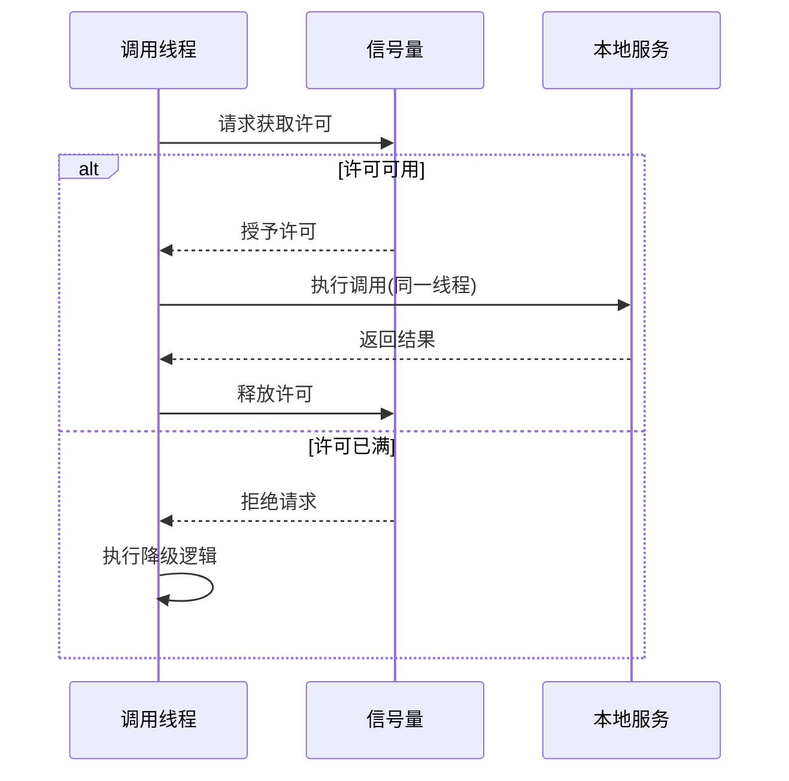
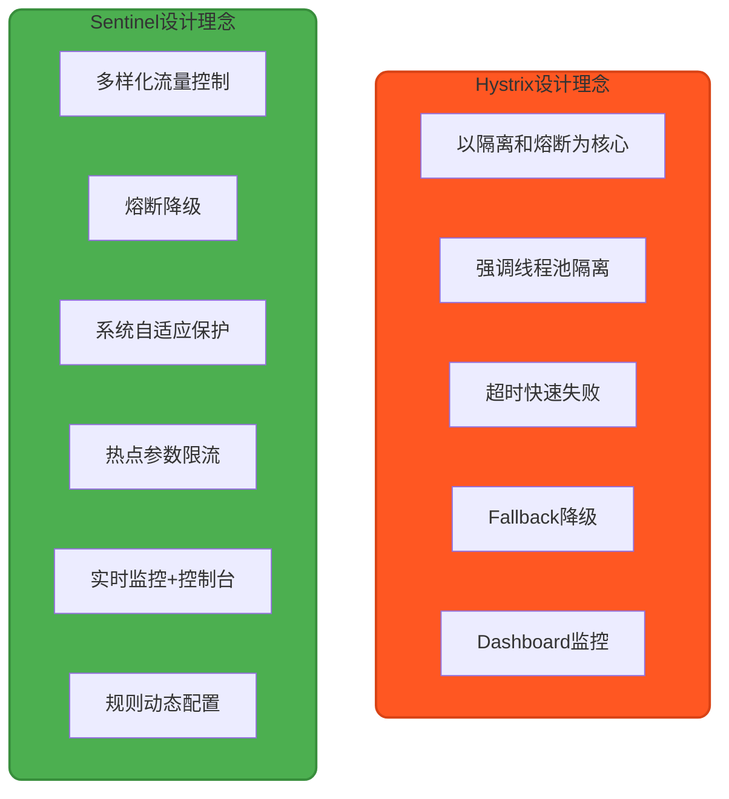

# Hystrix熔断与容错机制详解

## Hystrix容错设计理念

在分布式微服务架构中,服务间的依赖调用不可避免。当某个依赖服务出现故障或响应缓慢时,如果没有有效的容错机制,故障会像雪崩一样在整个调用链路中蔓延,最终导致整个系统崩溃。这就是著名的"雪崩效应"。

Hystrix是Netflix开源的容错框架,它借鉴了电路系统中"断路器"的设计思想,为微服务提供延迟和容错保护。通过隔离服务访问点、停止级联故障以及提供降级方案,Hystrix能够显著提升分布式系统的稳定性和弹性。

Hystrix的核心能力包括:
- **熔断保护**:自动检测故障并快速失败,防止系统资源被耗尽
- **资源隔离**:通过线程池或信号量机制,隔离不同依赖服务的调用
- **降级策略**:当服务不可用时,执行备用逻辑,保证系统部分可用
- **实时监控**:提供丰富的指标数据,帮助运维人员快速定位问题

## 熔断器工作原理

### 熔断器状态机制

Hystrix熔断器采用状态机模式进行管理,主要包含三种状态:关闭(Closed)、开启(Open)和半开启(Half-Open)。这三种状态通过内部的计数器和定时器进行自动切换。



### 状态转换详解

**关闭状态(Closed)**

这是熔断器的初始状态和正常工作状态。在此状态下,熔断器允许所有请求正常通过,同时在内部维护一个滑动窗口来统计请求的成功和失败次数。

关键机制:
- 每次调用失败时,失败计数器自动递增
- 当失败次数或失败率达到预设阈值时,触发状态切换
- 同时启动一个休眠窗口计时器,为后续恢复做准备

**开启状态(Open)**

当错误率超过阈值后,熔断器进入开启状态。此时系统采取快速失败策略,所有请求会被立即拒绝,不再调用实际的服务,而是直接执行降级逻辑或抛出异常。

这种设计的目的是:
- 避免持续请求故障服务,防止线程资源被耗尽
- 给下游服务留出恢复时间,减轻其负载压力
- 保护调用方不被长时间阻塞,提升整体响应速度

**半开启状态(Half-Open)**

在开启状态持续一段时间后(休眠窗口期结束),熔断器会自动切换到半开启状态。这是一个试探性的恢复阶段,系统会放行少量请求到下游服务,检验其是否已经恢复正常。

恢复判断机制:
- 如果试探请求全部成功,说明服务已恢复,熔断器切换回关闭状态并重置计数器
- 如果试探请求中有任何失败,立即切回开启状态,重新开始休眠窗口计时
- 这种渐进式恢复策略,避免了大量请求同时涌入刚恢复的服务

### 熔断触发条件

Hystrix通过多个维度的指标来综合判断是否需要开启熔断器,主要包括:

**请求量阈值(Request Volume Threshold)**

在滑动时间窗口内,只有当请求总数超过设定的最小值时,才会进行熔断判断。这个设计避免了在低流量场景下,因个别请求失败就触发熔断的误判情况。

默认配置: 10秒窗口内至少20个请求

**错误百分比阈值(Error Percentage Threshold)**

计算在时间窗口内,失败请求占总请求的百分比。失败的定义包括:
- 抛出异常的请求
- 超时的请求
- 线程池拒绝的请求
- 信号量拒绝的请求

默认配置: 错误率超过50%触发熔断

**休眠窗口时间(Sleep Window)**

熔断器开启后,需要等待一段时间才能进入半开启状态。这个等待期给下游服务提供了充分的恢复时间。

默认配置: 5秒

### 熔断器数据流转



### 熔断机制的价值

引入熔断器后,微服务系统将自动具备以下能力:

**快速失败**

当下游服务频繁失败时,熔断器立即开启,上游服务不再等待超时,而是快速返回。这避免了大量线程被长时间阻塞,防止资源耗尽导致的系统雪崩。

**自动恢复**

熔断器通过半开启状态的试探机制,能够自动检测下游服务的恢复情况。一旦服务恢复正常,调用链路会自动恢复,无需人工干预。

**系统稳定性保障**

即使部分依赖服务不可用,通过降级机制,核心业务仍然可以继续运行。这种优雅降级的设计思想,保证了系统在故障场景下的部分可用性。

## Hystrix代码实战

### 环境依赖配置

在Spring Boot项目中使用Hystrix,首先需要添加相关依赖。以Maven项目为例,在`pom.xml`中添加:

```xml
<dependencies>
    <!-- Spring Cloud Hystrix核心依赖 -->
    <dependency>
        <groupId>org.springframework.cloud</groupId>
        <artifactId>spring-cloud-starter-netflix-hystrix</artifactId>
        <version>2.2.10.RELEASE</version>
    </dependency>
    
    <!-- 用于仪表盘监控(可选) -->
    <dependency>
        <groupId>com.netflix.hystrix</groupId>
        <artifactId>hystrix-core</artifactId>
        <version>1.5.18</version>
    </dependency>
</dependencies>
```

### 创建Hystrix命令类

假设我们有一个电商系统,需要调用库存服务查询商品库存。我们使用Hystrix来保护这个远程调用,避免库存服务故障影响主流程。

```java
import com.netflix.hystrix.HystrixCommand;
import com.netflix.hystrix.HystrixCommandGroupKey;
import com.netflix.hystrix.HystrixCommandProperties;

public class QueryInventoryCommand extends HystrixCommand<Integer> {
    private final String productId;
    
    public QueryInventoryCommand(String productId) {
        super(Setter.withGroupKey(HystrixCommandGroupKey.Factory.asKey("InventoryServiceGroup"))
                .andCommandPropertiesDefaults(
                    HystrixCommandProperties.Setter()
                        // 设置超时时间为2秒
                        .withExecutionTimeoutInMilliseconds(2000)
                        // 错误率超过60%触发熔断
                        .withCircuitBreakerErrorThresholdPercentage(60)
                        // 10秒窗口内至少15个请求才进行熔断判断
                        .withCircuitBreakerRequestVolumeThreshold(15)
                        // 熔断后5秒进入半开启状态
                        .withCircuitBreakerSleepWindowInMilliseconds(5000)
                ));
        this.productId = productId;
    }
    
    @Override
    protected Integer run() throws Exception {
        // 调用远程库存服务
        return inventoryServiceClient.getStock(productId);
    }
    
    @Override
    protected Integer getFallback() {
        // 降级逻辑:返回默认库存值-1,前端可根据此值显示"库存查询失败"
        System.out.println("库存服务调用失败,执行降级策略,商品ID:" + productId);
        return -1;
    }
    
    private InventoryServiceClient inventoryServiceClient = new InventoryServiceClient();
    
    // 模拟库存服务客户端
    static class InventoryServiceClient {
        public Integer getStock(String productId) throws Exception {
            // 实际项目中这里应该是HTTP调用、RPC调用等
            // 这里仅作演示,模拟可能失败的远程调用
            if (Math.random() > 0.7) {
                throw new Exception("库存服务暂时不可用");
            }
            return 100; // 返回库存数量
        }
    }
}
```

### 使用Hystrix命令

在业务代码中调用Hystrix命令非常简单:

```java
public class ProductService {
    /**
     * 查询商品库存信息
     * @param productId 商品ID
     * @return 库存数量,-1表示查询失败
     */
    public Integer getProductStock(String productId) {
        // 创建Hystrix命令实例
        QueryInventoryCommand command = new QueryInventoryCommand(productId);
        
        // 同步执行命令
        return command.execute();
        
        // 也可以异步执行
        // Future<Integer> future = command.queue();
        // return future.get();
    }
}
```

### 配置说明

上述代码中涉及的关键配置参数解释:

| 配置项 | 说明 | 默认值 | 示例值 |
|-------|------|--------|--------|
| executionTimeoutInMilliseconds | 命令执行超时时间 | 1000ms | 2000ms |
| circuitBreakerErrorThresholdPercentage | 触发熔断的错误率阈值 | 50% | 60% |
| circuitBreakerRequestVolumeThreshold | 熔断判断的最小请求数 | 20 | 15 |
| circuitBreakerSleepWindowInMilliseconds | 熔断后的休眠窗口时间 | 5000ms | 5000ms |

## 资源隔离策略

### 隔离机制的必要性

在微服务架构中,一个应用通常需要调用多个下游服务。如果所有服务调用共享同一个线程池,当某个慢服务占用大量线程时,会导致其他正常服务的调用也无法获取线程资源,最终引发整体性能下降。

Hystrix提供了两种资源隔离策略,确保不同服务的调用互不影响,实现故障隔离。

### 线程池隔离(Thread Pool Isolation)

这是Hystrix的默认策略,也是生产环境中最常用的方式。每个HystrixCommand或服务依赖都在独立的线程池中执行,线程池之间完全隔离。

**工作原理**:



**优势特点**:
- **完全隔离**:不同服务的线程池互不干扰,一个服务的故障不会影响其他服务
- **异步执行**:支持超时控制,即使下游服务挂起,也能及时释放调用线程
- **并发控制**:通过线程池大小和队列长度,精确控制每个服务的并发访问量

**代码示例**:

```java
import com.netflix.hystrix.HystrixCommand;
import com.netflix.hystrix.HystrixCommandGroupKey;
import com.netflix.hystrix.HystrixThreadPoolProperties;

public class OrderServiceCommand extends HystrixCommand<String> {
    
    private final String orderId;
    
    protected OrderServiceCommand(String orderId) {
        super(Setter.withGroupKey(HystrixCommandGroupKey.Factory.asKey("OrderGroup"))
                // 配置线程池属性
                .andThreadPoolPropertiesDefaults(HystrixThreadPoolProperties.Setter()
                        .withCoreSize(15)              // 核心线程数
                        .withMaximumSize(30)           // 最大线程数
                        .withMaxQueueSize(10)          // 任务队列大小
                        .withQueueSizeRejectionThreshold(8)  // 队列拒绝阈值
                        .withKeepAliveTimeMinutes(2))  // 线程存活时间
                .andCommandPropertiesDefaults(
                    HystrixCommandProperties.Setter()
                        .withExecutionTimeoutInMilliseconds(3000)
                ));
        this.orderId = orderId;
    }
    
    @Override
    protected String run() throws Exception {
        // 在独立线程池中执行订单服务调用
        return orderServiceClient.queryOrderDetail(orderId);
    }
    
    @Override
    protected String getFallback() {
        return "订单服务暂时不可用,请稍后重试";
    }
    
    private OrderServiceClient orderServiceClient = new OrderServiceClient();
    
    static class OrderServiceClient {
        public String queryOrderDetail(String orderId) {
            // 模拟远程调用
            return "Order-" + orderId + "-Details";
        }
    }
}
```

### 信号量隔离(Semaphore Isolation)

信号量隔离使用Java并发包中的`Semaphore`机制来限制并发访问数量,不创建额外的线程,直接在调用线程中执行。

**工作原理**:



**优势特点**:
- **轻量高效**:没有线程切换和上下文切换的开销,性能更优
- **资源节省**:不创建额外线程池,降低内存消耗
- **适用场景**:适合调用本地缓存、内存数据库等低延迟操作

**代码示例**:

```java
import com.netflix.hystrix.HystrixCommand;
import com.netflix.hystrix.HystrixCommandGroupKey;
import com.netflix.hystrix.HystrixCommandProperties;

public class CacheServiceCommand extends HystrixCommand<String> {
    
    private final String cacheKey;
    
    protected CacheServiceCommand(String cacheKey) {
        super(Setter.withGroupKey(HystrixCommandGroupKey.Factory.asKey("CacheGroup"))
                .andCommandPropertiesDefaults(
                    HystrixCommandProperties.Setter()
                        // 设置隔离策略为信号量
                        .withExecutionIsolationStrategy(
                            HystrixCommandProperties.ExecutionIsolationStrategy.SEMAPHORE)
                        // 设置信号量最大并发数
                        .withExecutionIsolationSemaphoreMaxConcurrentRequests(10)
                        .withExecutionTimeoutInMilliseconds(500)
                ));
        this.cacheKey = cacheKey;
    }
    
    @Override
    protected String run() throws Exception {
        // 在调用线程中直接执行,访问本地缓存
        return localCache.get(cacheKey);
    }
    
    @Override
    protected String getFallback() {
        return "缓存访问失败,返回默认值";
    }
    
    private LocalCache localCache = new LocalCache();
    
    static class LocalCache {
        public String get(String key) {
            // 模拟本地缓存访问
            return "cached-value-" + key;
        }
    }
}
```

### 两种策略对比

| 对比维度 | 线程池隔离 | 信号量隔离 |
|---------|-----------|------------|
| **资源消耗** | 较高(需创建线程池) | 低(仅计数器) |
| **性能开销** | 有线程切换开销 | 几乎无开销 |
| **超时支持** | 完全支持 | 不支持主动中断 |
| **异步执行** | 支持 | 不支持 |
| **适用场景** | 外部HTTP/RPC调用 | 本地内存/缓存访问 |
| **隔离级别** | 完全隔离 | 计数隔离 |
| **推荐度** | ⭐⭐⭐⭐⭐ | ⭐⭐⭐ |

### 选择建议

在实际项目中,**99%的场景应该选择线程池隔离**,原因如下:

1. **网络调用不可控**:外部服务的响应时间难以预测,线程池隔离能提供更可靠的超时保护
2. **故障隔离彻底**:即使某个服务完全挂起,也只会耗尽该服务的线程池,不影响其他业务
3. **并发控制精准**:可以根据下游服务的承载能力,为每个服务配置不同的线程池大小

仅在以下极少数场景考虑信号量隔离:
- 访问本地内存缓存(如Caffeine、Guava Cache)
- 读取应用内的共享数据结构
- 调用同JVM内的其他模块(且确保低延迟)

## Hystrix与Sentinel对比

### 技术选型背景

Hystrix和Sentinel都是SpringCloud生态中用于实现限流、降级和熔断的容错组件。虽然目标相似,但两者在设计理念、功能特性和社区活跃度上存在显著差异。

**重要提示**: Netflix官方已于2018年宣布Hystrix进入维护模式,不再开发新功能。而Sentinel由阿里巴巴开源,社区活跃,持续更新,已成为云原生时代的主流选择。

### 核心差异对比



### 详细功能对比

| 对比维度 | Hystrix | Sentinel |
|---------|---------|----------|
| **核心定位** | 隔离与熔断为主的容错框架 | 流量控制+熔断降级+系统保护的综合方案 |
| **隔离策略** | 线程池隔离、信号量隔离 | 信号量隔离(轻量级) |
| **熔断降级** | 基于异常比例和响应时间 | 支持慢调用比例、异常比例、异常数多种策略 |
| **限流算法** | 不支持 | 支持QPS限流、并发线程数限流、冷启动、匀速排队等 |
| **实时监控** | Hystrix Dashboard(基础) | Sentinel Dashboard(功能强大,支持规则推送) |
| **规则配置** | 硬编码或配置文件 | 支持动态规则推送(Nacos、Apollo、ZK等) |
| **框架集成** | 注解+命令模式 | 注解、SPI扩展点丰富 |
| **性能开销** | 线程池隔离开销较大 | 轻量级,性能损耗极小 |
| **社区活跃度** | 已停止更新(维护模式) | 持续迭代,社区活跃 |
| **适用场景** | 传统SpringCloud微服务 | 云原生、高并发、需要精细流控的场景 |

### Sentinel的优势特性

**1. 丰富的流量控制手段**

Sentinel提供了多种流量整形算法,可以应对不同的业务场景:

- **直接拒绝模式**:QPS超过阈值后直接拒绝新请求
- **Warm Up预热模式**:系统启动时逐步提升限流阈值,避免冷启动压垮系统
- **匀速排队模式**:让请求以固定速率通过,适合消息队列等场景
- **热点参数限流**:针对特定参数值进行精细化限流(如限制某个商品ID的访问)

**2. 系统自适应保护**

Sentinel可以根据系统的整体负载(CPU使用率、系统负载、入口QPS、线程数等)自动调整限流阈值,防止系统被压垮。这是Hystrix不具备的能力。

**3. 实时规则动态推送**

Sentinel支持通过控制台实时修改限流、降级规则,并立即生效,无需重启应用。可以与Nacos、Apollo等配置中心集成,实现规则的持久化和版本管理。

**4. 强大的可视化监控**

Sentinel Dashboard提供了比Hystrix Dashboard更丰富的监控能力:
- 实时查看QPS、响应时间、拒绝数等指标
- 可视化配置和推送规则
- 支持集群流控,多个实例共享限流配额

### 迁移建议

对于新项目:
- **强烈推荐使用Sentinel**,它代表了容错治理的最新实践,功能更全面,性能更优

对于老项目:
- 如果已使用Hystrix且运行稳定,可以继续使用,但要规划逐步迁移到Sentinel的路线
- Sentinel提供了与Hystrix注解兼容的适配层,迁移成本可控

技术趋势:
- Hystrix已停止更新,未来不会有新功能和Bug修复
- Sentinel已成为SpringCloud Alibaba的官方推荐组件
- Kubernetes、Service Mesh等云原生技术栈更倾向于在基础设施层实现流量治理,但应用层仍需要Sentinel这样的精细化控制

## 最佳实践建议

### Hystrix配置优化

**1. 合理设置超时时间**

超时时间应该根据依赖服务的P99响应时间设置,避免过短(频繁超时)或过长(故障时阻塞过久):

```java
HystrixCommandProperties.Setter()
    .withExecutionTimeoutInMilliseconds(3000)  // 建议设置为P99响应时间的1.5-2倍
```

**2. 线程池大小计算公式**

线程池核心大小建议参考以下公式:
```
核心线程数 = (每秒请求峰值 × P99响应时间) / 1000
```

例如:峰值QPS=100,P99响应时间=200ms,则核心线程数=100×0.2=20

**3. 熔断阈值设定**

- 错误率阈值:建议设置为50%-70%之间,过低容易误触发
- 请求量阈值:设置为每秒QPS的1-2倍,避免低流量时误判

### 降级策略设计

**1. 多级降级方案**

设计降级逻辑时,应该提供多个降级层次:

- **一级降级**:返回缓存数据
- **二级降级**:返回默认值或兜底数据
- **三级降级**:返回友好提示信息

**2. 降级数据准备**

对于核心业务,应提前准备好降级数据:
- 商品详情:缓存热门商品的基础信息
- 推荐服务:预置通用推荐列表
- 库存服务:默认显示"库存充足",避免影响下单

### 监控与告警

**1. 关键指标监控**

必须监控的Hystrix指标:
- 熔断器状态变化(关闭→开启)
- 请求失败率趋势
- 线程池使用率
- 降级执行次数

**2. 告警规则**

建议配置的告警规则:
- 熔断器开启时立即告警
- 线程池使用率超过80%预警
- 降级执行占比超过20%告警

## 总结

Hystrix作为微服务容错领域的先驱框架,其熔断器设计思想和资源隔离机制至今仍具有很高的参考价值。通过合理配置熔断阈值、选择恰当的隔离策略、设计完善的降级方案,可以显著提升分布式系统的稳定性和用户体验。

核心要点回顾:
1. **熔断器三态模型**:通过关闭、开启、半开启状态的自动切换,实现故障的快速隔离和自动恢复
2. **线程池隔离优先**:99%场景应使用线程池隔离,确保不同服务调用的完全隔离
3. **合理降级设计**:降级不是简单返回错误,而是提供可接受的替代方案
4. **技术演进方向**:对于新项目,建议优先考虑Sentinel,它代表了容错治理的最新实践

在微服务架构日益复杂的今天,容错能力已经成为系统设计的基础要求。掌握Hystrix的核心原理,并结合实际业务场景灵活应用,才能构建真正高可用的分布式系统。