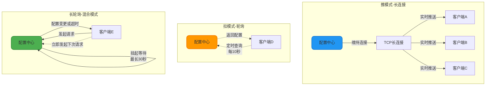
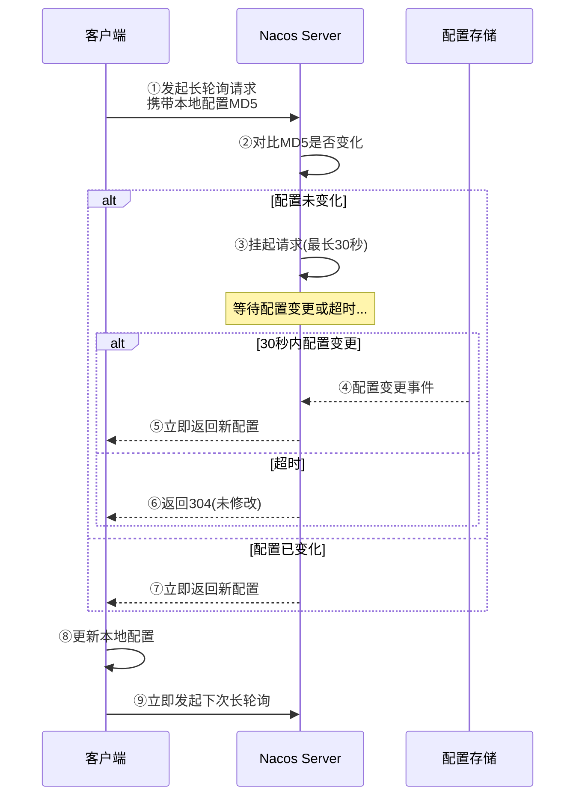
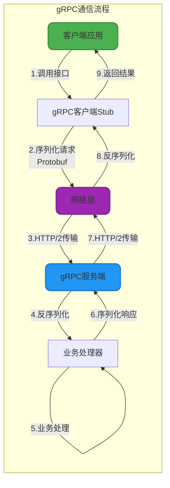

# Nacos配置中心实现原理与通信机制

## 配置中心核心价值

在传统的单体应用时代,配置信息通常存储在应用程序的配置文件中(如`application.properties`),这种方式在微服务架构下暴露出诸多问题:

**配置分散管理**: 数十上百个微服务各自维护配置文件,配置散落在各个代码仓库,管理和维护成本高昂。

**变更需要重启**: 修改配置需要重新打包、发布、重启应用,变更周期长,无法快速响应业务需求。

**环境配置混乱**: 开发、测试、生产环境的配置容易混淆,误操作风险高。

**缺乏审计能力**: 配置变更无法追溯,出现问题难以定位和回滚。

Nacos配置中心通过集中式配置管理解决了上述痛点,提供了动态配置推送、版本管理、灰度发布等企业级能力。

## 配置变更感知机制

配置中心的核心挑战是:如何让客户端实时感知到配置的变化?业界主要有两种技术方案:推(Push)和拉(Pull)。

### 推拉模式对比



**推模式(长连接)**

配置中心与客户端建立TCP长连接,当配置发生变化时,服务端立即通过连接推送最新配置。

**优势**:
- 实时性极高,配置变更秒级生效
- 客户端无需主动轮询,节省资源

**劣势**:
- 服务端需要维护大量长连接,内存和CPU消耗高
- 网络抖动时连接容易断开,需要复杂的重连机制
- 在大规模集群下(数万客户端)连接数成为瓶颈

**拉模式(轮询)**

客户端定时向配置中心发起HTTP请求,查询配置是否变化。

**优势**:
- 实现简单,无需维护连接状态
- 服务端压力相对均匀

**劣势**:
- 实时性差,轮询间隔越短实时性越好,但会增加服务端压力
- 大量无效请求,99%的轮询请求返回"配置未变化"
- 网络带宽浪费

### Nacos 1.x的长轮询方案

Nacos 1.x版本创新性地采用了**长轮询(Long Polling)**机制,巧妙地结合了推拉两种模式的优势。



**核心流程解析**:

**①发起长轮询请求**: 客户端向Nacos Server发送HTTP请求,携带本地配置文件的MD5值。请求参数中包含需要监听的配置项列表(dataId、group等)。

**②-③对比并挂起**: 服务端对比客户端提交的MD5与服务端的最新MD5:
- 如果一致,说明配置未变化,将请求挂起(hold住),不立即返回
- 如果不一致,说明配置已变化,立即返回最新配置

**④-⑤配置变更推送**: 在挂起期间(最长30秒),如果配置发生变化,服务端会立即结束挂起状态,将最新配置返回给客户端。这相当于服务端"推"给客户端。

**⑥超时返回**: 如果30秒内配置未发生变化,服务端返回HTTP 304状态码,告知客户端配置未修改。

**⑧-⑨循环监听**: 客户端收到响应后,如果配置有变化则更新本地缓存,然后立即发起下一次长轮询请求,形成持续监听。

**长轮询的优势**:

- **准实时性**: 配置变更后最多延迟30秒生效,对于配置中心场景完全可接受
- **降低服务端压力**: 相比短轮询,请求数量减少了数十倍(每30秒一次vs每秒数次)
- **避免长连接开销**: 不需要维护持久TCP连接,避免了大规模集群下的连接数瓶颈
- **网络友好**: 请求被挂起期间不占用网络带宽,只在配置变更时才传输数据

**长轮询vs长连接的区别**:

| 对比维度 | 长轮询(Long Polling) | 长连接(Persistent Connection) |
| --- | --- | --- |
| 协议层面 | 基于HTTP协议 | 基于TCP协议 |
| 连接维持 | 请求-响应后连接关闭 | 连接持续保持 |
| 数据流向 | 客户端主动发起请求 | 服务端主动推送数据 |
| 实时性 | 准实时(秒级延迟) | 真实时(毫秒级延迟) |
| 服务端压力 | 中等(挂起请求占用内存) | 高(维护大量连接) |
| 适用场景 | 配置中心、消息订阅 | IM即时通讯、行情推送 |

### Nacos 2.x的gRPC长连接升级

Nacos 2.0进行了重大架构升级,将通信层从HTTP改造为**gRPC长连接**,彻底解决了1.x版本的性能瓶颈。


#### Nacos 1.x的性能瓶颈

在Nacos 1.x的架构下,配置中心和注册中心都使用HTTP协议通信,在大规模集群环境下暴露出以下问题:

**TIME_WAIT连接堆积**: HTTP采用短连接模式,每次请求都需要创建和销毁TCP连接。TCP连接关闭后会进入TIME_WAIT状态,等待2MSL(通常2-4分钟)才会完全释放。当TPS和QPS较高时,服务端和客户端会堆积大量TIME_WAIT状态的连接,最终导致:
- `connect time out`错误(连接数达到系统上限)
- `Cannot assign requested address`错误(端口耗尽)

**频繁的内存申请和GC**: 配置模块使用HTTP长轮询模拟长连接,每30秒需要进行一次请求和响应的上下文切换。每次切换都会创建新的Request/Response对象,导致频繁的内存分配和回收,在大规模集群下引发频繁的Full GC,影响系统稳定性。

**心跳风暴**: 在服务注册场景下,每个服务实例需要每5秒发送一次心跳。在大规模集群下(如10万实例),心跳请求的TPS高达2万/秒,占用大量系统资源,造成资源空耗。

**健康检查时延**: 基于心跳的健康检查,默认需要15秒才能检测到实例不健康,30秒才会移除实例。这种时延在某些对实时性要求高的场景下难以接受。如果缩短超时时间,又会在网络抖动时频繁触发误判,增加系统抖动。

#### gRPC长连接的技术优势

Nacos 2.0引入gRPC后,带来了以下关键改进:

**真实的长连接**: 客户端与服务端建立gRPC双向流(Bidirectional Streaming),连接持续保持。配置变更、服务变更等事件可以通过长连接实时推送,无需频繁创建连接,彻底解决了TIME_WAIT问题。

**连接复用与多路复用**: gRPC基于HTTP/2协议,支持在单个TCP连接上并发处理多个请求(多路复用)。这意味着客户端只需维护少量连接,就可以处理大量并发请求,大幅降低了连接数。

**取消心跳机制**: 在长连接模式下,客户端无需定时发送心跳包,只需发送轻量级的KeepAlive消息维持连接。心跳TPS从数万降低到数百,资源消耗大幅下降。

**快速故障感知**: TCP连接断开可以被立即感知,无需等待心跳超时。当客户端异常关闭或网络中断时,服务端能在秒级内检测到并移除实例,大幅提升了故障感知速度。

**减少内存占用**: 长连接避免了频繁的对象创建和销毁,内存使用更加平稳,Full GC频率显著降低。根据阿里官方测试,相同规模下内存占用降低了50%以上。

**二进制协议**: gRPC使用Protobuf进行序列化,相比JSON等文本协议,序列化后的数据体积更小,网络传输效率更高。



#### Nacos 2.x架构改造

Nacos 2.0在保持API兼容的前提下,对底层架构进行了重大重构:

**新增连接管理层**: 引入了独立的连接层(Connection Layer),负责管理客户端连接、请求路由、流量控制等。连接层对上层业务逻辑屏蔽了通信细节,支持HTTP和gRPC两种协议,保证了平滑升级。

**请求模型统一**: 将不同协议(HTTP/gRPC)的请求统一抽象为标准的Request/Response模型,业务层无需关心底层通信协议,降低了代码复杂度。

**客户端管理优化**: 服务端使用Client对象记录每个客户端发布了哪些服务、订阅了哪些服务。当服务发生变化时,可以精准推送给相关的订阅者,避免了广播式推送的资源浪费。

**集群同步优化**: Nacos集群节点间的数据同步也改用gRPC协议,同步粒度更细(只同步变更的部分),大幅降低了集群间的网络流量和同步延迟。

#### 性能提升数据

根据阿里官方的压测数据,Nacos 2.0相比1.x版本在大规模场景下的性能提升显著:

- **内存占用**: 降低50%+
- **CPU使用率**: 降低30%+
- **心跳TPS**: 从2万/秒降至200/秒(降低99%)
- **故障感知时延**: 从30秒降至1秒内(提升30倍)
- **配置推送延迟**: 从秒级优化到毫秒级

#### gRPC的权衡

虽然gRPC带来了性能提升,但也存在一定的劣势:

**可观测性下降**: HTTP协议的请求可以通过浏览器、Postman等工具直接调试,日志也易于理解。gRPC基于二进制协议,调试和问题排查的难度更高,需要专门的工具支持。

**网络环境兼容性**: 某些老旧的网络设备(如负载均衡器、防火墙)对HTTP/2的支持不完善,可能导致gRPC连接失败。Nacos通过同时支持HTTP和gRPC两种协议,保证了兼容性。

## 配置动态刷新实现

### Spring Cloud集成示例

在Spring Cloud应用中使用Nacos配置中心,可以实现配置的动态刷新无需重启应用。

**第一步:引入依赖**

```xml
<dependency>
    <groupId>com.alibaba.cloud</groupId>
    <artifactId>spring-cloud-starter-alibaba-nacos-config</artifactId>
    <version>2022.0.0.0</version>
</dependency>
```

**第二步:配置Nacos地址**

在`bootstrap.yml`中配置Nacos Config:

```yaml
spring:
  application:
    name: email-service
  cloud:
    nacos:
      config:
        server-addr: 192.168.1.100:8848  # Nacos地址
        namespace: production  # 命名空间(环境隔离)
        group: EMAIL_GROUP  # 配置分组
        file-extension: yaml  # 配置文件格式
        refresh-enabled: true  # 开启自动刷新
```

**第三步:定义配置类**

```java
@Configuration
@ConfigurationProperties(prefix = "email")
@RefreshScope  // 关键注解:支持配置动态刷新
public class EmailConfig {
    
    private String smtpHost;
    private Integer smtpPort;
    private String username;
    private String password;
    private Integer maxRetry;
    private Integer timeout;
    
    // Getter和Setter省略
}
```

**第四步:使用配置**

```java
@Service
public class EmailService {
    
    @Autowired
    private EmailConfig emailConfig;
    
    /**
     * 发送邮件
     */
    public void sendEmail(String to, String subject, String content) {
        // 读取最新的配置信息
        String smtpHost = emailConfig.getSmtpHost();
        Integer smtpPort = emailConfig.getSmtpPort();
        
        log.info("使用SMTP服务器: {}:{}", smtpHost, smtpPort);
        
        // 发送邮件的具体逻辑
        Properties props = new Properties();
        props.put("mail.smtp.host", smtpHost);
        props.put("mail.smtp.port", smtpPort);
        props.put("mail.smtp.auth", "true");
        
        Session session = Session.getInstance(props, new Authenticator() {
            @Override
            protected PasswordAuthentication getPasswordAuthentication() {
                return new PasswordAuthentication(
                    emailConfig.getUsername(), 
                    emailConfig.getPassword()
                );
            }
        });
        
        try {
            MimeMessage message = new MimeMessage(session);
            message.setFrom(new InternetAddress(emailConfig.getUsername()));
            message.setRecipients(Message.RecipientType.TO, InternetAddress.parse(to));
            message.setSubject(subject);
            message.setText(content);
            
            Transport.send(message);
            log.info("邮件发送成功: {}", to);
        } catch (Exception e) {
            log.error("邮件发送失败", e);
            throw new RuntimeException("邮件发送失败", e);
        }
    }
}
```

当在Nacos控制台修改`email-service.yaml`配置文件中的`email.smtpHost`或`email.smtpPort`等配置项时,应用会自动刷新配置,下次调用`sendEmail`方法时就会使用新的配置,无需重启应用。

### 配置监听机制

除了使用`@RefreshScope`注解自动刷新,还可以通过监听器主动监听配置变化:

```java
@Component
public class EmailConfigListener {
    
    @Autowired
    private NacosConfigManager nacosConfigManager;
    
    @PostConstruct
    public void init() throws Exception {
        String dataId = "email-service.yaml";
        String group = "EMAIL_GROUP";
        
        ConfigService configService = nacosConfigManager.getConfigService();
        
        // 添加配置监听器
        configService.addListener(dataId, group, new Listener() {
            
            @Override
            public Executor getExecutor() {
                return null;  // 使用默认线程池
            }
            
            @Override
            public void receiveConfigInfo(String configInfo) {
                log.info("邮件配置发生变化,最新配置: {}", configInfo);
                
                // 可以在这里执行自定义的配置更新逻辑
                // 例如:重新初始化邮件客户端、发送配置变更通知等
            }
        });
    }
}
```

这种方式提供了更大的灵活性,可以在配置变化时执行自定义的业务逻辑,如清除缓存、重新建立连接等。
