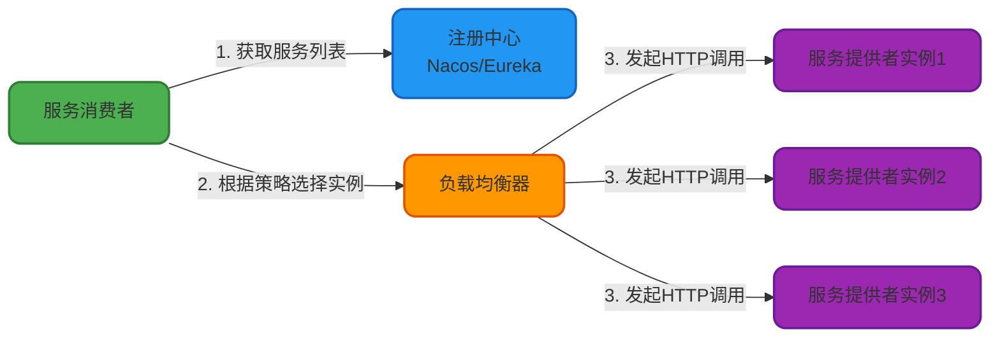
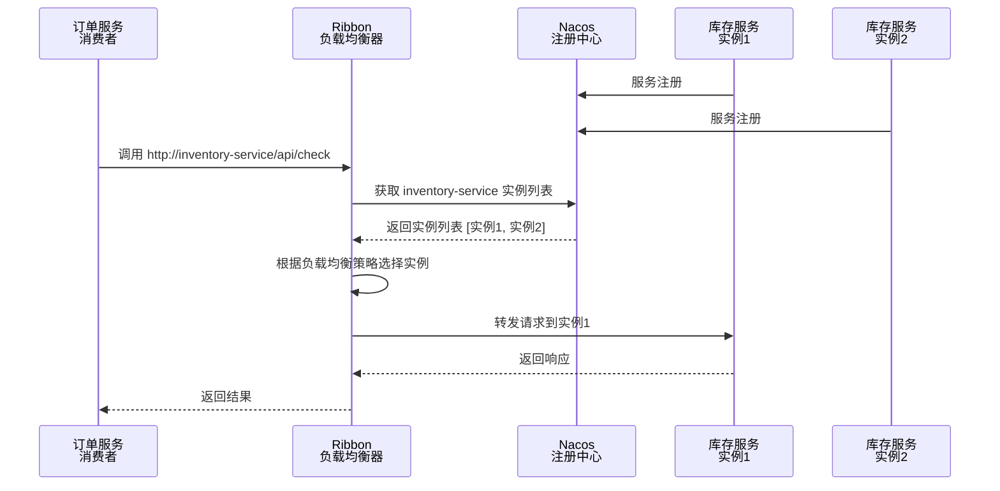
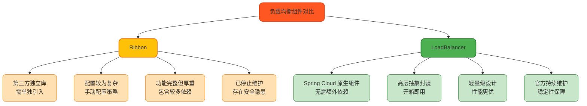

# 微服务负载均衡技术详解

## 负载均衡基本概念

在微服务架构中，负载均衡是一项核心技术，它能够将请求流量合理分配到多个服务实例上，从而提高系统的吞吐量、可用性和容错能力。

负载均衡主要分为两种类型：

- **服务端负载均衡**：由独立的负载均衡设备（如 Nginx、F5）在服务端进行请求分发
- **客户端负载均衡**：由客户端自己维护服务实例列表，通过内置的负载均衡器选择目标服务实例

在 Spring Cloud 微服务体系中，采用的是客户端负载均衡方案。客户端负载均衡的核心流程如下：



客户端负载均衡器会从注册中心（如 Nacos）将可用的服务实例列表拉取到本地，然后根据配置的负载均衡策略计算出目标服务器的 IP 和端口，最后通过 HTTP 框架发起请求并获取响应结果。

## Ribbon 负载均衡原理

### Ribbon 工作机制

Ribbon 是 Netflix 开源的一款客户端负载均衡组件，广泛应用于早期的 Spring Cloud 微服务架构中。它通过在客户端添加拦截器的方式实现负载均衡功能。

当服务消费者发起远程调用时，Ribbon 拦截器会介入请求处理流程，根据预定义的负载均衡规则从服务实例列表中选择一个合适的实例来处理请求。这些规则可以综合考虑多个维度的因素，如服务实例的健康状态、响应时间、并发连接数等。

Ribbon 的完整工作流程如下：



工作流程详细说明：

1. **服务注册**：服务提供者（如库存服务）启动后将自己的实例信息注册到 Nacos、Eureka 等注册中心
2. **请求拦截**：消费者（如订单服务）通过 Ribbon 发起调用，请求中使用服务名称而非具体 IP 地址
3. **服务发现**：Ribbon 根据服务名称从注册中心获取所有可用的服务实例列表
4. **负载均衡**：Ribbon 根据配置的负载均衡算法（如轮询、随机等）从实例列表中选择一个目标服务器
5. **请求转发**：Ribbon 将请求转发给选中的服务实例
6. **响应返回**：目标服务器处理请求后返回响应，Ribbon 将结果返回给消费者

### Ribbon 负载均衡策略

Ribbon 的核心优势在于提供了丰富的负载均衡算法。所有策略都实现了 `IRule` 接口，并继承自 `AbstractLoadBalanceRule` 抽象类。

以下是 Ribbon 内置的主要负载均衡策略：

| 策略名称 | 实现类 | 策略描述 |
|---------|--------|---------|
| **轮询策略** | `RoundRobinRule` | 按顺序依次调用服务实例，适用于实例性能相近的场景 |
| **随机策略** | `RandomRule` | 从服务实例列表中随机选择一个，简单高效 |
| **权重响应时间策略** | `WeightedResponseTimeRule` | 根据实例响应时间分配权重，响应越快权重越高，被选中概率越大 |
| **最小并发策略** | `BestAvailableRule` | 选择当前并发连接数最少的实例，若有相同值则使用轮询 |
| **重试策略** | `RetryRule` | 在指定时间内循环使用轮询策略获取服务，失败则重试 |
| **可用性过滤策略** | `AvailabilityFilteringRule` | 先过滤掉故障或高并发的实例，再选择连接数较小的实例 |
| **区域感知策略** | `ZoneAvoidanceRule` | 根据服务所在区域（zone）的性能和可用性选择实例 |

**权重响应时间策略**工作原理：

- 启动时使用轮询策略，同时开启定时器
- 定期收集所有服务实例的平均响应时间
- 为每个实例计算权重值：响应时间越短，权重越高
- 选择实例时优先考虑高权重实例

### Ribbon 集成示例

下面演示如何在订单服务中使用 Ribbon 调用库存服务。

**1. 添加依赖**

在 `pom.xml` 中添加 Nacos 和 Ribbon 依赖（注意：Nacos 2021 版本后已移除 Ribbon 支持）：

```xml
<dependency>
    <groupId>com.alibaba.cloud</groupId>
    <artifactId>spring-cloud-starter-alibaba-nacos-discovery</artifactId>
    <version>2.2.5.RELEASE</version>
</dependency>
<dependency>
    <groupId>org.springframework.cloud</groupId>
    <artifactId>spring-cloud-starter-netflix-ribbon</artifactId>
    <version>2.2.10.RELEASE</version>
</dependency>
```

**2. 配置注册中心**

在 `application.yml` 中配置 Nacos 注册中心地址：

```yaml
spring:
  cloud:
    nacos:
      discovery:
        server-addr: ${NACOS_SERVER_ADDR:localhost:8848}
```

**3. 配置 RestTemplate**

创建配置类，启用 Ribbon 负载均衡功能：

```java
@Configuration
public class LoadBalancerConfig {

    @Bean
    public IRule ribbonRule() {
        // 使用随机算法选择库存服务实例
        return new RandomRule();
    }

    @Bean
    @LoadBalanced  // 启用负载均衡功能
    public RestTemplate restTemplate(RestTemplateBuilder builder) {
        return builder.build();
    }
}
```

**4. 服务调用**

在订单服务的控制器中调用库存服务：

```java
@RestController
@RequestMapping("/order")
public class OrderController {

    @Autowired
    private RestTemplate restTemplate;

    @PostMapping("/create")
    public String createOrder(@RequestParam String productId) {
        // 使用服务名称调用库存服务，Ribbon 会自动进行负载均衡
        String url = "http://inventory-service/api/deduct?productId=" + productId;
        String response = restTemplate.postForObject(url, null, String.class);
        return "订单创建成功：" + response;
    }
}
```

在上述示例中，`inventory-service` 是在注册中心注册的服务名称，Ribbon 会自动从可用实例中选择一个进行调用。

## Spring Cloud LoadBalancer 详解

### LoadBalancer 与 Ribbon 的差异

从 2020 年开始，Netflix 宣布旗下多个 Spring Cloud 组件停止更新维护，包括 Ribbon。为了应对这一变化，Spring Cloud 官方推出了 **Spring Cloud LoadBalancer** 作为替代方案。

在 Spring Cloud 2020.0 版本中，Ribbon 已被标记为过时（Deprecated），官方强烈推荐使用 Spring Cloud LoadBalancer。

LoadBalancer 与 Ribbon 的核心区别如下：



主要差异点：

**1. 来源与集成度**
- Ribbon：Netflix 开源的独立第三方库，需要单独引入依赖
- LoadBalancer：Spring Cloud 官方组件，与 Spring Cloud 深度集成，无需额外配置

**2. 易用性**
- Ribbon：相对底层，需要开发人员手动配置负载均衡策略和服务发现机制
- LoadBalancer：提供了更高层次的抽象，将负载均衡策略和服务发现进行了封装，使用更加简便

**3. 生态与性能**
- Ribbon：功能完整但较为厚重，包含许多依赖
- LoadBalancer：更加轻量级，性能表现更优，与 Spring Cloud 生态无缝集成

**4. 维护状态**
- Ribbon：已于 2020 年停止维护，存在安全风险
- LoadBalancer：Spring 官方持续维护，稳定性和安全性有保障

### LoadBalancer 使用示例

**1. 添加依赖**

在项目的 `pom.xml` 文件中添加 LoadBalancer 依赖：

```xml
<dependency>
    <groupId>org.springframework.cloud</groupId>
    <artifactId>spring-cloud-starter-loadbalancer</artifactId>
</dependency>
```

**2. 配置 RestTemplate**

创建配置类，使用 `@LoadBalanced` 注解启用负载均衡：

```java
@Configuration
public class RestTemplateConfig {
    
    @Bean
    @LoadBalanced
    public RestTemplate restTemplate() {
        return new RestTemplate();
    }
}
```

**3. 服务调用**

在支付服务中调用账户服务：

```java
@Service
public class PaymentService {
    
    @Autowired
    private RestTemplate restTemplate;

    public String processPayment(String userId, BigDecimal amount) {
        String url = "http://account-service/api/balance/deduct";
        Map<String, Object> params = new HashMap<>();
        params.put("userId", userId);
        params.put("amount", amount);
        
        return restTemplate.postForObject(url, params, String.class);
    }
}
```

在实际调用时，LoadBalancer 会自动从注册中心获取 `account-service` 的所有可用实例，并根据负载均衡策略选择一个实例进行请求。

### LoadBalancer 负载均衡策略

Spring Cloud LoadBalancer 默认提供了两种内置策略：

| 策略类型 | 实现类 | 描述 |
|---------|--------|------|
| **轮询策略** | `RoundRobinLoadBalancer` | **默认策略**，请求依次分配到不同实例，向下兼容 Ribbon 的轮询策略 |
| **随机策略** | `RandomLoadBalancer` | 随机选择一个可用实例处理请求 |

默认策略的源码定义在 `LoadBalancerClientConfiguration` 配置类中：

```java
@Configuration(proxyBeanMethods = false)
@ConditionalOnDiscoveryEnabled
public class LoadBalancerClientConfiguration {
    
    @Bean
    @ConditionalOnMissingBean
    public ReactorLoadBalancer<ServiceInstance> reactorServiceInstanceLoadBalancer(
            Environment environment,
            LoadBalancerClientFactory loadBalancerClientFactory) {
        
        String name = environment.getProperty(LoadBalancerClientFactory.PROPERTY_NAME);
        
        // 默认使用轮询策略
        return new RoundRobinLoadBalancer(
                loadBalancerClientFactory.getLazyProvider(name, ServiceInstanceListSupplier.class), 
                name);
    }
}
```

从源码可以看出，LoadBalancer 默认使用 `RoundRobinLoadBalancer` 实现轮询负载均衡。

### 修改负载均衡策略

如果需要修改默认的负载均衡策略，可以通过自定义 `ReactorLoadBalancer<ServiceInstance>` Bean 来实现。

**方式一：使用随机策略**

```java
@Configuration
public class CustomLoadBalancerConfig {
    
    @Bean
    public ReactorLoadBalancer<ServiceInstance> randomLoadBalancer(
            Environment environment,
            LoadBalancerClientFactory clientFactory) {
        
        String name = environment.getProperty(LoadBalancerClientFactory.PROPERTY_NAME);
        
        return new RandomLoadBalancer(
                clientFactory.getLazyProvider(name, ServiceInstanceListSupplier.class), 
                name);
    }
}
```

**方式二：使用 Nacos 权重策略**

Nacos 提供了基于权重的负载均衡实现 `NacosLoadBalancer`，可以根据服务实例配置的权重值进行流量分配：

```java
@Configuration
public class NacosLoadBalancerConfig {
    
    @Bean
    public ReactorLoadBalancer<ServiceInstance> nacosLoadBalancer(
            Environment environment,
            LoadBalancerClientFactory clientFactory) {
        
        String serviceId = environment.getProperty(LoadBalancerClientFactory.PROPERTY_NAME);
        
        return new NacosLoadBalancer(
                clientFactory.getLazyProvider(serviceId, ServiceInstanceListSupplier.class), 
                serviceId);
    }
}
```

使用 Nacos 权重策略后，可以在 Nacos 控制台为每个服务实例设置不同的权重值，权重越高的实例会获得更多的流量。

### 自定义负载均衡策略

如果内置策略无法满足业务需求，可以通过实现 `ReactorServiceInstanceLoadBalancer` 接口来自定义负载均衡算法。

以下示例演示如何实现一个基于最少活跃连接数的负载均衡策略：

**1. 实现自定义负载均衡器**

```java
import org.springframework.cloud.client.ServiceInstance;
import org.springframework.cloud.client.loadbalancer.Request;
import org.springframework.cloud.client.loadbalancer.Response;
import org.springframework.cloud.client.loadbalancer.DefaultResponse;
import org.springframework.cloud.loadbalancer.core.ReactorServiceInstanceLoadBalancer;
import org.springframework.cloud.loadbalancer.core.ServiceInstanceListSupplier;
import reactor.core.publisher.Mono;

import java.util.List;
import java.util.concurrent.ConcurrentHashMap;
import java.util.concurrent.atomic.AtomicInteger;

public class LeastActiveLoadBalancer implements ReactorServiceInstanceLoadBalancer {

    private final ServiceInstanceListSupplier serviceInstanceListSupplier;
    private final ConcurrentHashMap<String, AtomicInteger> activeCountMap = new ConcurrentHashMap<>();

    public LeastActiveLoadBalancer(ServiceInstanceListSupplier serviceInstanceListSupplier) {
        this.serviceInstanceListSupplier = serviceInstanceListSupplier;
    }

    @Override
    public Mono<Response<ServiceInstance>> choose(Request request) {
        return serviceInstanceListSupplier.get().next().map(instances -> {
            // 选择当前活跃连接数最少的实例
            ServiceInstance chosenInstance = chooseByLeastActive(instances);
            return new DefaultResponse(chosenInstance);
        });
    }

    /**
     * 根据最少活跃连接数选择实例
     */
    private ServiceInstance chooseByLeastActive(List<ServiceInstance> instances) {
        ServiceInstance leastActiveInstance = null;
        int minActiveCount = Integer.MAX_VALUE;
        
        for (ServiceInstance instance : instances) {
            String instanceId = instance.getInstanceId();
            
            // 获取当前实例的活跃连接数
            AtomicInteger activeCount = activeCountMap.computeIfAbsent(
                instanceId, 
                k -> new AtomicInteger(0)
            );
            
            int currentCount = activeCount.get();
            if (currentCount < minActiveCount) {
                minActiveCount = currentCount;
                leastActiveInstance = instance;
            }
        }
        
        // 增加选中实例的活跃连接数
        if (leastActiveInstance != null) {
            activeCountMap.get(leastActiveInstance.getInstanceId()).incrementAndGet();
        }
        
        return leastActiveInstance;
    }
}
```

**2. 注册自定义负载均衡器**

```java
import org.springframework.cloud.client.loadbalancer.LoadBalanced;
import org.springframework.cloud.loadbalancer.core.ReactorServiceInstanceLoadBalancer;
import org.springframework.cloud.loadbalancer.core.ServiceInstanceListSupplier;
import org.springframework.context.annotation.Bean;
import org.springframework.context.annotation.Configuration;

@Configuration
public class CustomLoadBalancerConfiguration {

    @Bean
    public ReactorServiceInstanceLoadBalancer leastActiveLoadBalancer(
            ServiceInstanceListSupplier serviceInstanceListSupplier) {
        return new LeastActiveLoadBalancer(serviceInstanceListSupplier);
    }
}
```

**3. 应用自定义策略**

使用 `@LoadBalancerClient` 注解指定特定服务使用自定义负载均衡策略：

```java
@Configuration
@LoadBalancerClient(name = "payment-service", configuration = CustomLoadBalancerConfiguration.class)
public class ApplicationConfig {
    
    @Bean
    @LoadBalanced
    public RestTemplate restTemplate() {
        return new RestTemplate();
    }
}
```

这样配置后，调用 `payment-service` 时会使用自定义的最少活跃连接数策略，而调用其他服务仍使用默认的轮询策略。

## 总结

负载均衡是微服务架构中的关键技术，它直接影响系统的性能和可用性。Spring Cloud 体系提供了从 Ribbon 到 LoadBalancer 的演进路径：

- **Ribbon** 功能强大但已停止维护，适用于老旧项目
- **LoadBalancer** 轻量高效且官方支持，是当前推荐的解决方案

在实际项目中，应根据业务特点选择合适的负载均衡策略：

- **轮询策略**：适用于服务实例性能均衡的场景
- **随机策略**：适用于无状态服务的快速分发
- **权重策略**：适用于服务实例性能差异较大的场景
- **最少活跃连接策略**：适用于长连接或处理时间差异大的场景

此外，还需要结合服务治理、熔断降级、限流等机制，构建健壮的微服务调用链路。
