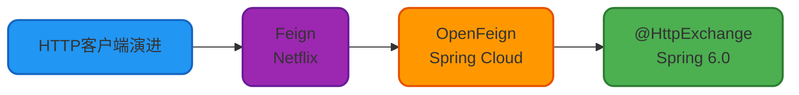
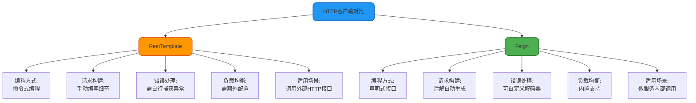
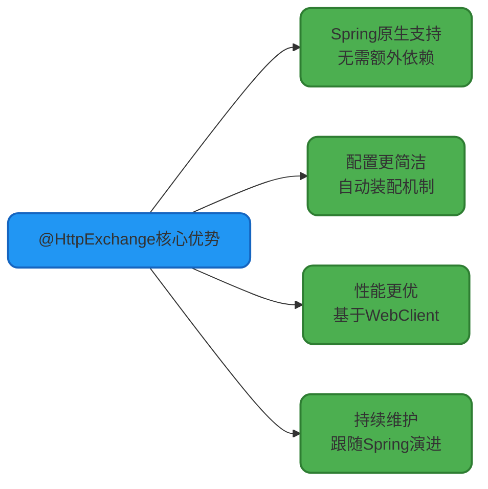

# Feign核心概念与技术对比

## Feign简介与设计理念

Feign 是声明式 Web 服务客户端,旨在简化微服务之间的 HTTP 通信。通过定义 Java 接口并添加注解,开发者可以像调用本地方法一样调用远程服务,极大提升了开发效率。

Feign 最初由 **Netflix** 开发,提供基于注解的声明式 HTTP 请求方式。后来 **Spring Cloud** 团队对其进行了封装和扩展,推出了 **OpenFeign**,增强了与 Spring Cloud 生态的集成能力。

### Feign 与 OpenFeign 的关系

虽然两者名称相近,但它们存在本质差异:

| 特性 | Feign | OpenFeign |
|------|-------|-----------|
| **维护团队** | Netflix 官方 | Spring Cloud 官方 |
| **负载均衡集成** | 需手动与 Ribbon 集成 | 自动集成 LoadBalancer/Ribbon |
| **服务发现支持** | 不支持或需手动配置 | 自动集成 Eureka/Consul/Nacos |
| **自动配置能力** | 无自动配置机制 | 提供 Spring Boot 自动配置 |
| **维护状态** | 独立项目维护 | 跟随 Spring Cloud 更新 |

**OpenFeign 本质上是 Feign 的 Spring Cloud 增强版**,提供了更好的自动化配置和生态集成。从 Spring Cloud 2022 版本开始,OpenFeign 已被标记为功能完整,官方不再添加新特性,仅修复安全问题和严重缺陷。

### OpenFeign 演进与替代方案

随着 Spring Framework 6.0 和 Spring Boot 3.0 的发布,Spring 引入了新的声明式 HTTP 客户端 **@HttpExchange**,这是 OpenFeign 的官方推荐替代方案。



## Feign 与其他技术方案对比

### Feign vs RestTemplate

RestTemplate 和 Feign 都是 Java 中常用的 HTTP 客户端,但设计理念截然不同。

**RestTemplate 是传统命令式客户端**,需要手动编写每个 HTTP 请求的细节:

```java
@Service
public class ProductService {
    
    @Autowired
    private RestTemplate restTemplate;
    
    public ProductInfo getProduct(Long productId) {
        String url = "http://product-service/api/products/" + productId;
        
        // 手动构建 GET 请求
        ResponseEntity<ProductInfo> response = 
            restTemplate.getForEntity(url, ProductInfo.class);
        
        return response.getBody();
    }
    
    public void updateStock(Long productId, Integer quantity) {
        String url = "http://product-service/api/stock/update";
        
        // 手动构建 POST 请求体
        StockRequest request = new StockRequest(productId, quantity);
        restTemplate.postForObject(url, request, Void.class);
    }
}
```

**Feign 采用声明式接口设计**,自动处理请求细节:

```java
@FeignClient(name = "product-service")
public interface ProductClient {
    
    @GetMapping("/api/products/{id}")
    ProductInfo getProduct(@PathVariable("id") Long productId);
    
    @PostMapping("/api/stock/update")
    void updateStock(@RequestBody StockRequest request);
}
```

调用方式极其简洁:

```java
@RestController
@RequestMapping("/order")
public class OrderController {
    
    @Autowired
    private ProductClient productClient;
    
    @PostMapping("/create")
    public String createOrder(@RequestParam Long productId) {
        // 像调用本地方法一样调用远程服务
        ProductInfo product = productClient.getProduct(productId);
        productClient.updateStock(new StockRequest(productId, 1));
        return "订单创建成功";
    }
}
```

**核心差异总结**:



RestTemplate 更加灵活通用,可以调用任何 HTTP 接口,包括第三方外部服务。而 Feign 更适合微服务内部调用,需要服务注册中心和统一的接口定义。

### Feign vs Dubbo

Dubbo 和 Feign 都用于微服务间通信,但它们的技术路线完全不同。

**Dubbo 是高性能 RPC 框架**,基于二进制协议进行远程过程调用,主要特点:

- **通信协议**: 支持 Dubbo、HTTP、RMI、gRPC 等多种协议
- **性能表现**: 基于二进制序列化,性能优于 HTTP 文本协议
- **服务治理**: 内置完整的服务治理功能(限流、降级、路由等)
- **注册中心**: 依赖 Nacos、Zookeeper 等
- **技术生态**: 属于 Spring Cloud Alibaba 体系

**Feign 是声明式 HTTP 客户端**,基于标准 HTTP 协议进行通信,主要特点:

- **通信协议**: 仅支持 HTTP/HTTPS
- **性能表现**: 基于文本序列化,性能相对较低
- **服务治理**: 依赖 Hystrix、Sentinel 等外部组件
- **注册中心**: 依赖 Eureka、Consul、Nacos 等
- **技术生态**: 属于 Spring Cloud Netflix/原生体系

**架构对比图**:

```mermaid
graph TB
    subgraph Dubbo架构
        A1[订单服务] -->|Dubbo协议| A2[RPC调用层]
        A2 --> A3[序列化层<br/>Hessian/Protobuf]
        A3 --> A4[网络传输层<br/>Netty]
        A4 --> A5[库存服务]
    end
    
    subgraph Feign架构
        B1[订单服务] -->|HTTP协议| B2[Feign客户端]
        B2 --> B3[编码解码<br/>JSON/XML]
        B3 --> B4[负载均衡<br/>LoadBalancer]
        B4 --> B5[库存服务]
    end
    
    style A1 fill:#9C27B0,stroke:#6A1B9A,stroke-width:2px,rx:10,ry:10
    style A2 fill:#673AB7,stroke:#4527A0,stroke-width:2px,rx:10,ry:10
    style A3 fill:#673AB7,stroke:#4527A0,stroke-width:2px,rx:10,ry:10
    style A4 fill:#673AB7,stroke:#4527A0,stroke-width:2px,rx:10,ry:10
    style A5 fill:#9C27B0,stroke:#6A1B9A,stroke-width:2px,rx:10,ry:10
    
    style B1 fill:#4CAF50,stroke:#2E7D32,stroke-width:2px,rx:10,ry:10
    style B2 fill:#66BB6A,stroke:#388E3C,stroke-width:2px,rx:10,ry:10
    style B3 fill:#66BB6A,stroke:#388E3C,stroke-width:2px,rx:10,ry:10
    style B4 fill:#66BB6A,stroke:#388E3C,stroke-width:2px,rx:10,ry:10
    style B5 fill:#4CAF50,stroke:#2E7D32,stroke-width:2px,rx:10,ry:10
```



**主要区别对照表**:

| 对比维度 | Dubbo | Feign |
|---------|-------|-------|
| **设计哲学** | RPC 远程过程调用 | RESTful HTTP 调用 |
| **通信协议** | Dubbo/gRPC/HTTP/RMI | HTTP/HTTPS |
| **性能表现** | 高性能(二进制序列化) | 中等性能(文本序列化) |
| **服务治理** | 内置完整治理能力 | 依赖外部组件 |
| **负载均衡** | 内置多种策略 | 通过 LoadBalancer 实现 |
| **注册中心** | Nacos/Zookeeper/Consul | Eureka/Nacos/Consul |
| **技术生态** | Spring Cloud Alibaba | Spring Cloud Netflix |
| **维护状态** | 持续更新 | 功能完整不再新增 |

**选型建议**:

- **选择 Dubbo**: 对性能要求高、需要完整服务治理能力、内部系统调用、技术栈基于 Spring Cloud Alibaba
- **选择 Feign**: 跨语言互操作、轻量级调用需求、技术栈基于 Spring Cloud Netflix、HTTP 协议标准化要求

总的来说,Dubbo 更注重高性能和服务治理的深度,Feign 更强调简洁易用和 HTTP 协议的通用性。两者各有优势,需根据具体业务场景选择。

## Spring 6.0 原生方案 @HttpExchange

### 使用背景

从 Spring Framework 6.0 和 Spring Boot 3.0 开始,Spring 官方内置了声明式 HTTP 客户端 **@HttpExchange**,作为 OpenFeign 的原生替代方案。

要使用该特性,需满足以下版本要求:
- Spring Framework 6.0+
- Spring Boot 3.0+

在 `pom.xml` 中引入依赖(二选一):

```xml
<!-- 阻塞式 HTTP 客户端 -->
<dependency>
    <groupId>org.springframework.boot</groupId>
    <artifactId>spring-boot-starter-web</artifactId>
</dependency>

<!-- 或者使用响应式 HTTP 客户端 -->
<dependency>
    <groupId>org.springframework.boot</groupId>
    <artifactId>spring-boot-starter-webflux</artifactId>
</dependency>
```

### 支持的注解

@HttpExchange 支持完整的 RESTful 操作:

| 注解 | HTTP 方法 | 用途 |
|-----|----------|------|
| `@GetExchange` | GET | 查询数据 |
| `@PostExchange` | POST | 创建数据 |
| `@PutExchange` | PUT | 完整更新 |
| `@PatchExchange` | PATCH | 部分更新 |
| `@DeleteExchange` | DELETE | 删除数据 |

### 完整使用示例

**1. 定义数据模型**

```java
public class Employee implements Serializable {
    
    private Long id;
    private String name;
    private String department;
    private Integer salary;
    
    public Employee() {}
    
    public Employee(String name, String department, Integer salary) {
        this.name = name;
        this.department = department;
        this.salary = salary;
    }
    
    // Getter、Setter 省略
    
    @Override
    public String toString() {
        return String.format("Employee[id=%d, name=%s, dept=%s, salary=%d]", 
            id, name, department, salary);
    }
}
```

**2. 提供 HTTP 服务端**

```java
@RestController
@RequestMapping("/api/employees")
public class EmployeeController {
    
    @GetMapping
    public List<Employee> listEmployees() {
        return IntStream.rangeClosed(1, 5)
            .mapToObj(i -> new Employee(
                "Employee-" + i, 
                "Department-" + (i % 3 + 1), 
                8000 + i * 1000
            ))
            .collect(Collectors.toList());
    }
    
    @PostMapping
    public Employee createEmployee(@RequestBody Employee employee) {
        employee.setId(System.currentTimeMillis());
        return employee;
    }
}
```

**3. 定义声明式客户端接口**

```java
public interface EmployeeApiClient {
    
    @GetExchange("/api/employees")
    List<Employee> getEmployees();
    
    @PostExchange("/api/employees")
    Employee createEmployee(@RequestBody Employee employee);
}
```

**4. 配置 HTTP 客户端代理**

```java
@Configuration
public class HttpClientConfiguration {
    
    @Bean
    public WebClient webClient() {
        return WebClient.builder()
            .baseUrl("http://localhost:8080")
            .build();
    }
    
    @Bean
    public EmployeeApiClient employeeApiClient(WebClient webClient) {
        HttpServiceProxyFactory factory = HttpServiceProxyFactory
            .builder(WebClientAdapter.forClient(webClient))
            .build();
        return factory.createClient(EmployeeApiClient.class);
    }
}
```

**5. 调用远程服务**

```java
@SpringBootTest
class EmployeeApiTests {
    
    @Autowired
    private EmployeeApiClient employeeApiClient;
    
    @Test
    public void testGetEmployees() {
        List<Employee> employees = employeeApiClient.getEmployees();
        Assert.assertEquals(5, employees.size());
        employees.forEach(System.out::println);
    }
    
    @Test
    public void testCreateEmployee() {
        Employee newEmployee = new Employee("张三", "技术部", 15000);
        Employee created = employeeApiClient.createEmployee(newEmployee);
        Assert.assertNotNull(created.getId());
    }
}
```

### @HttpExchange 优势

相比 OpenFeign,@HttpExchange 具有以下优势:



对于新项目,如果使用 Spring Boot 3.0 及以上版本,建议优先选择 @HttpExchange 作为声明式 HTTP 客户端解决方案。
