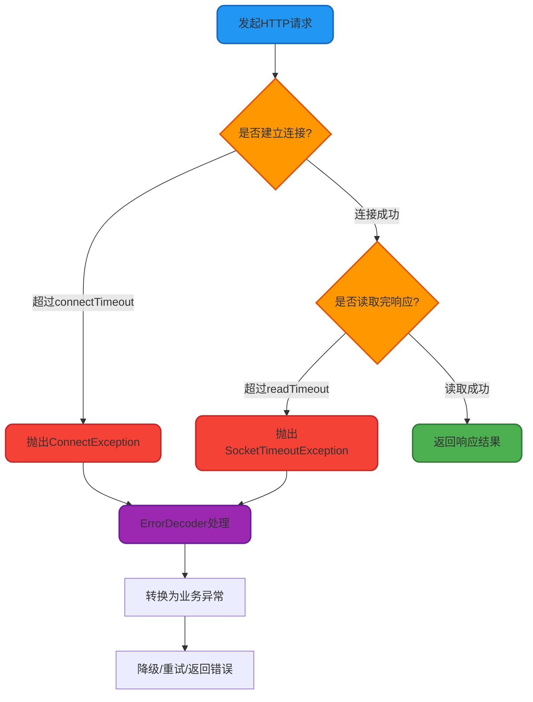
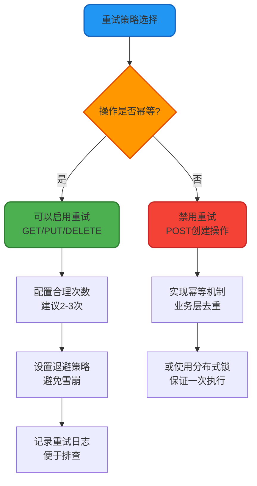
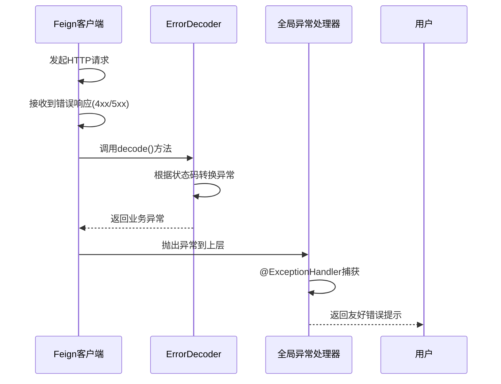
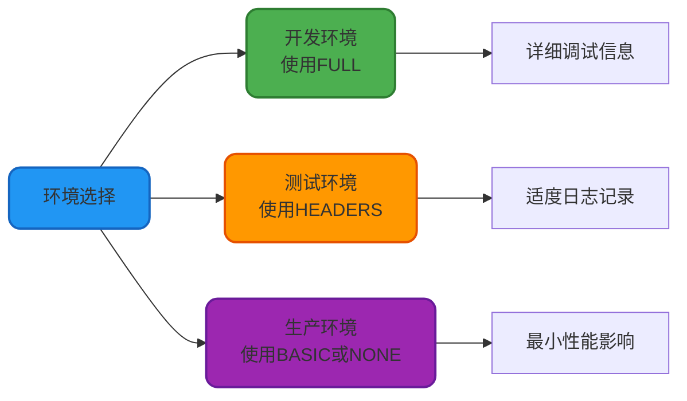

# Feign配置与超时管理

## Feign 超时配置详解

在微服务架构中,网络延迟和服务响应时间不可预测,合理配置超时参数对系统稳定性至关重要。OpenFeign 提供了灵活的超时配置机制,可以精细控制连接和读取超时时间。

### 全局超时配置

通过 `application.yml` 配置文件可以设置全局超时参数:

```yaml
feign:
  client:
    config:
      default:
        connectTimeout: 3000  # 连接超时时间,单位:毫秒
        readTimeout: 5000     # 读取超时时间,单位:毫秒
```

**配置项说明**:

- `connectTimeout`: 建立 TCP 连接的最长等待时间,超时则抛出 `ConnectException`
- `readTimeout`: 从服务端读取数据的最长等待时间,超时则抛出 `SocketTimeoutException`

### 针对特定服务的超时配置

如果不同服务的响应时间差异较大,可以为每个服务单独配置:

```yaml
feign:
  client:
    config:
      # 全局默认配置
      default:
        connectTimeout: 3000
        readTimeout: 5000
      
      # 订单服务专属配置(业务逻辑复杂,响应较慢)
      order-service:
        connectTimeout: 5000
        readTimeout: 10000
      
      # 商品服务专属配置(查询数据库较快)
      product-service:
        connectTimeout: 2000
        readTimeout: 3000
```

**优先级规则**: 特定服务配置 > 全局默认配置

### 超时异常处理流程

当发生超时时,Feign 的异常传播链如下:



## Feign 重试机制

### 默认重试行为

**默认情况下,OpenFeign 不会对失败请求进行自动重试**。当发生超时、网络异常或 HTTP 5xx 错误时,Feign 会直接抛出异常,由调用方处理。

这种设计是为了避免重试导致的数据不一致问题,特别是对于非幂等操作(如创建订单、扣减库存等)。

### 自定义重试策略

通过配置 `Retryer` 组件可以启用重试功能。Feign 提供了 `Retryer.Default` 实现类,支持自定义重试次数和间隔时间。

**1. 定义重试配置类**

```java
import feign.Retryer;
import org.springframework.context.annotation.Bean;
import org.springframework.context.annotation.Configuration;
import java.util.concurrent.TimeUnit;

@Configuration
public class FeignRetryConfiguration {
    
    @Bean
    public Retryer feignRetryer() {
        // 参数说明:
        // 第一个参数: 重试初始间隔时间(毫秒)
        // 第二个参数: 重试最大间隔时间(毫秒)
        // 第三个参数: 最大重试次数(不含首次请求)
        return new Retryer.Default(
            200,                          // 首次重试间隔 200ms
            TimeUnit.SECONDS.toMillis(1), // 最大重试间隔 1s
            3                             // 最多重试 3 次
        );
    }
}
```

**2. 应用到 Feign 客户端**

```java
@FeignClient(
    name = "payment-service", 
    configuration = FeignRetryConfiguration.class
)
public interface PaymentClient {
    
    @GetMapping("/api/payment/status/{orderId}")
    PaymentStatus checkPaymentStatus(@PathVariable("orderId") String orderId);
}
```

### 重试间隔计算规则

`Retryer.Default` 采用**指数退避算法**计算重试间隔:

```
实际间隔时间 = min(初始间隔 × 1.5^重试次数, 最大间隔)
```

示例计算(初始间隔 200ms,最大间隔 1000ms):

| 重试次数 | 计算公式 | 实际间隔 |
|---------|---------|---------|
| 第1次 | 200 × 1.5^0 = 200ms | 200ms |
| 第2次 | 200 × 1.5^1 = 300ms | 300ms |
| 第3次 | 200 × 1.5^2 = 450ms | 450ms |
| 第4次 | 200 × 1.5^3 = 675ms | 675ms |

### 重试最佳实践



**重要提醒**:
- 仅对幂等接口启用重试(如查询、状态检查等)
- 对于创建、支付等非幂等操作,应在业务层实现幂等控制
- 避免无限重试导致资源耗尽和级联故障

## Feign 异常处理

### 自定义错误解码器

OpenFeign 提供 `ErrorDecoder` 接口,用于将 HTTP 错误响应转换为业务异常。默认实现 `ErrorDecoder.Default` 会根据状态码抛出不同异常。

**自定义错误解码器示例**:

```java
import feign.Response;
import feign.codec.ErrorDecoder;
import org.springframework.http.HttpStatus;

public class CustomErrorDecoder implements ErrorDecoder {
    
    private final ErrorDecoder defaultDecoder = new Default();
    
    @Override
    public Exception decode(String methodKey, Response response) {
        HttpStatus status = HttpStatus.valueOf(response.status());
        
        // 根据 HTTP 状态码返回自定义异常
        switch (status) {
            case NOT_FOUND:
                return new ResourceNotFoundException(
                    "请求的资源不存在: " + methodKey
                );
            
            case FORBIDDEN:
                return new UnauthorizedException(
                    "没有权限访问: " + methodKey
                );
            
            case INTERNAL_SERVER_ERROR:
            case BAD_GATEWAY:
            case SERVICE_UNAVAILABLE:
                return new ServiceUnavailableException(
                    "服务暂时不可用,请稍后重试"
                );
            
            case GATEWAY_TIMEOUT:
                return new ServiceTimeoutException(
                    "服务调用超时: " + methodKey
                );
            
            default:
                // 其他状态码使用默认解码器
                return defaultDecoder.decode(methodKey, response);
        }
    }
}
```

**应用错误解码器**:

```java
@Configuration
public class FeignErrorConfiguration {
    
    @Bean
    public ErrorDecoder errorDecoder() {
        return new CustomErrorDecoder();
    }
}

@FeignClient(
    name = "user-service",
    configuration = FeignErrorConfiguration.class
)
public interface UserClient {
    
    @GetMapping("/api/users/{id}")
    UserInfo getUserInfo(@PathVariable("id") Long userId);
}
```

### 异常处理链路

Feign 的异常处理链路如下:



### 全局异常处理示例

结合 Spring Boot 的 `@ControllerAdvice` 统一处理 Feign 异常:

```java
@RestControllerAdvice
public class GlobalExceptionHandler {
    
    @ExceptionHandler(ResourceNotFoundException.class)
    public ResponseEntity<ErrorResponse> handleNotFound(ResourceNotFoundException ex) {
        ErrorResponse error = new ErrorResponse(404, ex.getMessage());
        return ResponseEntity.status(HttpStatus.NOT_FOUND).body(error);
    }
    
    @ExceptionHandler(ServiceUnavailableException.class)
    public ResponseEntity<ErrorResponse> handleServiceUnavailable(ServiceUnavailableException ex) {
        ErrorResponse error = new ErrorResponse(503, "服务暂时不可用,请稍后重试");
        return ResponseEntity.status(HttpStatus.SERVICE_UNAVAILABLE).body(error);
    }
    
    @ExceptionHandler(RetryableException.class)
    public ResponseEntity<ErrorResponse> handleTimeout(RetryableException ex) {
        ErrorResponse error = new ErrorResponse(504, "服务调用超时");
        return ResponseEntity.status(HttpStatus.GATEWAY_TIMEOUT).body(error);
    }
}
```

## Feign 日志记录

### 日志级别配置

Feign 支持四种日志级别,可以记录不同详细程度的请求信息:

| 日志级别 | 记录内容 | 适用场景 |
|---------|---------|---------|
| `NONE` | 不记录任何日志(默认) | 生产环境 |
| `BASIC` | 记录请求方法、URL、响应状态码、执行时间 | 生产环境监控 |
| `HEADERS` | 在 BASIC 基础上增加请求和响应头 | 问题排查 |
| `FULL` | 记录完整的请求和响应内容(含 Body) | 开发测试环境 |

### 配置方式一:全局配置

在 `application.yml` 中配置:

```yaml
# 开启 Feign 客户端日志
logging:
  level:
    com.example.client: DEBUG  # 替换为实际的 Feign 接口包路径
    feign: DEBUG
```

定义日志级别 Bean:

```java
@Configuration
public class FeignLogConfiguration {
    
    @Bean
    public Logger.Level feignLoggerLevel() {
        return Logger.Level.FULL;  // 记录完整请求响应信息
    }
}
```

### 配置方式二:针对特定客户端

为不同的 Feign 客户端设置不同日志级别:

```java
// 商品服务配置 - BASIC 级别
@Configuration
public class ProductFeignConfig {
    @Bean
    public Logger.Level productLogLevel() {
        return Logger.Level.BASIC;
    }
}

// 订单服务配置 - FULL 级别(业务复杂需详细日志)
@Configuration
public class OrderFeignConfig {
    @Bean
    public Logger.Level orderLogLevel() {
        return Logger.Level.FULL;
    }
}
```

应用到客户端:

```java
@FeignClient(
    name = "product-service",
    configuration = ProductFeignConfig.class
)
public interface ProductClient {
    @GetMapping("/api/products/{id}")
    Product getProduct(@PathVariable Long id);
}

@FeignClient(
    name = "order-service",
    configuration = OrderFeignConfig.class
)
public interface OrderClient {
    @PostMapping("/api/orders")
    Order createOrder(@RequestBody OrderRequest request);
}
```

### 日志输出示例

**BASIC 级别输出**:

```
[ProductClient#getProduct] ---> GET http://product-service/api/products/12345 HTTP/1.1
[ProductClient#getProduct] <--- HTTP/1.1 200 (245ms)
```

**FULL 级别输出**:

```
[OrderClient#createOrder] ---> POST http://order-service/api/orders HTTP/1.1
[OrderClient#createOrder] Content-Type: application/json
[OrderClient#createOrder] Content-Length: 153
[OrderClient#createOrder] 
[OrderClient#createOrder] {"userId":10001,"productId":12345,"quantity":2,"amount":299.00}
[OrderClient#createOrder] ---> END HTTP (153-byte body)
[OrderClient#createOrder] <--- HTTP/1.1 201 (487ms)
[OrderClient#createOrder] content-type: application/json
[OrderClient#createOrder] 
[OrderClient#createOrder] {"orderId":"ORD20231215001","status":"CREATED","createTime":"2023-12-15T10:30:45"}
[OrderClient#createOrder] <--- END HTTP (98-byte body)
```

### 自定义日志记录器

可以实现 `feign.Logger` 抽象类来完全自定义日志格式:

```java
import feign.Logger;
import feign.Request;
import feign.Response;
import lombok.extern.slf4j.Slf4j;

@Slf4j
public class CustomFeignLogger extends Logger {
    
    @Override
    protected void log(String configKey, String format, Object... args) {
        log.info(String.format(methodTag(configKey) + format, args));
    }
    
    @Override
    protected void logRequest(String configKey, Level logLevel, Request request) {
        super.logRequest(configKey, logLevel, request);
        // 可以添加自定义的请求日志逻辑,如记录到数据库、发送到监控系统等
    }
    
    @Override
    protected Response logAndRebufferResponse(String configKey, Level logLevel, 
                                              Response response, long elapsedTime) {
        Response result = super.logAndRebufferResponse(configKey, logLevel, response, elapsedTime);
        // 可以添加自定义的响应日志逻辑
        return result;
    }
}
```

注册自定义日志记录器:

```java
@Configuration
public class FeignConfig {
    
    @Bean
    public Logger feignLogger() {
        return new CustomFeignLogger();
    }
}
```

### 日志配置最佳实践



**生产环境建议**:
- 默认使用 `NONE` 或 `BASIC` 级别,避免记录敏感信息和影响性能
- 通过配置中心动态调整日志级别,方便线上问题排查
- 结合链路追踪系统(如 Sleuth + Zipkin)获取完整调用链路
- 对于关键业务接口,可以单独配置 `HEADERS` 级别便于审计
