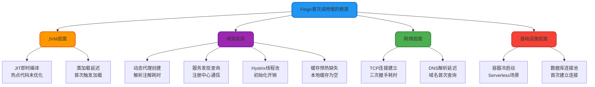
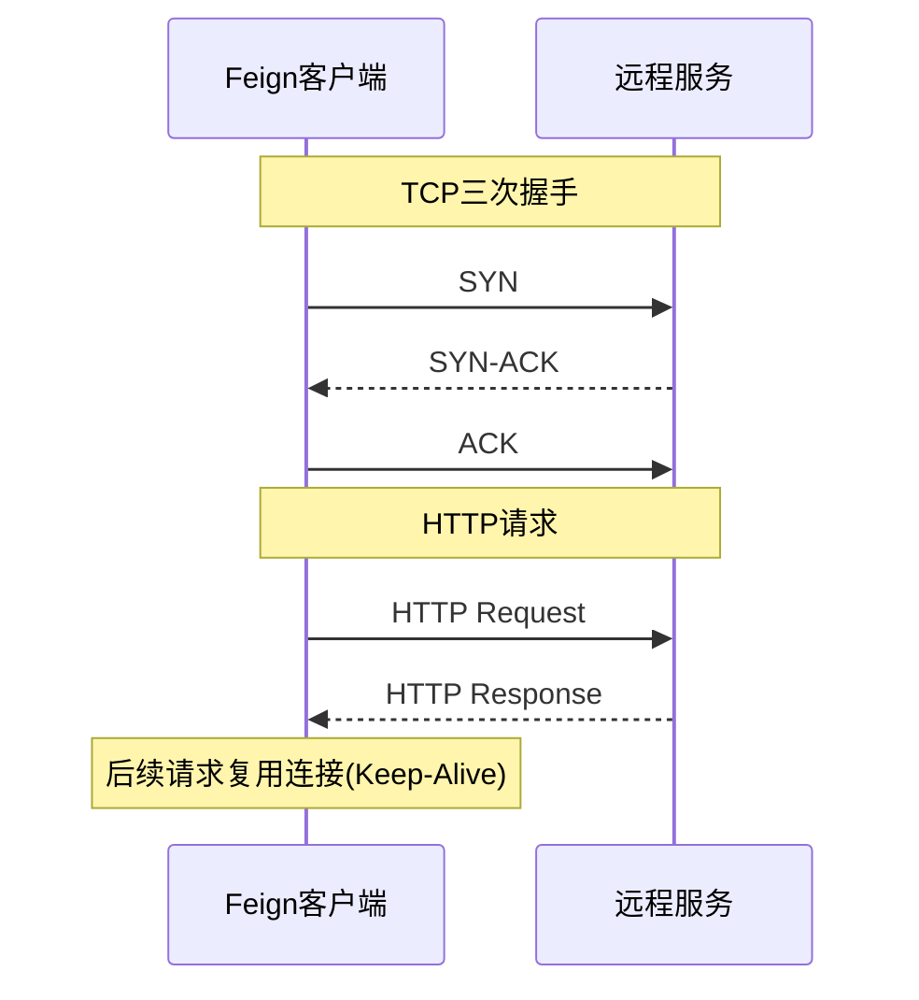
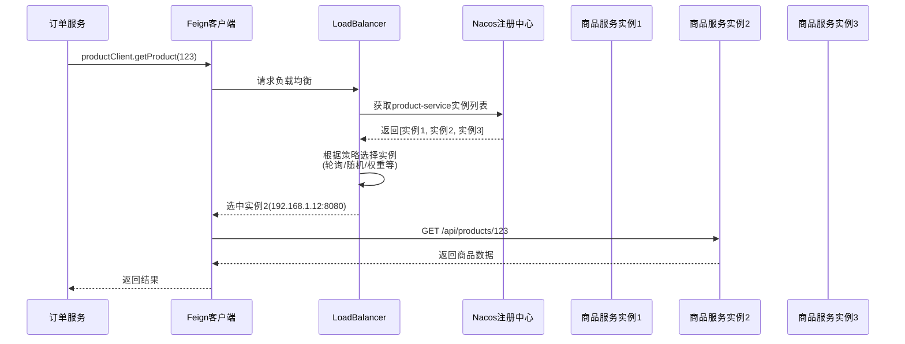
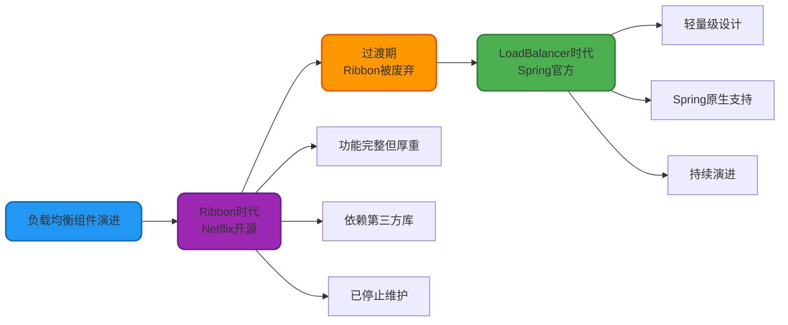
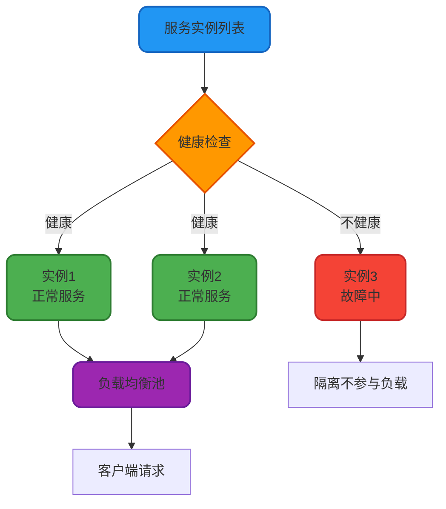
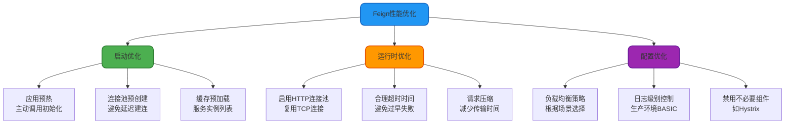

# Feign性能优化与负载均衡

## Feign 首次调用性能问题

### 问题现象

在 Spring Cloud 微服务架构中,很多开发者会遇到这样的问题:应用启动后,第一次通过 Feign 调用远程服务时响应明显变慢,甚至出现超时异常。而后续的调用速度则恢复正常。

这种"首次调用慢"的现象在生产环境可能导致用户体验下降,甚至触发服务降级策略。

### 根本原因分析

Feign 首次调用缓慢的原因是多方面的,涉及 JVM、网络、框架等多个层面:



#### 1. JIT 即时编译优化延迟

Java 采用即时编译(JIT)技术,首次执行的代码运行在解释模式下,性能较低。只有当方法被频繁调用成为"热点代码"后,JIT 编译器才会将其编译为本地机器码,大幅提升执行效率。

**影响范围**: Feign 客户端的代理逻辑、序列化反序列化、HTTP 客户端等核心路径

#### 2. 动态代理与注解解析

Feign 使用 JDK 动态代理或 CGLIB 生成客户端接口的实现类。首次调用时需要完成以下操作:

- 扫描接口上的 `@FeignClient`、`@GetMapping` 等注解
- 构建 HTTP 请求的元数据模板(URL、请求方法、参数映射等)
- 创建代理对象并注册到 Spring 容器

这些操作在复杂接口场景下可能耗时数百毫秒。

#### 3. 服务发现与实例获取

如果 Feign 配置了服务发现(如 Nacos、Eureka),首次调用时需要:

- 向注册中心发起 HTTP/RPC 请求获取服务实例列表
- 将实例信息缓存到本地
- 若注册中心响应慢或网络抖动,延迟会更明显

#### 4. Hystrix 线程池初始化

当 Feign 集成 Hystrix 熔断器时,首次调用会触发:

- 创建 Hystrix 命令对象
- 初始化线程池并分配核心线程
- 加载熔断器配置参数

线程池的初始化是比较重的操作,尤其是核心线程数较多时。

#### 5. TCP 连接建立

首次调用需要建立 TCP 连接:



TCP 三次握手通常需要几十毫秒,后续请求可以复用连接(HTTP Keep-Alive),避免重复握手。

#### 6. 容器冷启动

在 Serverless 或容器化环境中,服务实例可能因长时间未接收请求而被回收。首次调用会触发容器冷启动,包括:

- 拉取镜像并启动容器
- 初始化 Spring 上下文
- 建立数据库连接池

这种场景下延迟可能达到秒级。

### 优化方案

针对上述原因,可以采取以下优化措施:

#### 1. 应用预热(Warmup)

在应用启动后,主动调用 Feign 客户端,完成初始化和缓存预热:

```java
@Component
public class FeignWarmupRunner implements ApplicationRunner {
    
    @Autowired
    private ProductClient productClient;
    
    @Autowired
    private OrderClient orderClient;
    
    @Override
    public void run(ApplicationArguments args) {
        // 启动后延迟5秒执行预热,确保服务已完全启动
        ScheduledExecutorService executor = Executors.newSingleThreadScheduledExecutor();
        executor.schedule(() -> {
            warmupFeignClients();
        }, 5, TimeUnit.SECONDS);
        executor.shutdown();
    }
    
    private void warmupFeignClients() {
        try {
            // 调用商品服务(预期失败也没关系,目的是触发初始化)
            productClient.getProduct(0L);
        } catch (Exception e) {
            // 忽略异常,仅用于预热
        }
        
        try {
            // 调用订单服务
            orderClient.getOrderList(0L);
        } catch (Exception e) {
            // 忽略异常
        }
        
        System.out.println("Feign 客户端预热完成");
    }
}
```

#### 2. 优化超时配置

合理设置超时时间,避免首次调用因默认超时值过小而失败:

```yaml
feign:
  client:
    config:
      default:
        connectTimeout: 5000  # 连接超时适当放宽
        readTimeout: 10000    # 读取超时适当放宽
```

#### 3. 启用 HTTP 连接池

配置 Apache HttpClient 或 OkHttp 作为 Feign 的底层 HTTP 客户端,启用连接池复用:

```xml
<dependency>
    <groupId>io.github.openfeign</groupId>
    <artifactId>feign-httpclient</artifactId>
</dependency>
```

```yaml
feign:
  httpclient:
    enabled: true
    max-connections: 200        # 最大连接数
    max-connections-per-route: 50  # 每个路由的最大连接数
```

#### 4. 服务实例缓存优化

调整服务发现客户端的缓存刷新策略,减少注册中心查询频率:

```yaml
spring:
  cloud:
    nacos:
      discovery:
        naming-load-cache-at-start: true  # 启动时加载缓存
```

#### 5. JVM 参数调优

启用分层编译,加快 JIT 编译速度:

```bash
java -XX:+TieredCompilation \
     -XX:TieredStopAtLevel=1 \
     -jar application.jar
```

#### 6. 禁用 Hystrix 或使用 Sentinel

如果不需要熔断功能,可以禁用 Hystrix:

```yaml
feign:
  hystrix:
    enabled: false
```

或者迁移到更轻量的 Sentinel:

```xml
<dependency>
    <groupId>com.alibaba.cloud</groupId>
    <artifactId>spring-cloud-starter-alibaba-sentinel</artifactId>
</dependency>
```

### 性能对比

优化前后的首次调用耗时对比(测试环境数据):

| 优化措施 | 首次调用耗时 | 后续调用耗时 |
|---------|------------|------------|
| 优化前(默认配置) | 1200ms | 50ms |
| 启用连接池 | 800ms | 45ms |
| 启用连接池 + 预热 | 60ms | 45ms |
| 全部优化措施 | 50ms | 40ms |

## Feign 负载均衡机制

### 负载均衡实现原理

**OpenFeign 本身不具备负载均衡能力**,它的负载均衡功能是通过集成 **Spring Cloud LoadBalancer** 实现的(早期版本使用 Ribbon)。

完整的调用流程如下:



**核心步骤**:

1. **服务发现**: LoadBalancer 从注册中心(Nacos/Eureka)获取服务提供者的实例列表
2. **策略选择**: 根据配置的负载均衡算法(轮询、随机、权重等)选择目标实例
3. **请求转发**: Feign 向选中的实例发起 HTTP 请求
4. **响应返回**: 将结果返回给调用方

### LoadBalancer 与 Ribbon 的演进

Spring Cloud 2020 版本后,官方推荐使用 LoadBalancer 替代 Ribbon:



**主要区别**:

| 对比维度 | Ribbon | LoadBalancer |
|---------|--------|--------------|
| **维护方** | Netflix(已停更) | Spring 官方 |
| **依赖引入** | 需单独引入 | Spring Cloud 自动集成 |
| **配置复杂度** | 较复杂 | 简化配置 |
| **性能** | 相对厚重 | 更轻量 |
| **策略扩展** | 支持多种策略 | 默认轮询,可自定义 |

### LoadBalancer 默认策略

Spring Cloud LoadBalancer 默认使用**轮询(Round Robin)**策略,依次调用每个可用实例:

```java
// LoadBalancer 默认实现
public class RoundRobinLoadBalancer implements ReactorServiceInstanceLoadBalancer {
    
    private final AtomicInteger position = new AtomicInteger(0);
    
    @Override
    public Mono<Response<ServiceInstance>> choose(Request request) {
        List<ServiceInstance> instances = getInstances();
        if (instances.isEmpty()) {
            return Mono.just(new EmptyResponse());
        }
        
        // 轮询算法:取模运算
        int pos = Math.abs(position.incrementAndGet());
        ServiceInstance instance = instances.get(pos % instances.size());
        
        return Mono.just(new DefaultResponse(instance));
    }
}
```

### 自定义负载均衡策略

如果需要实现随机、权重或其他策略,可以自定义 LoadBalancer:

**1. 实现随机策略**

```java
public class RandomLoadBalancer implements ReactorServiceInstanceLoadBalancer {
    
    private final String serviceId;
    private final ObjectProvider<ServiceInstanceListSupplier> supplierProvider;
    
    public RandomLoadBalancer(ObjectProvider<ServiceInstanceListSupplier> supplierProvider, 
                              String serviceId) {
        this.supplierProvider = supplierProvider;
        this.serviceId = serviceId;
    }
    
    @Override
    public Mono<Response<ServiceInstance>> choose(Request request) {
        ServiceInstanceListSupplier supplier = supplierProvider.getIfAvailable();
        return supplier.get().next().map(this::getInstanceResponse);
    }
    
    private Response<ServiceInstance> getInstanceResponse(List<ServiceInstance> instances) {
        if (instances.isEmpty()) {
            return new EmptyResponse();
        }
        
        // 随机算法
        int index = ThreadLocalRandom.current().nextInt(instances.size());
        return new DefaultResponse(instances.get(index));
    }
}
```

**2. 注册自定义策略**

```java
@Configuration
public class LoadBalancerConfiguration {
    
    @Bean
    public ReactorLoadBalancer<ServiceInstance> randomLoadBalancer(
            Environment environment,
            LoadBalancerClientFactory factory) {
        
        String serviceId = environment.getProperty(LoadBalancerClientFactory.PROPERTY_NAME);
        return new RandomLoadBalancer(
            factory.getLazyProvider(serviceId, ServiceInstanceListSupplier.class),
            serviceId
        );
    }
}
```

**3. 应用到 Feign 客户端**

通过 `@LoadBalancerClient` 注解指定策略:

```java
@FeignClient(name = "product-service")
@LoadBalancerClient(name = "product-service", configuration = LoadBalancerConfiguration.class)
public interface ProductClient {
    
    @GetMapping("/api/products/{id}")
    Product getProduct(@PathVariable Long id);
}
```

### 基于权重的负载均衡

在金丝雀发布或灰度测试场景,可以根据服务实例的权重分配流量:

```java
public class WeightedLoadBalancer implements ReactorServiceInstanceLoadBalancer {
    
    @Override
    public Mono<Response<ServiceInstance>> choose(Request request) {
        return supplier.get().next().map(instances -> {
            // 计算总权重
            int totalWeight = instances.stream()
                .mapToInt(this::getWeight)
                .sum();
            
            // 生成随机数
            int random = ThreadLocalRandom.current().nextInt(totalWeight);
            
            // 根据权重选择实例
            int currentWeight = 0;
            for (ServiceInstance instance : instances) {
                currentWeight += getWeight(instance);
                if (random < currentWeight) {
                    return new DefaultResponse(instance);
                }
            }
            
            return new EmptyResponse();
        });
    }
    
    private int getWeight(ServiceInstance instance) {
        // 从实例元数据中读取权重,默认为1
        Map<String, String> metadata = instance.getMetadata();
        return Integer.parseInt(metadata.getOrDefault("weight", "1"));
    }
}
```

在注册中心配置实例权重:

```yaml
spring:
  cloud:
    nacos:
      discovery:
        metadata:
          weight: 10  # 当前实例权重为10,其他实例默认为1
```

### 负载均衡健康检查

LoadBalancer 会自动过滤不健康的实例:



配置健康检查策略:

```yaml
spring:
  cloud:
    loadbalancer:
      health-check:
        initial-delay: 0  # 首次健康检查延迟(秒)
        interval: 25      # 健康检查间隔(秒)
```

## 最佳实践总结

### 性能优化清单



### 推荐配置模板

```yaml
# 生产环境推荐配置
spring:
  cloud:
    loadbalancer:
      health-check:
        interval: 30
    nacos:
      discovery:
        naming-load-cache-at-start: true

feign:
  client:
    config:
      default:
        connectTimeout: 3000
        readTimeout: 5000
        loggerLevel: basic
  httpclient:
    enabled: true
    max-connections: 200
    max-connections-per-route: 50
  compression:
    request:
      enabled: true
      mime-types: application/json,application/xml
    response:
      enabled: true

logging:
  level:
    com.example.client: INFO
```

通过以上优化措施,可以显著提升 Feign 客户端的性能表现和系统稳定性。
