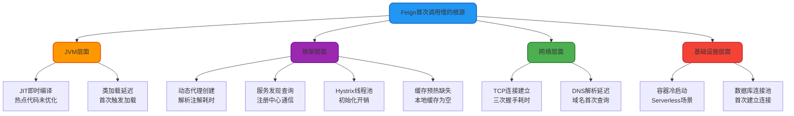

import PaidCTA from '@site/src/components/PaidCTA';

# Feign性能优化与负载均衡

## Feign 首次调用性能问题

### 问题现象

在 Spring Cloud 微服务架构中,很多开发者会遇到这样的问题:应用启动后,第一次通过 Feign 调用远程服务时响应明显变慢,甚至出现超时异常。而后续的调用速度则恢复正常。

这种"首次调用慢"的现象在生产环境可能导致用户体验下降,甚至触发服务降级策略。

### 根本原因分析

Feign 首次调用缓慢的原因是多方面的,涉及 JVM、网络、框架等多个层面:

#### 1. JIT 即时编译优化延迟

Java 采用即时编译(JIT)技术,首次执行的代码运行在解释模式下,性能较低。只有当方法被频繁调用成为"热点代码"后,JIT 编译器才会将其编译为本地机器码,大幅提升执行效率。

**影响范围**: Feign 客户端的代理逻辑、序列化反序列化、HTTP 客户端等核心路径

#### 2. 动态代理与注解解析

Feign 使用 JDK 动态代理或 CGLIB 生成客户端接口的实现类。首次调用时需要完成以下操作:

- 扫描接口上的 `@FeignClient`、`@GetMapping` 等注解
- 构建 HTTP 请求的元数据模板(URL、请求方法、参数映射等)
- 创建代理对象并注册到 Spring 容器

这些操作在复杂接口场景下可能耗时数百毫秒。

#### 3. 服务发现与实例获取

<PaidCTA />