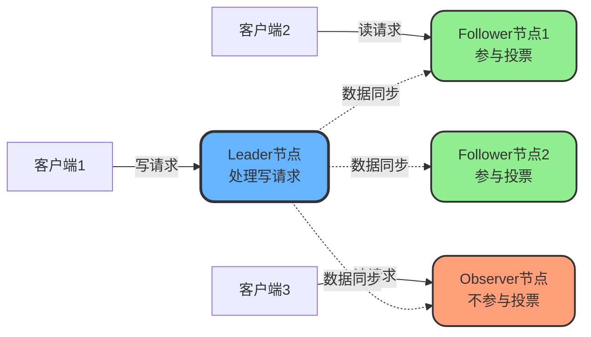
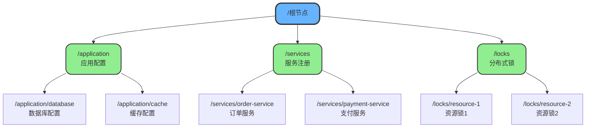

# Zookeeper核心架构与数据模型

## Zookeeper简介

Zookeeper是一个分布式协调服务框架,用于解决分布式系统中的数据一致性问题。它为分布式应用提供了高效且可靠的协调功能,包括配置管理、命名服务、分布式同步、集群管理等核心能力。

## 集群角色划分

在Zookeeper集群中,节点按照职责划分为以下几种角色:

### Leader(领导者)

Leader是集群的核心节点,承担以下职责:
- **发起投票和决议**:在集群选举过程中主导投票流程
- **处理写请求**:所有写操作都必须经过Leader处理
- **更新系统状态**:维护集群数据的权威版本
- **提供读写服务**:同时为客户端提供读和写操作

### Follower(跟随者)

Follower作为集群的工作节点,主要负责:
- **接收客户端请求**:处理来自客户端的连接和请求
- **转发写请求**:将写操作转发给Leader处理
- **参与选举投票**:在Leader选举时行使投票权
- **提供读服务**:直接响应客户端的读请求
- **同步数据**:从Leader同步最新的数据状态

### Observer(观察者)

Observer是一种特殊的节点类型,用于提升集群的读性能:
- **接收客户端连接**:扩展集群的服务容量
- **转发写请求**:将写操作转发到Leader
- **不参与投票**:在选举过程中没有投票权
- **同步Leader状态**:保持与Leader的数据一致性
- **提升读性能**:通过增加Observer节点横向扩展读能力



## CAP特性分析

Zookeeper在CAP理论中是典型的**CP系统**,即保证一致性(Consistency)和分区容错性(Partition Tolerance),在极端情况下会牺牲可用性(Availability)。

### CP特性的体现

**写操作限制**

当集群中存活节点数低于半数时,整个集群将拒绝写请求,确保不会出现数据不一致。这是一种典型的牺牲可用性来保证一致性的策略。

**Leader选举阶段**

在Leader选举过程中,新Leader尚未选出前,集群暂时无法接受写请求,直到选举完成才能恢复服务。

**网络分区处理**

当发生网络分区时,Zookeeper会将无法与集群通信的节点从管理范围剔除,即使这些节点本身健康可用,但为了保证一致性,到达这些节点的请求也会被丢弃。

### 一致性模型说明

需要特别注意的是,Zookeeper保证的是**顺序一致性(Sequential Consistency)**而非**线性一致性(Linearizability)**。

**顺序一致性的含义**

Zookeeper确保每个节点按照相同的顺序执行所有写操作,保证最终所有节点达到一致状态。但在数据同步过程中,不同节点可能暂时看到不同的数据视图。

**实际案例**

当Leader完成半数节点的数据同步后,就会提交事务。此时如果读请求发送到尚未同步的节点,可能会读到旧数据。但Zookeeper保证该节点最终会按顺序同步到最新数据。

### 实现线性一致性

如需要真正的强一致性(线性一致性),可以使用sync命令:

```java
// 商品库存管理系统示例
public class InventoryManager {
    private ZooKeeper zk;
    
    public int getLatestStock(String productId) throws Exception {
        String path = "/inventory/" + productId;
        // 先执行sync确保数据最新
        zk.sync(path, null, null);
        // 再读取数据,此时保证读到最新值
        byte[] data = zk.getData(path, false, null);
        return Integer.parseInt(new String(data));
    }
}
```

sync命令会强制Follower与Leader同步数据,确保后续读操作能获取到最新值,从而实现线性一致性。

## 数据模型

### 树形结构

Zookeeper采用类似文件系统的**树形目录结构**来组织数据。每个节点称为**ZNode**,具有唯一的路径标识。



### 节点特性

**数据存储**

每个ZNode可以存储数据和状态信息,但不支持部分读写,必须一次性完整读写。这种设计保证了数据的原子性。

**子节点管理**

除临时节点外,所有节点都可以拥有子节点,形成层次化的数据组织结构。

**监听器机制**

可以在节点上配置监听器(Watcher),实时监控节点数据的变化,实现分布式事件通知。

## 节点类型详解

### 持久节点(PERSISTENT)

持久节点在创建后会一直存在,直到主动删除。适合存储需要长期保存的配置信息。

```java
// 电商系统配置管理
public class ConfigManager {
    public void initSystemConfig(ZooKeeper zk) throws Exception {
        String configRoot = "/ecommerce/config";
        // 创建持久节点存储系统配置
        zk.create(configRoot, 
                 "system-config".getBytes(),
                 Ids.OPEN_ACL_UNSAFE, 
                 CreateMode.PERSISTENT);
        
        // 创建数据库配置节点
        String dbConfig = configRoot + "/database";
        String dbInfo = "jdbc:mysql://localhost:3306/shop";
        zk.create(dbConfig, 
                 dbInfo.getBytes(),
                 Ids.OPEN_ACL_UNSAFE, 
                 CreateMode.PERSISTENT);
    }
}
```

### 持久顺序节点(PERSISTENT_SEQUENTIAL)

持久顺序节点会自动在节点名后追加递增序号,序号范围为整型最大值。适合需要保持创建顺序的场景。

```java
// 订单序列生成器
public class OrderSequenceGenerator {
    public String generateOrderId(ZooKeeper zk) throws Exception {
        String orderRoot = "/orders";
        String orderPath = orderRoot + "/order-";
        
        // 创建持久顺序节点,自动追加序号
        String createdPath = zk.create(orderPath,
                                      "order-data".getBytes(),
                                      Ids.OPEN_ACL_UNSAFE,
                                      CreateMode.PERSISTENT_SEQUENTIAL);
        
        // 返回路径: /orders/order-0000000001
        //          /orders/order-0000000002
        //          /orders/order-0000000003
        return createdPath;
    }
}
```

### 临时节点(EPHEMERAL)

临时节点的生命周期与客户端会话绑定。当客户端会话失效时,节点自动删除。适合实现服务注册、分布式锁等场景。

```java
// 服务注册中心
public class ServiceRegistry {
    public void registerService(ZooKeeper zk) throws Exception {
        String serviceRoot = "/microservices";
        zk.create(serviceRoot, 
                 "services".getBytes(),
                 Ids.OPEN_ACL_UNSAFE, 
                 CreateMode.PERSISTENT);
        
        String servicePath = serviceRoot + "/payment-service";
        String serviceInfo = "192.168.1.100:8080";
        
        // 创建临时节点注册服务
        zk.create(servicePath,
                 serviceInfo.getBytes(),
                 Ids.OPEN_ACL_UNSAFE,
                 CreateMode.EPHEMERAL);
        
        Thread.sleep(20000); // 服务运行20秒
        zk.close(); // 关闭连接后临时节点自动删除
    }
}
```

**重要限制**:临时节点不能拥有子节点。

### 临时顺序节点(EPHEMERAL_SEQUENTIAL)

结合了临时节点和顺序节点的特性,既会自动追加序号,又在会话结束时自动删除。常用于实现分布式队列和公平锁。

```java
// 分布式队列实现
public class DistributedQueue {
    public void enqueue(ZooKeeper zk, String data) throws Exception {
        String queueRoot = "/task-queue";
        zk.create(queueRoot,
                 "queue".getBytes(),
                 Ids.OPEN_ACL_UNSAFE,
                 CreateMode.PERSISTENT);
        
        String taskPath = queueRoot + "/task-";
        
        // 创建临时顺序节点,自动编号
        String createdPath = zk.create(taskPath,
                                      data.getBytes(),
                                      Ids.OPEN_ACL_UNSAFE,
                                      CreateMode.EPHEMERAL_SEQUENTIAL);
        
        // 输出示例:
        // /task-queue/task-0000000001
        // /task-queue/task-0000000002
        // /task-queue/task-0000000003
        System.out.println("Task created: " + createdPath);
    }
}
```

## 访问控制

每个ZNode在创建时都会关联一个ACL(访问控制列表),用于决定哪些客户端可以执行何种操作,实现细粒度的权限控制。

## 监听机制

Watcher是Zookeeper的核心功能之一,可以监控节点的数据变化和子节点变化。

**可设置监听的操作**
- exists: 检查节点是否存在
- getData: 获取节点数据
- getChildren: 获取子节点列表

**可触发监听的操作**
- create: 创建节点
- delete: 删除节点
- setData: 修改节点数据

当节点状态发生变化时,Zookeeper会主动通知设置了Watcher的客户端,使其能够及时响应变化,实现分布式协调功能。
