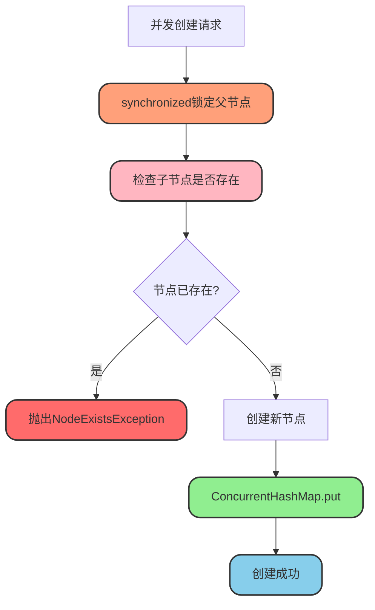
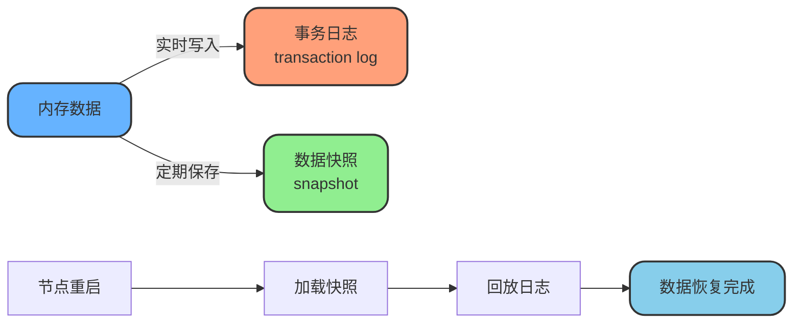

# Zookeeper一致性保障机制

## 一致性保障概述

Zookeeper作为分布式一致性协调组件,其核心目标就是保证集群中所有节点的数据一致性。通过**ZAB协议(Zookeeper Atomic Broadcast)**实现强一致性保障,该协议类似于Paxos和Raft,但针对Zookeeper"读多写少"的场景做了专门优化。

## ZAB协议核心思想

ZAB协议通过以下机制确保数据一致性:

### 单点写入原则

所有写操作(create、setData、delete)必须由Leader节点统一处理。即使客户端将写请求发送到Follower节点,也会被转发到Leader执行。这种设计避免了多点写入导致的冲突。

### 全局顺序保证

Leader为每个写操作分配全局唯一且递增的事务ID(**zxid**),确保所有节点按照相同顺序执行写操作,从而保证数据的顺序一致性。

### 多数确认机制

Leader在处理写请求时,会将操作广播给所有Follower。只有当**超过半数节点**写入成功后,事务才被视为提交成功。这是Quorum机制的核心,确保数据的可靠性。

```mermaid
sequenceDiagram
    participant Client as 客户端
    participant Leader as Leader节点
    participant F1 as Follower1
    participant F2 as Follower2
    participant F3 as Follower3
    
    Client->>Leader: 写请求(创建/update/order)
    Leader->>Leader: 分配zxid=1001
    Leader->>F1: 广播事务(zxid=1001)
    Leader->>F2: 广播事务(zxid=1001)
    Leader->>F3: 广播事务(zxid=1001)
    F1-->>Leader: ACK确认
    F2-->>Leader: ACK确认
    Note over Leader: 收到半数以上确认
    Leader->>Leader: 提交事务
    Leader->>F1: 通知提交
    Leader->>F2: 通知提交
    Leader->>F3: 通知提交
    Leader-->>Client: 返回成功
    
    style Leader fill:#66b3ff,stroke:#333,stroke-width:3px,rx:15,ry:15
    style F1 fill:#90ee90,stroke:#333,stroke-width:2px,rx:15,ry:15
    style F2 fill:#90ee90,stroke:#333,stroke-width:2px,rx:15,ry:15
    style F3 fill:#90ee90,stroke:#333,stroke-width:2px,rx:15,ry:15
```

## 写入一致性保障

### 全局事务ID(zxid)

zxid是Zookeeper中至关重要的概念,它是一个64位的长整型数字,分为两部分:

- **高32位**:表示Leader的epoch(纪元),每次选举出新Leader时递增
- **低32位**:表示事务在当前epoch中的顺序号

```mermaid
graph LR
    A[写请求到达Leader]
    B[分配全局唯一zxid]
    C[广播给所有Follower]
    D[等待半数以上ACK]
    E[提交事务]
    F[通知所有节点apply]
    G[返回客户端成功]
    
    A --> B --> C --> D --> E --> F --> G
    
    style A fill:#ffb6c1,stroke:#333,stroke-width:2px,rx:15,ry:15
    style D fill:#ffa07a,stroke:#333,stroke-width:2px,rx:15,ry:15
    style E fill:#90ee90,stroke:#333,stroke-width:2px,rx:15,ry:15
    style G fill:#87ceeb,stroke:#333,stroke-width:2px,rx:15,ry:15
```



### 版本号机制

Zookeeper的每个ZNode都内置了版本号(**version**)和zxid,可以基于版本号进行乐观锁控制,防止并发写入冲突。

```java
// 库存扣减场景 - 使用版本号防止超卖
public class StockManager {
    private ZooKeeper zk;
    
    public boolean decreaseStock(String productId, int quantity) {
        try {
            String stockPath = "/inventory/" + productId;
            
            // 获取当前库存和版本号
            Stat stat = new Stat();
            byte[] data = zk.getData(stockPath, false, stat);
            int currentStock = Integer.parseInt(new String(data));
            
            if (currentStock < quantity) {
                System.out.println("库存不足,当前库存:" + currentStock);
                return false;
            }
            
            // 扣减库存
            int newStock = currentStock - quantity;
            
            // 使用版本号进行CAS操作,防止并发冲突
            zk.setData(stockPath, 
                      String.valueOf(newStock).getBytes(), 
                      stat.getVersion()); // 版本号必须匹配才能更新成功
            
            System.out.println("扣减成功,剩余库存:" + newStock);
            return true;
            
        } catch (KeeperException.BadVersionException e) {
            // 版本号不匹配,说明数据已被其他客户端修改
            System.out.println("并发冲突,请重试");
            return false;
        } catch (Exception e) {
            e.printStackTrace();
            return false;
        }
    }
}
```

## 节点创建唯一性保障

Zookeeper通过双重机制确保节点创建的唯一性,避免并发环境下重复创建节点。

### 机制一:Leader统一处理

所有写请求都由Leader节点统一处理。即使客户端连接到Follower,写请求也会被转发到Leader执行,从根本上避免了多节点并发写入的问题。

### 机制二:synchronized + CAS双重保障

在Leader内部,通过加锁和CAS操作保证同一时刻只有一个线程能够成功创建节点。

#### 源码分析

在Zookeeper的`DataTree.createNode()`方法中实现了创建节点的核心逻辑:

```java
// 节点创建的核心实现
public void createNode(final String path, byte[] data, 
                      List<ACL> acl, long ephemeralOwner, 
                      int parentCVersion, long zxid, long time, 
                      Stat outputStat) throws NodeExistsException {
    
    // 解析路径,获取父节点和子节点名称
    int lastSlash = path.lastIndexOf('/');
    String parentName = path.substring(0, lastSlash);
    String childName = path.substring(lastSlash + 1);
    
    // 获取父节点
    DataNode parent = nodes.get(parentName);
    if (parent == null) {
        throw new NoNodeException();
    }
    
    // 关键点1: 对父节点加锁,确保同一父节点下的并发创建是串行的
    synchronized (parent) {
        // 转换ACL
        Long acls = aclCache.convertAcls(acl);
        
        // 获取父节点的所有子节点
        Set<String> children = parent.getChildren();
        
        // 关键点2: 检查节点是否已存在
        if (children.contains(childName)) {
            throw new NodeExistsException();
        }
        
        // 更新父节点版本号
        if (parentCVersion > parent.stat.getCversion()) {
            parent.stat.setCversion(parentCVersion);
            parent.stat.setPzxid(zxid);
        }
        
        // 创建新节点
        StatPersisted stat = createStat(zxid, time, ephemeralOwner);
        DataNode child = new DataNode(data, acls, stat);
        
        // 将子节点添加到父节点
        parent.addChild(childName);
        
        // 关键点3: 使用ConcurrentHashMap存储节点,保证线程安全
        nodes.put(path, child);
        
        // 处理临时节点、容器节点等特殊类型
        EphemeralType ephemeralType = EphemeralType.get(ephemeralOwner);
        if (ephemeralType == EphemeralType.CONTAINER) {
            containers.add(path);
        } else if (ephemeralType == EphemeralType.TTL) {
            ttls.add(path);
        } else if (ephemeralOwner != 0) {
            HashSet<String> list = ephemerals.computeIfAbsent(
                ephemeralOwner, k -> new HashSet<>());
            synchronized (list) {
                list.add(path);
            }
        }
    }
}
```

#### 三重保障机制



**第一重:synchronized加锁**

对父节点加互斥锁,确保同一时刻只有一个线程可以在该父节点下创建子节点,避免并发创建。

**第二重:重复性检查**

在锁内检查子节点集合中是否已包含待创建的节点名,如果存在则直接抛出`NodeExistsException`异常。

**第三重:ConcurrentHashMap保证**

节点数据存储在`NodeHashMap`中,其内部使用`ConcurrentHashMap`实现,即使在高并发场景下也能保证put操作的原子性。

```java
// NodeHashMap的内部实现
public class NodeHashMapImpl implements NodeHashMap {
    private final ConcurrentHashMap<String, DataNode> nodes;
    
    public NodeHashMapImpl(DigestCalculator digestCalculator) {
        this.nodes = new ConcurrentHashMap<>();
        // 初始化摘要计算器等
    }
    
    @Override
    public DataNode put(String path, DataNode node) {
        // 利用ConcurrentHashMap的线程安全特性
        DataNode oldNode = nodes.put(path, node);
        addDigest(path, node);
        if (oldNode != null) {
            removeDigest(path, oldNode);
        }
        return oldNode;
    }
}
```

### 实际应用示例

```java
// 分布式ID生成器 - 利用节点唯一性
public class DistributedIdGenerator {
    private ZooKeeper zk;
    
    public String generateUniqueId(String business) {
        try {
            String idRoot = "/id-generator/" + business;
            
            // 创建业务根节点(持久节点)
            try {
                zk.create(idRoot, 
                         "id-root".getBytes(),
                         Ids.OPEN_ACL_UNSAFE,
                         CreateMode.PERSISTENT);
            } catch (KeeperException.NodeExistsException e) {
                // 根节点已存在,忽略
            }
            
            // 创建顺序节点生成唯一ID
            String idPath = idRoot + "/id-";
            String createdPath = zk.create(idPath,
                                          System.currentTimeMillis() + "".getBytes(),
                                          Ids.OPEN_ACL_UNSAFE,
                                          CreateMode.PERSISTENT_SEQUENTIAL);
            
            // 提取序号作为唯一ID
            // 例如: /id-generator/order/id-0000000001
            String uniqueId = createdPath.substring(createdPath.lastIndexOf('-') + 1);
            return business + "-" + uniqueId;
            
        } catch (Exception e) {
            e.printStackTrace();
            return null;
        }
    }
}
```

## Leader选举与数据同步

当发生故障或集群重启时,Zookeeper会进行Leader选举:

**选举依据**

基于epoch(选举轮次)和zxid选出数据最完整的节点作为Leader。

**数据同步**

选举完成后,其他节点会回滚或追赶日志,与Leader保持同步。

**对外服务**

系统进入一致状态后才开始对外提供服务,确保数据一致性。

## 持久化机制

### 事务日志

所有事务操作都会持久化到磁盘上的事务日志中,确保操作的持久性和可追溯性。

### 数据快照

Zookeeper会周期性地将内存数据快照到磁盘,加速节点重启后的数据恢复速度。

### 崩溃恢复

节点重启后通过回放事务日志和加载快照文件恢复数据,保证崩溃恢复后仍然与集群保持一致。



## 总结

Zookeeper通过**ZAB协议 + Leader单点写入 + 多数确认机制 + 持久化日志**等多重手段,确保分布式集群中所有节点的强一致性(顺序一致性)。在节点创建时,通过synchronized加锁、重复性检查和ConcurrentHashMap三重保障,确保即使在高并发场景下也不会创建重复节点,为上层分布式应用提供了可靠的一致性保证。
