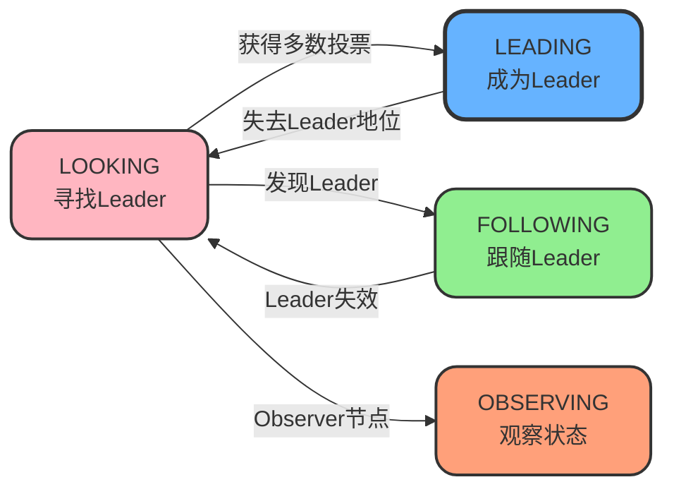
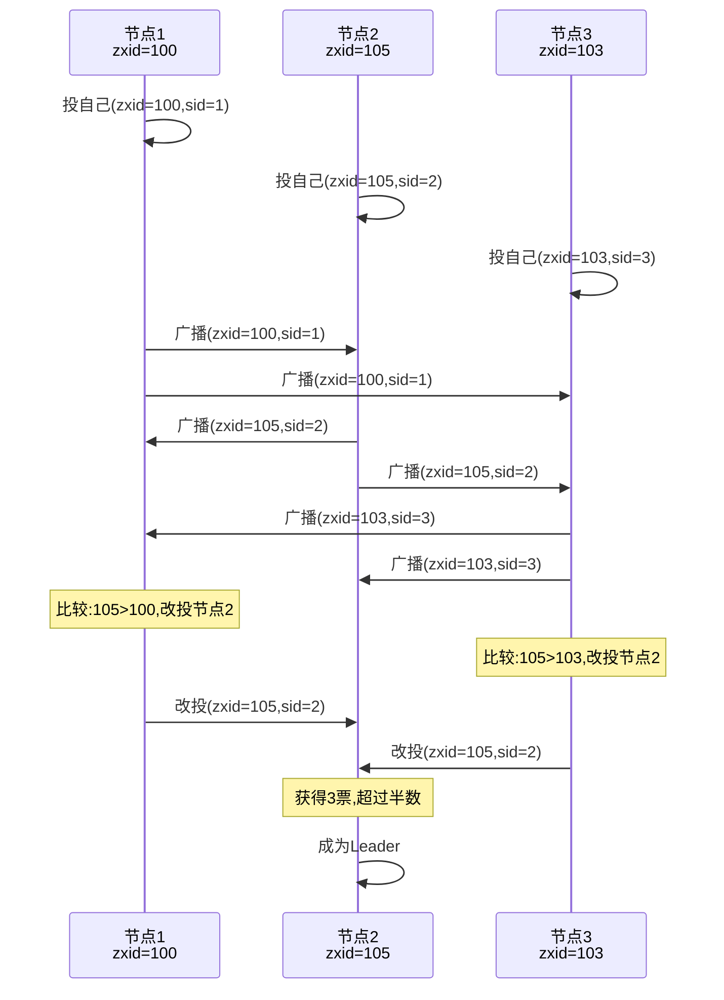
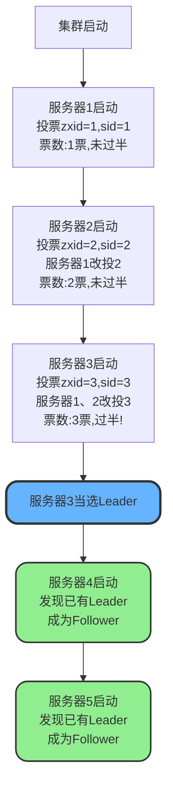
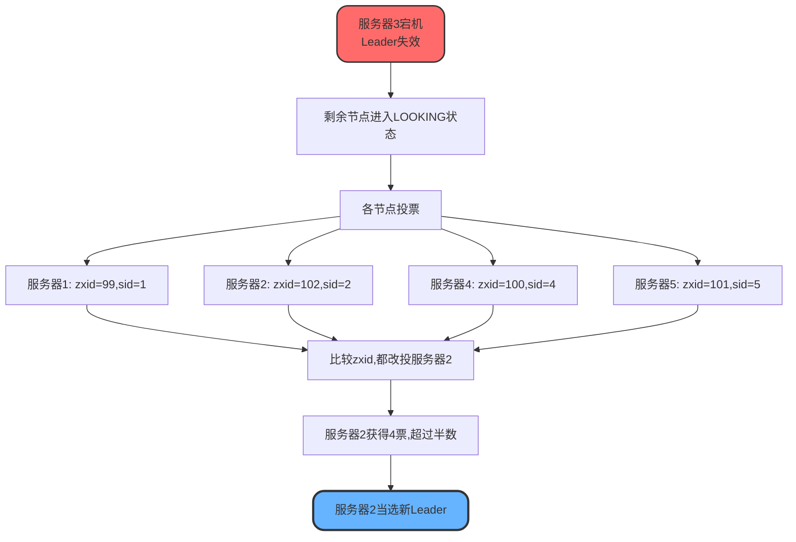
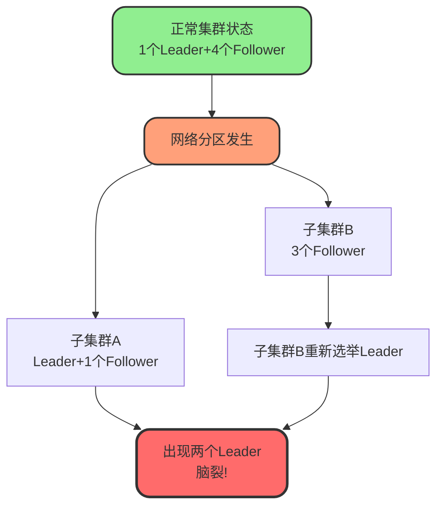
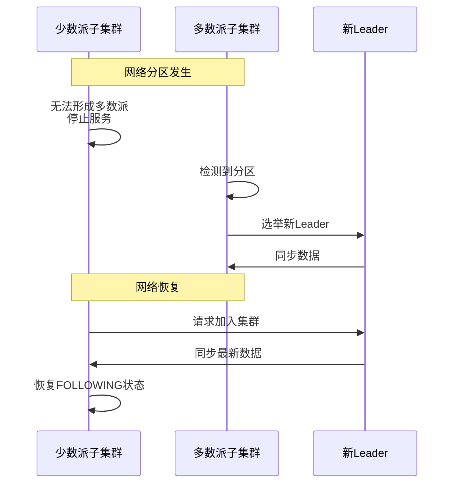

# Zookeeper选举机制详解

## Leader选举概述

Leader选举是Zookeeper实现分布式协调一致性的核心机制。通过选举机制确保集群中有且仅有一个Leader节点来协调和处理客户端的写请求,保证数据的一致性和系统的可用性。

## 节点选举状态

在选举过程中,Zookeeper节点会经历不同的状态转换:

**LOOKING(竞选状态)**

节点正在寻找Leader,处于选举投票阶段。

**FOLLOWING(跟随者状态)**

节点已确认Leader,作为Follower同步Leader状态并参与投票。

**OBSERVING(观察者状态)**

节点同步Leader状态,但不参与投票过程。

**LEADING(领导者状态)**

节点当选为Leader,负责处理写请求和协调集群。



## 选举核心原则

### 遇强投强策略

在投票过程中,所有节点都遵循"遇强投强"的原则,即优先投票给数据更新、更完整的节点。

### 强弱判断标准

Zookeeper通过**事务ID(zxid)**来判断节点的强弱:

**zxid的含义**

zxid是一个64位的长整型数字,用于标识每个事务操作。zxid越大,说明节点执行的事务越新,数据越完整,节点能力越强。

**zxid的结构**
- 高32位:epoch(选举轮次)
- 低32位:事务计数器

### 投票信息

每次投票包含两个关键信息:

**zxid(事务ID)**

标识节点的数据新旧程度。

**sid(服务器ID)**

唯一标识集群中的每个节点。

## 选举流程详解

### 初始化阶段

集群启动时,所有节点都处于LOOKING状态,开始寻找Leader。每个节点监听其他节点,等待接收选举消息。

### 自荐和投票



**步骤说明**

1. 每个节点首先投自己一票,认为自己是最强的候选者
2. 将投票信息(包含zxid和sid)广播给集群中的所有节点
3. 收到其他节点的投票后,比较zxid大小
4. 如果对方的zxid更大,说明对方数据更新,则改投对方
5. 将更新后的投票再次广播出去

### 选举周期

选举分为多个轮次,每个轮次称为一个选举周期。在每个周期中:

**多数原则**

如果某个候选者获得超过半数节点的投票,则当选为Leader。

**选举失败**

如果没有候选者获得足够投票,则进入下一个选举周期继续选举。

### Leader确认

一旦候选者获得多数投票,立即成为Leader并向其他节点发送Leader就绪消息,通知自己已成为Leader并开始处理客户端请求。

### 集群同步

新Leader选举完成后,其他节点与Leader同步数据,包括:
- 同步未完成的事务
- 同步最新的数据状态
- 确保所有节点达到一致状态

## 选举场景分析

### 场景一:集群启动选举

假设有5台服务器组成的集群,服务器ID从1到5,全部为最新启动且无历史数据。



**详细过程**

**服务器1启动**
- 状态:LOOKING
- 投票:(zxid=1, sid=1)
- 结果:1票,未过半,继续选举

**服务器2启动**
- 服务器2投票:(zxid=2, sid=2)
- 服务器1收到投票,比较后改投服务器2
- 结果:服务器2获得2票,未过半,继续选举

**服务器3启动**
- 服务器3投票:(zxid=3, sid=3)
- 服务器1、2收到投票后,发现服务器3的zxid最大,都改投服务器3
- 结果:服务器3获得3票,超过半数(5/2+1=3)
- **服务器3当选Leader**,服务器1、2变为Follower

**服务器4启动**
- 发现集群已有Leader
- 直接成为Follower,状态:FOLLOWING

**服务器5启动**
- 发现集群已有Leader
- 直接成为Follower,状态:FOLLOWING

**最终状态**
- 服务器3:LEADING
- 服务器1、2、4、5:FOLLOWING

### 场景二:Leader失效重新选举

假设初始状态下服务器3是Leader,各服务器的zxid分别为:
- 服务器1:zxid=99
- 服务器2:zxid=102
- 服务器3:zxid=105(Leader,已宕机)
- 服务器4:zxid=100
- 服务器5:zxid=101



**选举步骤**

1. **Leader失效检测**
   - 服务器3宕机,Follower节点检测到心跳超时
   - 所有Follower进入LOOKING状态,开始新一轮选举

2. **初始投票**
   - 服务器1投票:(zxid=99, sid=1)
   - 服务器2投票:(zxid=102, sid=2)
   - 服务器4投票:(zxid=100, sid=4)
   - 服务器5投票:(zxid=101, sid=5)

3. **投票比较和改投**
   - 服务器1收到其他投票,发现102最大,改投服务器2
   - 服务器4收到其他投票,发现102最大,改投服务器2
   - 服务器5收到其他投票,发现102最大,改投服务器2

4. **选举结果**
   - 服务器2获得4票(包括自己),超过半数
   - **服务器2当选新Leader**

5. **集群同步**
   - 服务器2作为新Leader开始同步数据
   - 其他节点与新Leader同步,恢复一致状态

## 脑裂问题

### 什么是脑裂

脑裂是指分布式系统因网络或节点故障,被分割成多个独立的子系统,每个子系统都认为自己是完整的主系统,导致系统失去一致性和可用性。



### 脑裂产生原因

**网络分区**

当集群中部分节点无法与其他节点通信时,出现网络分区。无法确定哪个节点是真正的Leader,可能导致多个Leader并存。

**主节点宕机后恢复**

原Leader宕机后,集群选举出新Leader。如果旧Leader恢复后未及时发现新Leader,可能产生双Leader冲突。

### 脑裂恢复机制

**自动恢复**

Zookeeper具备自动检测和恢复脑裂的能力:

1. **识别集群分裂**
   - 检测到网络分区或节点失联
   - 发现集群被分割成多个子集群

2. **过半原则保护**
   - 只有包含超过半数节点的子集群才能继续对外服务
   - 少数派子集群自动停止服务,进入LOOKING状态

3. **重新选举Leader**
   - 多数派子集群中的节点进行Leader选举
   - 通过epoch+zxid选出数据最新的节点作为Leader

4. **数据同步**
   - 新Leader使用原子广播机制同步数据
   - 确保所有节点达到一致状态

5. **恢复正常服务**
   - 网络分区恢复后,少数派节点重新加入集群
   - 与Leader同步数据后恢复正常服务



**手动恢复**

在某些极端情况下,需要人工介入恢复:

1. 在网络分区的节点上运行独立的Zookeeper实例
2. 等待网络分区恢复
3. 手动合并集群,同步数据
4. 重新进行Leader选举

### 脑裂预防策略

**合理的选举超时时间**

设置适当的选举超时时间,避免因短暂网络抖动触发频繁的Leader选举。

```properties
# Zookeeper配置示例
# 心跳间隔(单位:毫秒)
tickTime=2000
# 初始化连接超时时间(tickTime的倍数)
initLimit=10
# Leader与Follower同步超时时间(tickTime的倍数)
syncLimit=5
```

**合理的节点数量**

采用奇数个节点(如3、5、7),确保能够有效应用过半原则。推荐配置:
- 小规模集群:3个节点
- 中等规模集群:5个节点
- 大规模集群:7个节点

**Watch监听机制**

利用Zookeeper的Watch机制监听节点状态变化,及时发现并处理异常情况。

```java
// 监听Leader变化,及时发现脑裂
public class LeaderMonitor implements Watcher {
    private ZooKeeper zk;
    
    public void monitorLeader() throws Exception {
        String leaderPath = "/election/leader";
        
        // 监听Leader节点
        zk.exists(leaderPath, this);
    }
    
    @Override
    public void process(WatchedEvent event) {
        if (event.getType() == Event.EventType.NodeDeleted) {
            System.out.println("Leader节点消失,可能发生故障!");
            // 触发告警或恢复流程
        } else if (event.getType() == Event.EventType.NodeDataChanged) {
            System.out.println("Leader节点数据变化,检查是否脑裂!");
            // 检查集群状态
        }
        
        try {
            // 重新设置监听
            zk.exists(event.getPath(), this);
        } catch (Exception e) {
            e.printStackTrace();
        }
    }
}
```

**网络质量保障**

- 使用高质量的网络设备,减少网络故障概率
- 合理规划网络拓扑,避免单点故障
- 定期检查网络连接质量

## 总结

Zookeeper的Leader选举机制通过"遇强投强"的策略和过半原则,确保集群能够选出数据最完整的节点作为Leader。在面对脑裂问题时,Zookeeper通过自动检测、过半原则保护和数据同步等机制,能够有效地恢复集群一致性。合理配置选举参数、节点数量以及利用Watch机制,可以最大程度地预防和减少脑裂问题的发生。
