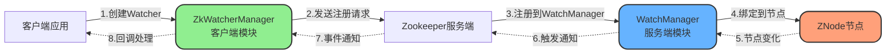
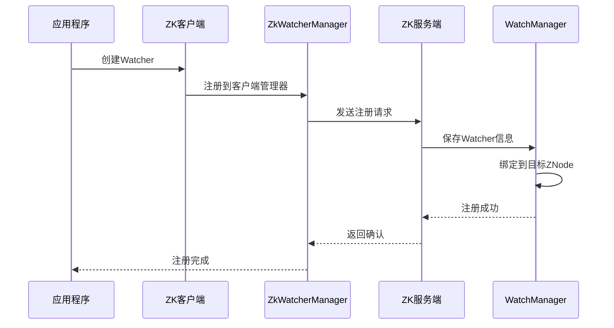
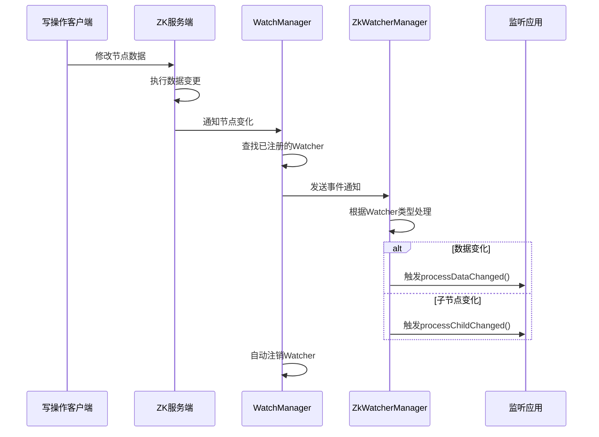
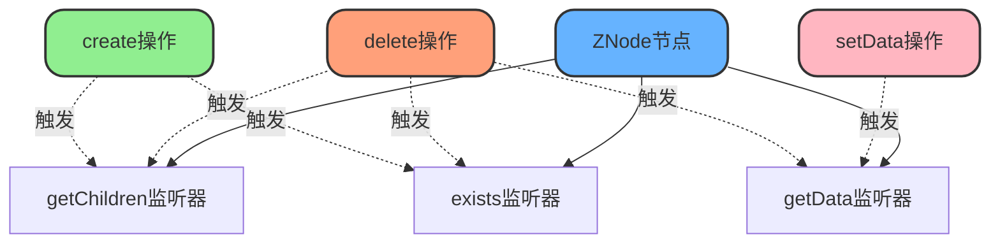

# Zookeeper监听机制与通知

## Watch机制概述

Watch机制是Zookeeper的核心特性之一,它提供了一种高效的事件通知机制,允许客户端监听节点的变化,从而实现分布式环境下的数据同步和协调。当被监听的节点发生变化时,Zookeeper会主动通知客户端,使应用程序能够及时做出响应。

## 核心组件

Watch机制涉及客户端和服务端两个关键模块:

### WatchManager(服务端模块)

WatchManager是Zookeeper服务端的核心组件,负责管理所有监听器的生命周期:

**职责范围**
- **注册Watcher**:将客户端的监听器注册到对应的ZNode上
- **存储Watcher信息**:在内存中维护节点与监听器的映射关系
- **触发Watcher**:当节点发生变化时,查找并触发相应的监听器
- **注销Watcher**:监听器触发后自动注销(一次性监听)

### ZkWatcherManager(客户端模块)

ZkWatcherManager运行在客户端,管理客户端侧的监听器操作:

**职责范围**
- **创建Watcher**:根据业务需求创建不同类型的监听器
- **注册Watcher到客户端**:维护本地的监听器列表
- **处理事件通知**:接收服务端的通知并触发相应的回调方法
- **管理Watcher生命周期**:控制监听器的创建、触发和销毁



## Watch工作流程

### 注册阶段



**详细步骤**

1. **客户端连接Zookeeper**
   - 应用程序建立与Zookeeper集群的连接
   - 客户端创建ZkWatcherManager实例

2. **创建并注册Watcher**
   - 应用程序调用ZkWatcherManager创建监听器
   - 客户端将Watcher信息发送到服务端

3. **服务端处理注册**
   - Zookeeper服务端接收Watcher注册请求
   - WatchManager将Watcher注册到对应的ZNode上
   - 在内存中保存Watcher与节点的映射关系

### 触发阶段



**详细步骤**

1. **节点发生变化**
   - 有客户端对ZNode执行了写操作(create/setData/delete)
   - 服务端完成数据变更

2. **WatchManager发现变化**
   - 检测到ZNode状态改变
   - 查找该节点上注册的所有Watcher

3. **服务端发送通知**
   - Zookeeper Server根据变化类型通知相关客户端
   - 告知具体发生了哪种变化(创建/修改/删除)

4. **客户端处理事件**
   - ZkWatcherManager接收到通知
   - 根据Watcher类型触发相应的回调方法:
     - **Data Watcher**:触发`processDataChanged()`
     - **Child Watcher**:触发`processChildChanged()`

5. **Watcher自动注销**
   - Watcher触发后会被自动移除
   - 如需继续监听,必须重新注册

## Watcher类型

### Data Watcher(数据监听器)

监听节点数据的变化,当节点内容发生修改时触发。

```java
// 配置中心实时更新示例
public class ConfigWatcher implements Watcher {
    private ZooKeeper zk;
    private String configPath = "/app-config/database";
    
    public void watchConfig() throws Exception {
        // 注册Data Watcher
        byte[] data = zk.getData(configPath, this, null);
        String config = new String(data);
        System.out.println("当前配置: " + config);
    }
    
    @Override
    public void process(WatchedEvent event) {
        if (event.getType() == Event.EventType.NodeDataChanged) {
            System.out.println("配置发生变化,重新加载!");
            try {
                // 读取新配置
                byte[] newData = zk.getData(configPath, this, null);
                String newConfig = new String(newData);
                System.out.println("新配置: " + newConfig);
                
                // 应用新配置
                applyNewConfig(newConfig);
                
                // 重新注册监听(Watcher是一次性的)
                zk.getData(configPath, this, null);
            } catch (Exception e) {
                e.printStackTrace();
            }
        }
    }
    
    private void applyNewConfig(String config) {
        // 更新应用配置
        System.out.println("应用新配置: " + config);
    }
}
```

### Child Watcher(子节点监听器)

监听节点的子节点列表变化,当子节点增加或删除时触发。

```java
// 服务发现场景:监听服务实例变化
public class ServiceDiscovery implements Watcher {
    private ZooKeeper zk;
    private String servicePath = "/services/order-service";
    
    public void discoverServices() throws Exception {
        // 注册Child Watcher
        List<String> children = zk.getChildren(servicePath, this);
        
        System.out.println("当前可用服务实例:");
        for (String instance : children) {
            String instancePath = servicePath + "/" + instance;
            byte[] data = zk.getData(instancePath, false, null);
            System.out.println(" - " + instance + ": " + new String(data));
        }
    }
    
    @Override
    public void process(WatchedEvent event) {
        if (event.getType() == Event.EventType.NodeChildrenChanged) {
            System.out.println("服务实例列表发生变化!");
            try {
                // 重新获取服务列表
                List<String> newChildren = zk.getChildren(servicePath, this);
                
                System.out.println("更新后的服务实例:");
                for (String instance : newChildren) {
                    String instancePath = servicePath + "/" + instance;
                    byte[] data = zk.getData(instancePath, false, null);
                    System.out.println(" - " + instance + ": " + new String(data));
                }
                
                // 更新本地服务列表
                updateServiceList(newChildren);
                
            } catch (Exception e) {
                e.printStackTrace();
            }
        }
    }
    
    private void updateServiceList(List<String> services) {
        // 更新本地缓存的服务列表
        System.out.println("本地服务列表已更新,共 " + services.size() + " 个实例");
    }
}
```

## 可监听的操作

以下操作可以在节点上设置监听:

**exists**

检查节点是否存在,可监听节点的创建和删除事件。

```java
// 监听节点创建
Stat stat = zk.exists("/config/app", new Watcher() {
    public void process(WatchedEvent event) {
        if (event.getType() == Event.EventType.NodeCreated) {
            System.out.println("节点被创建");
        }
    }
});
```

**getData**

获取节点数据,可监听节点数据的变化。

```java
// 监听数据变化
byte[] data = zk.getData("/config/database", new Watcher() {
    public void process(WatchedEvent event) {
        if (event.getType() == Event.EventType.NodeDataChanged) {
            System.out.println("节点数据被修改");
        }
    }
}, null);
```

**getChildren**

获取子节点列表,可监听子节点的增加或删除。

```java
// 监听子节点变化
List<String> children = zk.getChildren("/services", new Watcher() {
    public void process(WatchedEvent event) {
        if (event.getType() == Event.EventType.NodeChildrenChanged) {
            System.out.println("子节点发生变化");
        }
    }
});
```

## 可触发监听的操作

以下操作会触发已注册的监听器:

**create**

创建节点,会触发父节点的Child Watcher和exists操作设置的Watcher。

**delete**

删除节点,会触发该节点的Data Watcher和父节点的Child Watcher。

**setData**

修改节点数据,会触发该节点的Data Watcher。



## 实战应用场景

### 场景一:分布式配置中心

```java
public class DistributedConfigCenter {
    private ZooKeeper zk;
    private Map<String, String> localConfig = new ConcurrentHashMap<>();
    
    public void init() throws Exception {
        String configRoot = "/config-center";
        
        // 监听整个配置目录
        watchConfigDirectory(configRoot);
    }
    
    private void watchConfigDirectory(String path) throws Exception {
        // 获取所有配置项并设置监听
        List<String> configs = zk.getChildren(path, new Watcher() {
            @Override
            public void process(WatchedEvent event) {
                if (event.getType() == Event.EventType.NodeChildrenChanged) {
                    System.out.println("配置项列表发生变化");
                    try {
                        // 重新加载配置
                        watchConfigDirectory(path);
                    } catch (Exception e) {
                        e.printStackTrace();
                    }
                }
            }
        });
        
        // 为每个配置项设置数据监听
        for (String config : configs) {
            String configPath = path + "/" + config;
            watchConfigItem(configPath);
        }
    }
    
    private void watchConfigItem(String path) throws Exception {
        byte[] data = zk.getData(path, new Watcher() {
            @Override
            public void process(WatchedEvent event) {
                if (event.getType() == Event.EventType.NodeDataChanged) {
                    try {
                        // 重新读取并更新配置
                        byte[] newData = zk.getData(path, this, null);
                        String configKey = path.substring(path.lastIndexOf('/') + 1);
                        String configValue = new String(newData);
                        
                        localConfig.put(configKey, configValue);
                        System.out.println("配置更新: " + configKey + " = " + configValue);
                        
                    } catch (Exception e) {
                        e.printStackTrace();
                    }
                }
            }
        }, null);
        
        // 初始化本地配置
        String configKey = path.substring(path.lastIndexOf('/') + 1);
        localConfig.put(configKey, new String(data));
    }
    
    public String getConfig(String key) {
        return localConfig.get(key);
    }
}
```

### 场景二:集群节点监控

```java
public class ClusterMonitor {
    private ZooKeeper zk;
    private Set<String> activeNodes = new CopyOnWriteArraySet<>();
    
    public void monitorCluster() throws Exception {
        String clusterPath = "/cluster/nodes";
        
        // 监听集群节点变化
        List<String> nodes = zk.getChildren(clusterPath, new Watcher() {
            @Override
            public void process(WatchedEvent event) {
                if (event.getType() == Event.EventType.NodeChildrenChanged) {
                    System.out.println("集群拓扑发生变化");
                    try {
                        updateClusterTopology(clusterPath);
                    } catch (Exception e) {
                        e.printStackTrace();
                    }
                }
            }
        });
        
        updateActiveNodes(nodes);
    }
    
    private void updateClusterTopology(String clusterPath) throws Exception {
        List<String> currentNodes = zk.getChildren(clusterPath, this);
        
        // 发现新增节点
        Set<String> newNodes = new HashSet<>(currentNodes);
        newNodes.removeAll(activeNodes);
        for (String node : newNodes) {
            System.out.println("新节点上线: " + node);
            onNodeJoin(node);
        }
        
        // 发现下线节点
        Set<String> removedNodes = new HashSet<>(activeNodes);
        removedNodes.removeAll(currentNodes);
        for (String node : removedNodes) {
            System.out.println("节点下线: " + node);
            onNodeLeave(node);
        }
        
        updateActiveNodes(currentNodes);
    }
    
    private void updateActiveNodes(List<String> nodes) {
        activeNodes.clear();
        activeNodes.addAll(nodes);
        System.out.println("当前活跃节点数: " + activeNodes.size());
    }
    
    private void onNodeJoin(String node) {
        // 处理节点加入逻辑,如负载重新分配
        System.out.println("触发负载均衡重新分配");
    }
    
    private void onNodeLeave(String node) {
        // 处理节点离开逻辑,如故障转移
        System.out.println("触发故障转移流程");
    }
}
```

## Watch机制特点

### 一次性触发

Watcher是一次性的,触发后会被自动移除。如果需要持续监听,必须在回调方法中重新注册。

```java
// 错误示例:未重新注册
zk.getData("/config", new Watcher() {
    public void process(WatchedEvent event) {
        System.out.println("数据变化"); // 只会触发一次
    }
}, null);

// 正确示例:重新注册实现持续监听
zk.getData("/config", new Watcher() {
    public void process(WatchedEvent event) {
        System.out.println("数据变化");
        try {
            // 重新注册监听
            zk.getData("/config", this, null);
        } catch (Exception e) {
            e.printStackTrace();
        }
    }
}, null);
```

### 轻量级通知

Watcher只通知变化发生,不会传递变化后的数据内容。客户端需要主动查询获取最新数据。

### 有序性保证

客户端接收到的事件通知顺序与服务端发送的顺序一致,保证了事件的顺序性。

## 总结

Zookeeper的Watch机制通过WatchManager和ZkWatcherManager的协同工作,实现了高效的分布式事件通知。它支持数据变化和子节点变化两种监听类型,广泛应用于配置管理、服务发现、集群监控等场景。理解Watch机制的工作原理和特点,能够帮助我们更好地设计和实现分布式协调功能。
