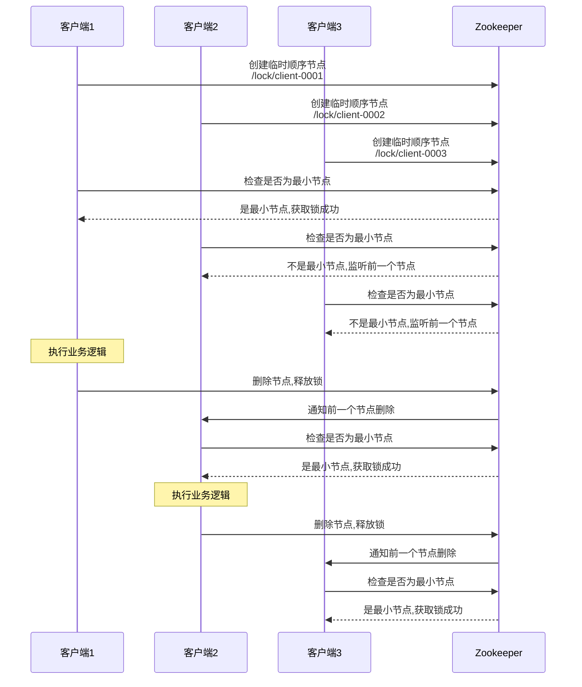
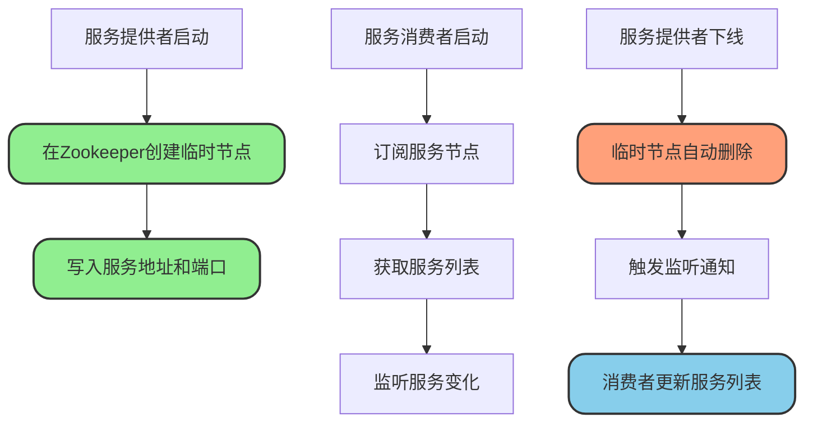
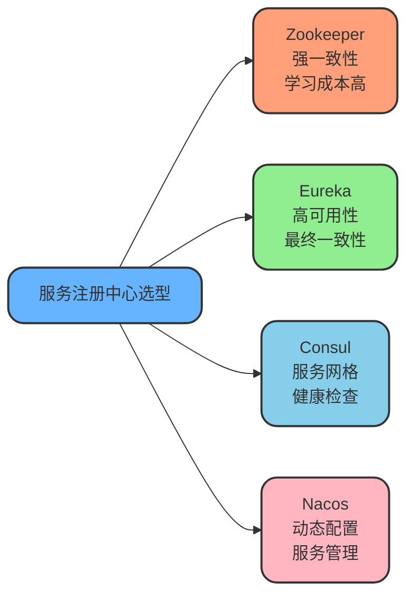
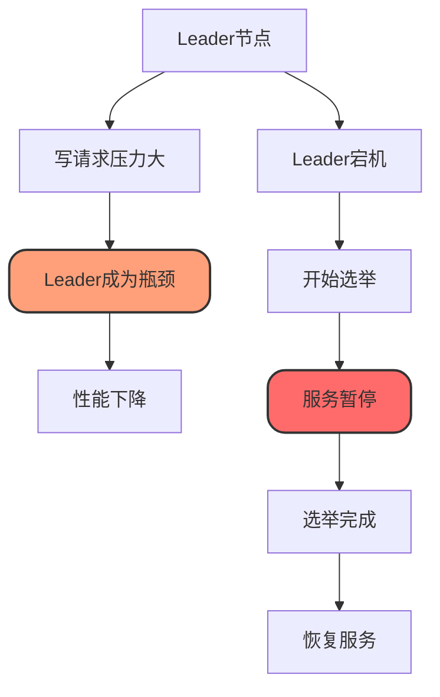

# Zookeeper典型应用场景

## 典型应用场景

Zookeeper作为分布式协调服务,在分布式系统中有着广泛的应用。以下介绍几种最常见的使用场景。

### 分布式配置管理

Zookeeper可以集中存储配置信息,应用程序可以动态读取和监听配置变化,实现配置的实时更新,无需重启服务。

**应用场景**:多环境配置管理、动态参数调整、开关控制等。

### 分布式同步

Zookeeper通过ZAB协议协调各个节点的同步,确保分布式环境下的数据一致性,为分布式系统提供可靠的同步机制。

**应用场景**:分布式事务协调、数据同步、状态同步等。

### 命名服务

Zookeeper可以作为分布式环境下的命名服务,应用程序通过统一的命名空间来定位和发现所需的服务或资源。

**应用场景**:服务注册、资源定位、全局ID生成等。

### 集群管理

Zookeeper可以管理分布式集群,监控节点的加入和退出,实现集群成员的动态管理和健康监控。

**应用场景**:节点上下线监控、集群拓扑管理、负载均衡等。

### Master选举

利用Zookeeper的临时顺序节点和监听机制,可以实现分布式环境下的主节点选举,确保集群中有且仅有一个主节点。

**应用场景**:主备切换、任务调度Master选举、分布式协调等。

### 分布式协调服务

Zookeeper提供了多种分布式协调原语,如分布式锁、分布式队列、分布式屏障等,简化分布式系统的开发。

**应用场景**:分布式锁、唯一ID生成、分布式队列等。

### 服务注册与发现

服务提供者在Zookeeper上注册服务信息,服务消费者通过Zookeeper发现和订阅服务,实现服务的动态注册和发现。

**应用场景**:微服务注册中心、API网关路由、RPC服务发现等。

### 负载均衡

Zookeeper可以动态维护服务提供者列表,客户端根据实时的服务列表进行负载均衡,提高系统的可用性和吞吐量。

**应用场景**:动态负载均衡、流量分发、服务降级等。

## 分布式锁实现

基于Zookeeper的临时顺序节点,可以实现高可用的分布式锁,有效解决分布式环境下的并发控制问题。

### 实现原理



**核心思想**

1. 每个客户端在指定的锁节点目录下创建临时顺序节点
2. 判断自己创建的节点序号是否最小
3. 如果是最小节点,则获取锁成功
4. 如果不是最小节点,则监听前一个节点的删除事件
5. 当前一个节点删除时,重新判断是否为最小节点
6. 释放锁时删除临时节点

### 优势分析

**锁自动释放**

使用临时节点,当客户端异常宕机时,Session断开后节点自动删除,避免死锁。

**阻塞锁实现**

客户端可以通过监听机制实现阻塞等待,当前面的节点释放锁时,会自动收到通知。

**可重入支持**

创建节点时写入客户端和线程信息,下次获取锁时比对数据即可判断是否为同一客户端,实现可重入。

**高可用性**

Zookeeper集群部署,只要半数以上节点存活,就能对外提供服务,有效解决单点问题。

### 代码实现

使用Curator框架可以简化分布式锁的实现:

```java
// 基于Curator实现分布式锁
public class DistributedLockDemo {
    private CuratorFramework client;
    private InterProcessMutex lock;
    
    public void init() {
        // 创建Zookeeper客户端
        RetryPolicy retryPolicy = new ExponentialBackoffRetry(1000, 3);
        client = CuratorFrameworkFactory.newClient(
            "localhost:2181", 
            retryPolicy
        );
        client.start();
        
        // 创建分布式锁
        lock = new InterProcessMutex(client, "/distributed-lock/inventory");
    }
    
    public void processWithLock() {
        try {
            // 尝试获取锁,最多等待10秒
            if (lock.acquire(10, TimeUnit.SECONDS)) {
                try {
                    System.out.println("获取锁成功,开始处理业务");
                    // 执行业务逻辑:库存扣减
                    decreaseInventory();
                } finally {
                    // 释放锁
                    lock.release();
                    System.out.println("释放锁成功");
                }
            } else {
                System.out.println("获取锁失败,超时");
            }
        } catch (Exception e) {
            e.printStackTrace();
        }
    }
    
    private void decreaseInventory() throws InterruptedException {
        System.out.println("执行库存扣减操作");
        Thread.sleep(2000); // 模拟业务处理
        System.out.println("库存扣减完成");
    }
    
    public void close() {
        CloseableUtils.closeQuietly(client);
    }
}
```

### 性能考虑

**写操作性能**

Zookeeper的写操作需要通过Leader执行并同步到多数节点,相比基于Redis的分布式锁,性能较低。

**适用场景**

适合对一致性要求高、并发量不是特别大的场景,如资源分配、任务调度等。

**并发问题**

虽然Zookeeper有重试机制,但在网络抖动导致Session断开时,仍可能出现锁被提前释放的情况,需要合理配置重试策略。

```java
// 配置合理的重试策略
RetryPolicy retryPolicy = new ExponentialBackoffRetry(
    1000,  // 初始重试间隔(ms)
    5,     // 最大重试次数
    3000   // 最大重试间隔(ms)
);
```

## 服务注册与发现

### 实现流程



### 服务注册

服务提供者在Zookeeper上创建临时节点注册服务信息:

```java
public class ServiceRegistry {
    private ZooKeeper zk;
    
    public void registerService(String serviceName, 
                                String host, 
                                int port) throws Exception {
        String serviceRoot = "/microservices/" + serviceName;
        
        // 确保服务根节点存在(持久节点)
        try {
            if (zk.exists(serviceRoot, false) == null) {
                zk.create(serviceRoot, 
                         "service-root".getBytes(),
                         Ids.OPEN_ACL_UNSAFE,
                         CreateMode.PERSISTENT);
            }
        } catch (KeeperException.NodeExistsException e) {
            // 节点已存在,忽略
        }
        
        // 创建临时节点注册服务实例
        String serviceInstance = serviceRoot + "/instance-";
        String serviceInfo = host + ":" + port;
        
        String createdPath = zk.create(serviceInstance,
                                      serviceInfo.getBytes(),
                                      Ids.OPEN_ACL_UNSAFE,
                                      CreateMode.EPHEMERAL_SEQUENTIAL);
        
        System.out.println("服务注册成功: " + createdPath);
        System.out.println("服务信息: " + serviceInfo);
        
        // 添加连接状态监听,断线重连后自动重新注册
        addConnectionWatcher();
    }
    
    private void addConnectionWatcher() {
        // 监听连接状态变化
        // 实现断线重连逻辑
    }
}
```

### 服务发现

服务消费者订阅服务并获取可用服务列表:

```java
public class ServiceDiscovery {
    private ZooKeeper zk;
    private Map<String, List<String>> serviceCache = new ConcurrentHashMap<>();
    
    public List<String> discoverService(String serviceName) throws Exception {
        String servicePath = "/microservices/" + serviceName;
        
        // 获取服务列表并设置监听
        List<String> instances = zk.getChildren(servicePath, new Watcher() {
            @Override
            public void process(WatchedEvent event) {
                if (event.getType() == Event.EventType.NodeChildrenChanged) {
                    System.out.println("服务实例列表发生变化");
                    try {
                        // 重新获取服务列表
                        updateServiceCache(serviceName);
                    } catch (Exception e) {
                        e.printStackTrace();
                    }
                }
            }
        });
        
        // 获取每个实例的详细信息
        List<String> serviceList = new ArrayList<>();
        for (String instance : instances) {
            String instancePath = servicePath + "/" + instance;
            byte[] data = zk.getData(instancePath, false, null);
            String serviceInfo = new String(data);
            serviceList.add(serviceInfo);
        }
        
        // 缓存服务列表
        serviceCache.put(serviceName, serviceList);
        
        return serviceList;
    }
    
    private void updateServiceCache(String serviceName) throws Exception {
        List<String> newServiceList = discoverService(serviceName);
        System.out.println("服务列表已更新: " + serviceName);
        System.out.println("可用实例数: " + newServiceList.size());
    }
    
    public String selectService(String serviceName) {
        List<String> services = serviceCache.get(serviceName);
        if (services == null || services.isEmpty()) {
            return null;
        }
        
        // 简单的随机负载均衡
        int index = ThreadLocalRandom.current().nextInt(services.size());
        return services.get(index);
    }
}
```

### 与专业注册中心对比

虽然Zookeeper可以实现服务发现,但与Nacos、Eureka、Consul等专业注册中心相比存在一些不足:

**学习成本高**

Zookeeper配置和使用相对复杂,需要深入理解其底层原理和API,对开发和运维人员都有一定的学习门槛。

**性能瓶颈**

Zookeeper主要用于分布式协调和同步,在高频率的服务注册和查询场景下,性能可能成为瓶颈。

**功能灵活性**

Zookeeper在服务状态管理、健康检查、元数据管理等方面不够灵活和完善,需要额外开发。

**专业注册中心优势**

Nacos、Eureka和Consul等专业注册中心提供了:
- 更简单易用的API
- 更高的查询性能
- 内置健康检查机制
- 完善的负载均衡策略
- 流量控制和熔断降级
- 友好的管理界面



## Zookeeper的局限性

### 性能问题

**写性能瓶颈**

Zookeeper采用ZAB协议保证强一致性,所有写操作必须同步到多数节点才能提交,导致写性能较低。在高并发写入场景下,性能会成为明显瓶颈。

**CAP权衡**

Zookeeper选择了一致性(C)和分区容错性(P),必然牺牲部分可用性(A)。这种权衡在某些对可用性要求极高的场景下可能不太适合。

### Leader瓶颈

**单点写入限制**

所有写操作必须经过Leader节点处理,Leader成为整个集群的性能瓶颈。如果Leader负载过高,会导致整体性能下降。

**故障恢复时间**

Leader宕机后,需要进行重新选举,在选举完成之前集群无法处理写请求,影响系统可用性。



### 数据存储限制

**内存存储模式**

Zookeeper将所有数据存储在内存中以提供快速访问,这意味着它不适合存储大量数据,通常只用于存储小型元数据和配置信息。

**数据量限制**

如果数据量过大,会导致:
- 内存不足
- JVM GC压力增大
- 性能急剧下降
- 启动恢复时间过长

**建议实践**

- 单个ZNode数据不超过1MB
- 总数据量控制在GB级别
- 仅存储关键的元数据和配置

### 网络敏感性

**频繁选举问题**

Zookeeper假设网络和节点状态变化较少。如果网络分区或节点频繁故障,会导致:
- Leader频繁选举
- 服务可用性下降
- 集群不稳定

**网络质量要求**

需要稳定、低延迟的网络环境,否则容易出现:
- Session超时
- 心跳丢失
- 误判节点下线

### 运维复杂度

**工具生态不足**

相较于现代分布式工具(如etcd、Consul),Zookeeper的:
- 管理工具较少
- 监控集成度低
- 运维自动化程度不高
- 学习曲线较陡

**版本升级风险**

Zookeeper的滚动升级需要谨慎操作,可能面临:
- 兼容性问题
- 数据迁移风险
- 服务中断风险

## 总结

Zookeeper作为成熟的分布式协调服务,在配置管理、集群协调、Master选举、分布式锁、服务发现等场景有着广泛应用。它通过强一致性保证和丰富的协调原语,为分布式系统提供了可靠的基础设施。

然而,Zookeeper也存在一些局限性,如写性能瓶颈、Leader单点限制、数据存储受限、运维复杂等。在实际应用中,需要根据业务特点选择合适的技术方案:

- **高一致性要求**:选择Zookeeper
- **高可用性要求**:考虑Eureka
- **专业服务注册**:推荐Nacos或Consul
- **高性能KV存储**:考虑etcd

合理评估业务需求,选择最适合的分布式协调方案,才能构建稳定高效的分布式系统。
