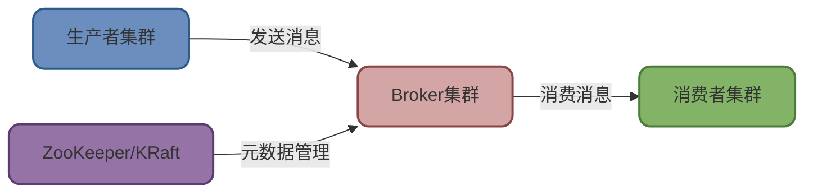
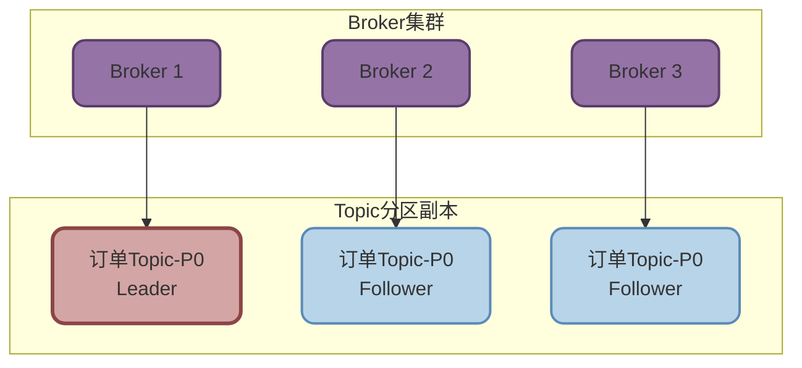
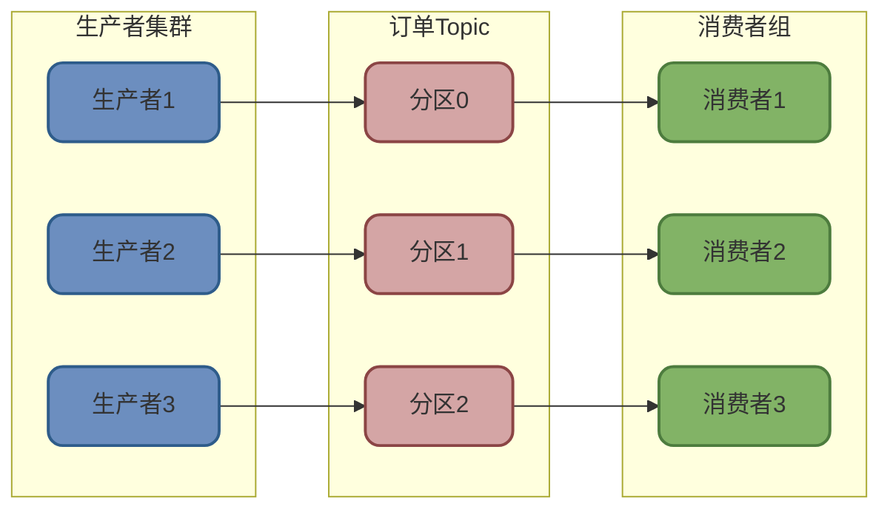
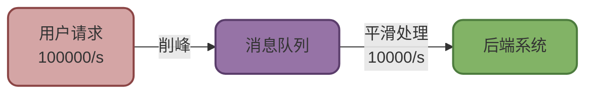

# Kafka基础架构与核心概念

## Kafka核心组件与架构设计

Kafka 作为一款高性能的分布式消息队列系统,其整体架构设计简洁而强大。系统主要由三大核心角色组成:消息生产者(Producer)、Broker集群以及消费者(Consumer)。

### 生产者(Producer)

生产者负责将业务数据封装成消息并发送到指定的Topic。每个Topic可以包含若干个分区(Partition),生产者会根据分区策略选择目标分区进行消息投递。

:::tip 核心术语
- **Topic(主题)**: 消息的逻辑分类容器,用于区分不同的业务场景。例如订单Topic、支付Topic等
- **Partition(分区)**: Topic的物理划分单元,每个分区维护一个有序且不可变的消息序列
:::

### Broker集群架构

Broker是Kafka的服务节点,多个Broker组成高可用集群。集群采用主从架构管理分区副本:

每个分区都包含一个Leader副本和多个Follower副本:

- **Leader副本**: 负责处理所有读写请求
- **Follower副本**: 异步同步Leader数据,提供冗余备份和容错能力
- **副本切换**: Leader故障时,Kafka自动从Follower中选举新Leader

:::info 偏移量(Offset)
Offset是分区中每条消息的唯一位置标识,从0开始单调递增。消费者通过Offset跟踪消费进度,确保消息不丢失、不重复。
:::

### 消费者(Consumer)

消费者从指定Topic的分区拉取消息并进行业务处理。Kafka提供两种关键机制保障消费可靠性:

**消费位移管理**

消费者会向Kafka报告自己的消费进度(即下一条待消费消息的Offset),支持两种提交方式:

- **自动提交**: 消费者定期自动提交位移(默认5秒一次)
- **手动提交**: 消费者显式调用API提交位移,确保消息处理成功后再提交

**消费者组机制**

多个消费者可以组成消费者组(Consumer Group)实现负载均衡:
- 同一组内的消费者共同消费Topic,每个分区只分配给组内一个消费者
- 不同组之间相互独立,可以重复消费相同数据

### 协调服务演进

**ZooKeeper时代**

早期Kafka依赖ZooKeeper管理集群元数据,包括:
- Broker注册与监控
- 分区Leader选举
- 消费者组协调

**KRaft架构升级**

从Kafka 2.8.0引入KRaft协议,4.0版本(2025年3月)正式移除ZooKeeper依赖:
- 简化运维部署
- 提升元数据处理性能
- 加速故障恢复速度

## Kafka为什么需要分区机制

看似Topic已经可以作为消息的逻辑容器,为什么还要在其下再细分出Partition层级?这种设计背后有深刻的分布式系统考量。

### 并行处理能力提升

单个Topic如果只有一个分区,所有消息都串行写入和读取,性能瓶颈明显。通过将Topic划分为多个Partition:

- **生产端并行**: 多个生产者可同时向不同分区写入消息
- **消费端并行**: 多个消费者可并行消费不同分区,大幅提升吞吐量

### 负载均衡与弹性扩展

Partition数量通常设计得比消费者数量多,这样做的好处是:

- **动态负载均衡**: 消费者加入或退出时,Kafka可重新分配分区实现负载均衡
- **水平扩展**: 增加Partition数量即可提升系统处理能力,无需修改业务代码

:::warning 分区与消费者数量关系
- 当消费者数 ≤ 分区数时,每个消费者至少分配一个分区
- 当消费者数 > 分区数时,多余的消费者将处于空闲状态(Kafka 4.0引入共享组机制后支持多消费者消费同一分区)
:::

### 数据隔离与容错

不同Partition的副本可分布在不同Broker上,实现:
- **故障隔离**: 单个Broker故障只影响其上的分区
- **数据冗余**: 副本机制确保数据不丢失

## 消息队列技术选型对比

市场上主流的消息队列产品包括Kafka、RocketMQ、RabbitMQ和ActiveMQ,它们各有特点和适用场景。

### 核心特性对比

| 特性维度 | Kafka | RocketMQ | RabbitMQ | ActiveMQ |
|---------|-------|----------|----------|----------|
| **消息模型** | 发布-订阅 | 发布-订阅 点对点 | 发布-订阅 点对点 | 发布-订阅 点对点 |
| **吞吐量** | 百万级/秒 | 十万级/秒 | 万级/秒 | 万级/秒 |
| **延迟消息** | 不支持(可间接实现) | 原生支持 | 插件支持 | 支持 |
| **消息优先级** | 不支持 | 支持 | 支持 | 支持 |
| **死信队列** | 无 | 支持 | 支持 | 支持 |
| **事务消息** | 支持(仅生产端原子性) | 支持(本地事务+MQ原子性) | 支持基础事务 | 支持 |
| **开发语言** | Scala/Java | Java | Erlang | Java |

### 技术选型建议

**选择Kafka的场景**

适合大数据量、高吞吐的实时数据管道:
- 日志收集与分析系统
- 实时数据流处理(配合Flink/Spark Streaming)
- 用户行为追踪与统计

**选择RocketMQ的场景**

金融、电商等对消息可靠性要求极高的业务:
- 分布式事务场景(订单-库存-积分联动)
- 需要延迟消息的定时任务
- 对消息顺序性有严格要求的业务

**选择RabbitMQ的场景**

- 中小规模系统的异步解耦
- 需要复杂路由规则的场景
- 对AMQP协议有明确需求

### 消息队列的核心价值

无论选择哪种技术,消息队列都能为系统带来以下核心价值:

**系统解耦**

通过消息队列作为中间层,上游系统无需关心下游系统的具体实现。例如订单系统创建订单后,只需发送"订单创建"消息,库存系统、积分系统各自订阅并独立处理,互不影响。

**异步处理**

将耗时操作(如发送邮件、生成报表)异步化,避免阻塞主业务流程。用户下单后立即返回成功,后台异步完成邮件通知、优惠券发放等操作,显著提升用户体验。

**流量削峰**

在秒杀、促销等高并发场景下,将请求先写入消息队列缓冲,后端系统按自身处理能力从队列消费,避免瞬时流量压垮系统。

**高可用保障**

消息持久化与副本机制确保消息不丢失,消费者组机制实现故障自动转移,整体提升系统可靠性。
