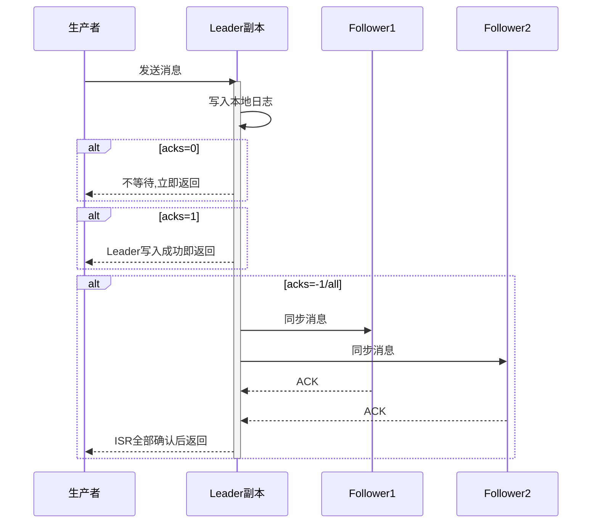
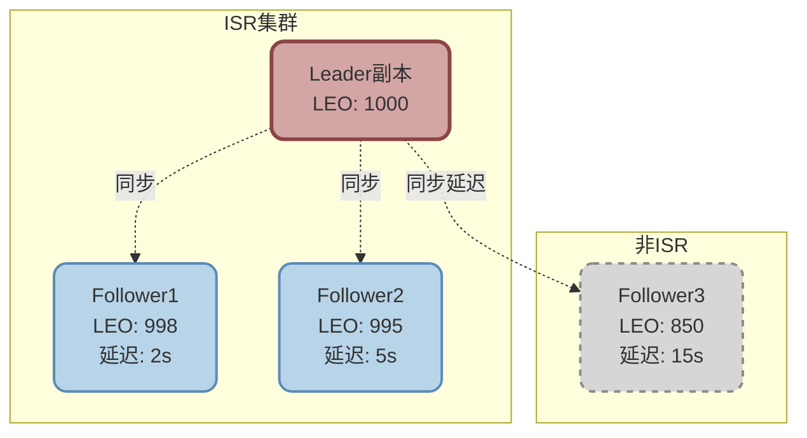
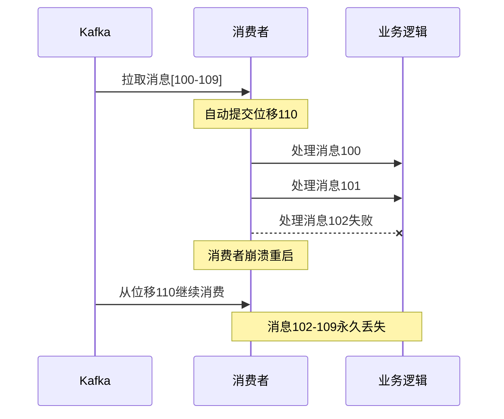

# Kafka消息可靠性保障机制

## Kafka消息可靠性保障体系

Kafka作为企业级消息中间件,需要在生产者、Broker集群、消费者三个环节都做好消息可靠性保障。虽然Kafka无法100%保证消息不丢失,但通过合理的配置和机制设计,可以将消息丢失的风险降到最低。

### 消息传递语义

Kafka提供三种消息传递保障语义:

| 语义类型 | 保障承诺 | 适用场景 |
|---------|---------|---------|
| **At most once** | 消息可能丢失,但不会重复 | 日志收集等允许少量丢失的场景 |
| **At least once** | 消息不会丢失,但可能重复 | 金融交易等不容忍数据丢失的场景 |
| **Exactly once** | 消息精确送达一次 | 对一致性要求极高的场景 |

Kafka默认提供**At least once**保障,即宁可重复也不能丢失。

## 生产者端可靠性保障

生产者需要确保消息能成功发送到Broker,并得到可靠的确认反馈。

### ACK确认机制

生产者通过`acks`参数控制消息确认级别:

```java
// 风险配置 - 不等待任何确认
properties.put("acks", "0");  
// 消息发送后立即返回,网络故障或Broker宕机会丢消息

// 平衡配置 - 等待Leader确认
properties.put("acks", "1");  
// Leader写入成功即返回,若Leader未同步给Follower就宕机会丢消息

// 可靠配置 - 等待ISR全部确认
properties.put("acks", "-1");  // 或 "all"
// Leader和所有ISR副本都写入成功才返回,最大程度保证不丢失
```



### 失败重试策略

生产者需要配置合理的重试机制应对临时性故障:

```java
Properties props = new Properties();
props.put("acks", "-1");                    // ISR全部确认
props.put("retries", 3);                    // 失败重试3次
props.put("retry.backoff.ms", 300);         // 重试间隔300ms
props.put("max.in.flight.requests.per.connection", 1);  // 保证顺序性

// 使用回调处理异常
producer.send(record, new Callback() {
    @Override
    public void onCompletion(RecordMetadata metadata, Exception exception) {
        if (exception != null) {
            // 记录失败日志,触发告警或补偿逻辑
            log.error("消息发送失败: {}", exception.getMessage());
            // 可以将失败消息持久化到本地表,后续补偿重发
        }
    }
});
```

:::warning 常见陷阱
使用`producer.send(record)`异步发送时,方法立即返回不代表发送成功!必须通过回调或同步等待`producer.send(record).get()`来确认结果。
:::

## Broker集群可靠性保障

Broker集群通过副本机制、持久化存储和ISR机制保障数据可靠性。

### ISR同步副本机制

ISR(In-Sync Replicas)是与Leader保持同步的副本集合,Kafka通过ISR机制平衡性能与可靠性。

**ISR列表动态维护**

早期版本(0.9.x之前)通过`replica.lag.max.messages`参数判断副本是否落后,但在流量突增时会误判。

从0.9.x版本开始改用`replica.lag.max.ms`时间维度判断:
- 默认10秒内能追上Leader的Follower保留在ISR中
- 超过10秒未同步的Follower被踢出ISR



:::info LEO与HW
- **LEO**(Log End Offset): 副本日志的最新偏移量,标识下一条待写入消息的位置
- **HW**(High Watermark): 已提交消息的最高偏移量,消费者只能消费HW之前的消息
:::

**副本选举策略**

配置`unclean.leader.election.enable=false`可防止非ISR副本被选为Leader,避免数据丢失:
- `true`: 允许非ISR副本参与选举,可能丢失部分数据但提升可用性
- `false`: 只允许ISR副本参与选举,保证数据完整性但可能降低可用性

### 持久化存储机制

Kafka采用顺序写磁盘的方式持久化消息,性能接近内存操作。但在以下场景仍可能丢失:

**Page Cache未刷盘**

操作系统会先将数据写入Page Cache,再异步刷到磁盘。如果Broker在刷盘前宕机,Page Cache中的数据会丢失。

虽然可以配置`log.flush.interval.messages=1`强制同步刷盘,但会严重影响性能,通常不推荐。

**副本同步延迟**

即使配置`acks=-1`,如果Leader在消息同步给Follower之前宕机,消息仍可能丢失。这种情况下需要结合:
- 增加副本数`replication.factor≥3`
- 设置最小ISR数量`min.insync.replicas≥2`

```java
// Broker端可靠性配置
replication.factor=3                     // 每个分区3个副本
min.insync.replicas=2                   // 至少2个副本确认才算成功
unclean.leader.election.enable=false    // 禁止非ISR副本参与选举
```

## 消费者端可靠性保障

消费者需要正确管理消费位移,确保消息不丢失也不重复消费。

### 位移提交策略

**自动提交的风险**

```java
// 自动提交配置
props.put("enable.auto.commit", "true");
props.put("auto.commit.interval.ms", "5000");  // 每5秒自动提交
```

自动提交可能导致消息丢失:
1. 消费者拉取一批消息
2. Kafka自动提交位移(标记已消费)
3. 消费者处理消息时发生异常
4. 消费者重启后从新位移开始,之前失败的消息永久丢失



**手动提交的正确姿势**

```java
props.put("enable.auto.commit", "false");

while (true) {
    ConsumerRecords<String, String> records = consumer.poll(Duration.ofMillis(100));
    
    try {
        for (ConsumerRecord<String, String> record : records) {
            // 处理业务逻辑
            processRecord(record);
        }
        // 所有消息处理成功后才提交
        consumer.commitSync();
    } catch (Exception e) {
        // 处理失败不提交,下次重新消费
        log.error("消息处理失败", e);
    }
}
```

:::warning 批量消费陷阱
在批量消费场景下,即使手动提交也可能丢消息。如果在finally块中提交位移,无论消息是否处理成功都会提交,导致失败消息被跳过。
:::

### 批量消费可靠性保障

批量消费需要确保所有消息都处理成功才提交位移:

```java
@KafkaListener(topics = "payment-topic", containerFactory = "batchFactory")
public void batchConsume(List<ConsumerRecord<String, String>> records, 
                         Acknowledgment ack) {
    
    CompletionService<Boolean> completionService = 
        new ExecutorCompletionService<>(executor);
    List<Future<Boolean>> futures = new ArrayList<>();

    // 1. 并发处理所有消息
    records.forEach(record -> {
        Callable<Boolean> task = () -> {
            try {
                processPayment(record.value());  // 业务处理
                return true;
            } catch (Exception e) {
                log.error("支付处理失败: {}", record.value(), e);
                return false;
            }
        };
        futures.add(completionService.submit(task));
    });

    // 2. 检查所有任务是否成功
    boolean allSuccess = true;
    try {
        for (int i = 0; i < records.size(); i++) {
            Future<Boolean> future = completionService.take();
            if (!future.get()) {
                allSuccess = false;
                break;  // 发现失败立即终止检查
            }
        }
    } catch (Exception e) {
        allSuccess = false;
    }

    // 3. 全部成功才提交位移
    if (allSuccess) {
        ack.acknowledge();
    } else {
        // 失败消息会重新投递,需要业务保证幂等性
        log.warn("批次中有消息处理失败,等待重新投递");
    }
}
```

### 消费者组容错机制

多个消费者组成消费者组可提升处理能力和容错性:
- 分区自动分配给组内消费者,实现负载均衡
- 消费者故障时,分区自动分配给其他健康消费者

## 消息丢失常见场景分析

### 生产者端丢失

**场景一: 未开启消息确认**

```java
// 危险配置
props.put("acks", "0");  // 不等待Broker确认
```
网络抖动或Broker故障时消息直接丢失,生产者无感知。

**场景二: 未处理发送失败**

```java
// 错误做法
producer.send(record);  // 异步发送,不关心结果
```
消息发送失败时没有重试或补偿机制。

**场景三: 生产者崩溃**

消息准备发送但还未发出时,生产者进程崩溃,消息丢失。

### Broker端丢失

**场景一: Page Cache未刷盘**

Broker将消息写入Page Cache后宕机,数据未持久化到磁盘。

**场景二: 副本同步延迟**

```
acks=1配置下:
1. Leader写入成功并响应生产者
2. Leader在同步给Follower前宕机
3. 新Leader从Follower中选出,之前的消息丢失
```

**场景三: 消息过期删除**

Kafka默认保留消息72小时,超时未消费的消息会被删除。

### 消费者端丢失

**场景一: 自动提交位移**

消息拉取后自动提交位移,但业务处理失败,消息永久丢失。

**场景二: 批量消费finally提交**

```java
// 错误做法
try {
    batchProcess(records);
} finally {
    ack.acknowledge();  // 无论成败都提交
}
```

## 最佳实践配置清单

### 生产者配置

```java
Properties props = new Properties();
// 核心可靠性配置
props.put("acks", "-1");                    // ISR全部确认
props.put("retries", 3);                    // 失败重试3次
props.put("retry.backoff.ms", 300);         // 重试间隔300ms
props.put("max.in.flight.requests.per.connection", 1);  // 保证顺序

// 使用callback处理异常
producer.send(record, (metadata, exception) -> {
    if (exception != null) {
        handleFailure(record, exception);  // 持久化失败记录,后续补偿
    }
});
```

### Broker配置

```properties
# 副本配置
replication.factor=3                     # 3副本
min.insync.replicas=2                   # 至少2个ISR副本
unclean.leader.election.enable=false    # 禁止非ISR副本当选Leader

# 日志配置
log.flush.interval.messages=10000       # 每10000条刷盘一次
log.flush.interval.ms=1000              # 每1秒刷盘一次
```

### 消费者配置

```java
Properties props = new Properties();
props.put("enable.auto.commit", "false");  // 禁用自动提交
props.put("isolation.level", "read_committed");  // 只读已提交消息

// 手动提交模式
consumer.subscribe(Arrays.asList("topic"));
while (true) {
    ConsumerRecords<String, String> records = consumer.poll(Duration.ofMillis(100));
    try {
        for (ConsumerRecord<String, String> record : records) {
            processWithIdempotence(record);  // 幂等处理
        }
        consumer.commitSync();  // 同步提交
    } catch (Exception e) {
        // 异常时不提交,等待重新消费
        log.error("处理失败,等待重新投递", e);
    }
}
```

:::tip 核心要点
1. 生产者必须使用`acks=-1`并处理发送失败
2. Broker配置充足的副本数和ISR要求
3. 消费者禁用自动提交,确保处理成功后再提交位移
4. 业务代码实现幂等性,应对消息重复投递
:::
