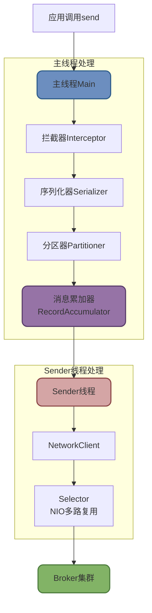
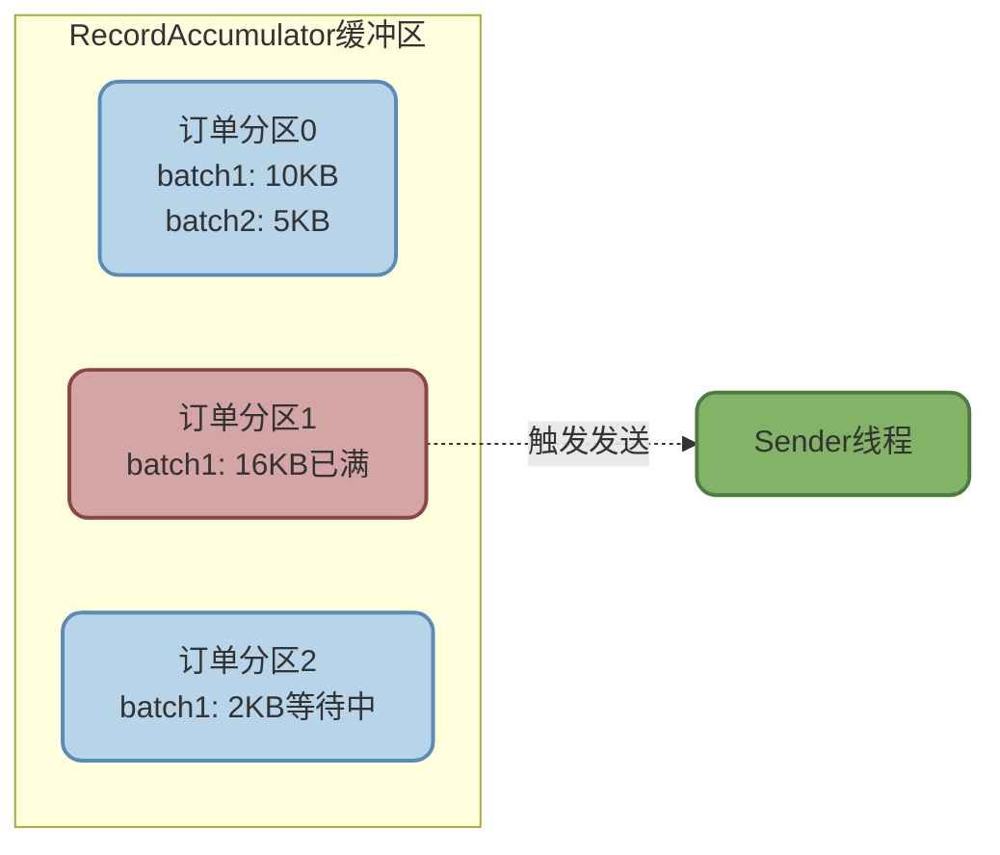
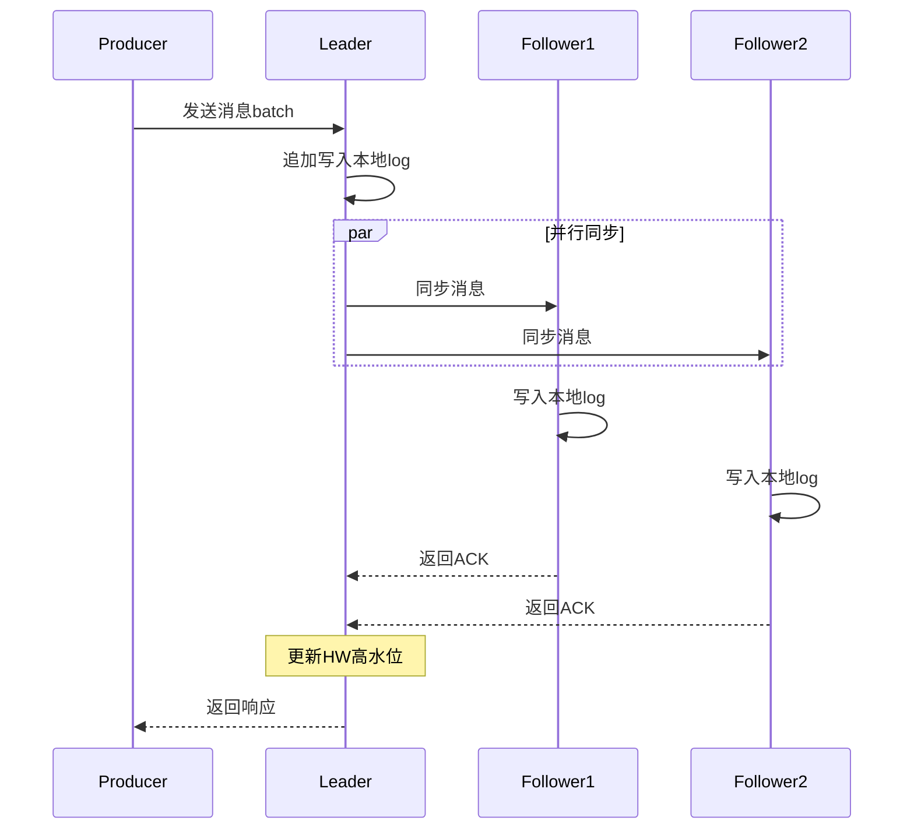
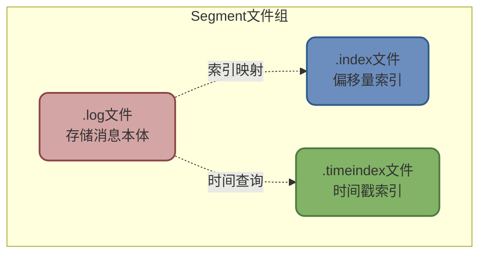
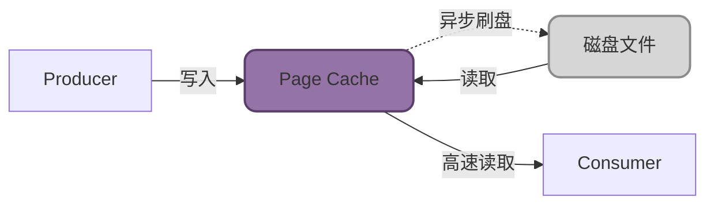
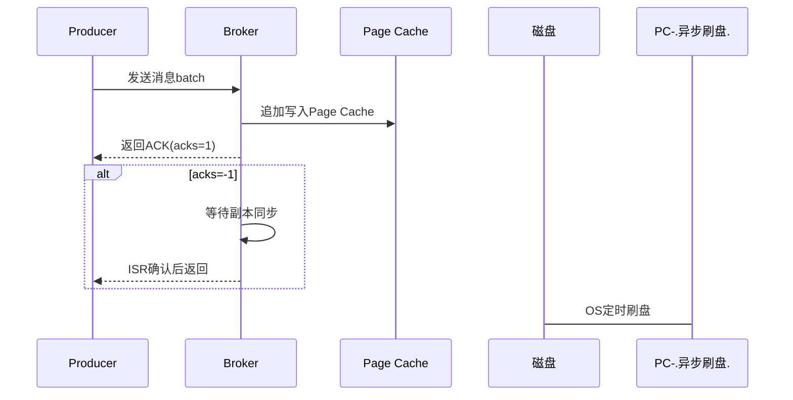
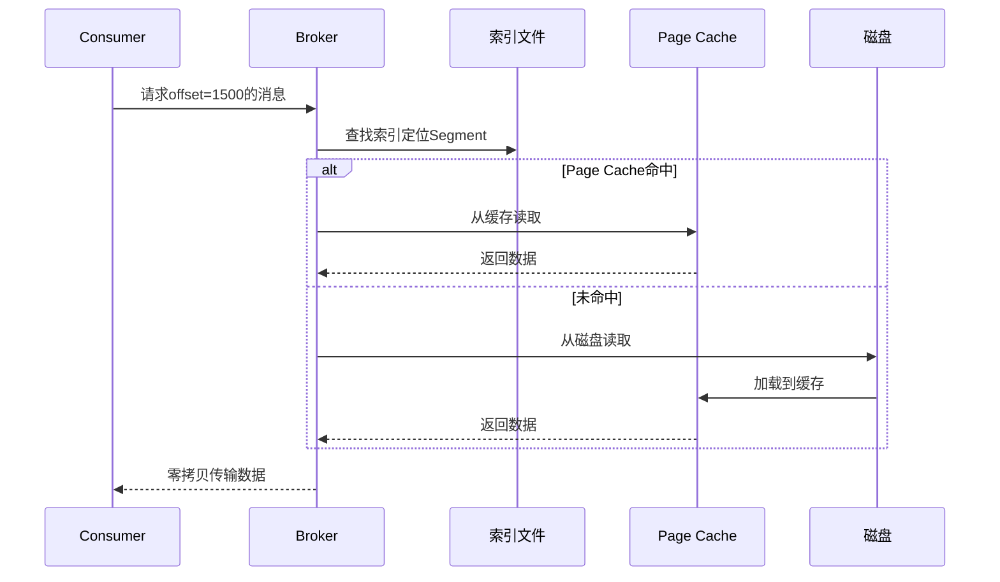

# Kafka消息发送与存储原理

## Kafka消息发送全流程解析

Kafka提供同步和异步两种消息发送方式,但无论哪种方式,消息在Producer端都会经历复杂的处理流程才能最终到达Broker。

### 同步与异步发送对比

```java
// 同步发送 - 阻塞等待结果
RecordMetadata metadata = producer.send(record).get();
System.out.println("消息发送成功,偏移量: " + metadata.offset());

// 异步发送 - 立即返回,通过回调处理结果
producer.send(record, (metadata, exception) -> {
    if (exception == null) {
        System.out.println("异步发送成功: " + metadata.offset());
    } else {
        System.err.println("发送失败: " + exception.getMessage());
    }
});
```

同步发送能准确获取发送结果,但吞吐量较低。异步发送通过回调机制实现高吞吐,是生产环境的主流选择。

### Producer内部线程模型

Kafka Producer采用双线程架构:主线程负责消息预处理,Sender线程负责网络传输。



**主线程处理流程**

1. **拦截器(Interceptor)**: 在消息发送前后执行自定义逻辑,如添加统一的消息头、记录审计日志等

```java
public class AuditInterceptor implements ProducerInterceptor<String, String> {
    @Override
    public ProducerRecord<String, String> onSend(ProducerRecord<String, String> record) {
        // 添加审计信息
        Headers headers = record.headers();
        headers.add("audit-user", "admin".getBytes());
        headers.add("audit-time", String.valueOf(System.currentTimeMillis()).getBytes());
        return record;
    }
}
```

2. **序列化器(Serializer)**: 将消息的key和value对象转换为字节数组,便于网络传输

```java
props.put("key.serializer", "org.apache.kafka.common.serialization.StringSerializer");
props.put("value.serializer", "com.example.OrderSerializer");  // 自定义序列化
```

3. **分区器(Partitioner)**: 决定消息发送到哪个分区

**默认分区策略**:
- 如果指定了partition,直接使用
- 如果指定了key,对key进行hash计算分区
- 如果都未指定,采用Round-Robin轮询

```java
// 自定义分区策略:VIP订单发往固定分区
public class VipPartitioner implements Partitioner {
    @Override
    public int partition(String topic, Object key, byte[] keyBytes, 
                         Object value, byte[] valueBytes, Cluster cluster) {
        OrderMessage order = (OrderMessage) value;
        int numPartitions = cluster.partitionsForTopic(topic).size();
        
        // VIP订单发往分区0,普通订单hash分配
        return order.isVip() ? 0 : Math.abs(key.hashCode()) % numPartitions;
    }
}
```

4. **消息累加器(RecordAccumulator)**: 核心组件,负责消息批量聚合

**批量发送机制**

RecordAccumulator维护一个按分区组织的缓冲区,满足以下任一条件就会触发发送:

- 缓冲区大小达到`batch.size`(默认16KB)
- 等待时间达到`linger.ms`(默认0ms)

```java
props.put("batch.size", 16384);     // 批次大小16KB
props.put("linger.ms", 10);         // 最多等待10ms
props.put("buffer.memory", 33554432);  // 总缓冲区32MB
```



**Sender线程处理**

Sender线程通过NetworkClient和Selector组件实现高效的网络通信:
- 使用NIO非阻塞模式,单线程管理多个连接
- 批量发送请求到对应的Broker
- 处理响应结果,触发回调或重试

### Broker端处理流程

消息到达Broker后,经历以下关键步骤:

**1. 写入Leader分区**

Broker接收到消息后,将其追加写入对应分区的Leader副本日志文件。

**2. 副本同步**



**3. ACK响应策略**

根据Producer的`acks`配置决定何时响应:

- **acks=0**: 收到请求立即响应,不等待写入
- **acks=1**: Leader写入成功后响应
- **acks=-1/all**: 等待所有ISR副本确认后响应

## Kafka高性能存储架构

Kafka能够实现百万级吞吐量,核心在于其存储层的精妙设计。

### 数据存储层次结构

Kafka的存储是一个从逻辑到物理的层次映射:

```
Topic(逻辑) → Partition(逻辑/物理) → Segment(物理文件)
```

**Partition目录结构**

每个Partition对应磁盘上的一个独立目录:

```
/data/kafka-logs/
├── order-topic-0/              # 订单主题分区0
│   ├── 00000000000000000000.log
│   ├── 00000000000000000000.index
│   ├── 00000000000000000000.timeindex
│   ├── 00000000000000050000.log
│   ├── 00000000000000050000.index
│   ├── 00000000000000050000.timeindex
│   └── leader-epoch-checkpoint
├── order-topic-1/              # 订单主题分区1
└── payment-topic-0/            # 支付主题分区0
```

**Segment文件组织**

Partition按照大小切分成多个Segment,每个Segment包含三类文件:



1. **.log文件**: 实际的消息数据,顺序追加写入
2. **.index文件**: 稀疏索引,存储`offset → 物理位置`的映射
3. **.timeindex文件**: 时间索引,存储`timestamp → offset`的映射

**Segment命名规则**

文件名是该Segment的起始offset(20位数字填充):
```
00000000000000000000.log  # offset 0开始
00000000000000050000.log  # offset 50000开始
```

### 高性能读写技术

**顺序写磁盘**

Kafka采用追加写(Append-Only)模式,将消息顺序追加到log文件末尾:
- 避免了随机写的磁头寻道开销
- 顺序写性能接近内存,可达到600MB/s

```java
// 消息追加示例
[offset=100, msg="订单001"] → log文件末尾
[offset=101, msg="订单002"] → 追加
[offset=102, msg="订单003"] → 追加
```

**Page Cache优化**

Kafka充分利用操作系统的Page Cache:
- 写入时先写Page Cache,操作系统异步刷盘
- 读取时优先从Page Cache读取,命中率高时性能极佳
- 避免了在JVM堆内缓存数据,减少GC压力



**零拷贝技术**

消费者读取数据时,Kafka使用`sendfile`系统调用实现零拷贝:

传统方式需要4次拷贝:
```
磁盘 → 内核缓冲区 → 应用缓冲区 → Socket缓冲区 → 网卡
```

零拷贝方式只需2次:
```
磁盘 → 内核缓冲区 → 网卡
```

```java
// Kafka使用Java NIO的FileChannel.transferTo实现零拷贝
long bytesSent = fileChannel.transferTo(position, count, socketChannel);
```

**稀疏索引加速查找**

Kafka不对每条消息都建索引,而是每隔一定消息量(默认4KB)建立一个索引点:

```
索引文件(.index):
offset=0     → position=0
offset=1000  → position=45600
offset=2000  → position=91800

查找offset=1500的消息:
1. 通过索引找到offset=1000 → position=45600
2. 从position=45600开始顺序扫描到offset=1500
```

这种设计既节省索引空间,又能快速定位消息。

### 消息读写完整流程

**写入流程**



**读取流程**



## Kafka极致性能优化揭秘

### 发送端优化

**批量发送**

将多个消息聚合成batch发送,减少网络往返:

```java
props.put("batch.size", 32768);      // 增大batch为32KB
props.put("linger.ms", 20);          // 最多等待20ms凑批次
props.put("compression.type", "lz4"); // 启用LZ4压缩
```

**异步发送**

Producer采用异步发送避免阻塞:

```java
// 异步发送,通过callback处理结果
for (int i = 0; i < 10000; i++) {
    ProducerRecord<String, String> record = new ProducerRecord<>("topic", "msg" + i);
    producer.send(record, (metadata, exception) -> {
        if (exception != null) {
            log.error("发送失败", exception);
        }
    });
}
```

**消息压缩**

Kafka支持多种压缩算法,减少网络传输量:

| 压缩算法 | 压缩率 | CPU消耗 | 适用场景 |
|---------|-------|---------|---------|
| gzip | 高 | 高 | 网络带宽受限 |
| snappy | 中 | 低 | 平衡性能和压缩率 |
| lz4 | 中 | 极低 | 高吞吐场景(推荐) |
| zstd | 极高 | 中 | Kafka 2.1+新增 |

**并行发送**

通过分区实现并行发送,提升吞吐:

```java
// 创建足够多的分区,建议分区数 = 消费者数 × 2
bin/kafka-topics.sh --create --topic order-topic \
  --partitions 12 --replication-factor 3
```

### 存储端优化

**磁盘顺序写**
- 避免随机写,充分发挥磁盘顺序写性能
- 机械硬盘顺序写可达100MB/s+,SSD更高

**Page Cache利用**
- 写入优先进Page Cache,减少磁盘IO
- 读取优先从Page Cache读,提升命中率

**稀疏索引**
- 减少索引文件大小,加快加载速度
- 索引项少,内存占用低

**零拷贝技术**
- 减少CPU拷贝次数,降低CPU和内存开销
- 数据直接从文件到网卡,性能提升明显

**分区与副本**
- 分区实现并行处理,提升整体吞吐
- 副本提供高可用,避免单点故障

### 消费端优化

**消费者组并行**

多个消费者组成消费者组,并行消费不同分区:

```java
// 启动多个消费者实例,自动分配分区
for (int i = 0; i < 3; i++) {
    new Thread(() -> {
        KafkaConsumer<String, String> consumer = new KafkaConsumer<>(props);
        consumer.subscribe(Arrays.asList("order-topic"));
        // 消费逻辑
    }).start();
}
```

**批量拉取**

一次拉取多条消息批量处理:

```java
props.put("max.poll.records", 500);  // 每次最多拉取500条
props.put("fetch.min.bytes", 10240); // 至少10KB才返回

ConsumerRecords<String, String> records = consumer.poll(Duration.ofMillis(100));
// 批量处理records
```

**并行消费**

拉取后提交线程池并行处理:

```java
ExecutorService executor = Executors.newFixedThreadPool(10);

while (true) {
    ConsumerRecords<String, String> records = consumer.poll(Duration.ofMillis(100));
    
    for (ConsumerRecord<String, String> record : records) {
        executor.submit(() -> processRecord(record));
    }
}
```

### 性能指标对比

| 优化维度 | 优化前 | 优化后 | 提升倍数 |
|---------|-------|-------|---------|
| 单Producer吞吐 | 10万/秒 | 50万/秒 | 5倍 |
| 消费延迟 | 100ms | 10ms | 10倍 |
| 磁盘利用率 | 随机写50MB/s | 顺序写600MB/s | 12倍 |
| CPU使用率 | 传统拷贝60% | 零拷贝20% | 降低67% |

:::tip 性能优化核心要点
1. **生产端**: 批量发送 + 异步模式 + 消息压缩 + 多分区并行
2. **存储端**: 顺序写磁盘 + Page Cache + 稀疏索引 + 零拷贝
3. **消费端**: 消费者组 + 批量拉取 + 并行处理
:::
