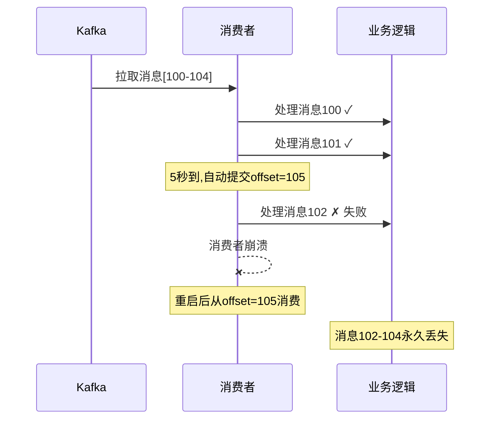
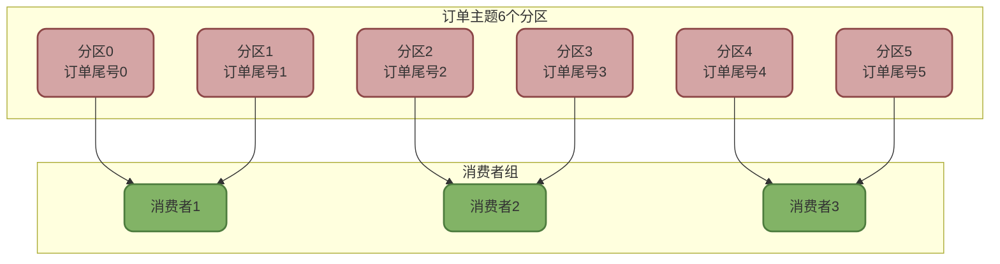
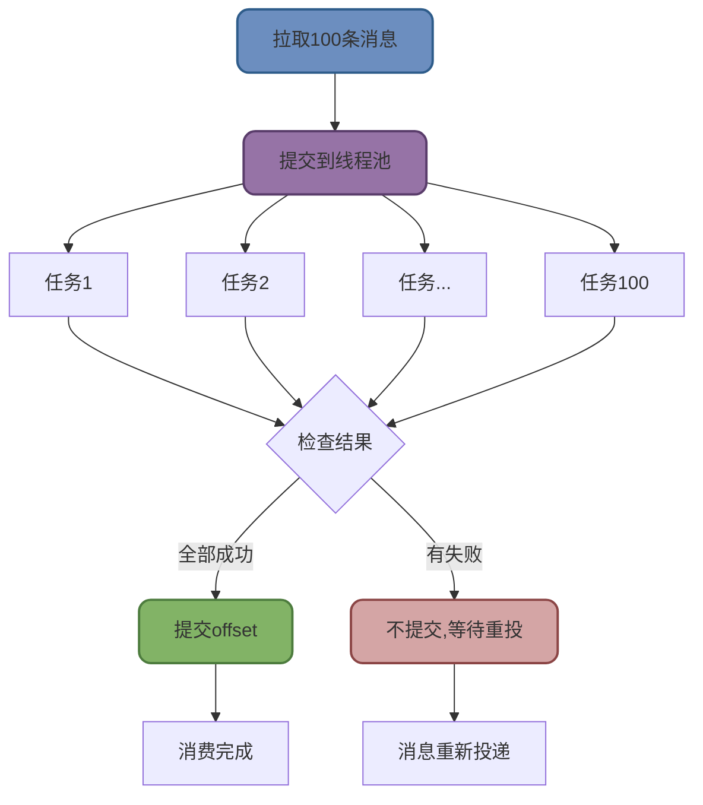
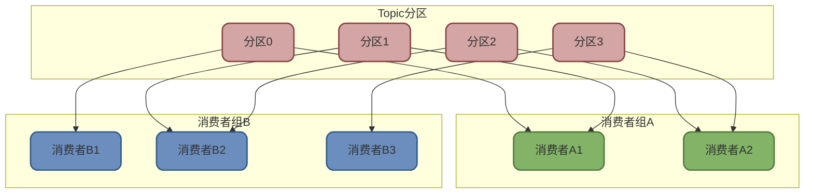

# Kafka消费机制详解

## Kafka消费位移管理

Offset(偏移量)是Kafka消费机制的核心概念,贯穿了消息的生产、存储和消费全过程。

### Offset的双重身份

**在分区中:消息的唯一位置标识**

每条消息写入分区时都会分配一个从0开始单调递增的offset,标识该消息在分区中的位置:

```
分区消息序列:
offset=0: {订单ID: 001, 金额: 100}
offset=1: {订单ID: 002, 金额: 200}
offset=2: {订单ID: 003, 金额: 150}
...
```

**在消费者中:消费进度的位移**

消费者的offset记录的是**下一条待消费消息的位置**,而不是已消费的最后一条:

```
假设分区有10条消息(offset 0-9)
消费者已消费0-5共6条消息
则消费者offset应该是6(下一条待消费)
```

:::warning 常见误解
消费者offset记录的是**下一条待消费的位置**,而非最后一条已消费的位置!例如消费完offset=5的消息后,消费者offset应更新为6。
:::

### Offset提交策略对比

Kafka提供自动和手动两种offset提交方式,各有利弊。

**自动提交机制**

```java
Properties props = new Properties();
props.put("enable.auto.commit", "true");
props.put("auto.commit.interval.ms", "5000");  // 每5秒自动提交

KafkaConsumer<String, String> consumer = new KafkaConsumer<>(props);
consumer.subscribe(Arrays.asList("payment-topic"));

while (true) {
    ConsumerRecords<String, String> records = consumer.poll(Duration.ofMillis(100));
    for (ConsumerRecord<String, String> record : records) {
        processPayment(record);  // 处理支付业务
    }
    // Kafka会在后台定时自动提交offset
}
```

**优点**:
- 配置简单,无需手动管理offset
- 减少频繁提交带来的网络开销

**缺点**:
- 可能丢失消息:自动提交offset后,消息处理失败会导致消息永久丢失
- 可能重复消费:消费者崩溃重启后,从上次提交的offset继续,中间的消息会重复消费



**手动提交机制**

手动提交分为同步提交和异步提交两种:

```java
props.put("enable.auto.commit", "false");

// 同步提交:阻塞等待提交成功
while (true) {
    ConsumerRecords<String, String> records = consumer.poll(Duration.ofMillis(100));
    for (ConsumerRecord<String, String> record : records) {
        processOrder(record);
    }
    try {
        consumer.commitSync();  // 同步提交,确保成功
    } catch (CommitFailedException e) {
        log.error("offset提交失败", e);
    }
}

// 异步提交:非阻塞,通过回调处理结果
while (true) {
    ConsumerRecords<String, String> records = consumer.poll(Duration.ofMillis(100));
    for (ConsumerRecord<String, String> record : records) {
        processOrder(record);
    }
    
    consumer.commitAsync((offsets, exception) -> {
        if (exception != null) {
            log.error("异步提交失败: {}", offsets, exception);
        }
    });
}
```

| 提交方式 | 可靠性 | 性能 | 适用场景 |
|---------|-------|------|---------|
| 自动提交 | 低 | 高 | 允许少量消息丢失或重复的场景 |
| 手动同步提交 | 高 | 中 | 对消息可靠性要求高的场景 |
| 手动异步提交 | 中 | 高 | 平衡性能与可靠性的场景 |

**组合提交策略**

结合同步和异步提交的优点:

```java
try {
    while (true) {
        ConsumerRecords<String, String> records = consumer.poll(Duration.ofMillis(100));
        processRecords(records);
        consumer.commitAsync();  // 正常流程异步提交,高性能
    }
} catch (Exception e) {
    log.error("消费异常", e);
} finally {
    try {
        consumer.commitSync();  // 关闭前同步提交,确保可靠
    } finally {
        consumer.close();
    }
}
```

## Kafka顺序消费实现方案

Kafka只保证单个分区内的消息有序,跨分区消息无序。这是由其存储机制决定的。

### 分区内有序的原理

生产者向同一分区发送的消息会按顺序追加到log文件,消费者按offset顺序读取,天然保证顺序性:

```
分区0日志文件:
offset=0: 订单创建事件
offset=1: 订单支付事件  
offset=2: 订单发货事件
offset=3: 订单完成事件

消费者按0→1→2→3顺序消费,保证顺序
```

### 保证顺序消费的三种方案

**方案一:单分区Topic**

最简单的方案,创建只有一个分区的Topic:

```bash
bin/kafka-topics.sh --create --topic order-seq-topic \
  --partitions 1 \
  --replication-factor 3
```

**优点**: 全局顺序,实现简单
**缺点**: 无法并行消费,吞吐量受限

**方案二:按Key发送到固定分区**

对于需要保证顺序的消息,指定相同的key:

```java
// 同一订单的所有事件使用相同的订单ID作为key
String orderId = "ORDER_12345";

ProducerRecord<String, String> createEvent = 
    new ProducerRecord<>("order-topic", orderId, "订单创建");
ProducerRecord<String, String> payEvent = 
    new ProducerRecord<>("order-topic", orderId, "订单支付");
ProducerRecord<String, String> shipEvent = 
    new ProducerRecord<>("order-topic", orderId, "订单发货");

// 相同key的消息会发往同一分区,保证顺序
producer.send(createEvent);
producer.send(payEvent);
producer.send(shipEvent);
```

**Kafka的key分区算法**:
```java
partition = Math.abs(key.hashCode()) % numPartitions
```

**优点**: 既保证顺序,又能多分区并行
**缺点**: 同一key的消息只能单消费者处理

**方案三:自定义分区器**

实现自定义分区逻辑,精确控制消息路由:

```java
public class OrderPartitioner implements Partitioner {
    
    @Override
    public int partition(String topic, Object key, byte[] keyBytes,
                         Object value, byte[] valueBytes, Cluster cluster) {
        
        String orderId = (String) key;
        int numPartitions = cluster.partitionsForTopic(topic).size();
        
        // 按订单ID尾号分区:订单001、011、021都进分区1
        int lastDigit = Integer.parseInt(orderId.substring(orderId.length() - 1));
        return lastDigit % numPartitions;
    }
    
    @Override
    public void configure(Map<String, ?> configs) {}
    
    @Override
    public void close() {}
}

// 配置使用自定义分区器
props.put("partitioner.class", "com.example.OrderPartitioner");
```

### 顺序消费最佳实践



:::tip 顺序消费设计要点
1. 根据业务确定顺序性要求:全局顺序还是局部顺序
2. 全局顺序用单分区,局部顺序用key或自定义分区器
3. 消费端避免多线程并发处理同一分区的消息
4. 生产端设置`max.in.flight.requests.per.connection=1`确保发送顺序
:::

## Kafka批量消费实现与优化

批量消费可以显著提升吞吐量,但需要正确处理才能保证消息可靠性。

### Spring Kafka批量消费配置

**配置消费者工厂**

```java
@Configuration
public class KafkaConsumerConfig {
    
    @Bean
    public ConsumerFactory<String, String> consumerFactory() {
        Map<String, Object> props = new HashMap<>();
        props.put(ConsumerConfig.BOOTSTRAP_SERVERS_CONFIG, "localhost:9092");
        props.put(ConsumerConfig.GROUP_ID_CONFIG, "batch-consumer-group");
        props.put(ConsumerConfig.KEY_DESERIALIZER_CLASS_CONFIG, StringDeserializer.class);
        props.put(ConsumerConfig.VALUE_DESERIALIZER_CLASS_CONFIG, StringDeserializer.class);
        
        // 批量消费配置
        props.put(ConsumerConfig.MAX_POLL_RECORDS_CONFIG, 100);  // 每次最多拉取100条
        props.put(ConsumerConfig.FETCH_MIN_BYTES_CONFIG, 10240); // 至少10KB才返回
        
        return new DefaultKafkaConsumerFactory<>(props);
    }
    
    @Bean
    public ConcurrentKafkaListenerContainerFactory<String, String> batchFactory(
            ConsumerFactory<String, String> consumerFactory) {
        
        ConcurrentKafkaListenerContainerFactory<String, String> factory =
            new ConcurrentKafkaListenerContainerFactory<>();
        
        factory.setConsumerFactory(consumerFactory);
        factory.setBatchListener(true);  // 启用批量监听
        
        // 手动提交模式
        factory.getContainerProperties()
               .setAckMode(ContainerProperties.AckMode.MANUAL_IMMEDIATE);
        
        return factory;
    }
}
```

**实现批量消费监听器**

```java
@Service
public class OrderBatchConsumer {
    
    @KafkaListener(topics = "order-topic", containerFactory = "batchFactory")
    public void consumeBatch(List<ConsumerRecord<String, String>> records,
                            Acknowledgment ack) {
        
        log.info("收到批量消息: {} 条", records.size());
        
        try {
            // 业务处理
            for (ConsumerRecord<String, String> record : records) {
                processOrder(record.value());
            }
            
            // 全部成功才提交offset
            ack.acknowledge();
            log.info("批次处理成功,已提交offset");
            
        } catch (Exception e) {
            log.error("批量处理失败", e);
            // 不提交offset,等待重新投递
        }
    }
}
```

### 批量消费可靠性保障

**错误场景一:finally中提交offset**

```java
// ❌ 错误做法
@KafkaListener(topics = "topic", containerFactory = "batchFactory")
public void consume(List<ConsumerRecord<String, String>> records, Acknowledgment ack) {
    try {
        processBatch(records);
    } finally {
        ack.acknowledge();  // 无论成败都提交,会丢消息!
    }
}
```

**错误场景二:自动提交模式**

```java
// ❌ 错误配置
props.put("enable.auto.commit", "true");  // 自动提交

// 处理过程中失败,但offset已自动提交,消息丢失
```

**正确方案:并发处理+全部成功才提交**

```java
@Service
public class ReliableBatchConsumer {
    
    private final ExecutorService executor = Executors.newFixedThreadPool(10);
    
    @KafkaListener(topics = "payment-topic", containerFactory = "batchFactory")
    public void consumeBatch(List<ConsumerRecord<String, String>> records,
                            Acknowledgment ack) {
        
        CompletionService<Boolean> completionService = 
            new ExecutorCompletionService<>(executor);
        List<Future<Boolean>> futures = new ArrayList<>();
        
        // 1. 提交所有任务到线程池并发处理
        for (ConsumerRecord<String, String> record : records) {
            Callable<Boolean> task = () -> {
                try {
                    processPayment(record.value());
                    return true;
                } catch (Exception e) {
                    log.error("支付处理失败: {}", record.value(), e);
                    return false;
                }
            };
            futures.add(completionService.submit(task));
        }
        
        // 2. 等待所有任务完成并检查结果
        boolean allSuccess = true;
        try {
            for (int i = 0; i < records.size(); i++) {
                Future<Boolean> future = completionService.take();
                if (!future.get()) {
                    allSuccess = false;
                    break;  // 发现失败立即终止
                }
            }
        } catch (Exception e) {
            allSuccess = false;
            log.error("任务执行异常", e);
        }
        
        // 3. 全部成功才提交offset
        if (allSuccess) {
            ack.acknowledge();
            log.info("批次全部成功,已提交offset");
        } else {
            log.warn("批次中有失败消息,不提交offset,等待重新投递");
            // 重新投递会导致重复消费,需要业务保证幂等性
        }
    }
}
```



:::warning 重复消费处理
批量消费失败不提交offset会导致整批消息重新投递,业务代码必须实现幂等性,避免重复处理导致数据错误。
:::

### 批量消费性能优化

**调优参数**

```java
// 每次拉取的消息数量
props.put("max.poll.records", 500);

// 至少积累多少字节才返回
props.put("fetch.min.bytes", 10240);

// 最多等待多久(没凑够也返回)
props.put("fetch.max.wait.ms", 500);

// 单次拉取最大字节数
props.put("max.partition.fetch.bytes", 1048576);
```

**吞吐量对比**

| 消费模式 | 吞吐量 | 网络开销 | 适用场景 |
|---------|-------|---------|---------|
| 单条消费 | 1万/秒 | 高 | 实时性要求高 |
| 批量消费(100条) | 10万/秒 | 低 | 吞吐量要求高 |
| 批量消费(500条) | 30万/秒 | 极低 | 大数据量处理 |

## Kafka消费者组协调机制

消费者组是Kafka实现负载均衡和高可用的核心机制。

### 消费者组基本概念

**消费者组特性**:
- 同一组内的消费者共同消费Topic,每个分区只分配给组内一个消费者
- 不同组之间相互独立,可以重复消费相同的消息
- 消费者数量变化时,自动触发重平衡(Rebalance)重新分配分区



### 分区分配策略

Kafka提供多种分区分配策略,影响重平衡的行为:

**RangeAssignor(默认策略)**

按topic的分区范围分配:

```
Topic有6个分区(P0-P5),3个消费者:
消费者1: P0, P1
消费者2: P2, P3
消费者3: P4, P5
```

**RoundRobinAssignor(轮询策略)**

所有分区轮询分配:

```
Topic有6个分区,3个消费者:
消费者1: P0, P3
消费者2: P1, P4
消费者3: P2, P5
```

**StickyAssignor(粘性策略)**

尽量保持原有分配,减少重平衡影响:

```
重平衡前:
消费者1: P0, P1
消费者2: P2, P3

消费者1下线后:
消费者2: P2, P3, P0, P1  // 只接手P0和P1,自己的不变
```

**CooperativeStickyAssignor(协作式粘性)**

Kafka 2.4+引入,支持渐进式重平衡,不会暂停所有消费者。

### 消费者数量与分区数量关系

**消费者数 ≤ 分区数(推荐)**

每个消费者至少分配一个分区,充分利用并行能力:

```
6个分区,3个消费者:
✓ 每个消费者分配2个分区,充分并行

6个分区,6个消费者:
✓ 每个消费者分配1个分区,最大并行度
```

**消费者数 > 分区数(资源浪费)**

多余的消费者会处于空闲状态:

```
6个分区,8个消费者:
✗ 6个消费者各分配1个分区,2个消费者空闲浪费资源
```

**Kafka 4.0新特性:共享组**

从Kafka 4.0(2025-03-19)开始,引入共享组(Shared Group)机制,允许多个消费者并行消费同一分区,并支持逐条确认。这打破了传统的"一个分区只能被组内一个消费者消费"的限制。

:::tip 消费者数量设计建议
- 消费者数量 = 分区数量,实现最大并行度
- 预留扩展空间,分区数可设为消费者数的2倍
- 避免消费者数超过分区数,造成资源浪费
:::
