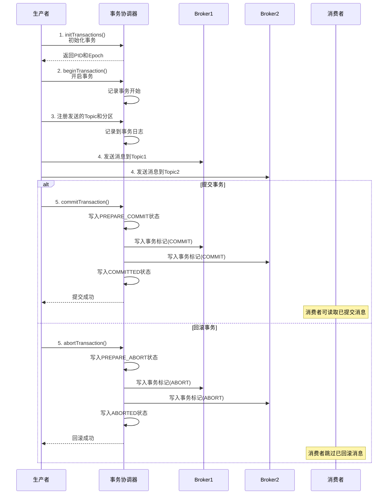
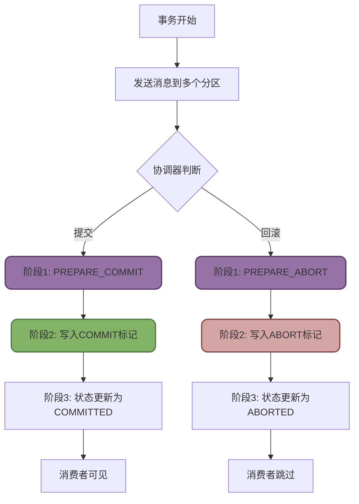
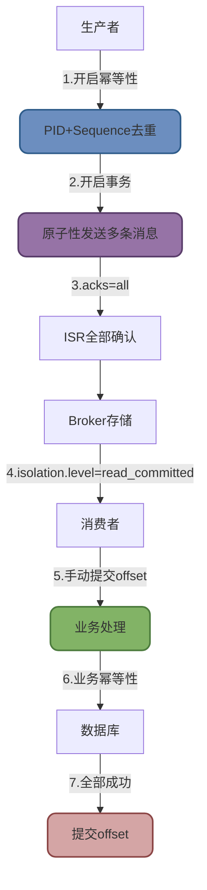

# Kafka事务与一致性保障

## Kafka事务消息深度解析

Kafka从0.11版本开始支持事务消息,但与RocketMQ等消息队列的事务消息有本质区别,需要正确理解其应用场景。

### Kafka事务与RocketMQ事务的本质差异

**Kafka事务消息**

保证一组消息的发送具有原子性,要么全部成功,要么全部失败:

```java
// Kafka事务保证:多条消息的原子性发送
producer.beginTransaction();
try {
    producer.send(new ProducerRecord<>("topic1", "msg1"));
    producer.send(new ProducerRecord<>("topic2", "msg2"));
    producer.send(new ProducerRecord<>("topic3", "msg3"));
    producer.commitTransaction();  // 三条消息要么全成功,要么全失败
} catch (Exception e) {
    producer.abortTransaction();
}
```

**RocketMQ事务消息**

保证本地事务和发送消息的原子性,解决分布式事务问题:

```java
// RocketMQ事务保证:本地DB事务 + 发送消息的原子性
TransactionMQProducer producer = new TransactionMQProducer();
producer.sendMessageInTransaction(msg, (msg, arg) -> {
    // 执行本地数据库事务
    orderService.createOrder(order);  // 本地事务
    return LocalTransactionState.COMMIT_MESSAGE;  // 提交消息
});
// 保证订单入库和消息发送要么都成功,要么都失败
```

:::warning 核心区别
- **Kafka事务**: 保证Kafka自身的多条消息原子性发送
- **RocketMQ事务**: 保证本地业务事务与MQ消息的原子性
:::

### Kafka事务机制核心组件

Kafka通过引入三个关键组件实现事务能力:

**Transaction Coordinator(事务协调器)**

特殊的Broker组件,负责管理事务状态:
- 为每个生产者分配唯一的Transaction ID
- 维护事务日志,记录事务状态变更
- 协调事务的提交和回滚

**Producer ID (PID) 和 Epoch**

Kafka为每个事务生产者分配:
- **PID**: 全局唯一的生产者标识
- **Epoch**: 生产者的版本号,防止僵尸实例

这两个字段配合使用,可以防止消息重复和过期:

```
生产者重启后:
旧实例: PID=123, Epoch=5 (已失效)
新实例: PID=123, Epoch=6 (有效)

Broker会拒绝Epoch=5的消息,防止僵尸实例干扰
```

**Transaction Log(事务日志)**

Kafka内部的特殊Topic(`__transaction_state`),记录事务状态:
- ONGOING: 事务进行中
- PREPARE_COMMIT: 准备提交
- COMMITTED: 已提交
- ABORTED: 已回滚

### Kafka事务执行流程



**详细步骤解析**

1. **初始化事务**

```java
Properties props = new Properties();
props.put("transactional.id", "order-producer-01");  // 必须设置事务ID
KafkaProducer<String, String> producer = new KafkaProducer<>(props);

producer.initTransactions();  // 向协调器注册,获取PID和Epoch
```

2. **开启事务**

生产者调用`beginTransaction()`告知协调器事务开始,协调器在事务日志中记录状态。

3. **发送消息**

生产者发送消息前,先向协调器注册涉及的Topic和分区:

```java
producer.beginTransaction();

// 发送到多个Topic
producer.send(new ProducerRecord<>("order-topic", orderId, orderData));
producer.send(new ProducerRecord<>("inventory-topic", skuId, inventoryData));
producer.send(new ProducerRecord<>("points-topic", userId, pointsData));
```

4. **两阶段提交**

**第一阶段(Prepare)**:
- 协调器将事务状态更新为`PREPARE_COMMIT`
- 写入事务日志持久化

**第二阶段(Commit)**:
- 协调器向所有相关分区写入"事务提交"标记
- 消费者读到标记后,放行之前被隔离的事务消息
- 协调器记录最终状态`COMMITTED`



### Kafka事务使用示例

**生产者事务代码**

```java
public class TransactionalProducer {
    
    public static void main(String[] args) {
        Properties props = new Properties();
        props.put("bootstrap.servers", "localhost:9092");
        props.put("transactional.id", "my-transactional-producer");
        props.put("key.serializer", StringSerializer.class.getName());
        props.put("value.serializer", StringSerializer.class.getName());
        
        // 事务配置
        props.put("enable.idempotence", "true");  // 开启幂等性
        props.put("acks", "all");                 // ISR全部确认
        
        KafkaProducer<String, String> producer = new KafkaProducer<>(props);
        producer.initTransactions();
        
        try {
            producer.beginTransaction();
            
            // 发送订单消息
            producer.send(new ProducerRecord<>("order-topic", "order001", 
                "{\"orderId\":\"001\",\"amount\":100}"));
            
            // 发送库存消息
            producer.send(new ProducerRecord<>("inventory-topic", "sku001", 
                "{\"skuId\":\"001\",\"quantity\":-1}"));
            
            // 发送积分消息
            producer.send(new ProducerRecord<>("points-topic", "user001", 
                "{\"userId\":\"001\",\"points\":10}"));
            
            // 模拟业务异常
            if (Math.random() > 0.5) {
                throw new RuntimeException("业务处理失败");
            }
            
            producer.commitTransaction();
            System.out.println("事务提交成功");
            
        } catch (ProducerFencedException | OutOfOrderSequenceException | 
                 AuthorizationException e) {
            // 致命异常,需要关闭生产者
            e.printStackTrace();
            producer.close();
        } catch (KafkaException e) {
            // 可恢复异常,回滚事务
            e.printStackTrace();
            producer.abortTransaction();
            System.out.println("事务已回滚");
        }
    }
}
```

**消费者事务隔离**

消费者需要设置隔离级别为`read_committed`,才能只读取已提交的事务消息:

```java
Properties props = new Properties();
props.put("bootstrap.servers", "localhost:9092");
props.put("group.id", "transactional-consumer-group");
props.put("isolation.level", "read_committed");  // 只读已提交的消息
props.put("enable.auto.commit", "false");        // 手动提交offset

KafkaConsumer<String, String> consumer = new KafkaConsumer<>(props);
consumer.subscribe(Arrays.asList("order-topic"));

while (true) {
    ConsumerRecords<String, String> records = consumer.poll(Duration.ofMillis(100));
    
    for (ConsumerRecord<String, String> record : records) {
        // 只会收到已提交的事务消息,未提交或已回滚的消息被自动过滤
        System.out.println("消费消息: " + record.value());
    }
    
    consumer.commitSync();
}
```

**隔离级别对比**

| 隔离级别 | 说明 | 可见性 |
|---------|------|-------|
| read_uncommitted | 读未提交(默认) | 可读取未提交的事务消息,可能读到后续回滚的消息 |
| read_committed | 读已提交 | 只读已提交的事务消息,自动跳过未提交或已回滚的消息 |

## Kafka消息精确一次语义

Kafka提供三种消息传递保障语义,其中Exactly-once是最高级别的保障。

### 三种消息语义对比

**At Most Once(最多一次)**

消息可能丢失,但不会重复:

```java
// 配置导致At Most Once
props.put("acks", "0");  // 不等待确认,可能丢失
props.put("enable.auto.commit", "true");  // 自动提交,处理失败后不重新消费
```

**使用场景**: 日志收集、用户行为埋点等允许少量丢失的场景

**At Least Once(至少一次)**

消息不会丢失,但可能重复:

```java
// 配置导致At Least Once
props.put("acks", "all");  // 等待ISR确认,不会丢失
props.put("enable.auto.commit", "false");  // 手动提交,失败后重新消费可能重复
```

**使用场景**: 金融交易、订单处理等不容许丢失的场景(Kafka默认)

**Exactly Once(精确一次)**

消息精确送达一次,既不丢失也不重复:

```java
// 生产者配置
props.put("enable.idempotence", "true");  // 幂等性
props.put("transactional.id", "my-tx-id");  // 事务ID

// 消费者配置
props.put("isolation.level", "read_committed");
```

**使用场景**: 金额计算、库存扣减等对一致性要求极高的场景

### 实现Exactly Once的技术手段

**生产者端:幂等性**

Kafka通过PID和Sequence Number实现生产者幂等:

```java
props.put("enable.idempotence", "true");

// Kafka会为每条消息分配序号
消息1: PID=100, Sequence=0
消息2: PID=100, Sequence=1
消息3: PID=100, Sequence=2 (重试)
消息3: PID=100, Sequence=2 (重复,Broker自动去重)
```

Broker会检测到相同PID和Sequence的消息,自动丢弃重复消息。

**端到端:事务 + 手动提交**

```java
// 生产者:开启事务
producer.initTransactions();
producer.beginTransaction();
producer.send(record);
producer.commitTransaction();

// 消费者:事务内消费和提交offset
consumer.beginTransaction();
ConsumerRecords<String, String> records = consumer.poll(Duration.ofMillis(100));
for (ConsumerRecord<String, String> record : records) {
    processRecord(record);
}
consumer.commitTransaction();  // 提交消费offset
```

**业务层:幂等性保障**

即使Kafka保证了Exactly Once,业务代码仍需实现幂等性:

```java
@Service
public class OrderService {
    
    @Transactional
    public void processOrder(OrderMessage msg) {
        // 方案1: 数据库唯一约束
        try {
            orderRepo.save(new Order(msg.getOrderId(), msg.getAmount()));
        } catch (DuplicateKeyException e) {
            log.warn("订单已存在,跳过: {}", msg.getOrderId());
            return;
        }
        
        // 方案2: 分布式锁
        String lockKey = "order:" + msg.getOrderId();
        if (redisLock.tryLock(lockKey)) {
            try {
                if (!orderRepo.exists(msg.getOrderId())) {
                    orderRepo.save(new Order(msg.getOrderId(), msg.getAmount()));
                }
            } finally {
                redisLock.unlock(lockKey);
            }
        }
        
        // 方案3: 去重表
        if (dedupeRepo.contains(msg.getOrderId())) {
            log.warn("消息已处理,跳过: {}", msg.getOrderId());
            return;
        }
        
        orderRepo.save(new Order(msg.getOrderId(), msg.getAmount()));
        dedupeRepo.add(msg.getOrderId());
    }
}
```

### Exactly Once完整实现方案



:::tip Exactly Once最佳实践
1. **生产者**: 开启幂等性(`enable.idempotence=true`) + 事务
2. **Broker**: 配置`acks=all`,确保ISR全部确认
3. **消费者**: 隔离级别`read_committed` + 手动提交offset
4. **业务层**: 实现幂等性(数据库约束/分布式锁/去重表)
5. **监控告警**: 监控重复消息率,及时发现问题
:::
