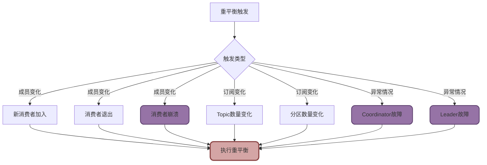

import PaidCTA from '@site/src/components/PaidCTA';

# Kafka重平衡机制深度解析

## Kafka重平衡机制原理

重平衡(Rebalance)是Kafka消费者组的核心协调机制,当消费者组成员或订阅信息发生变化时,Kafka会重新分配分区给各个消费者,确保负载均衡和高可用性。

### 重平衡触发条件

**正常触发条件**

1. **消费者组成员变化**
   - 新消费者加入消费者组
   - 消费者主动退出(调用`close()`)
   - 消费者崩溃或网络故障被踢出

2. **订阅Topic数量变化**
   - 使用正则订阅时,新Topic匹配上
   - 动态添加或删除Topic订阅

3. **Topic分区数量变化**
   - 管理员增加Topic的分区数

**异常触发条件**

1. **Group Coordinator故障**
   - 负责管理消费者组的Broker节点宕机
   - Kafka需要重新选举Coordinator并触发重平衡

2. **Consumer Leader故障**
   - 消费者组的Leader消费者崩溃
   - 需要选举新Leader重新分配分区

### 重平衡执行流程

Kafka的重平衡流程经过精心设计,确保分区分配的公平性和一致性:

<PaidCTA />