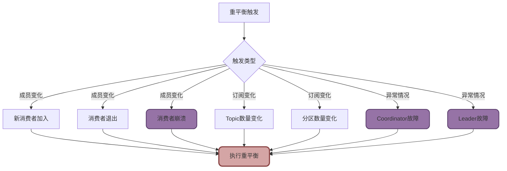
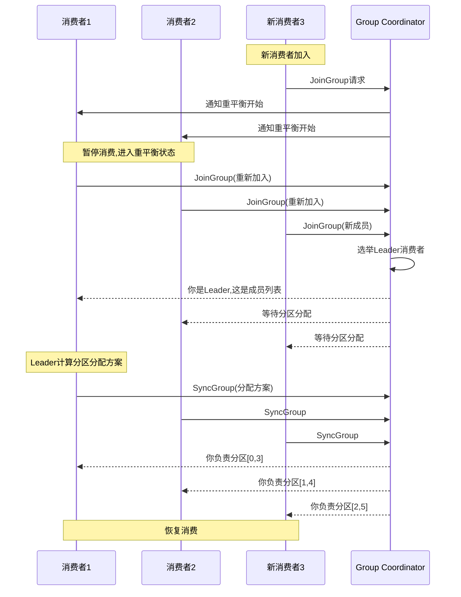
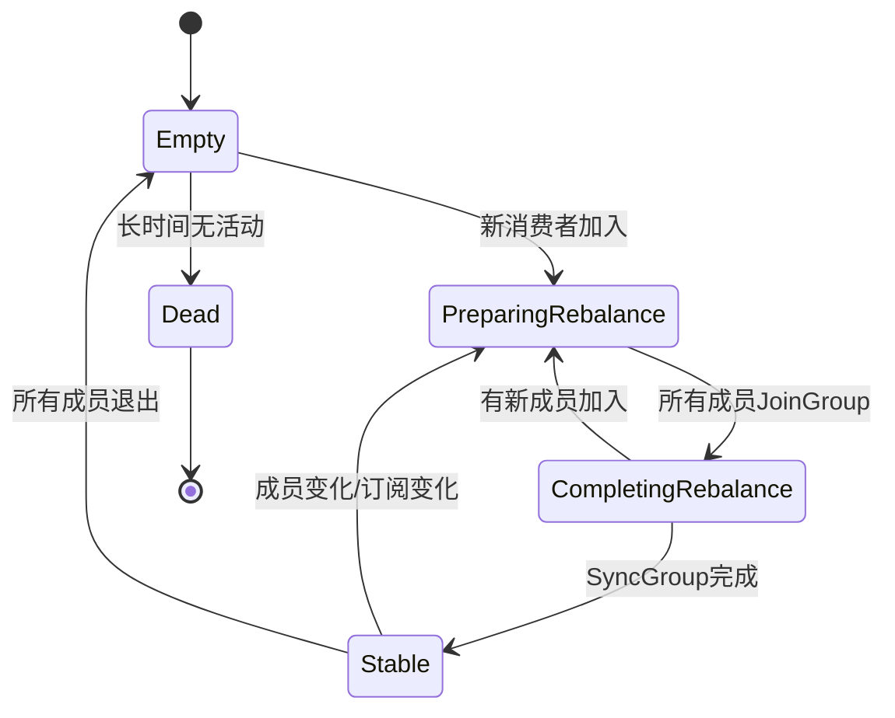
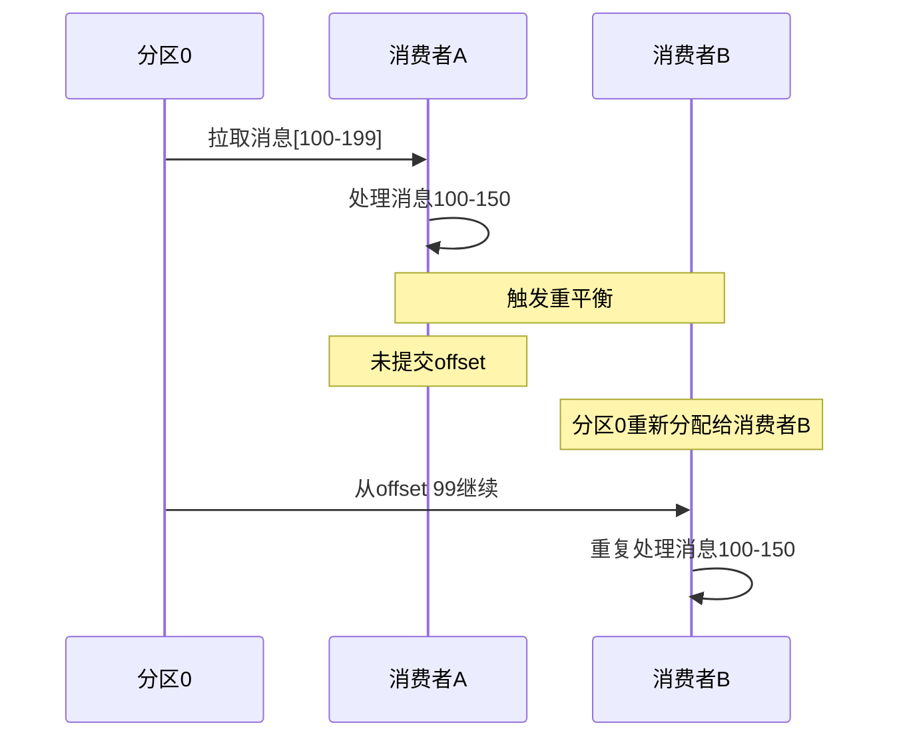
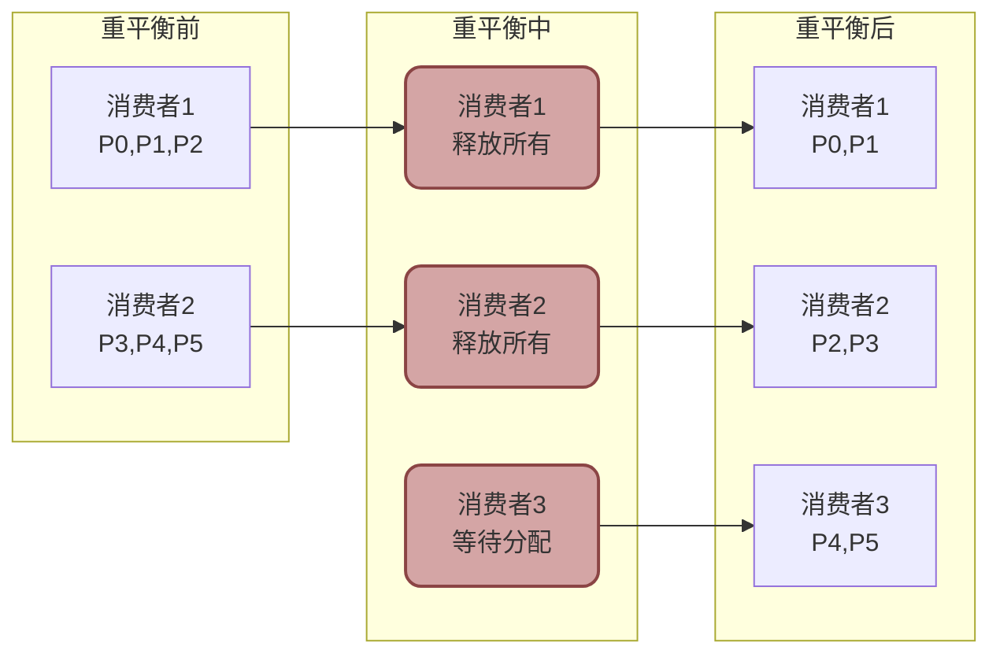
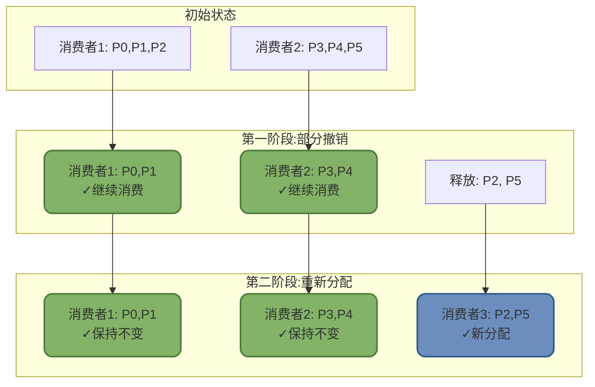

# Kafka重平衡机制深度解析

## Kafka重平衡机制原理

重平衡(Rebalance)是Kafka消费者组的核心协调机制,当消费者组成员或订阅信息发生变化时,Kafka会重新分配分区给各个消费者,确保负载均衡和高可用性。

### 重平衡触发条件

**正常触发条件**

1. **消费者组成员变化**
   - 新消费者加入消费者组
   - 消费者主动退出(调用`close()`)
   - 消费者崩溃或网络故障被踢出

2. **订阅Topic数量变化**
   - 使用正则订阅时,新Topic匹配上
   - 动态添加或删除Topic订阅

3. **Topic分区数量变化**
   - 管理员增加Topic的分区数

**异常触发条件**

1. **Group Coordinator故障**
   - 负责管理消费者组的Broker节点宕机
   - Kafka需要重新选举Coordinator并触发重平衡

2. **Consumer Leader故障**
   - 消费者组的Leader消费者崩溃
   - 需要选举新Leader重新分配分区



### 重平衡执行流程

Kafka的重平衡流程经过精心设计,确保分区分配的公平性和一致性:



**详细步骤解析**

1. **暂停消费(Pause)**

所有消费者停止拉取消息,进入重平衡准备状态,这是造成STW(Stop-The-World)的根本原因。

2. **JoinGroup阶段**

所有消费者向Group Coordinator发送JoinGroup请求,包含:
- 消费者ID
- 支持的分区分配策略
- 订阅的Topic列表

Coordinator收集所有成员信息后,选举一个消费者作为Leader(通常是第一个发送JoinGroup的消费者)。

3. **分配计算(Leader Only)**

只有Leader消费者负责计算分区分配方案:

```java
// Leader消费者的职责
Map<String, List<TopicPartition>> assignment = 
    partitionAssignor.assign(metadata, subscriptions);

// 例如RangeAssignor的分配结果:
{
  "consumer1": [partition-0, partition-1],
  "consumer2": [partition-2, partition-3],
  "consumer3": [partition-4, partition-5]
}
```

4. **SyncGroup阶段**

所有消费者向Coordinator发送SyncGroup请求:
- Leader消费者携带分配方案
- 其他消费者发送空请求

Coordinator将分配结果广播给所有消费者。

5. **恢复消费(Resume)**

每个消费者按照分配的分区恢复消费,重平衡完成。

### 消费者五种状态流转

Kafka消费者组在生命周期中会经历五种状态:

| 状态 | 说明 | 典型场景 |
|------|------|---------|
| **Empty** | 组内无成员,但可能有已提交的offset | 所有消费者停止后 |
| **Dead** | 组内无成员,元数据已清除 | 长时间无消费者,被GC |
| **PreparingRebalance** | 准备开启重平衡,等待成员加入 | 新消费者加入或成员退出 |
| **CompletingRebalance** | 成员已加入,等待Leader分配分区 | JoinGroup完成,等待SyncGroup |
| **Stable** | 稳定状态,正常消费 | 重平衡完成 |

**状态流转图**:



## 重平衡带来的问题与影响

重平衡虽然实现了自动化的负载均衡,但也带来了不可忽视的副作用。

### STW问题

**Stop-The-World现象**

在重平衡期间,消费者组内的所有消费者都会停止消费,等待重平衡完成:

```
假设消费者组有10个消费者,每个消费者消费10万/秒
重平衡耗时5秒,则:
停止消费消息数 = 10 × 100000 × 5 = 500万条消息
造成严重的消费延迟
```

**STW影响示意图**:

```mermaid
gantt
    title 重平衡STW影响
    dateFormat s
    axisFormat %S秒
    section 消费者1
    正常消费  :active, 0, 10s
    重平衡STW :crit, 10, 5s
    恢复消费  :active, 15, 10s
    
    section 消费者2
    正常消费  :active, 0, 10s
    重平衡STW :crit, 10, 5s
    恢复消费  :active, 15, 10s
    
    section 消费者3
    正常消费  :active, 0, 10s
    重平衡STW :crit, 10, 5s
    恢复消费  :active, 15, 10s
```



### 消息重复消费

重平衡过程中可能导致消息重复消费:

**场景示例**:

```
1. 消费者A正在消费分区0,已拉取offset 100-199的消息
2. 处理到offset 150,还未提交offset
3. 触发重平衡,分区0被重新分配给消费者B
4. 消费者B从上次提交的offset 99开始消费
5. offset 100-150的消息被重复消费
```



### 消息堆积

**Kafka旧版本(4.0前)**

所有消费者同时暂停,导致短时间内消息大量积压:

```
Topic吞吐: 50万/秒
重平衡耗时: 10秒
消息堆积量: 50万 × 10 = 500万条
```

**RocketMQ定时重平衡**

RocketMQ采用定时重平衡机制(默认20秒),消费者宕机后,消息会积压直到下一次重平衡:

```
消费者A宕机时间: 10:00:00
下次重平衡时间: 10:00:20 (20秒后)
消息堆积时间: 20秒
```

## 传统重平衡优化方案

在Kafka引入渐进式重平衡之前,可以通过以下方案减少重平衡影响。

### 静态成员机制

Kafka 2.3+引入静态成员(Static Membership),消费者重启时不触发重平衡:

```java
Properties props = new Properties();
// 设置静态成员ID
props.put("group.instance.id", "consumer-instance-01");

// 设置会话超时时间(默认45秒)
props.put("session.timeout.ms", "45000");
```

**工作原理**:

```
传统模式:
消费者A重启 → 离开消费者组 → 触发重平衡 → 重新加入 → 再次重平衡

静态成员模式:
消费者A重启 → Coordinator等待45秒 → 
  - 如果45秒内重启成功 → 保持原分区分配,不重平衡
  - 如果超过45秒 → 踢出并触发重平衡
```

### 合理配置分区分配策略

选择合适的分区分配策略可以减少重平衡的影响:

**RangeAssignor(默认)**

按Topic的分区范围分配,可能导致负载不均:

```
Topic1有3个分区,Topic2有3个分区,2个消费者:
消费者1: Topic1-P0, Topic1-P1, Topic2-P0, Topic2-P1 (4个分区)
消费者2: Topic1-P2, Topic2-P2 (2个分区)  // 不均衡
```

**RoundRobinAssignor**

轮询分配,更加均衡:

```
消费者1: Topic1-P0, Topic1-P2, Topic2-P1
消费者2: Topic1-P1, Topic2-P0, Topic2-P2  // 负载均衡
```

**StickyAssignor(推荐)**

尽量保持原有分配,减少分区迁移:

```
重平衡前:
消费者1: P0, P1, P2
消费者2: P3, P4, P5

消费者3加入后(传统策略):
消费者1: P0, P1  // 失去P2
消费者2: P2, P3  // 失去P4、P5,得到P2
消费者3: P4, P5  // 新分配

消费者3加入后(Sticky策略):
消费者1: P0, P1  // 保持不变
消费者2: P3, P4  // 只失去P5
消费者3: P2, P5  // 新分配,减少了迁移
```

**配置分区策略**:

```java
props.put("partition.assignment.strategy", 
    "org.apache.kafka.clients.consumer.StickyAssignor");
```

### 避免频繁重平衡

**调优心跳参数**:

```java
// 会话超时时间(默认45秒)
props.put("session.timeout.ms", "60000");

// 心跳间隔(默认3秒)
props.put("heartbeat.interval.ms", "3000");

// 两次poll之间的最大间隔(默认5分钟)
props.put("max.poll.interval.ms", "300000");
```

**关系说明**:
- `heartbeat.interval.ms` < `session.timeout.ms` / 3
- 处理时间不能超过`max.poll.interval.ms`,否则被踢出

## 渐进式重平衡(Incremental Cooperative Rebalance)

Kafka 2.4+引入的协作式重平衡,彻底改变了重平衡的执行方式。

### CooperativeStickyAssignor原理

传统重平衡的问题:所有消费者释放所有分区,再重新分配,造成全局STW。

渐进式重平衡的改进:只释放需要迁移的分区,其他分区继续消费。

**配置方式**:

```java
props.put("partition.assignment.strategy",
    "org.apache.kafka.clients.consumer.CooperativeStickyAssignor");
```

### 两阶段渐进式分配

**场景**: 6个分区,2个消费者,新增1个消费者

**传统重平衡流程**:



**渐进式重平衡流程**:



**优势对比**:

| 维度 | 传统重平衡 | 渐进式重平衡 |
|------|-----------|------------|
| STW时间 | 全部消费者暂停 | 只有迁移分区暂停 |
| 影响范围 | 100% | ~17%(本例中2/6) |
| 消息堆积 | 严重 | 轻微 |
| 分区迁移数 | 6个 | 2个 |

### 渐进式重平衡详细流程

**第一阶段:撤销不需要的分区**

```java
// Coordinator计算最小变更方案
消费者1释放: P2
消费者2释放: P5

// 其他分区继续消费
消费者1继续消费: P0, P1
消费者2继续消费: P3, P4
```

**第二阶段:分配给新消费者**

```java
// 新消费者接手被释放的分区
消费者3分配: P2, P5

// 最终分配结果
消费者1: P0, P1
消费者2: P3, P4
消费者3: P2, P5
```

## Kafka 4.0下一代重平衡协议

Kafka 4.0(2025-03-19发布)引入全新的重平衡协议,进一步优化性能和可用性。

### 核心改进点

**1. 服务端分区分配**

将分区分配逻辑从客户端移到服务端:

```
传统模式:
Coordinator → 选举Leader消费者 → Leader计算分配 → 广播结果

新协议:
Coordinator → 直接计算分配 → 广播结果
```

**优势**:
- 客户端更简单,降低开发复杂度
- 服务端全局视角,分配更优化
- 减少网络往返,提升效率

**2. 独立重平衡**

允许消费者独立于其他成员进行重平衡:

```
传统模式:
消费者A变化 → 所有消费者暂停 → 重新分配 → 全部恢复

新协议:
消费者A变化 → 只有A相关的分区调整 → 其他继续消费
```

**效果**:
- 消费者故障只影响其负责的分区
- 大幅减少STW时间
- 提升系统整体可用性

**3. 共享组(Shared Group)**

打破"一个分区只能被组内一个消费者消费"的限制:

```java
// 传统模式
6个分区,8个消费者 → 2个消费者空闲

// 共享组模式
6个分区,8个消费者 → 8个消费者并行消费,逐条确认
```

**特性**:
- 多个消费者可并行消费同一分区
- 支持逐条确认消息
- 显著提升消费吞吐

### 重平衡优化效果对比

| 版本 | 重平衡方式 | STW时间 | 可用性 |
|------|-----------|---------|--------|
| 2.3之前 | 全量重平衡 | 5-10秒 | 低 |
| 2.4-3.x | 渐进式重平衡 | 1-2秒 | 中 |
| 4.0+ | 下一代协议 | 100-500ms | 高 |

:::tip 重平衡优化建议
1. **Kafka 2.4+**: 使用`CooperativeStickyAssignor`渐进式重平衡
2. **Kafka 4.0+**: 启用下一代重平衡协议
3. **静态成员**: 对于频繁重启的消费者,配置静态成员ID
4. **合理调优**: 调整心跳、会话超时参数,避免误判
5. **监控告警**: 监控重平衡频率和耗时,及时优化
:::
