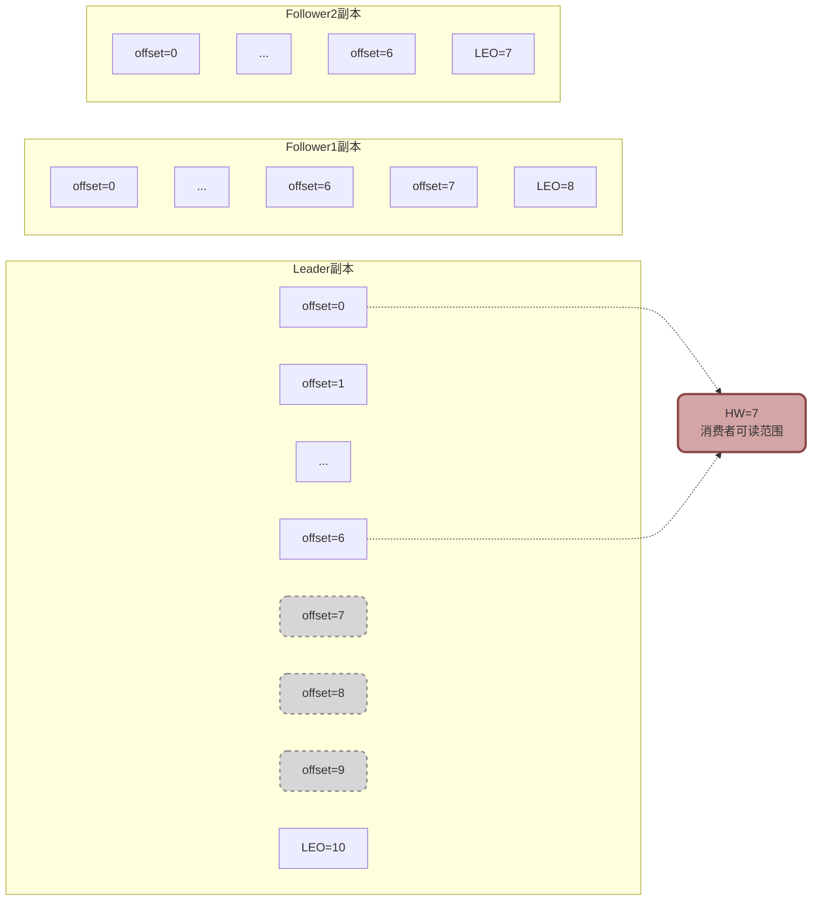
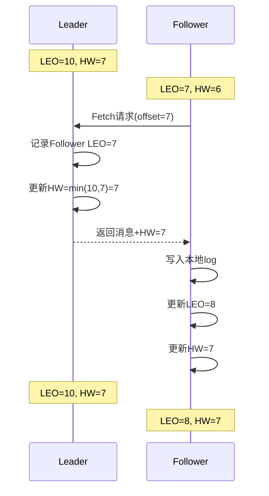
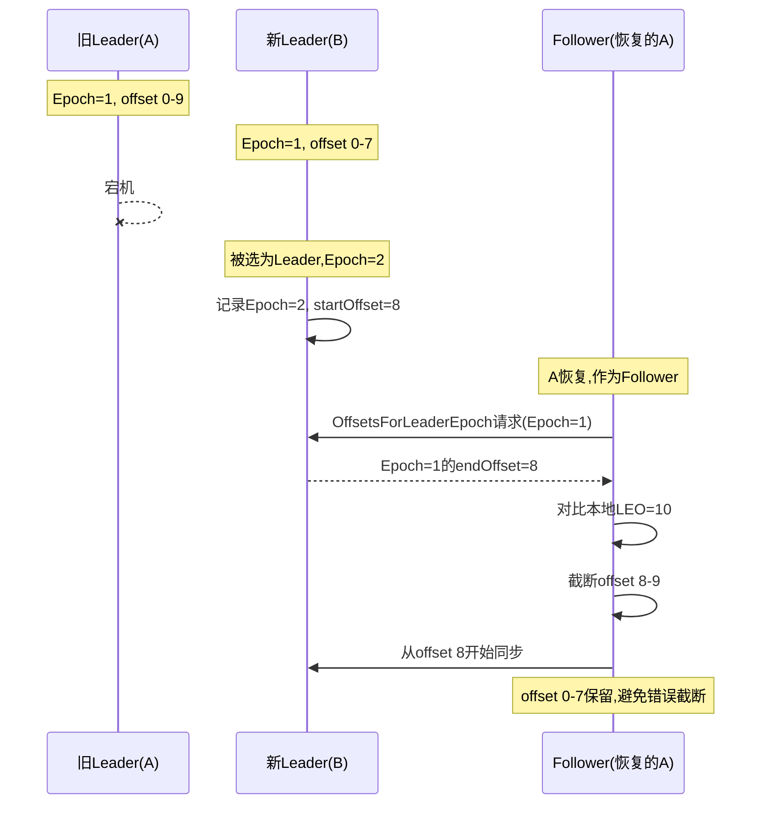
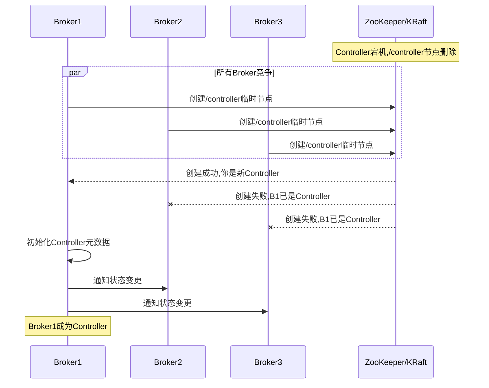
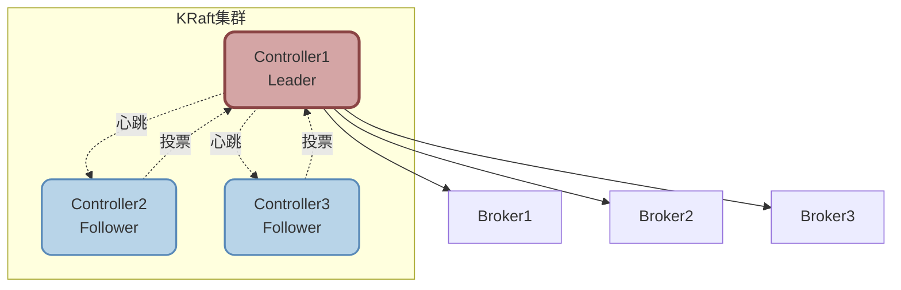

# Kafka高级特性与核心机制

## Kafka高水位与LEO机制

高水位(High Watermark, HW)和LEO(Log End Offset)是Kafka保证消息可靠性和一致性的核心机制。

### 核心概念解析

**LEO(Log End Offset)**

LEO标识当前日志文件中下一条待写入消息的位置,即最新消息的offset + 1:

```
分区日志文件:
offset=0: 消息A
offset=1: 消息B
offset=2: 消息C
LEO = 3 (下一条消息将写入offset=3的位置)
```

**HW(High Watermark)**

HW标识已经被所有ISR副本确认的消息的最高offset,消费者只能读取HW之前的消息:

```
Leader副本: offset 0-9, LEO=10
Follower1: offset 0-7, LEO=8
Follower2: offset 0-6, LEO=7

HW = min(所有ISR的LEO) = 7
消费者只能读取offset 0-6的消息
```



### HW的作用

**1. 消费进度管理**

消费者通过比较自己的消费offset与HW,确定消费进度:

```java
// 消费者读取消息时
if (consumerOffset < highWatermark) {
    // 可以继续消费
    fetchMessages(consumerOffset, highWatermark);
} else {
    // 已经消费到最新,等待新消息
    wait();
}
```

**2. 数据可靠性保障**

只有HW之前的消息才被认为是"已提交"的,保证消息不会因副本故障而丢失:

```
场景:Leader宕机
HW=7时,offset 0-6的消息已被所有ISR副本确认
新Leader从任何ISR副本选出,都能保证offset 0-6的消息存在
offset 7-9的消息未被全部确认,可能丢失(符合预期)
```

### HW更新机制

**Leader端HW更新**:

```java
// Leader收到Follower的Fetch请求时
for (Follower follower : ISR) {
    remoteLEO = follower.fetchRequest.getOffset();
}

// 更新HW为所有ISR副本LEO的最小值
newHW = min(allISRLEOs);
if (newHW > currentHW) {
    updateHighWatermark(newHW);
}
```

**Follower端HW更新**:

```java
// Follower从Leader拉取消息时
FetchResponse response = fetchFromLeader();

// 写入本地日志
appendToLocalLog(response.messages);

// 更新LEO
updateLEO(localLog.lastOffset() + 1);

// 更新HW为Leader返回的HW值
updateHW(response.highWatermark);
```



## Leader Epoch机制

Leader Epoch是Kafka为了解决HW机制缺陷而引入的增强特性,用于避免数据丢失和数据不一致。

### HW机制的缺陷

**数据丢失场景**:

```
初始状态:
Leader: offset 0-9, LEO=10, HW=8
Follower: offset 0-7, LEO=8, HW=7

步骤1: Follower发送Fetch请求
Leader响应消息,同时HW更新为8

步骤2: Follower收到响应前宕机重启
Follower根据HW=7截断日志,删除offset 7

步骤3: Leader宕机,Follower被选为新Leader
新Leader: offset 0-6, LEO=7, HW=7

结果: offset 7-9的消息永久丢失
```

**数据不一致场景**:

```
初始:
Leader A: msg1, msg2, msg3
Follower B: msg1, msg2

A宕机,B成为Leader写入msg4:
Leader B: msg1, msg2, msg4

A恢复后作为Follower,根据HW截断:
Follower A: msg1, msg2

A再次成为Leader,写入msg5:
Leader A: msg1, msg2, msg5

最终数据不一致:
A: msg1, msg2, msg5
B: msg1, msg2, msg4
```

### Leader Epoch解决方案

Leader Epoch通过记录每个Leader的任期和起始offset,避免基于HW的盲目截断。

**Leader Epoch结构**:

```java
class LeaderEpochEntry {
    int epoch;         // Leader任期编号
    long startOffset;  // 该任期的起始offset
}

// 示例
[
  {epoch: 0, startOffset: 0},    // 第0任Leader从offset 0开始
  {epoch: 1, startOffset: 100},  // 第1任Leader从offset 100开始
  {epoch: 2, startOffset: 250}   // 第2任Leader从offset 250开始
]
```

**避免数据丢失流程**:



**工作原理**:

1. 每次Leader切换时,新Leader的Epoch递增
2. 新Leader记录当前的起始offset
3. Follower恢复时,向Leader查询上一个Epoch的结束位置
4. Follower根据Leader返回的准确位置截断,而非盲目使用HW

**对比**:

| 机制 | 截断依据 | 数据丢失风险 | 数据一致性 |
|------|---------|------------|-----------|
| 仅HW | Follower本地HW | 高 | 低 |
| HW+Leader Epoch | Leader确认的Epoch结束位置 | 低 | 高 |

## Kafka分区Leader选举机制

Kafka通过多种选举机制保证集群的高可用性。

### Partition Leader选举

当分区的Leader副本故障时,需要从Follower中选举新的Leader。

**选举触发条件**:
- Leader所在Broker宕机
- Leader网络故障无法响应
- Controller主动触发(如分区迁移)

**选举策略**:

**1. ISR优先选举(默认)**

只从ISR列表中选择新Leader,保证数据不丢失:

```java
// 选举逻辑
List<Replica> candidates = partition.getISR();
if (!candidates.isEmpty()) {
    newLeader = candidates.get(0);  // 选择ISR中第一个副本
} else {
    // ISR为空,无法选举,分区不可用
    throw new NoReplicaOnlineException();
}
```

**2. Unclean Leader选举**

当ISR为空时,可以从非ISR副本中选举Leader(可能丢失数据):

```java
// 配置
unclean.leader.election.enable = true  // 允许非ISR副本参与选举

// 选举逻辑
if (ISR.isEmpty() && uncleanElectionEnabled) {
    newLeader = allReplicas.get(0);  // 从所有副本中选择
    // 警告:可能丢失未同步的消息
}
```

| 配置 | 优点 | 缺点 | 适用场景 |
|------|------|------|---------|
| `false`(默认) | 保证数据不丢失 | ISR为空时分区不可用 | 金融、交易等场景 |
| `true` | 提升可用性 | 可能丢失未同步的消息 | 日志、监控等场景 |

### Controller选举

Kafka集群中有且仅有一个Controller,负责管理分区和副本状态。

**Controller职责**:
- 监听Broker上下线
- 管理分区的Leader选举
- 管理副本的ISR变更
- 处理分区迁移

**选举流程**:



**基于ZooKeeper的选举**:

```
1. Controller创建/controller临时节点
2. 其他Broker监听/controller节点
3. Controller宕机时,临时节点自动删除
4. 所有Broker收到通知,竞争创建/controller
5. 第一个创建成功的Broker成为新Controller
```

**基于KRaft的选举(Kafka 2.8+)**:

Kafka 4.0正式移除ZooKeeper依赖,使用KRaft协议:
- 采用Raft共识算法选举Controller
- 元数据存储在Kafka内部Topic
- 简化部署,提升性能



### 选举中的序列号机制

**为什么选择序列号最小的副本?**

在Partition Leader选举中,Kafka使用ZooKeeper的序列号节点机制:

```
ZooKeeper临时顺序节点:
/election/partition-0-0000000001  (Replica1)
/election/partition-0-0000000002  (Replica2)
/election/partition-0-0000000003  (Replica3)

序列号最小的Replica1成为Leader
```

**优势**:
- **唯一性**: 序列号由ZooKeeper保证全局唯一且递增
- **确定性**: 避免选举冲突,第一个注册的副本一定序列号最小
- **公平性**: 所有副本机会均等,按注册顺序选举

## Kafka与ZooKeeper协作机制

在Kafka 4.0之前,ZooKeeper是Kafka集群不可或缺的组件。

### ZooKeeper的核心职责

**1. 集群成员管理**

Broker启动时在ZooKeeper注册临时节点:

```
/brokers/ids/1001
  {"host":"broker1.example.com", "port":9092}

/brokers/ids/1002
  {"host":"broker2.example.com", "port":9092}

/brokers/ids/1003
  {"host":"broker3.example.com", "port":9092}
```

Broker宕机时,临时节点自动删除,集群立即感知。

**2. 分区元数据管理**

存储分区的Leader、副本、ISR信息:

```
/brokers/topics/order-topic/partitions/0/state
{
  "leader": 1001,
  "replicas": [1001, 1002, 1003],
  "isr": [1001, 1002]
}
```

所有Broker监听此节点,Leader变化时立即更新本地缓存。

**3. Controller选举**

通过创建`/controller`临时节点实现Controller选举:

```
/controller
{
  "brokerid": 1001,
  "timestamp": "1234567890"
}
```

**4. Broker配置管理**

存储Topic的创建、删除、修改等配置变更:

```
/config/topics/order-topic
{
  "version": 1,
  "config": {
    "retention.ms": "604800000",
    "segment.bytes": "1073741824"
  }
}
```

Controller监听此节点,配置变更时通知所有Broker更新。

### KRaft架构演进

**移除ZooKeeper的原因**:

1. **运维复杂**: 需要单独部署和维护ZooKeeper集群
2. **性能瓶颈**: 大规模集群下,ZooKeeper成为元数据管理瓶颈
3. **故障恢复慢**: Controller故障时,依赖ZooKeeper选举,耗时较长

**KRaft架构优势**:

| 维度 | ZooKeeper模式 | KRaft模式 |
|------|--------------|----------|
| 部署复杂度 | 需要单独部署ZK | 无需ZK,简化部署 |
| 元数据性能 | 受ZK限制 | Kafka内部管理,性能更高 |
| 故障恢复 | 选举慢(秒级) | Raft选举快(毫秒级) |
| 分区数支持 | 10万级 | 百万级 |

**Kafka 4.0(2025-03-19)正式移除ZooKeeper依赖,全面采用KRaft架构。**

:::tip 版本选择建议
- **生产环境新部署**: 优先选择Kafka 3.3+,使用KRaft模式
- **已有ZooKeeper集群**: 可继续使用,逐步迁移到KRaft
- **大规模集群**: 必须使用KRaft,突破ZooKeeper的性能限制
:::
