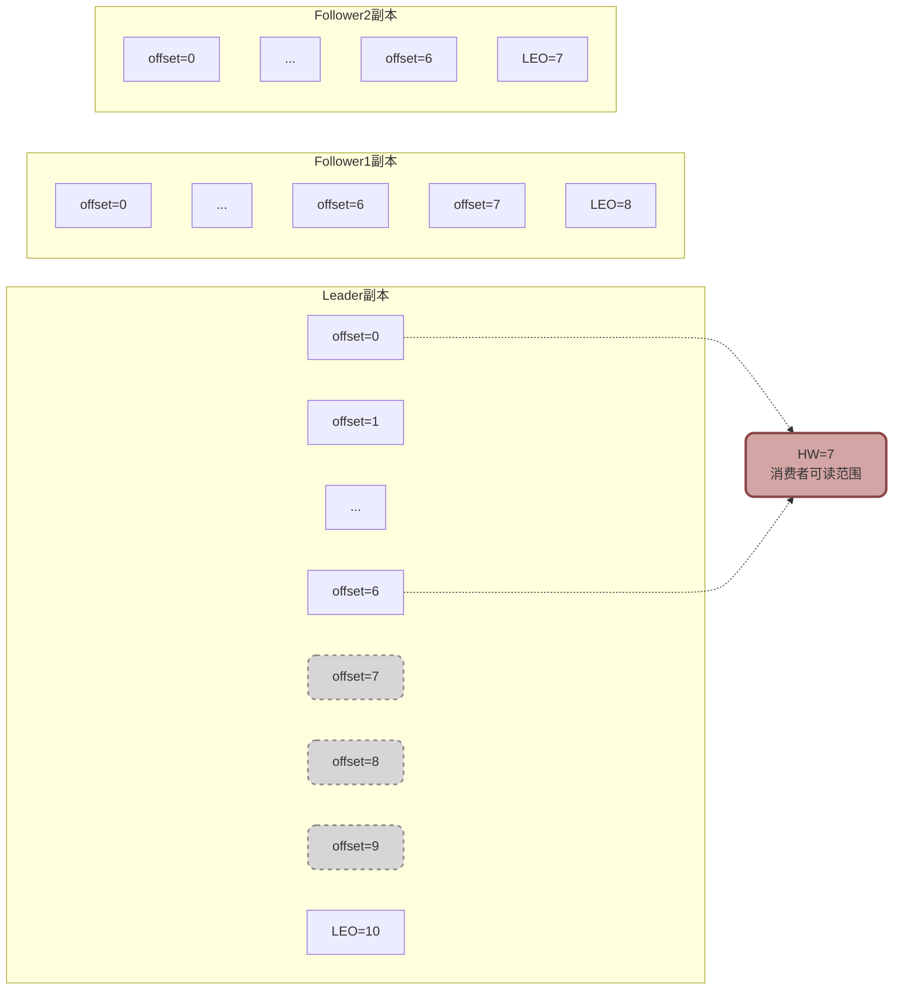
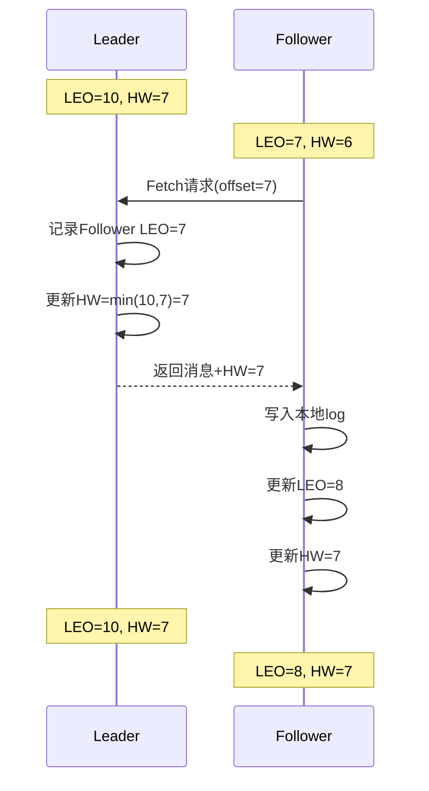
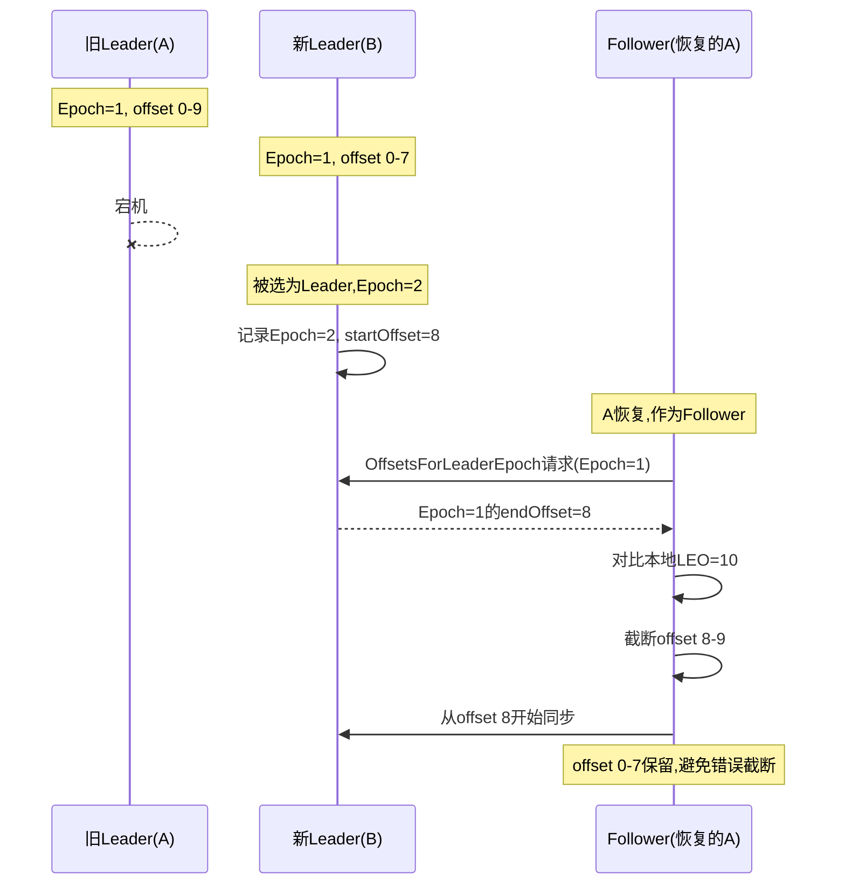

import PaidCTA from '@site/src/components/PaidCTA';

# Kafka高级特性与核心机制

## Kafka高水位与LEO机制

高水位(High Watermark, HW)和LEO(Log End Offset)是Kafka保证消息可靠性和一致性的核心机制。

### 核心概念解析

**LEO(Log End Offset)**

LEO标识当前日志文件中下一条待写入消息的位置,即最新消息的offset + 1:

```
分区日志文件:
offset=0: 消息A
offset=1: 消息B
offset=2: 消息C
LEO = 3 (下一条消息将写入offset=3的位置)
```

**HW(High Watermark)**

HW标识已经被所有ISR副本确认的消息的最高offset,消费者只能读取HW之前的消息:

```
Leader副本: offset 0-9, LEO=10
Follower1: offset 0-7, LEO=8
Follower2: offset 0-6, LEO=7

HW = min(所有ISR的LEO) = 7
消费者只能读取offset 0-6的消息
```



### HW的作用

**1. 消费进度管理**

消费者通过比较自己的消费offset与HW,确定消费进度:

```java
// 消费者读取消息时
if (consumerOffset < highWatermark) {
    // 可以继续消费
    fetchMessages(consumerOffset, highWatermark);
} else {
    // 已经消费到最新,等待新消息
    wait();
}
```

**2. 数据可靠性保障**

只有HW之前的消息才被认为是"已提交"的,保证消息不会因副本故障而丢失:

```
场景:Leader宕机
HW=7时,offset 0-6的消息已被所有ISR副本确认
新Leader从任何ISR副本选出,都能保证offset 0-6的消息存在
offset 7-9的消息未被全部确认,可能丢失(符合预期)
```

### HW更新机制

**Leader端HW更新**:

```java
// Leader收到Follower的Fetch请求时
for (Follower follower : ISR) {
    remoteLEO = follower.fetchRequest.getOffset();
}

// 更新HW为所有ISR副本LEO的最小值
newHW = min(allISRLEOs);
if (newHW > currentHW) {
    updateHighWatermark(newHW);
}
```

**Follower端HW更新**:

```java
// Follower从Leader拉取消息时
FetchResponse response = fetchFromLeader();

// 写入本地日志
appendToLocalLog(response.messages);

// 更新LEO
updateLEO(localLog.lastOffset() + 1);

// 更新HW为Leader返回的HW值
updateHW(response.highWatermark);
```



## Leader Epoch机制

Leader Epoch是Kafka为了解决HW机制缺陷而引入的增强特性,用于避免数据丢失和数据不一致。

### HW机制的缺陷

**数据丢失场景**:

```
初始状态:
Leader: offset 0-9, LEO=10, HW=8
Follower: offset 0-7, LEO=8, HW=7

步骤1: Follower发送Fetch请求
Leader响应消息,同时HW更新为8

步骤2: Follower收到响应前宕机重启
Follower根据HW=7截断日志,删除offset 7

步骤3: Leader宕机,Follower被选为新Leader
新Leader: offset 0-6, LEO=7, HW=7

结果: offset 7-9的消息永久丢失
```

**数据不一致场景**:

```
初始:
Leader A: msg1, msg2, msg3
Follower B: msg1, msg2

A宕机,B成为Leader写入msg4:
Leader B: msg1, msg2, msg4

A恢复后作为Follower,根据HW截断:
Follower A: msg1, msg2

A再次成为Leader,写入msg5:
Leader A: msg1, msg2, msg5

最终数据不一致:
A: msg1, msg2, msg5
B: msg1, msg2, msg4
```

### Leader Epoch解决方案

Leader Epoch通过记录每个Leader的任期和起始offset,避免基于HW的盲目截断。

**Leader Epoch结构**:

```java
class LeaderEpochEntry {
    int epoch;         // Leader任期编号
    long startOffset;  // 该任期的起始offset
}

// 示例
[
  {epoch: 0, startOffset: 0},    // 第0任Leader从offset 0开始
  {epoch: 1, startOffset: 100},  // 第1任Leader从offset 100开始
  {epoch: 2, startOffset: 250}   // 第2任Leader从offset 250开始
]
```

**避免数据丢失流程**:



**工作原理**:

1. 每次Leader切换时,新Leader的Epoch递增
2. 新Leader记录当前的起始offset
3. Follower恢复时,向Leader查询上一个Epoch的结束位置
4. Follower根据Leader返回的准确位置截断,而非盲目使用HW

**对比**:

| 机制 | 截断依据 | 数据丢失风险 | 数据一致性 |
|------|---------|------------|-----------|
| 仅HW | Follower本地HW | 高 | 低 |
| HW+Leader Epoch | Leader确认的Epoch结束位置 | 低 | 高 |

## Kafka分区Leader选举机制

Kafka通过多种选举机制保证集群的高可用性。

<PaidCTA />