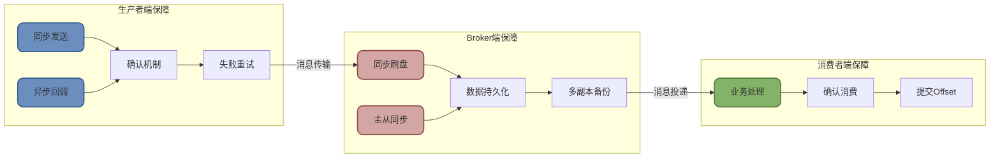
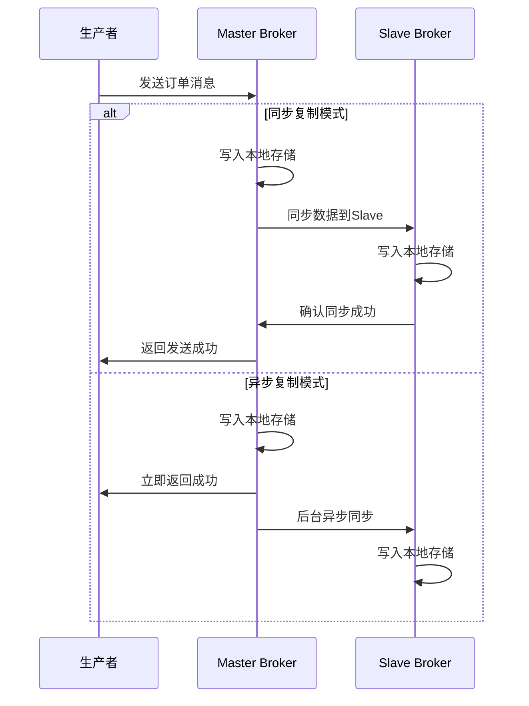

# RocketMQ消息可靠性保障机制

## 消息不丢失的保障策略

在分布式消息系统中,保证消息的可靠传输是一项系统工程,需要生产者、Broker和消费者三方协同配合。RocketMQ提供了多层次的可靠性保障机制,确保消息在各个环节都不会丢失。



### 生产者端可靠性保障

生产者是消息的起点,确保消息成功发送到Broker是可靠性的第一道防线。

#### 选择合适的发送方式

RocketMQ提供了三种消息发送方式,可靠性依次递减:

**同步发送(Sync Send)**: 这是可靠性最高的发送方式。生产者调用send方法后会阻塞等待,直到收到Broker的确认响应或超时。只有明确收到成功响应,才能确认消息已成功发送。

```java
// 同步发送示例 - 电商订单场景
DefaultMQProducer producer = new DefaultMQProducer("order_producer_group");
producer.setNamesrvAddr("192.168.1.100:9876");
producer.start();

try {
    // 创建订单消息
    Message msg = new Message(
        "ORDER_TOPIC",
        "CREATE_ORDER",
        ("订单编号:OD20250101-" + System.currentTimeMillis()).getBytes()
    );
    
    // 同步发送,等待Broker确认
    SendResult sendResult = producer.send(msg);
    
    if (sendResult.getSendStatus() == SendStatus.SEND_OK) {
        // 消息发送成功,可以继续后续业务
        System.out.println("订单消息发送成功,MessageId: " + sendResult.getMsgId());
    } else {
        // 发送失败,执行重试或补偿逻辑
        System.err.println("订单消息发送失败,需要重试");
        retryOrCompensate(msg);
    }
} catch (Exception e) {
    // 捕获异常,执行重试
    System.err.println("发送异常: " + e.getMessage());
    retryOrCompensate(msg);
} finally {
    producer.shutdown();
}

private void retryOrCompensate(Message msg) {
    // 实现重试逻辑,例如重试3次
    for (int i = 0; i < 3; i++) {
        try {
            SendResult result = producer.send(msg);
            if (result.getSendStatus() == SendStatus.SEND_OK) {
                return;
            }
        } catch (Exception e) {
            // 记录日志,继续重试
        }
    }
    // 重试失败,记录到数据库,后续人工处理
    saveToFailureTable(msg);
}
```

**异步发送(Async Send)**: 适用于对响应时间敏感但也需要保证可靠性的场景。生产者发送消息后立即返回,通过回调函数处理发送结果。

```java
// 异步发送示例 - 用户积分变动场景
DefaultMQProducer producer = new DefaultMQProducer("point_producer_group");
producer.setNamesrvAddr("192.168.1.100:9876");
producer.start();

Message msg = new Message(
    "USER_POINT_TOPIC",
    "POINT_CHANGE",
    ("用户ID:10086,变动积分:+500").getBytes()
);

// 异步发送,注册回调函数
producer.send(msg, new SendCallback() {
    @Override
    public void onSuccess(SendResult sendResult) {
        // 发送成功回调
        System.out.println("积分变动消息发送成功: " + sendResult.getMsgId());
        // 可以更新本地状态或记录日志
        updateLocalStatus(sendResult.getMsgId());
    }
    
    @Override
    public void onException(Throwable e) {
        // 发送失败回调
        System.err.println("积分变动消息发送失败: " + e.getMessage());
        // 执行补偿逻辑:可以选择重试或记录失败原因
        compensateFailedMessage(msg, e);
    }
});
```

**单向发送(Oneway Send)**: 仅发送消息,不关心发送结果,可靠性最低。

```java
// 单向发送示例 - 用户行为日志场景(可丢失)
Message logMsg = new Message(
    "USER_BEHAVIOR_LOG",
    "PAGE_VIEW",
    ("用户访问页面:/product/12345").getBytes()
);

// 单向发送,不等待响应,不保证成功
producer.sendOneway(logMsg);
```

:::warning 避免使用单向发送
单向发送无法获知消息是否成功送达,存在消息丢失风险。除非是日志、监控等允许丢失的场景,否则**强烈不建议使用**。
:::

#### 发送失败重试机制

RocketMQ内置了重试机制,当发送失败时会自动重试。可以通过参数控制重试行为:

```java
// 配置重试参数
producer.setRetryTimesWhenSendFailed(3);  // 同步发送失败重试次数,默认2次
producer.setRetryTimesWhenSendAsyncFailed(2);  // 异步发送失败重试次数,默认2次
producer.setSendMsgTimeout(3000);  // 发送超时时间,默认3秒
```

### Broker端可靠性保障

Broker作为消息的存储中心,其可靠性配置直接决定了消息是否会丢失。

#### 刷盘机制选择

Broker接收到消息后,需要将数据持久化到磁盘。RocketMQ提供了两种刷盘策略:

**异步刷盘(默认)**: Broker将消息写入内存的PageCache后立即返回成功,由后台线程异步批量刷写到磁盘。

```properties
# broker.conf配置
# 刷盘策略:ASYNC_FLUSH(异步) 或 SYNC_FLUSH(同步)
flushDiskType=ASYNC_FLUSH
```

这种模式性能极高,TPS可达百万级,但存在风险:如果机器突然断电或宕机,PageCache中尚未刷盘的数据会丢失。

**同步刷盘**: Broker收到消息后,立即调用系统的fsync函数将数据强制刷写到磁盘,确认写入成功后才返回响应。

```properties
# broker.conf配置
flushDiskType=SYNC_FLUSH
```

同步刷盘确保消息持久化,即使机器立即宕机也不会丢失数据,但性能会有所下降(约降低30-40%)。

:::tip 刷盘策略选择建议
- **金融支付、核心交易**: 必须使用同步刷盘,零容忍数据丢失
- **用户订单、账户变更**: 推荐同步刷盘,确保数据安全
- **日志采集、监控上报**: 可使用异步刷盘,追求高性能
:::

#### 主从同步策略

单机存储存在磁盘损坏风险,通过主从同步实现数据多副本备份。



**同步复制(SYNC_MASTER)**: Master写入成功后,必须等待至少一个Slave确认数据已同步,才返回成功。

```properties
# broker.conf配置
# 主从角色:SYNC_MASTER(同步主) 或 ASYNC_MASTER(异步主)
brokerRole=SYNC_MASTER
```

这种模式保证了数据强一致性,即使Master磁盘损坏,Slave上也有完整数据。但会增加发送延迟(约增加10-15%)。

**异步复制(ASYNC_MASTER,默认)**: Master写入成功后立即返回,后台异步将数据复制到Slave。

```properties
brokerRole=ASYNC_MASTER
```

性能最优,但存在窗口期风险:如果Master在数据同步前宕机,Slave上缺失部分消息。

:::info 最高可靠性配置
同时开启**同步刷盘**和**同步复制**,可以达到最高的消息可靠性:
- 数据持久化到Master磁盘,防止内存丢失
- 数据同步到Slave,防止磁盘损坏

代价是性能降低约30-50%,适合核心业务系统。
:::

### 消费者端可靠性保障

消费者正确处理消息并及时确认,是可靠性的最后一道防线。

#### 正确返回消费状态

消费者处理完消息后,必须向Broker明确报告消费状态,Broker才会更新消费进度。

```java
// 集群消费模式 - 正确的消费逻辑
consumer.registerMessageListener(new MessageListenerConcurrently() {
    @Override
    public ConsumeConcurrentlyStatus consumeMessage(
            List<MessageExt> msgs, 
            ConsumeConcurrentlyContext context) {
        
        for (MessageExt msg : msgs) {
            try {
                // 1. 解析消息
                String orderData = new String(msg.getBody());
                System.out.println("处理订单: " + orderData);
                
                // 2. 执行业务逻辑(可能包含数据库操作、外部调用等)
                boolean success = processOrder(orderData);
                
                if (!success) {
                    // 业务处理失败,返回稍后重试
                    System.err.println("订单处理失败,稍后重试: " + orderData);
                    return ConsumeConcurrentlyStatus.RECONSUME_LATER;
                }
                
                // 3. 业务处理成功,可以提交消费确认了
                System.out.println("订单处理成功: " + orderData);
                
            } catch (Exception e) {
                // 4. 异常情况也要返回重试,避免消息丢失
                System.err.println("处理异常: " + e.getMessage());
                return ConsumeConcurrentlyStatus.RECONSUME_LATER;
            }
        }
        
        // 5. 所有消息处理成功,返回CONSUME_SUCCESS
        return ConsumeConcurrentlyStatus.CONSUME_SUCCESS;
    }
});
```

:::danger 常见错误
以下写法会导致消息丢失:

```java
// 错误示例1:忽略异常,错误返回成功
try {
    processOrder(orderData);
} catch (Exception e) {
    // 捕获异常但不处理,继续返回成功
    e.printStackTrace();
}
return ConsumeConcurrentlyStatus.CONSUME_SUCCESS;  // 错误!消息实际未处理成功

// 错误示例2:业务失败也返回成功
boolean success = processOrder(orderData);
// 不管success是true还是false,都返回成功
return ConsumeConcurrentlyStatus.CONSUME_SUCCESS;  // 错误!应该根据success判断
```
:::

#### 控制消息超时

如果消费逻辑执行时间过长,RocketMQ可能认为消费者已失联,触发消息重投。

```java
// 配置消费超时时间
consumer.setConsumeTimeout(15);  // 设置消费超时时间为15分钟,默认15分钟
```

对于复杂业务,可以适当延长超时时间。或者采用"先快速确认,再异步处理"的模式:

```java
public ConsumeConcurrentlyStatus consumeMessage(List<MessageExt> msgs, ...) {
    for (MessageExt msg : msgs) {
        // 1. 先将消息持久化到自己的数据库
        saveToLocalDB(msg);
    }
    // 2. 立即返回成功,消息已安全落库
    return ConsumeConcurrentlyStatus.CONSUME_SUCCESS;
    
    // 3. 通过定时任务从数据库中读取消息,慢慢处理
    // 这样即使处理失败,消息也在数据库中,不会丢失
}
```

## 消息丢失的常见原因分析

尽管RocketMQ提供了完善的可靠性机制,但在实际使用中,由于配置不当或代码错误,仍可能出现消息丢失。以下是常见的丢失场景及排查方法。

### 生产者端丢失场景

#### 场景1:使用单向发送

```java
// 危险操作:单向发送,无法确认是否成功
producer.sendOneway(msg);
// 消息可能因为网络故障、Broker拒绝等原因发送失败,但应用完全不知道
```

**解决方案**: 改用同步或异步发送,确保能收到发送结果。

#### 场景2:忽略发送失败

```java
// 错误示例:捕获异常但不处理
try {
    SendResult result = producer.send(msg);
    // 未检查result.getSendStatus()
} catch (Exception e) {
    // 吞掉异常,不处理
    e.printStackTrace();
}
// 继续执行后续业务,认为消息已发送
```

**解决方案**: 正确处理发送结果和异常,失败时进行重试或记录。

#### 场景3:生产者进程崩溃

生产者准备发送消息,但在send方法调用前或调用过程中,应用进程突然崩溃或被杀死。

**解决方案**: 
- 在消息发送前,先将消息持久化到本地数据库
- 发送成功后再删除本地记录
- 通过定时任务扫描未发送成功的消息,进行补偿

### Broker端丢失场景

#### 场景4:异步刷盘+机器宕机

```properties
# 配置了异步刷盘
flushDiskType=ASYNC_FLUSH
```

Broker将消息写入PageCache后立即返回成功,但还未刷盘时机器突然断电,导致内存中的消息丢失。

**风险窗口**: 通常每秒刷盘一次,最多丢失1秒内的消息。

**解决方案**: 核心业务改用同步刷盘。

#### 场景5:Master宕机且未同步

```properties
# 配置了异步复制
brokerRole=ASYNC_MASTER
```

Master接收消息并返回成功,但在数据同步到Slave前,Master磁盘损坏。此时Slave上缺少部分消息。

**解决方案**: 核心业务改用同步复制。

#### 场景6:消息过期被删除

RocketMQ默认保留消息72小时(3天),超期自动删除。如果消费者长时间未消费,消息可能被删除。

```properties
# broker.conf配置
fileReservedTime=72  # 消息保留时间,单位:小时
```

**解决方案**: 
- 及时处理消息,避免长时间堆积
- 根据业务需求调整消息保留时间
- 监控消费延迟,及时告警

### 消费者端丢失场景

#### 场景7:错误返回消费成功

这是最常见的消息丢失原因,占到80%以上。

```java
// 错误示例
public ConsumeConcurrentlyStatus consumeMessage(...) {
    try {
        processMessage();
        // 如果processMessage内部抛异常,这里就捕获了
    } catch (Exception e) {
        // 捕获异常但不处理,继续往下走
    }
    // 无论成功失败,都返回成功
    return ConsumeConcurrentlyStatus.CONSUME_SUCCESS;
}
```

**解决方案**: 异常时返回`RECONSUME_LATER`,让消息重试。

#### 场景8:消费超时未返回

消费逻辑执行时间超过消费超时时间(默认15分钟),RocketMQ认为消费者失联,将消息重新投递给其他消费者,导致重复消费。

```java
public ConsumeConcurrentlyStatus consumeMessage(...) {
    // 执行了一个非常耗时的操作,超过15分钟
    longTimeOperation();  // 例如:大批量数据库写入、调用超慢的外部接口
    return ConsumeConcurrentlyStatus.CONSUME_SUCCESS;
}
```

**解决方案**: 
- 优化业务逻辑,减少处理时间
- 调整消费超时时间
- 采用先确认再异步处理的模式

#### 场景9:广播模式误用

```java
// 设置为广播消费
consumer.setMessageModel(MessageModel.BROADCASTING);
```

广播模式下,每个消费者都会收到所有消息。如果多个消费者执行相同的业务逻辑(如扣款、发货),会导致重复处理。虽然消息没丢,但业务上等同于"丢失"了幂等性保障。

**解决方案**: 确认业务场景是否真的需要广播,大部分情况应使用集群消费。

:::info 消息丢失排查清单
当怀疑消息丢失时,可按以下步骤排查:

1. **生产者侧**: 检查发送方式(是否单向),查看发送日志和异常记录
2. **Broker侧**: 检查刷盘模式、主从同步配置,查看Broker日志中是否有异常
3. **消费者侧**: 检查消费状态返回逻辑,查看是否有未捕获异常
4. **消息轨迹**: 使用RocketMQ的消息轨迹功能,追踪消息的完整生命周期
5. **监控告警**: 查看消费延迟、堆积量监控,及时发现异常
:::

## 最佳实践总结

为了最大程度保证消息可靠性,建议采用以下配置和编码规范:

### 核心业务系统配置

```properties
# Broker配置(broker.conf)
# 同步刷盘,确保数据持久化
flushDiskType=SYNC_FLUSH

# 同步复制,确保数据多副本
brokerRole=SYNC_MASTER

# 消息保留时间延长到7天
fileReservedTime=168
```

```java
// 生产者配置
DefaultMQProducer producer = new DefaultMQProducer("core_business_producer");
producer.setNamesrvAddr("192.168.1.100:9876;192.168.1.101:9876");
producer.setSendMsgTimeout(5000);  // 发送超时5秒
producer.setRetryTimesWhenSendFailed(3);  // 失败重试3次

// 使用同步发送
SendResult result = producer.send(msg);
if (result.getSendStatus() != SendStatus.SEND_OK) {
    // 记录失败日志,人工处理
    log.error("消息发送失败: {}", msg);
}

// 消费者配置
DefaultMQPushConsumer consumer = new DefaultMQPushConsumer("core_business_consumer");
consumer.setConsumeTimeout(30);  // 消费超时30分钟
consumer.setConsumeMessageBatchMaxSize(1);  // 每次消费1条,确保精确控制

// 正确处理消费结果
consumer.registerMessageListener((msgs, context) -> {
    try {
        for (MessageExt msg : msgs) {
            processCoreBusinessLogic(msg);
        }
        return ConsumeConcurrentlyStatus.CONSUME_SUCCESS;
    } catch (Exception e) {
        log.error("消费异常,稍后重试", e);
        return ConsumeConcurrentlyStatus.RECONSUME_LATER;
    }
});
```

### 高性能场景配置

对于日志、监控等允许少量丢失的场景,可以牺牲部分可靠性换取性能:

```properties
# 异步刷盘
flushDiskType=ASYNC_FLUSH

# 异步复制
brokerRole=ASYNC_MASTER
```

```java
// 使用异步发送提升吞吐量
producer.send(msg, new SendCallback() {
    @Override
    public void onSuccess(SendResult sendResult) {
        // 成功,不处理
    }
    
    @Override
    public void onException(Throwable e) {
        // 失败,记录日志即可,不阻塞主流程
        log.warn("消息发送失败: {}", e.getMessage());
    }
});
```
