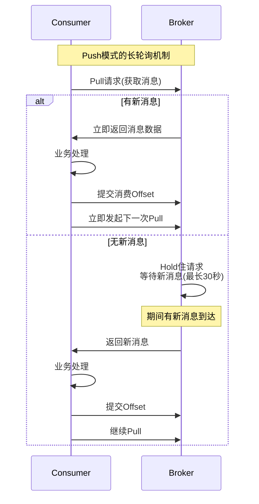
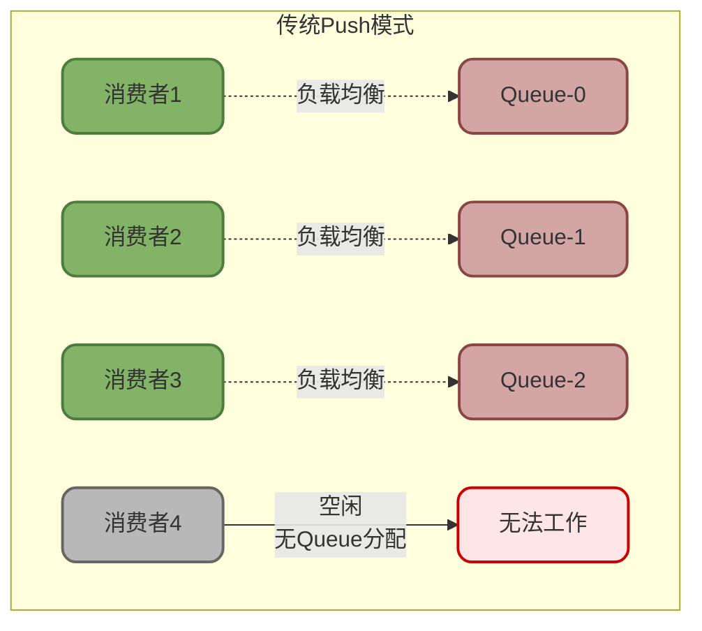
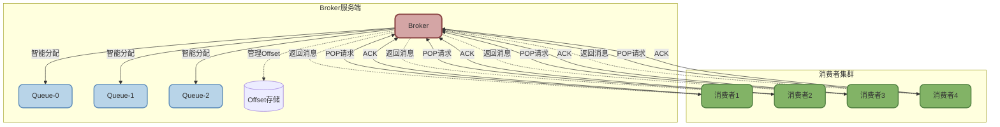
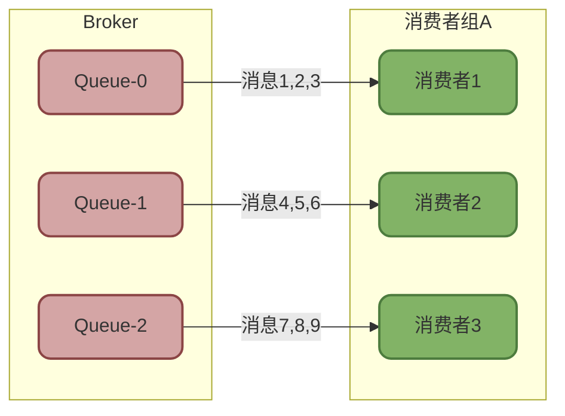
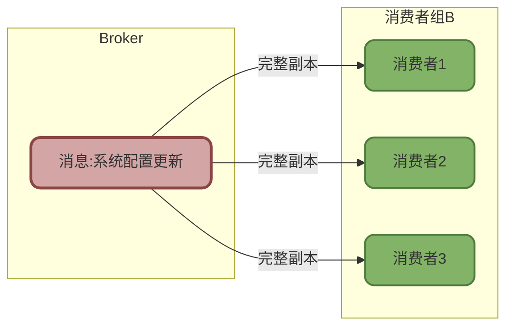

# RocketMQ消费模式与消息分发

## Push与Pull消费模式对比

消息队列的消费方式直接影响系统的性能和可靠性。RocketMQ提供了Push(推送)和Pull(拉取)两种消费模式,开发者可以根据业务特点灵活选择。

### Push模式:伪推送的长轮询实现

从使用者角度看,Push模式类似于Broker主动推送消息给消费者。但实际上,**RocketMQ的Push模式底层依然是基于Pull实现的**,只是通过长轮询机制进行了封装,让开发者感知不到拉取的过程。



#### Push模式的工作原理

RocketMQ的PullMessageService是一个后台线程,不断地向Broker发起Pull请求:

```java
// Push模式消费者示例 - 处理库存变动消息
DefaultMQPushConsumer consumer = new DefaultMQPushConsumer("inventory_consumer_group");
consumer.setNamesrvAddr("192.168.1.100:9876");

// 订阅库存Topic,接收所有标签的消息
consumer.subscribe("INVENTORY_TOPIC", "*");

// 注册消息监听器,当消息到达时自动回调
consumer.registerMessageListener(new MessageListenerConcurrently() {
    @Override
    public ConsumeConcurrentlyStatus consumeMessage(
            List<MessageExt> msgs, 
            ConsumeConcurrentlyContext context) {
        
        for (MessageExt msg : msgs) {
            String content = new String(msg.getBody());
            System.out.println("接收到库存变动: " + content);
            
            // 处理库存更新业务逻辑
            updateInventory(content);
        }
        
        // 返回消费成功,框架会自动提交Offset
        return ConsumeConcurrentlyStatus.CONSUME_SUCCESS;
    }
});

consumer.start();
System.out.println("Push消费者启动成功,等待消息...");
```

**长轮询的核心逻辑**:

1. 消费者向Broker发送Pull请求
2. 如果当前队列有新消息,Broker立即返回
3. 如果队列暂时没有消息,Broker不会立即返回,而是将请求挂起(默认最长30秒)
4. 在挂起期间,一旦有新消息到达,Broker立即结束等待,返回消息
5. 如果超过30秒仍无消息,返回空结果,消费者立即发起下一次请求

这种机制既避免了频繁的短轮询浪费资源,又实现了消息的准实时推送。

#### Push模式的优缺点

**优点**:
- **开发简单**: 只需注册监听器,无需关心消息拉取逻辑
- **实时性好**: 通过长轮询,消息延迟通常在毫秒级
- **自动流控**: 框架内置流控机制,避免消费者过载

**缺点**:
- **灵活性低**: 无法精确控制拉取时机和数量
- **消费速度受限**: 如果消费者处理能力不足,消息会堆积在Broker端

### Pull模式:主动拉取的精确控制

Pull模式下,消费者完全掌控消息的拉取节奏,可以根据自身处理能力主动获取消息。

#### DefaultLitePullConsumer的使用

RocketMQ 4.6.0引入的LitePullConsumer简化了Pull模式的使用,推荐优先采用。

```java
// Pull模式消费者示例 - 处理批量数据同步任务
DefaultLitePullConsumer consumer = new DefaultLitePullConsumer("data_sync_consumer_group");
consumer.setNamesrvAddr("192.168.1.100:9876");

// 订阅数据同步Topic
consumer.subscribe("DATA_SYNC_TOPIC", "*");

// 设置每次拉取的批次大小
consumer.setPullBatchSize(50);  // 一次拉取50条消息

consumer.start();

try {
    while (true) {
        // 主动拉取消息,最长阻塞5秒
        List<MessageExt> messages = consumer.poll(5000);
        
        if (messages.isEmpty()) {
            System.out.println("暂无消息,继续等待...");
            continue;
        }
        
        System.out.println("拉取到 " + messages.size() + " 条消息");
        
        // 批量处理消息
        List<DataRecord> records = new ArrayList<>();
        for (MessageExt msg : messages) {
            String data = new String(msg.getBody());
            records.add(parseData(data));
        }
        
        // 批量写入数据库,提升效率
        if (batchInsertToDB(records)) {
            // 处理成功,手动提交消费进度
            consumer.commitSync();
            System.out.println("批量数据同步成功");
        } else {
            // 处理失败,可以选择不提交,下次重新拉取
            System.err.println("数据同步失败,下次重试");
        }
        
        // 根据业务需要,可以动态控制拉取频率
        if (isSystemBusy()) {
            Thread.sleep(10000);  // 系统繁忙时,延迟10秒再拉取
        }
    }
} finally {
    consumer.shutdown();
}
```

#### Pull模式的优缺点

**优点**:
- **精确流控**: 可以根据自身处理能力控制拉取速度
- **批量处理**: 支持批量拉取和批量消费,提升吞吐量
- **灵活性高**: 可以暂停、恢复消费,适合复杂业务场景

**缺点**:
- **开发复杂**: 需要手动管理消费进度、异常处理
- **实时性稍差**: 依赖轮询间隔,不如Push模式及时

:::tip 模式选择建议
- **Push模式**: 适合实时性要求高、消费逻辑简单的场景,如即时通知、订单提醒
- **Pull模式**: 适合需要批量处理、对消费速度有精确控制需求的场景,如数据同步、离线分析
:::

### RocketMQ 5.0的POP消费模式

RocketMQ 5.0引入了全新的POP消费模式,旨在解决传统Push模式的一些局限性。

#### 传统Push模式的瓶颈

在传统Push模式中,消费者需要完成三项工作:

1. **负载均衡**: 计算自己应该消费哪些MessageQueue
2. **消息拉取**: 从分配到的Queue中拉取消息
3. **进度管理**: 维护每个Queue的消费Offset



**存在的问题**:

1. **扩展性受限**: 消费者数量超过Queue数量后,多余的消费者无法分配到Queue,处于空闲状态
2. **负载不均**: 某个消费者宕机或卡顿,分配给它的Queue消息会堆积,其他消费者无法帮忙消费
3. **客户端重**: 负载均衡、进度管理都在客户端,增加了客户端复杂度和出错概率

#### POP模式的优化设计

POP模式将负载均衡和进度管理上移到Broker端,消费者只需关注消息的消费和ACK。



**POP模式的核心特性**:

1. **无感知Queue**: 消费者不需要知道Queue的存在,直接向Broker POP消息即可
2. **服务端负载均衡**: Broker根据消费者的消费速度,智能分配消息
3. **服务端进度管理**: Offset由Broker维护,消费者只需ACK消息
4. **无限扩展**: 消费者数量不再受Queue数量限制,可以无限扩展
5. **故障隔离**: 某个消费者故障,不影响其他消费者继续消费该Queue的消息

#### POP模式使用示例

```java
// POP模式消费者示例(RocketMQ 5.0+)
DefaultMQPushConsumer consumer = new DefaultMQPushConsumer("pop_consumer_group");
consumer.setNamesrvAddr("192.168.1.100:9876");

// 开启POP消费模式
consumer.setClientRebalance(false);  // 禁用客户端负载均衡

consumer.subscribe("ORDER_TOPIC", "*");

consumer.registerMessageListener(new MessageListenerConcurrently() {
    @Override
    public ConsumeConcurrentlyStatus consumeMessage(
            List<MessageExt> msgs, 
            ConsumeConcurrentlyContext context) {
        
        for (MessageExt msg : msgs) {
            // 处理消息
            processOrder(new String(msg.getBody()));
        }
        
        // 返回成功,Broker会更新Offset
        return ConsumeConcurrentlyStatus.CONSUME_SUCCESS;
    }
});

consumer.start();
```

:::info POP模式的适用场景
- **高并发消费**: 需要大量消费者并行处理,突破Queue数量限制
- **弹性伸缩**: 消费者数量需要根据负载动态调整
- **简化客户端**: 希望降低客户端复杂度,将复杂逻辑交给服务端
:::

## 消息分发模式详解

RocketMQ支持两种消息分发模式:集群消费和广播消费,它们决定了消息如何在消费者之间分配。

### 集群消费模式(默认)

集群消费模式下,同一个消费者组内的多个消费者共同消费Topic,每条消息只会被组内的一个消费者处理。



#### 集群消费的特点

**负载均衡**: Broker会将Queue平均分配给组内的消费者。例如,3个Queue和3个消费者,每个消费者负责1个Queue;如果是3个Queue和2个消费者,则一个消费者负责2个Queue,另一个负责1个Queue。

**消费进度共享**: 消费进度(Offset)以消费者组为单位存储在Broker上,组内所有消费者共享同一份进度。

**故障转移**: 某个消费者宕机后,它负责的Queue会被重新分配给其他消费者,确保消息继续被处理。

#### 集群消费使用示例

```java
// 集群消费示例 - 订单处理系统
DefaultMQPushConsumer consumer = new DefaultMQPushConsumer("order_processor_group");
consumer.setNamesrvAddr("192.168.1.100:9876");

// 设置为集群消费模式(默认,可以不显式设置)
consumer.setMessageModel(MessageModel.CLUSTERING);

consumer.subscribe("ORDER_TOPIC", "*");

consumer.registerMessageListener(new MessageListenerConcurrently() {
    @Override
    public ConsumeConcurrentlyStatus consumeMessage(
            List<MessageExt> msgs, 
            ConsumeConcurrentlyContext context) {
        
        for (MessageExt msg : msgs) {
            String orderId = new String(msg.getBody());
            System.out.println("[消费者-" + getLocalIP() + "] 处理订单: " + orderId);
            
            // 执行订单处理逻辑
            processOrder(orderId);
        }
        
        return ConsumeConcurrentlyStatus.CONSUME_SUCCESS;
    }
});

consumer.start();
```

启动3个消费者实例,日志输出示例:
```
[消费者-192.168.1.10] 处理订单: ORD-001
[消费者-192.168.1.11] 处理订单: ORD-002
[消费者-192.168.1.12] 处理订单: ORD-003
[消费者-192.168.1.10] 处理订单: ORD-004
...
```

可以看到,每个订单只会被一个消费者处理。

#### 集群消费的适用场景

- **任务处理**: 每个消息代表一个任务,需要且仅需要被处理一次
- **负载均衡**: 希望多个消费者分担处理压力
- **大多数场景**: 集群消费是最常用的模式,占比超过95%

### 广播消费模式

广播消费模式下,每条消息会被推送给消费者组内的所有消费者,每个消费者都会收到完整的消息副本。



#### 广播消费的特点

**全量接收**: 组内每个消费者都会接收到所有消息

**独立进度**: 每个消费者独立维护自己的消费进度,存储在本地(不是Broker)

**不重投消息**: 消费失败的消息不会重新投递,需要业务自行处理失败情况

**重启丢消息**: 消费者重启后,会从最新消息开始消费,停机期间的消息会被跳过

#### 广播消费使用示例

```java
// 广播消费示例 - 配置中心同步
DefaultMQPushConsumer consumer = new DefaultMQPushConsumer("config_sync_group");
consumer.setNamesrvAddr("192.168.1.100:9876");

// 设置为广播消费模式
consumer.setMessageModel(MessageModel.BROADCASTING);

consumer.subscribe("CONFIG_UPDATE_TOPIC", "*");

consumer.registerMessageListener(new MessageListenerConcurrently() {
    @Override
    public ConsumeConcurrentlyStatus consumeMessage(
            List<MessageExt> msgs, 
            ConsumeConcurrentlyContext context) {
        
        for (MessageExt msg : msgs) {
            String configJson = new String(msg.getBody());
            System.out.println("[" + getLocalIP() + "] 接收到配置更新: " + configJson);
            
            // 每个应用实例都更新本地缓存
            updateLocalCache(configJson);
        }
        
        return ConsumeConcurrentlyStatus.CONSUME_SUCCESS;
    }
});

consumer.start();
```

启动3个消费者实例,日志输出示例:
```
[192.168.1.10] 接收到配置更新: {"timeout": 5000}
[192.168.1.11] 接收到配置更新: {"timeout": 5000}
[192.168.1.12] 接收到配置更新: {"timeout": 5000}
```

可以看到,同一条消息被所有消费者都接收到了。

#### 广播消费的适用场景

- **配置同步**: 配置中心推送配置更新,所有应用实例都需要更新
- **缓存刷新**: 统一刷新所有节点的本地缓存
- **状态通知**: 通知所有服务节点进行状态切换,如切换到维护模式

:::warning 广播模式注意事项
1. **消费失败不重投**: 必须自行处理失败情况,如记录日志、告警
2. **消息不持久**: 消费者离线期间的消息无法补偿
3. **幂等性要求**: 虽然理论上每个消费者只收到一次,但网络异常可能导致重复,仍需保证幂等
4. **慎用**: 绝大多数场景应使用集群消费,只有明确需要广播时才使用
:::

## 消费模式对比与选型

### 核心对比

| 对比维度 | Push模式 | Pull模式 | POP模式(5.0+) |
|---------|---------|---------|--------------|
| **实现原理** | 长轮询封装 | 主动拉取 | 服务端智能分配 |
| **开发难度** | 简单 | 较复杂 | 简单 |
| **消息实时性** | 高(毫秒级) | 中(秒级) | 高(毫秒级) |
| **流量控制** | 框架自动控制 | 开发者精确控制 | 框架自动控制 |
| **扩展性** | 受Queue数量限制 | 受Queue数量限制 | 不受限制 |
| **负载均衡** | 客户端负载均衡 | 客户端负载均衡 | 服务端负载均衡 |
| **进度管理** | 自动提交 | 手动提交 | 自动提交 |
| **适用场景** | 实时处理 | 批量处理、定时任务 | 高并发、弹性伸缩 |

| 对比维度 | 集群消费 | 广播消费 |
|---------|---------|---------|
| **消息分配** | 一条消息只给一个消费者 | 一条消息给所有消费者 |
| **负载均衡** | 自动负载均衡 | 无负载均衡 |
| **消费进度** | 存储在Broker,组内共享 | 存储在本地,各自独立 |
| **失败重投** | 支持 | 不支持 |
| **使用占比** | 95%+ | 5%- |
| **典型场景** | 订单处理、任务分发 | 配置同步、缓存刷新 |

### 选型建议

**选择Push模式**:
- 对消息实时性要求高,希望消息一到达就立即处理
- 业务逻辑相对简单,不需要复杂的流控策略
- 不想关心底层的拉取细节,降低开发成本

**选择Pull模式**:
- 需要批量处理消息,例如每次拉取100条后批量入库
- 需要根据下游系统负载动态调整消费速度
- 需要精确控制消费进度的提交时机

**选择POP模式**(RocketMQ 5.0+):
- 需要大规模扩展消费者数量,突破Queue数量限制
- 希望简化客户端逻辑,由服务端负责负载均衡
- 对故障隔离有更高要求,避免某个消费者故障影响全局

**选择集群消费**:
- 每条消息代表一个任务,需要且仅需要处理一次
- 需要多个消费者协作处理,提升吞吐量
- 大多数业务场景

**选择广播消费**:
- 每个消费者都需要接收并处理完整消息
- 用于配置同步、缓存刷新等场景
- 少数特殊场景

:::tip 削峰填谷的正确姿势
MQ的核心价值之一是削峰填谷,但并非所有消费模式都能实现:

- **Push模式**: 消息会立即推送给消费者,如果消费者处理能力不足,堆积会发生在消费者端,削峰效果有限
- **Pull模式**: 消费者可以控制拉取速度,消息堆积在Broker端,真正起到削峰作用,推荐使用

例如,在促销活动期间,使用Pull模式可以让消费者按照自己的处理能力稳定消费,避免瞬时压垮后端系统。
:::
