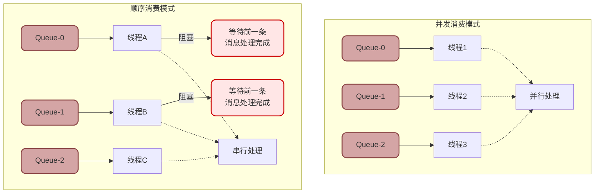

# RocketMQ顺序消息与幂等性保障

## 顺序消息实现机制

在分布式消息系统中,保证消息的顺序性是一个技术挑战。RocketMQ通过队列级别的顺序保证和多重加锁机制,实现了可靠的顺序消息功能。

### 顺序消息的分类

RocketMQ的顺序保证与Kafka类似,采用**分区有序**而非**全局有序**的策略:

- **局部顺序**: 同一个MessageQueue内的消息严格按照FIFO顺序消费
- **跨队列无序**: 不同MessageQueue之间的消息无法保证顺序


### 生产者端:消息路由策略

要保证顺序,首先要确保相关的消息发送到同一个Queue。RocketMQ提供了MessageQueueSelector接口实现消息的定向路由。

```java
// 顺序消息生产者示例 - 电商订单场景
public class OrderProducer {
    public static void main(String[] args) throws Exception {
        DefaultMQProducer producer = new DefaultMQProducer("order_producer_group");
        producer.setNamesrvAddr("192.168.1.100:9876");
        producer.start();
        
        // 模拟订单流转过程:创建→支付→发货→完成
        String[] orderSteps = {"创建订单", "支付成功", "商品发货", "确认收货"};
        
        // 订单ID作为分区键,确保同一订单的消息进入同一个Queue
        Long orderId = 202501010001L;
        
        for (String step : orderSteps) {
            Message msg = new Message(
                "ORDER_TOPIC",
                "ORDER_STEP",
                (orderId + "-" + step).getBytes()
            );
            
            // 使用MessageQueueSelector进行路由
            SendResult result = producer.send(msg, new MessageQueueSelector() {
                @Override
                public MessageQueue select(
                        List<MessageQueue> mqs,  // 该Topic的所有Queue
                        Message msg,              // 待发送的消息
                        Object arg) {             // 发送时传入的参数(这里是orderId)
                    
                    // 根据订单ID取模,计算目标Queue索引
                    Long id = (Long) arg;
                    int index = (int) (id % mqs.size());
                    
                    // 返回选定的Queue
                    return mqs.get(index);
                }
            }, orderId);  // 将orderId作为参数传入
            
            System.out.println("订单" + orderId + "-" + step + 
                             " 发送到Queue-" + result.getMessageQueue().getQueueId());
        }
        
        producer.shutdown();
    }
}
```

执行结果示例:
```
订单202501010001-创建订单 发送到Queue-1
订单202501010001-支付成功 发送到Queue-1
订单202501010001-商品发货 发送到Queue-1
订单202501010001-确认收货 发送到Queue-1
```

所有步骤都被路由到同一个Queue,确保了顺序性的基础。

:::tip 分区键选择原则
- **唯一性**: 如订单ID、用户ID,确保同一业务实体的消息进入同一个Queue
- **均匀性**: 避免热点,如果某些ID的消息量特别大,会导致Queue负载不均
- **稳定性**: 分区键不应频繁变化,否则可能导致消息分散
:::

:::warning 必须使用同步发送
顺序消息必须使用**同步发送**方式,因为:
1. 异步发送可能因为网络延迟导致消息到达顺序与发送顺序不一致
2. 同步发送可以立即感知发送失败,及时重试,避免消息丢失破坏顺序
:::

### 消费者端:顺序消费保障

即使消息按顺序存储在Queue中,消费时如果多线程并发处理,仍然会乱序。RocketMQ通过MessageListenerOrderly和多重加锁机制保证顺序消费。

#### 顺序消费监听器

```java
// 顺序消息消费者示例
public class OrderConsumer {
    public static void main(String[] args) throws Exception {
        DefaultMQPushConsumer consumer = new DefaultMQPushConsumer("order_consumer_group");
        consumer.setNamesrvAddr("192.168.1.100:9876");
        consumer.subscribe("ORDER_TOPIC", "*");
        
        // 注册顺序消息监听器
        consumer.registerMessageListener(new MessageListenerOrderly() {
            @Override
            public ConsumeOrderlyStatus consumeMessage(
                    List<MessageExt> msgs, 
                    ConsumeOrderlyContext context) {
                
                // 这个方法内的消息是严格有序的
                for (MessageExt msg : msgs) {
                    String content = new String(msg.getBody());
                    System.out.println(Thread.currentThread().getName() + 
                                     " 顺序处理: " + content);
                    
                    // 执行订单状态流转逻辑
                    updateOrderStatus(content);
                }
                
                // 返回成功,提交消费进度
                return ConsumeOrderlyStatus.SUCCESS;
            }
        });
        
        consumer.start();
        System.out.println("顺序消费者启动成功");
    }
}
```

#### 三重加锁机制

为了实现顺序消费,RocketMQ在消费端采用了三重加锁策略:


**第一重锁:Broker分布式锁**

消费者启动后,会向Broker申请锁定要消费的MessageQueue。Broker确保同一个Queue在同一时刻只能被一个消费者锁定,避免多个消费者同时消费同一个Queue导致乱序。

```java
// RocketMQ源码:定时向Broker申请锁
public class ConsumeMessageOrderlyService {
    // 初始化时启动定时任务,每20秒向Broker申请锁
    this.scheduledExecutorService.scheduleAtFixedRate(new Runnable() {
        @Override
        public void run() {
            // 向Broker申请锁定当前消费者负责的所有MessageQueue
            lockMQPeriodically();
        }
    }, 1000, 20 * 1000, TimeUnit.MILLISECONDS);
}
```

**第二重锁:MessageQueue本地锁**

获取到Broker锁后,消费者在本地也会对MessageQueue加锁,确保在本地多线程环境下,同一个Queue只能由一个线程处理。

```java
// RocketMQ源码:获取MessageQueue本地锁
synchronized (messageQueue) {
    // 只有获取到这个Queue的本地锁,才能消费
    processConsumeMessage(messageQueue);
}
```

这样即使消费者内部有线程池,也能保证Queue-0的消息由线程A处理,Queue-1的消息由线程B处理,互不干扰。

**第三重锁:ProcessQueue锁**

ProcessQueue是消息的本地缓存队列。在消费过程中,如果发生重平衡(消费者加入或退出),需要确保正在消费的消息不会因为Queue重新分配而丢失。

```java
// RocketMQ源码:ProcessQueue锁
final ProcessQueue processQueue = ...;
final Object objLock = messageQueueLock.fetchLockObject(messageQueue);

synchronized (objLock) {
    // 锁定ProcessQueue,防止重平衡时移除正在消费的消息
    if (processQueue.isLocked()) {
        // 安全消费
        consumeMessages(processQueue);
    }
}
```

当需要释放Queue时(如重平衡),也需要尝试获取这个锁,确保消费完成后再释放:

```java
// 重平衡时释放Queue
synchronized (objLock) {
    if (!processQueue.isConsuming()) {
        // 消费已完成,安全释放
        processQueue.setDropped(true);
    }
}
```

:::info 第三重锁的作用
为什么已经有了前两重锁,还需要第三重锁?

假设消费者A正在消费Queue-0,此时新增了消费者B,触发重平衡,Queue-0被分配给消费者B。如果没有第三重锁:
1. 消费者A释放Broker锁,但可能还在处理消息
2. 消费者B立即获取Broker锁,开始拉取新消息
3. 消费者A处理完成,提交Offset,可能覆盖消费者B的进度,导致消息重复或丢失

有了第三重锁,消费者A必须等待当前批次消息处理完成,才能释放给消费者B,保证了平滑过渡。
:::

### 顺序消息的性能影响

顺序消费通过多重加锁保证了顺序性,但也带来了性能损失:



**性能下降的原因**:

1. **并发度降低**: 同一个Queue只能单线程消费,无法并行处理
2. **阻塞风险**: 如果某条消息处理慢,会阻塞后续所有消息
3. **锁竞争开销**: 三重加锁增加了系统开销
4. **负载不均**: 如果某些Queue的消息特别多,会导致处理速度不均

**性能对比**:
- 并发消费TPS: 10万/秒
- 顺序消费TPS: 1-2万/秒(降低约80-90%)

:::warning 顺序消息的使用建议
顺序消息性能较低,且容错能力差(一条消息失败会阻塞整个Queue),应该**谨慎使用**:

**需要使用的场景**:
- 订单状态流转(创建→支付→发货→完成)
- 账户余额变动(初始100→支出50→收入30)
- 数据库binlog同步(必须按顺序回放)

**不需要使用的场景**(占比90%+):
- 用户行为日志(乱序无影响)
- 监控数据上报(不关心顺序)
- 通知消息(重复通知可接受)

对于不确定是否需要顺序的场景,优先考虑在消费端自行排序,而不是使用顺序消息。
:::

## 普通消息与顺序消息对比

### 核心差异

| 对比维度 | 普通消息 | 顺序消息 |
|---------|---------|---------|
| **消费顺序** | 无序,多线程并发 | 有序,单线程串行 |
| **发送方式** | 可异步可同步 | 必须同步 |
| **消息路由** | 随机或轮询 | 基于分区键定向 |
| **监听器类型** | MessageListenerConcurrently | MessageListenerOrderly |
| **加锁机制** | 无需加锁 | 三重加锁 |
| **性能** | 高(10万/秒+) | 低(1-2万/秒) |
| **容错能力** | 强,失败重试不阻塞 | 弱,失败会阻塞后续 |
| **使用占比** | 95%+ | 5%- |

### 代码对比

```java
// 普通消息发送
Message msg = new Message("TOPIC", "TAG", "消息内容".getBytes());
producer.send(msg);  // 随机或轮询选择Queue

// 普通消息消费
consumer.registerMessageListener(new MessageListenerConcurrently() {
    public ConsumeConcurrentlyStatus consumeMessage(...) {
        // 多线程并发处理,无序
        return ConsumeConcurrentlyStatus.CONSUME_SUCCESS;
    }
});

// 顺序消息发送
producer.send(msg, new MessageQueueSelector() {
    public MessageQueue select(List<MessageQueue> mqs, Message msg, Object arg) {
        // 基于业务键定向到指定Queue
        return mqs.get(arg.hashCode() % mqs.size());
    }
}, businessKey);

// 顺序消息消费
consumer.registerMessageListener(new MessageListenerOrderly() {
    public ConsumeOrderlyStatus consumeMessage(...) {
        // 单线程串行处理,严格有序
        return ConsumeOrderlyStatus.SUCCESS;
    }
});
```

## 消息重复消费问题分析

消息队列系统通常只能保证**至少一次**(`At Least Once`)投递,无法保证**精确一次**(`Exactly Once`),因此重复消费是不可避免的问题。

### 重复消费的常见原因

#### 原因1:消费失败返回重试

这是最常见的情况,占比超过60%。

```java
// 场景:库存扣减失败,返回重试
public ConsumeConcurrentlyStatus consumeMessage(List<MessageExt> msgs, ...) {
    for (MessageExt msg : msgs) {
        String orderId = new String(msg.getBody());
        
        try {
            // 扣减库存
            boolean success = inventoryService.deduct(orderId, 1);
            if (!success) {
                // 库存不足,返回稍后重试
                return ConsumeConcurrentlyStatus.RECONSUME_LATER;
            }
        } catch (Exception e) {
            // 异常也返回重试
            return ConsumeConcurrentlyStatus.RECONSUME_LATER;
        }
    }
    return ConsumeConcurrentlyStatus.CONSUME_SUCCESS;
}
```

Broker收到`RECONSUME_LATER`后,会将消息重新投递,导致重复消费。

#### 原因2:消费超时触发重投

```java
public ConsumeConcurrentlyStatus consumeMessage(List<MessageExt> msgs, ...) {
    // 执行了一个超长时间操作,超过15分钟
    processLongTimeTask();  // 例如:调用超慢的外部接口,等了20分钟
    
    return ConsumeConcurrentlyStatus.CONSUME_SUCCESS;
}
```

RocketMQ默认消费超时时间为15分钟,超时后会认为消费者失联,将消息重新投递给其他消费者。但实际上第一个消费者可能还在处理,最终导致两个消费者都处理了这条消息。

#### 原因3:生产者重复发送

```java
// 生产者端代码
try {
    SendResult result = producer.send(msg);
    // 由于网络抖动,未收到Broker的响应,抛出超时异常
} catch (RemotingTimeoutException e) {
    // 实际上Broker已经收到消息,但响应包丢失
    // 生产者误以为发送失败,进行重试
    producer.send(msg);  // 重复发送
}
```

Broker端会存储两条完全相同的消息,消费者消费时会收到重复数据。

#### 原因4:网络抖动导致ACK丢失

```java
public ConsumeConcurrentlyStatus consumeMessage(List<MessageExt> msgs, ...) {
    processMessage(msgs);  // 业务处理成功
    
    // 返回成功,但ACK响应在网络传输中丢失
    return ConsumeConcurrentlyStatus.CONSUME_SUCCESS;
}
```

Broker未收到ACK,认为消费失败,会重新投递消息。

#### 原因5:重平衡触发重复(Kafka)

虽然RocketMQ的重平衡机制优于Kafka,但在某些情况下仍可能导致重复:


#### 原因6:广播模式特性

广播模式下,每个消费者都会收到所有消息,如果多个消费者执行相同的业务逻辑,表现为重复消费。

```java
// 设置为广播模式
consumer.setMessageModel(MessageModel.BROADCASTING);

// 3个消费者实例都会收到同一条消息
// 如果都执行扣款操作,用户会被扣款3次
```

### 重复消费的解决方案:幂等性设计

由于重复消费不可避免,必须通过**幂等性**设计来保证业务正确性。幂等性是指同一个操作执行多次,结果与执行一次相同。

#### 方案1:唯一键约束(数据库层面)

适用于插入操作,利用数据库的唯一索引防止重复插入。

```java
// 订单表设计,order_id为唯一索引
CREATE TABLE t_order (
    id BIGINT PRIMARY KEY AUTO_INCREMENT,
    order_id VARCHAR(50) UNIQUE NOT NULL,  -- 唯一约束
    user_id BIGINT NOT NULL,
    amount DECIMAL(10,2),
    create_time DATETIME
);

// 消费逻辑
public ConsumeConcurrentlyStatus consumeMessage(List<MessageExt> msgs, ...) {
    for (MessageExt msg : msgs) {
        OrderInfo order = parseOrder(msg);
        
        try {
            // 插入订单,如果order_id重复会抛异常
            orderDao.insert(order);
        } catch (DuplicateKeyException e) {
            // 捕获唯一键冲突异常,说明已处理过,直接跳过
            log.warn("订单已存在,跳过: {}", order.getOrderId());
        }
    }
    return ConsumeConcurrentlyStatus.CONSUME_SUCCESS;
}
```

#### 方案2:消息ID或业务ID去重

利用消息的唯一ID或业务主键,在处理前先检查是否已处理。

```java
// 使用Redis记录已处理的消息ID
public ConsumeConcurrentlyStatus consumeMessage(List<MessageExt> msgs, ...) {
    for (MessageExt msg : msgs) {
        String msgId = msg.getMsgId();  // RocketMQ生成的唯一消息ID
        
        // 先检查Redis,判断是否已处理
        String key = "msg:processed:" + msgId;
        Boolean exists = redisTemplate.hasKey(key);
        
        if (exists) {
            // 已处理过,直接跳过
            log.warn("消息重复,跳过: {}", msgId);
            continue;
        }
        
        // 执行业务逻辑
        processBusiness(msg);
        
        // 处理成功后,记录到Redis,设置过期时间(如7天)
        redisTemplate.opsForValue().set(key, "1", 7, TimeUnit.DAYS);
    }
    return ConsumeConcurrentlyStatus.CONSUME_SUCCESS;
}
```

:::tip 业务ID vs 消息ID
- **消息ID**: RocketMQ生成的msgId,全局唯一,但生产者重复发送时,两条消息的msgId不同
- **业务ID**: 如订单ID、交易流水号,业务层面的唯一标识,即使重复发送,业务ID相同

建议优先使用**业务ID**进行去重,更加可靠。
:::

#### 方案3:状态机防重

适用于状态流转场景,通过状态机保证状态只能按照合法路径变更。

```java
// 订单状态枚举
public enum OrderStatus {
    CREATED(1, "已创建"),
    PAID(2, "已支付"),
    SHIPPED(3, "已发货"),
    COMPLETED(4, "已完成");
    
    private int code;
    private String desc;
}

// 状态流转服务
public class OrderStatusService {
    // 支付回调消息处理
    public void handlePayCallback(String orderId) {
        Order order = orderDao.selectById(orderId);
        
        // 只有"已创建"状态才能变更为"已支付"
        if (order.getStatus() == OrderStatus.CREATED.getCode()) {
            // 执行状态变更,使用乐观锁
            int rows = orderDao.updateStatus(
                orderId, 
                OrderStatus.PAID.getCode(), 
                OrderStatus.CREATED.getCode()  // WHERE status = CREATED
            );
            
            if (rows > 0) {
                // 变更成功
                log.info("订单状态变更: {} -> {}", OrderStatus.CREATED, OrderStatus.PAID);
            } else {
                // 变更失败,说明状态已改变(重复消费)
                log.warn("订单状态已变更,跳过: {}", orderId);
            }
        } else {
            // 当前状态不是CREATED,说明已处理过
            log.warn("订单状态异常,当前: {}", order.getStatus());
        }
    }
}

// SQL:乐观锁更新
UPDATE t_order 
SET status = #{newStatus}, update_time = NOW()
WHERE order_id = #{orderId} AND status = #{oldStatus}
```

即使重复消费,由于状态已经是"已支付",第二次消费时无法再次变更,保证了幂等性。

#### 方案4:分布式锁

对于复杂的业务操作,可以使用分布式锁确保同一时刻只有一个线程能处理。

```java
public ConsumeConcurrentlyStatus consumeMessage(List<MessageExt> msgs, ...) {
    for (MessageExt msg : msgs) {
        String orderId = new String(msg.getBody());
        
        // 基于订单ID加分布式锁
        RLock lock = redissonClient.getLock("order:lock:" + orderId);
        
        try {
            // 尝试获取锁,最多等待10秒,锁定30秒自动释放
            boolean locked = lock.tryLock(10, 30, TimeUnit.SECONDS);
            
            if (!locked) {
                // 获取锁失败,说明有其他实例在处理,返回稍后重试
                return ConsumeConcurrentlyStatus.RECONSUME_LATER;
            }
            
            // 获取锁成功,检查是否已处理
            if (isProcessed(orderId)) {
                log.warn("订单已处理,跳过: {}", orderId);
                return ConsumeConcurrentlyStatus.CONSUME_SUCCESS;
            }
            
            // 执行业务逻辑
            processOrder(orderId);
            
            // 标记已处理
            markProcessed(orderId);
            
        } catch (InterruptedException e) {
            Thread.currentThread().interrupt();
            return ConsumeConcurrentlyStatus.RECONSUME_LATER;
        } finally {
            // 释放锁
            if (lock.isHeldByCurrentThread()) {
                lock.unlock();
            }
        }
    }
    return ConsumeConcurrentlyStatus.CONSUME_SUCCESS;
}
```

### 幂等性设计最佳实践

1. **优先使用数据库唯一约束**: 简单可靠,性能好
2. **结合业务ID去重**: 利用订单号、流水号等业务唯一键
3. **采用状态机模式**: 适合状态流转场景,天然防重
4. **必要时使用分布式锁**: 对于复杂操作,加锁保护
5. **多层防护**: 组合使用多种方案,例如先检查Redis,再检查数据库,最后用唯一索引兜底

:::warning 不要依赖RocketMQ去重
RocketMQ本身不提供精确一次语义,重复消费是必然现象。必须在**业务层面**实现幂等性,而不是寄希望于中间件。
:::
