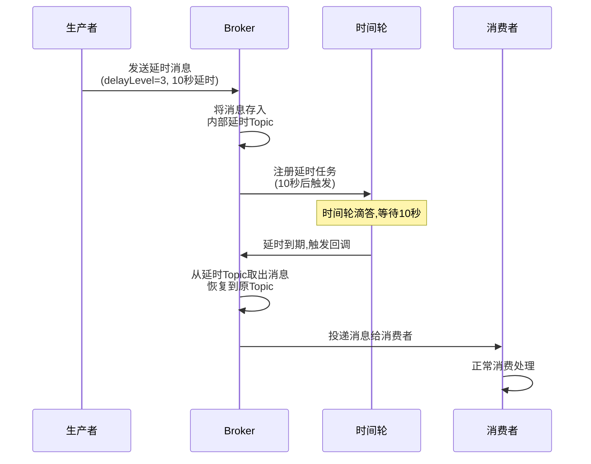
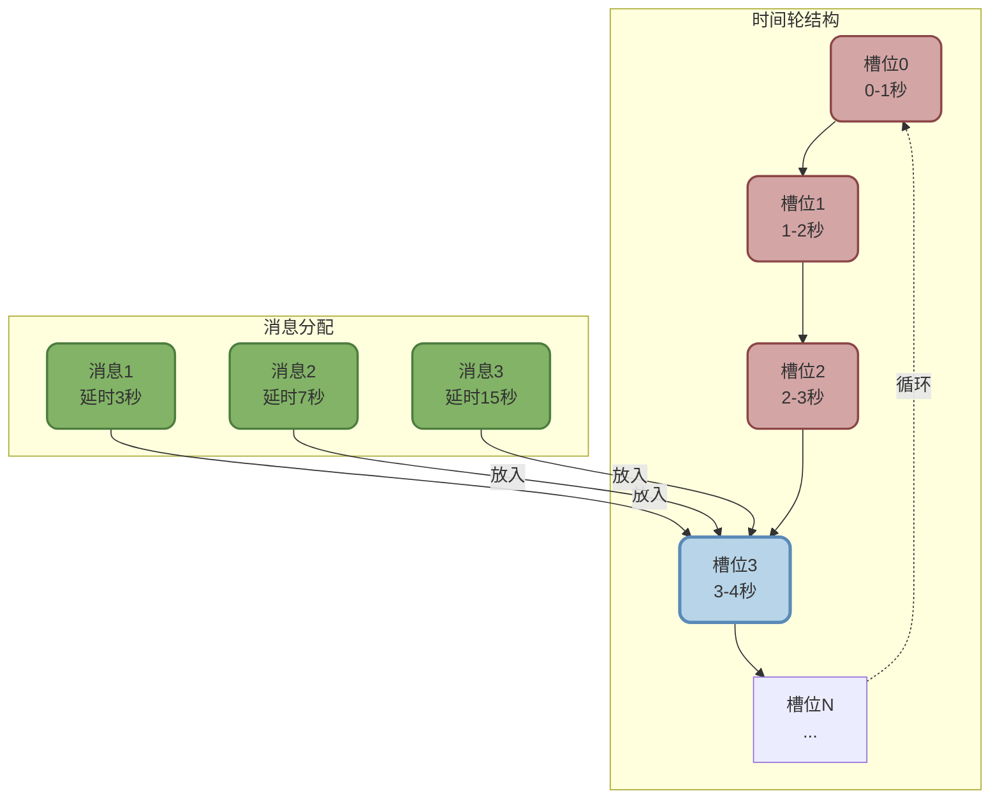
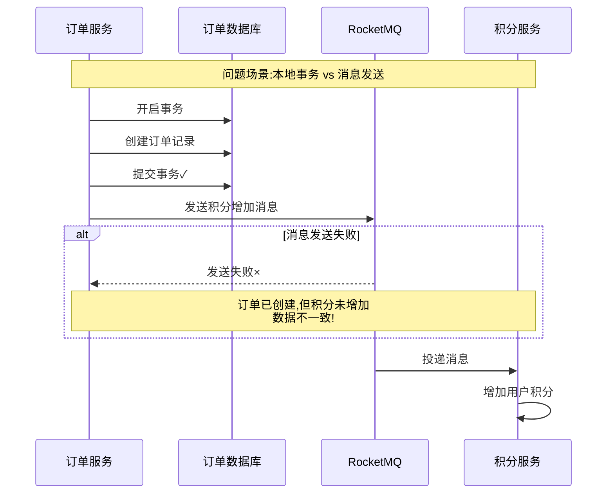
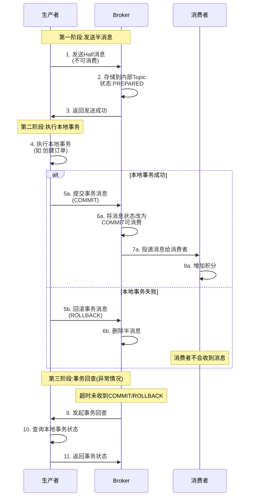

# RocketMQ高级特性与事务消息

## 延时消息实现机制

延时消息是指消息发送到Broker后,不会立即被消费者消费,而是在指定的延迟时间之后才能被消费。这一特性在电商订单超时取消、定时任务触发等场景中非常实用。

### 延时消息的工作原理

RocketMQ的延时消息并非真正的定时调度,而是通过**延时级别**和**时间轮**机制实现的。



#### RocketMQ 4.x的延时级别

在RocketMQ 4.x版本中,延时消息只支持预定义的18个时间级别,不支持任意时长。

```java
// 延时级别对应的时间
// 1s 5s 10s 30s 1m 2m 3m 4m 5m 6m 7m 8m 9m 10m 20m 30m 1h 2h
// 级别:1  2   3   4  5  6  7  8  9 10 11 12 13  14  15  16 17 18

// 延时消息生产者示例 - 订单超时取消场景
DefaultMQProducer producer = new DefaultMQProducer("order_timeout_producer");
producer.setNamesrvAddr("192.168.1.100:9876");
producer.start();

// 创建订单超时检查消息
Message msg = new Message(
    "ORDER_TIMEOUT_TOPIC",
    "TIMEOUT_CHECK",
    ("订单号:OD20250101-12345").getBytes(RemotingHelper.DEFAULT_CHARSET)
);

// 设置延时级别为14,对应10分钟延时
// 消息将在10分钟后被消费者接收
msg.setDelayTimeLevel(14);

SendResult sendResult = producer.send(msg);
System.out.println("延时消息发送成功: " + sendResult.getMsgId());
System.out.println("10分钟后将触发超时检查");

producer.shutdown();
```

#### RocketMQ 5.0的任意时长延时

RocketMQ 5.0引入了基于**时间轮**的定时消息实现,支持秒级甚至毫秒级的任意时长延时。

**时间轮的核心思想**:



时间轮的工作流程:

1. **槽位划分**: 将时间划分为固定大小的槽位,如每1秒一个槽位
2. **消息存储**: 收到延时消息后,根据延时时间计算目标槽位,将消息放入对应槽位
3. **指针滴答**: 时间轮的指针每秒向前移动一个槽位
4. **消息投递**: 当指针移动到某个槽位时,将该槽位中的所有消息投递给消费者

**优势对比**:

| 对比维度 | 4.x延时级别 | 5.0时间轮 |
|---------|------------|-----------|
| **时间精度** | 固定18个级别 | 秒级/毫秒级任意时长 |
| **性能** | Timer性能受任务数影响 | O(1)时间复杂度 |
| **扩展性** | 不支持自定义时长 | 支持任意时长 |
| **实现复杂度** | 简单 | 较复杂 |

```java
// RocketMQ 5.0任意时长延时示例
Message msg = new Message("TOPIC", "TAG", "消息内容".getBytes());

// 设置延时时间为65秒(任意时长)
msg.setDelayTimeSec(65);  // 5.0新增API

// 或者设置延时到具体时间点
long deliveryTime = System.currentTimeMillis() + 120000;  // 2分钟后
msg.setDeliverTimeMs(deliveryTime);

producer.send(msg);
```

### 延时消息的应用场景

#### 场景1:订单超时自动取消

```java
// 用户下单后,发送一个30分钟延时消息
public void createOrder(Order order) {
    // 1. 保存订单到数据库,状态为"待支付"
    orderDao.insert(order);
    
    // 2. 发送30分钟延时消息,用于超时检查
    Message timeoutMsg = new Message(
        "ORDER_TIMEOUT_TOPIC",
        order.getOrderId().getBytes()
    );
    timeoutMsg.setDelayTimeLevel(16);  // 级别16 = 30分钟
    producer.send(timeoutMsg);
}

// 30分钟后,消费者收到消息,检查订单状态
consumer.registerMessageListener(new MessageListenerConcurrently() {
    public ConsumeConcurrentlyStatus consumeMessage(List<MessageExt> msgs, ...) {
        for (MessageExt msg : msgs) {
            String orderId = new String(msg.getBody());
            
            // 查询订单状态
            Order order = orderDao.selectById(orderId);
            
            if (order.getStatus() == OrderStatus.UNPAID) {
                // 30分钟内未支付,自动取消订单
                orderDao.updateStatus(orderId, OrderStatus.CANCELLED);
                
                // 恢复库存
                inventoryService.restore(order.getProductId(), order.getQuantity());
                
                System.out.println("订单超时自动取消: " + orderId);
            } else {
                // 已支付或已取消,不做处理
                System.out.println("订单状态正常: " + order.getStatus());
            }
        }
        return ConsumeConcurrentlyStatus.CONSUME_SUCCESS;
    }
});
```

#### 场景2:支付成功后延时发货提醒

```java
// 支付成功后,发送48小时延时消息,提醒商家发货
public void onPaymentSuccess(String orderId) {
    // 更新订单状态为"已支付"
    orderDao.updateStatus(orderId, OrderStatus.PAID);
    
    // 发送48小时延时消息
    Message reminderMsg = new Message(
        "SHIP_REMINDER_TOPIC",
        orderId.getBytes()
    );
    
    // 48小时 = 2天,使用RocketMQ 5.0任意时长
    reminderMsg.setDelayTimeSec(48 * 3600);  // 172800秒
    producer.send(reminderMsg);
}

// 48小时后,提醒商家发货
consumer.subscribe("SHIP_REMINDER_TOPIC", "*");
consumer.registerMessageListener((msgs, context) -> {
    for (MessageExt msg : msgs) {
        String orderId = new String(msg.getBody());
        Order order = orderDao.selectById(orderId);
        
        if (order.getStatus() == OrderStatus.PAID) {
            // 仍未发货,发送提醒
            notificationService.sendToMerchant(order.getMerchantId(), 
                "订单" + orderId + "已支付48小时,请尽快发货!");
        }
    }
    return ConsumeConcurrentlyStatus.CONSUME_SUCCESS;
});
```

:::tip 延时消息注意事项
1. **精度有限**: 4.x版本只支持固定级别,5.0虽支持任意时长,但仍是秒级精度,不适合毫秒级定时
2. **不是定时任务**: 延时消息不能代替定时任务框架(如Quartz),它只能延时一次,不支持周期性执行
3. **时间偏差**: Broker时间与应用时间可能不一致,需要考虑时钟同步问题
:::

## 事务消息深度解析

事务消息是RocketMQ最具特色的功能之一,用于解决分布式场景下的本地事务与消息发送的原子性问题。

### 分布式事务的挑战

在微服务架构中,经常遇到这样的场景:



**核心问题**: 本地数据库事务和消息发送无法做到原子性。常见的两种错误方案:

**方案1:先提交事务,再发消息**

```java
// 错误示例
public void createOrder(Order order) {
    // 1. 本地事务:创建订单
    orderDao.insert(order);
    
    // 2. 发送消息:增加积分
    Message msg = new Message("POINT_ADD_TOPIC", ...);
    SendResult result = producer.send(msg);
    
    if (result.getSendStatus() != SendStatus.SEND_OK) {
        // 消息发送失败,但事务已提交,无法回滚
        // 导致:订单创建成功,积分未增加
        throw new RuntimeException("消息发送失败");
    }
}
```

**方案2:先发消息,再提交事务**

```java
// 错误示例
@Transactional
public void createOrder(Order order) {
    // 1. 先发送消息
    Message msg = new Message("POINT_ADD_TOPIC", ...);
    producer.send(msg);
    
    // 2. 本地事务:创建订单
    orderDao.insert(order);
    
    // 如果这里抛异常,事务回滚,订单未创建
    // 但消息已发送,积分会增加
    // 导致:订单未创建,积分却增加了
    
    // 手动提交事务
}
```

这两种方案都无法保证本地事务和消息发送的原子性,必须引入**事务消息**。

### RocketMQ事务消息原理

RocketMQ通过**两阶段提交**+**事务回查**机制,实现了本地事务和消息发送的最终一致性。



#### 事务消息的四个关键步骤

**步骤1: 发送半消息(Half Message)**

生产者向Broker发送一个特殊的"半消息",这个消息会被存储在Broker的内部Topic(RMQ_SYS_TRANS_HALF_TOPIC)中,对消费者不可见。

**步骤2: 执行本地事务**

Broker返回半消息发送成功后,生产者开始执行本地业务逻辑,如创建订单、扣减库存等。

**步骤3: 提交或回滚事务**

根据本地事务的执行结果,生产者向Broker发送COMMIT或ROLLBACK指令:
- **COMMIT**: 本地事务成功,Broker将消息状态改为可消费,投递给消费者
- **ROLLBACK**: 本地事务失败,Broker删除半消息,消费者永远不会收到

**步骤4: 事务回查**

如果Broker在超时时间内(默认60秒)没有收到COMMIT或ROLLBACK,会主动向生产者发起回查请求,询问本地事务的最终状态。生产者通过查询数据库等方式判断事务是否成功,返回对应状态。

### 事务消息代码实现

```java
// 事务消息生产者 - 订单创建场景
public class TransactionProducer {
    public static void main(String[] args) throws Exception {
        // 1. 创建事务消息生产者
        TransactionMQProducer producer = new TransactionMQProducer("tx_order_producer");
        producer.setNamesrvAddr("192.168.1.100:9876");
        
        // 2. 设置事务监听器(核心)
        producer.setTransactionListener(new TransactionListener() {
            
            // 本地事务执行方法
            @Override
            public LocalTransactionState executeLocalTransaction(
                    Message msg, Object arg) {
                
                try {
                    // 解析消息内容
                    String orderJson = new String(msg.getBody());
                    Order order = JSON.parseObject(orderJson, Order.class);
                    
                    System.out.println("开始执行本地事务: 创建订单" + order.getOrderId());
                    
                    // 执行本地事务:插入订单到数据库
                    orderDao.insert(order);
                    
                    System.out.println("本地事务执行成功");
                    
                    // 返回COMMIT,Broker将消息投递给消费者
                    return LocalTransactionState.COMMIT_MESSAGE;
                    
                } catch (Exception e) {
                    System.err.println("本地事务执行失败: " + e.getMessage());
                    
                    // 返回ROLLBACK,Broker删除半消息
                    return LocalTransactionState.ROLLBACK_MESSAGE;
                }
            }
            
            // 事务回查方法
            @Override
            public LocalTransactionState checkLocalTransaction(MessageExt msg) {
                try {
                    // 从消息中提取订单ID
                    String orderJson = new String(msg.getBody());
                    Order order = JSON.parseObject(orderJson, Order.class);
                    
                    System.out.println("Broker发起事务回查: " + order.getOrderId());
                    
                    // 查询数据库,判断订单是否创建成功
                    Order dbOrder = orderDao.selectById(order.getOrderId());
                    
                    if (dbOrder != null) {
                        // 订单存在,说明本地事务已提交
                        System.out.println("回查结果: 事务已提交");
                        return LocalTransactionState.COMMIT_MESSAGE;
                    } else {
                        // 订单不存在,说明本地事务未执行或已回滚
                        System.out.println("回查结果: 事务未执行");
                        return LocalTransactionState.ROLLBACK_MESSAGE;
                    }
                    
                } catch (Exception e) {
                    // 回查异常,返回UNKNOW,Broker会再次回查
                    System.err.println("回查异常: " + e.getMessage());
                    return LocalTransactionState.UNKNOW;
                }
            }
        });
        
        // 3. 启动生产者
        producer.start();
        
        // 4. 发送事务消息
        Order order = new Order();
        order.setOrderId("OD20250101-99999");
        order.setUserId(10086L);
        order.setAmount(new BigDecimal("299.00"));
        
        Message msg = new Message(
            "ORDER_CREATED_TOPIC",
            "CREATE",
            JSON.toJSONString(order).getBytes()
        );
        
        // 发送事务消息,触发本地事务执行
        TransactionSendResult result = producer.sendMessageInTransaction(msg, null);
        
        System.out.println("事务消息发送结果: " + result.getSendStatus());
        System.out.println("本地事务状态: " + result.getLocalTransactionState());
        
        // 保持运行,等待回查
        Thread.sleep(60000);
        producer.shutdown();
    }
}

// 消费者:增加用户积分
consumer.subscribe("ORDER_CREATED_TOPIC", "*");
consumer.registerMessageListener((msgs, context) -> {
    for (MessageExt msg : msgs) {
        String orderJson = new String(msg.getBody());
        Order order = JSON.parseObject(orderJson, Order.class);
        
        System.out.println("接收到订单创建消息: " + order.getOrderId());
        
        // 执行积分增加逻辑
        int points = order.getAmount().intValue() / 10;  // 消费10元积1分
        pointService.addPoints(order.getUserId(), points);
        
        System.out.println("用户" + order.getUserId() + "积分增加: " + points);
    }
    return ConsumeConcurrentlyStatus.CONSUME_SUCCESS;
});
```

### 事务消息与Kafka事务消息的区别

虽然RocketMQ和Kafka都支持"事务消息",但它们解决的问题和实现方式完全不同。

| 对比维度 | RocketMQ事务消息 | Kafka事务消息 |
|---------|----------------|--------------|
| **目标** | 本地事务+消息发送原子性 | 多条消息发送原子性 |
| **保证内容** | 本地DB事务与MQ消息一致 | 一批消息要么全成功要么全失败 |
| **实现机制** | 两阶段提交+事务回查 | 事务协调器+事务日志 |
| **典型场景** | 订单创建→积分增加 | 批量发送多个Topic消息 |
| **与本地事务关系** | 强关联,解决本地事务问题 | 无关联,仅保证消息原子性 |
| **Exactly Once** | 不支持 | 支持(配合幂等生产者) |

**RocketMQ事务消息示例场景**:

```
用户下单 → [本地事务:创建订单] + [MQ消息:通知积分服务]
需要保证:订单创建成功,消息一定发送;订单创建失败,消息一定不发送
```

**Kafka事务消息示例场景**:

```
一次性发送3条消息:
  - Topic A: 订单创建消息
  - Topic B: 库存扣减消息
  - Topic C: 优惠券核销消息
  
需要保证:3条消息要么全部发送成功,要么全部失败(原子性)
```

:::tip 事务消息选型
- **RocketMQ事务消息**: 用于解决**分布式事务**问题,保证本地数据库操作和下游系统通知的一致性,是分布式事务的常用方案
- **Kafka事务消息**: 用于实现**Exactly Once语义**,确保消息不重不丢,配合流式计算使用
:::

### 事务消息的最佳实践

#### 实践1:回查接口的幂等性设计

回查可能被多次调用,必须保证幂等性。

```java
@Override
public LocalTransactionState checkLocalTransaction(MessageExt msg) {
    // 通过唯一业务ID查询,而不是重新执行业务逻辑
    String orderId = extractOrderId(msg);
    
    Order order = orderDao.selectById(orderId);
    
    if (order != null && order.getStatus() == OrderStatus.CREATED) {
        return LocalTransactionState.COMMIT_MESSAGE;
    } else if (order == null) {
        return LocalTransactionState.ROLLBACK_MESSAGE;
    } else {
        return LocalTransactionState.UNKNOW;  // 状态异常,等待下次回查
    }
}
```

#### 实践2:设置合理的回查次数

默认回查15次,可以根据业务调整。

```java
// Broker配置
transactionCheckMax=15  // 最大回查次数,默认15
transactionCheckInterval=60000  // 回查间隔,默认60秒
```

#### 实践3:半消息发送失败的处理

```java
TransactionSendResult result = producer.sendMessageInTransaction(msg, null);

if (result.getSendStatus() != SendStatus.SEND_OK) {
    // 半消息发送失败,本地事务不会执行,可以直接返回失败
    throw new BusinessException("事务消息发送失败,请重试");
}
```

半消息发送失败意味着整个流程未启动,业务未执行,可以安全重试或返回失败,不会造成数据不一致。

:::warning 事务消息的限制
1. **不支持延时消息**: 事务消息和延时消息不能同时使用
2. **性能较低**: 两阶段提交和回查机制增加了开销,TPS远低于普通消息
3. **回查超时**: 如果回查一直返回UNKNOW,最终会超过最大回查次数,消息被丢弃
4. **不是万能方案**: 只能保证发送方的本地事务和消息发送一致,无法保证消费方的处理成功
:::

## RocketMQ与其他MQ的技术对比

### RocketMQ vs Kafka

| 对比维度 | RocketMQ | Kafka |
|---------|---------|-------|
| **设计目标** | 高可靠消息传递 | 高吞吐日志处理 |
| **吞吐量** | 十万级/秒 | 百万级/秒 |
| **延时** | 毫秒级 | 毫秒级(较高) |
| **延时消息** | 原生支持 | 不支持 |
| **事务消息** | 支持(本地事务+MQ) | 支持(消息原子性) |
| **消息回溯** | 支持按时间回溯 | 支持按Offset回溯 |
| **消息过滤** | 支持Tag和SQL过滤 | 不支持服务端过滤 |
| **顺序消息** | 支持分区顺序 | 支持分区顺序 |
| **死信队列** | 原生支持 | 无 |
| **消息优先级** | 不支持 | 不支持 |
| **开发语言** | Java | Scala/Java |
| **社区活跃度** | 中等(阿里开源) | 高(Apache顶级) |

**选择建议**:

- **选择RocketMQ**: 金融、电商等对消息可靠性要求极高,需要事务消息、延时消息的场景
- **选择Kafka**: 大数据量日志收集、实时流处理,追求极致吞吐量的场景

### RocketMQ vs RabbitMQ

| 对比维度 | RocketMQ | RabbitMQ |
|---------|---------|----------|
| **性能** | 高(十万级/秒) | 中(万级/秒) |
| **消息模型** | 发布订阅为主 | 支持多种模型 |
| **延时消息** | 原生支持 | 插件支持 |
| **消息优先级** | 不支持 | 支持 |
| **死信队列** | 支持 | 支持 |
| **集群部署** | 简单 | 复杂 |
| **运维难度** | 低 | 中 |
| **协议支持** | 私有协议 | AMQP等多协议 |

**选择建议**:

- **选择RocketMQ**: 互联网高并发场景,追求性能和可靠性
- **选择RabbitMQ**: 需要多协议支持、复杂路由、消息优先级的企业场景
