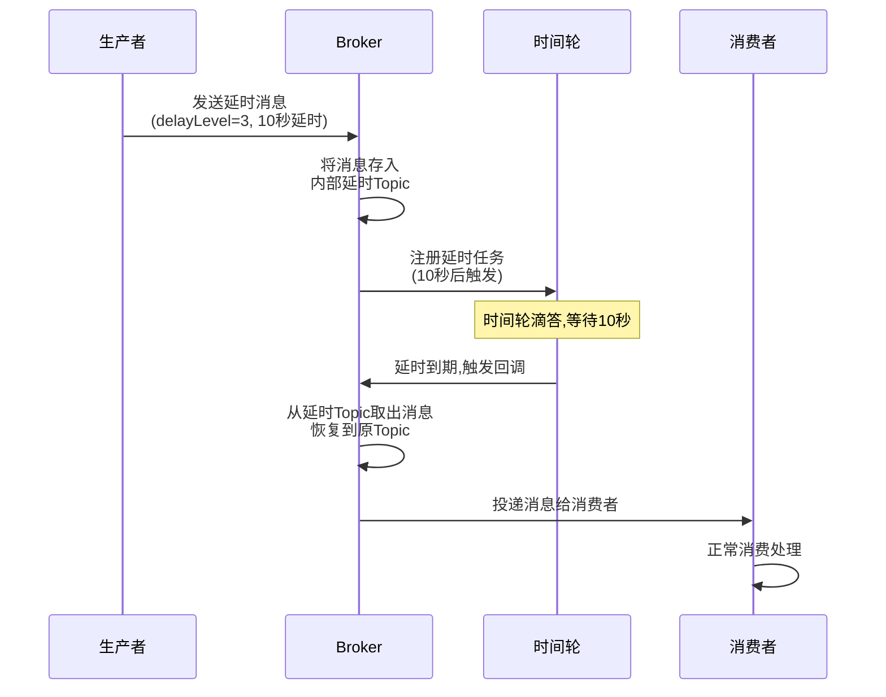
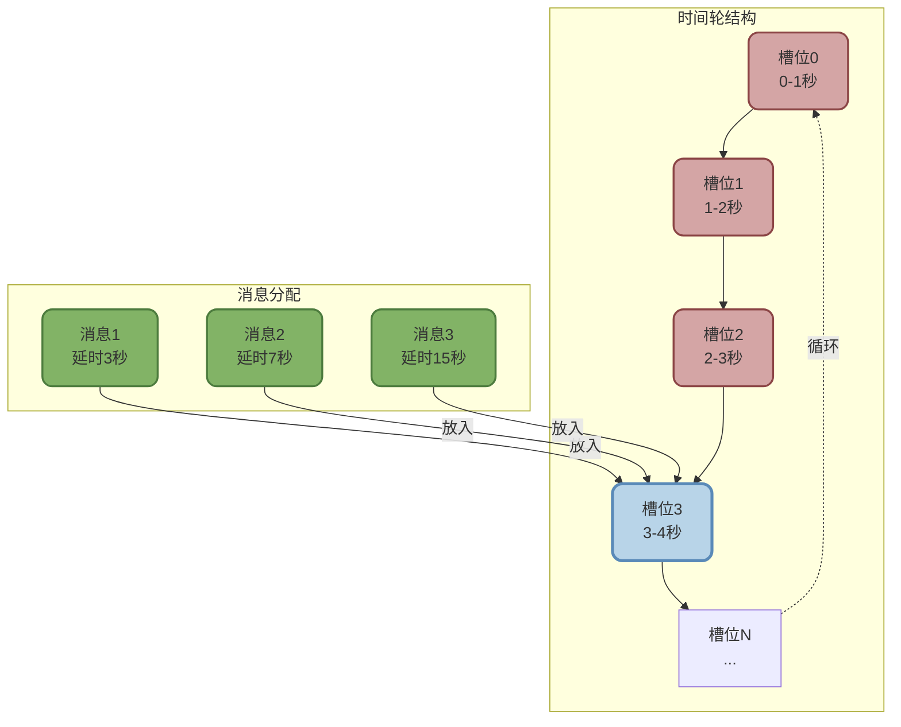

import PaidCTA from '@site/src/components/PaidCTA';

# RocketMQ高级特性与事务消息

## 延时消息实现机制

延时消息是指消息发送到Broker后,不会立即被消费者消费,而是在指定的延迟时间之后才能被消费。这一特性在电商订单超时取消、定时任务触发等场景中非常实用。

### 延时消息的工作原理

RocketMQ的延时消息并非真正的定时调度,而是通过**延时级别**和**时间轮**机制实现的。



#### RocketMQ 4.x的延时级别

在RocketMQ 4.x版本中,延时消息只支持预定义的18个时间级别,不支持任意时长。

```java
// 延时级别对应的时间
// 1s 5s 10s 30s 1m 2m 3m 4m 5m 6m 7m 8m 9m 10m 20m 30m 1h 2h
// 级别:1  2   3   4  5  6  7  8  9 10 11 12 13  14  15  16 17 18

// 延时消息生产者示例 - 订单超时取消场景
DefaultMQProducer producer = new DefaultMQProducer("order_timeout_producer");
producer.setNamesrvAddr("192.168.1.100:9876");
producer.start();

// 创建订单超时检查消息
Message msg = new Message(
    "ORDER_TIMEOUT_TOPIC",
    "TIMEOUT_CHECK",
    ("订单号:OD20250101-12345").getBytes(RemotingHelper.DEFAULT_CHARSET)
);

// 设置延时级别为14,对应10分钟延时
// 消息将在10分钟后被消费者接收
msg.setDelayTimeLevel(14);

SendResult sendResult = producer.send(msg);
System.out.println("延时消息发送成功: " + sendResult.getMsgId());
System.out.println("10分钟后将触发超时检查");

producer.shutdown();
```

#### RocketMQ 5.0的任意时长延时

RocketMQ 5.0引入了基于**时间轮**的定时消息实现,支持秒级甚至毫秒级的任意时长延时。

**时间轮的核心思想**:



时间轮的工作流程:

1. **槽位划分**: 将时间划分为固定大小的槽位,如每1秒一个槽位
2. **消息存储**: 收到延时消息后,根据延时时间计算目标槽位,将消息放入对应槽位
3. **指针滴答**: 时间轮的指针每秒向前移动一个槽位
4. **消息投递**: 当指针移动到某个槽位时,将该槽位中的所有消息投递给消费者

**优势对比**:

| 对比维度 | 4.x延时级别 | 5.0时间轮 |
|---------|------------|-----------|
| **时间精度** | 固定18个级别 | 秒级/毫秒级任意时长 |
| **性能** | Timer性能受任务数影响 | O(1)时间复杂度 |
| **扩展性** | 不支持自定义时长 | 支持任意时长 |
| **实现复杂度** | 简单 | 较复杂 |

```java
// RocketMQ 5.0任意时长延时示例
Message msg = new Message("TOPIC", "TAG", "消息内容".getBytes());

// 设置延时时间为65秒(任意时长)
msg.setDelayTimeSec(65);  // 5.0新增API

// 或者设置延时到具体时间点
long deliveryTime = System.currentTimeMillis() + 120000;  // 2分钟后
msg.setDeliverTimeMs(deliveryTime);

producer.send(msg);
```

### 延时消息的应用场景

<PaidCTA />