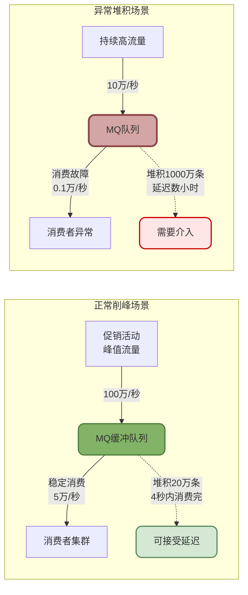
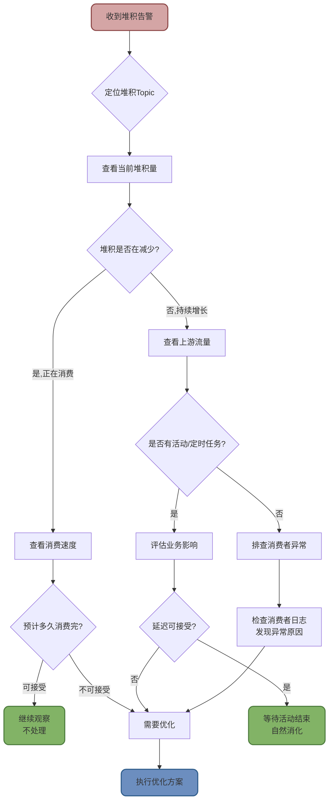

import PaidCTA from '@site/src/components/PaidCTA';

# RocketMQ性能优化与故障处理

## 消息堆积问题分析与解决

消息堆积是生产环境中最常见的MQ问题之一。虽然消息队列的核心价值就是"削峰填谷",但过度堆积会导致消息延迟、磁盘占用等问题,需要及时排查处理。

### 消息堆积的正确认知

首先需要明确:**MQ堆积是正常现象,不一定需要立即解决**。



MQ的作用就是在峰值流量时接收消息,然后让消费者按照自己的节奏慢慢消费。短时间的堆积是正常的,只要消费速度跟得上,堆积量会逐渐减少。

### 消息堆积的排查流程

当收到堆积告警时,应该按照以下步骤进行排查:



#### 排查步骤详解

**步骤1: 定位具体Topic和堆积量**

通过RocketMQ Console或监控系统查看:
- 哪个Topic堆积了?
- 当前堆积多少条消息?
- 堆积的消费者组是哪个?

```bash
# 使用mqadmin命令查看消费者组堆积情况
sh mqadmin consumerProgress -n 192.168.1.100:9876 -g order_consumer_group

# 输出示例:
# Topic: ORDER_TOPIC
# Queue: 0  Broker Offset: 1000000  Consumer Offset: 800000  Diff: 200000
# Queue: 1  Broker Offset: 1050000  Consumer Offset: 850000  Diff: 200000
# Total Diff: 400000  (总堆积40万条)
```

**步骤2: 判断堆积趋势**

<PaidCTA />