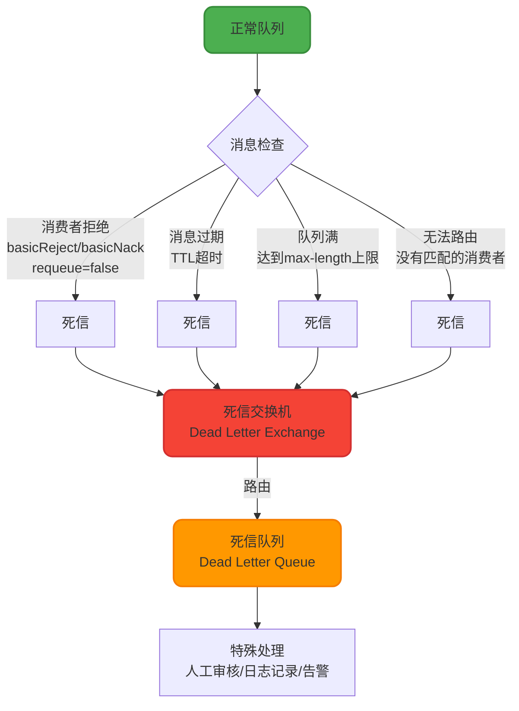
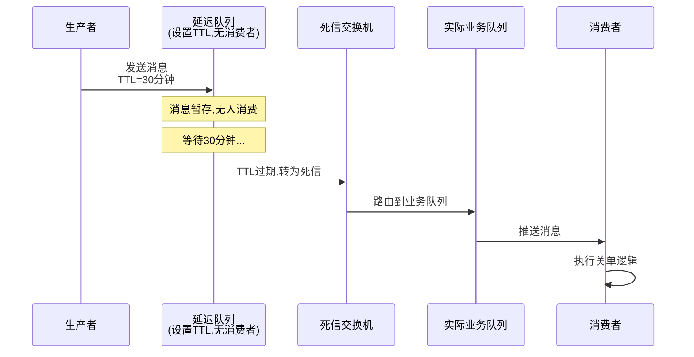
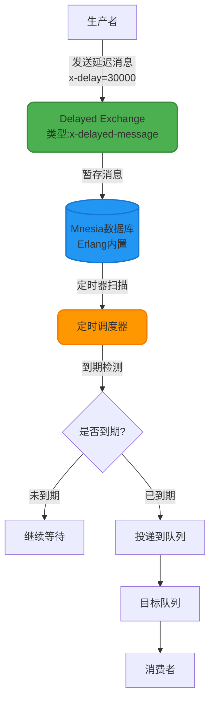
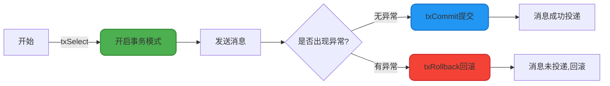

# 高级特性与应用场景

## 死信队列(Dead Letter Queue)机制

死信队列是RabbitMQ提供的一种消息兜底机制,用于处理无法被正常消费的"问题消息"。当消息因特定原因无法投递给消费者时,这些消息会被转发到死信交换机,最终路由到死信队列等待特殊处理。

### 消息成为死信的四种场景



#### 1. 消费者拒绝且不重新入队

消费者调用`basicReject()`或`basicNack()`时,将`requeue`参数设置为`false`:

```java
// 消息格式错误,业务无法处理
channel.basicReject(deliveryTag, false);  // 拒绝消息,不重新入队
```

#### 2. 消息TTL过期

队列或消息设置了过期时间(Time-To-Live),超时未被消费:

```java
// 设置消息10秒后过期
Map<String, Object> args = new HashMap<>();
args.put("x-message-ttl", 10000);
channel.queueDeclare("timeout_queue", true, false, false, args);
```

#### 3. 队列长度超限

队列达到最大长度限制(`x-max-length`),新消息会将最早的消息挤出变成死信:

```java
Map<String, Object> args = new HashMap<>();
args.put("x-max-length", 1000);  // 队列最多存储1000条消息
```

#### 4. 消息无法路由

Exchange找不到匹配的队列时,如果配置了死信机制,消息会进入死信队列。

### 死信队列配置实战

以下示例展示如何配置完整的死信队列体系:

```java
import org.springframework.amqp.core.*;
import org.springframework.context.annotation.Bean;
import org.springframework.context.annotation.Configuration;
import java.util.HashMap;
import java.util.Map;

@Configuration
public class DeadLetterQueueConfig {
    
    // ============ 死信交换机和队列 ============
    
    @Bean
    public DirectExchange deadLetterExchange() {
        return new DirectExchange("dlx_exchange");
    }
    
    @Bean
    public Queue deadLetterQueue() {
        return new Queue("dlx_queue", true);
    }
    
    @Bean
    public Binding deadLetterBinding() {
        return BindingBuilder.bind(deadLetterQueue())
                            .to(deadLetterExchange())
                            .with("dlx_routing_key");
    }
    
    // ============ 业务交换机和队列 ============
    
    @Bean
    public DirectExchange businessExchange() {
        return new DirectExchange("business_exchange");
    }
    
    @Bean
    public Queue businessQueue() {
        Map<String, Object> args = new HashMap<>();
        // 绑定死信交换机
        args.put("x-dead-letter-exchange", "dlx_exchange");
        // 死信路由键
        args.put("x-dead-letter-routing-key", "dlx_routing_key");
        // 可选:设置消息TTL为30秒
        args.put("x-message-ttl", 30000);
        // 可选:队列最大长度
        args.put("x-max-length", 10000);
        
        return QueueBuilder.durable("business_queue")
                          .withArguments(args)
                          .build();
    }
    
    @Bean
    public Binding businessBinding() {
        return BindingBuilder.bind(businessQueue())
                            .to(businessExchange())
                            .with("business_routing_key");
    }
}
```

### 消费者监听实现

```java
import com.rabbitmq.client.Channel;
import org.springframework.amqp.core.Message;
import org.springframework.amqp.rabbit.annotation.RabbitListener;
import org.springframework.stereotype.Component;
import java.io.IOException;

@Component
public class DeadLetterConsumer {
    
    /**
     * 业务队列消费者
     */
    @RabbitListener(queues = "business_queue")
    public void processBusinessMessage(Message message, Channel channel) 
            throws IOException {
        String content = new String(message.getBody());
        long deliveryTag = message.getMessageProperties().getDeliveryTag();
        
        try {
            // 模拟业务处理
            if (content.contains("error")) {
                // 消息格式异常,拒绝并转入死信队列
                channel.basicReject(deliveryTag, false);
                System.err.println("消息异常,已转入死信队列: " + content);
            } else {
                // 正常处理
                System.out.println("处理业务消息: " + content);
                channel.basicAck(deliveryTag, false);
            }
        } catch (Exception e) {
            // 异常情况拒绝消息
            channel.basicNack(deliveryTag, false, false);
        }
    }
    
    /**
     * 死信队列消费者 - 处理异常消息
     */
    @RabbitListener(queues = "dlx_queue")
    public void processDeadLetter(Message message, Channel channel) 
            throws IOException {
        String content = new String(message.getBody());
        long deliveryTag = message.getMessageProperties().getDeliveryTag();
        
        // 记录死信日志,发送告警,或人工审核
        System.err.println("🚨 收到死信消息,需要人工处理: " + content);
        logDeadLetterToDatabase(content);
        sendAlertNotification(content);
        
        // 确认死信消息已处理
        channel.basicAck(deliveryTag, false);
    }
    
    private void logDeadLetterToDatabase(String content) {
        // 持久化死信记录到数据库
    }
    
    private void sendAlertNotification(String content) {
        // 发送告警通知
    }
}
```

### 死信队列的典型应用

#### 应用1: 实现延迟消息

利用TTL过期机制,将消息发送到不消费的队列,等待过期后进入死信队列进行实际处理:



**典型场景**: 订单超时未支付自动关闭、优惠券到期提醒等。

**优势**: 
- 延迟时间灵活,支持任意时长(RocketMQ仅支持固定级别)
- 基于RabbitMQ集群,天然高可用

**缺陷**: 
- 队头阻塞问题: RabbitMQ仅检查队首消息是否过期,如果队首消息TTL较长,会阻塞后续已过期的消息
- 方案复杂度高,需要维护多套队列和交换机

#### 应用2: 消息处理失败兜底

业务消息处理失败后,转入死信队列进行补偿处理或人工介入:

```java
// 支付回调处理失败,转入死信队列等待人工审核
if (!updateOrderStatus(orderId)) {
    channel.basicReject(deliveryTag, false);  // 进入死信队列
}
```

## 延迟消息的两种实现方式

### 方案一: 基于死信队列(TTL)

如上文所述,通过TTL过期机制实现延迟消息。

**限制**:
- 队头阻塞: 需要保证消息按过期时间有序,否则长延时消息会阻塞短延时消息
- 资源消耗: 每个延迟级别可能需要独立的队列

### 方案二: 基于延迟消息插件

RabbitMQ官方提供的`rabbitmq_delayed_message_exchange`插件,从3.6.12版本开始支持,解决了死信队列的队头阻塞问题。

#### 插件工作原理



**核心差异**: 
- 死信方案: 消息先进队列,过期后转发
- 插件方案: 消息先存Mnesia数据库,定时器到期后才投递到队列

#### 插件配置示例

```java
@Configuration
public class DelayedMessageConfig {
    
    @Bean
    public CustomExchange delayedExchange() {
        Map<String, Object> args = new HashMap<>();
        args.put("x-delayed-type", "direct");  // 指定底层交换机类型
        
        // 声明延迟交换机,类型为x-delayed-message
        return new CustomExchange("delayed_exchange", 
                                 "x-delayed-message", 
                                 true, 
                                 false, 
                                 args);
    }
    
    @Bean
    public Queue delayedQueue() {
        return new Queue("delayed_queue", true);
    }
    
    @Bean
    public Binding delayedBinding() {
        return BindingBuilder.bind(delayedQueue())
                            .to(delayedExchange())
                            .with("delayed_routing_key")
                            .noargs();
    }
}
```

#### 发送延迟消息

```java
@Service
public class DelayedMessageProducer {
    
    @Autowired
    private RabbitTemplate rabbitTemplate;
    
    public void sendDelayedMessage(String content, int delayMillis) {
        rabbitTemplate.convertAndSend(
            "delayed_exchange", 
            "delayed_routing_key", 
            content,
            message -> {
                // 设置延迟时间(毫秒)
                message.getMessageProperties()
                       .setHeader("x-delay", delayMillis);
                return message;
            }
        );
        
        System.out.println("发送延迟消息,延迟时间: " + delayMillis + "ms");
    }
}

// 使用示例:30分钟后关闭订单
delayedMessageProducer.sendDelayedMessage(
    "{\"orderId\":123456}", 
    30 * 60 * 1000  // 30分钟
);
```

#### 插件方案的限制

1. **延迟时间上限**: 最大支持`(2^32)-1`毫秒,约49天,超过会被立即投递
2. **数据可靠性**: 消息存储在Mnesia数据库,仅在当前节点有单个磁盘副本,存在丢失风险
3. **性能瓶颈**: 不适合大量延迟消息场景(数十万或百万级),详见官方issue [#72](https://github.com/rabbitmq/rabbitmq-delayed-message-exchange/issues/72)
4. **定时器漂移**: 依赖Erlang定时器,大量长时间定时器会争用调度器资源,导致时间精度下降

**官方文档**: [rabbitmq-delayed-message-exchange](https://github.com/rabbitmq/rabbitmq-delayed-message-exchange#limitations)

### 延迟消息方案对比

| 对比维度 | 死信队列方案 | 延迟插件方案 |
|---------|------------|------------|
| 延迟时间限制 | 无限制 | 最大49天 |
| 队头阻塞 | 存在 | 不存在 |
| 消息存储 | 队列持久化 | Mnesia数据库 |
| 可靠性 | 高(支持集群复制) | 中(单节点副本) |
| 性能 | 中等 | 大量消息时性能差 |
| 配置复杂度 | 高(需要多套队列) | 低(仅需安装插件) |
| 版本要求 | 无 | ≥3.6.12 |

**选型建议**:
- 延迟时间固定且数量不大: 使用延迟插件,配置简单
- 海量延迟消息或高可靠性要求: 使用死信队列,或考虑专业的延迟消息中间件(如RocketMQ、时序数据库)

## 事务机制(Transaction)

RabbitMQ的事务机制提供了另一种保证消息可靠投递的方式,允许将一组操作打包成原子单元,要么全部成功,要么全部失败。

### 事务相关方法

AMQP协议定义了三个事务控制方法:



- **txSelect()**: 将当前Channel设置为事务模式
- **txCommit()**: 提交事务,消息正式投递
- **txRollback()**: 回滚事务,撤销所有操作

### 事务实现示例

```java
import com.rabbitmq.client.*;

public class TransactionExample {
    
    public static void main(String[] args) throws Exception {
        ConnectionFactory factory = new ConnectionFactory();
        factory.setHost("localhost");
        
        try (Connection connection = factory.newConnection();
             Channel channel = connection.createChannel()) {
            
            // 1. 开启事务模式
            channel.txSelect();
            
            String exchangeName = "transaction_exchange";
            String routingKey = "transaction_key";
            
            try {
                // 2. 发送第一条消息
                String message1 = "{\"type\":\"withdraw\",\"amount\":500}";
                channel.basicPublish(exchangeName, routingKey, 
                                   null, message1.getBytes());
                System.out.println("发送消息1: 扣款500元");
                
                // 3. 发送第二条消息
                String message2 = "{\"type\":\"notify\",\"content\":\"扣款成功\"}";
                channel.basicPublish(exchangeName, routingKey, 
                                   null, message2.getBytes());
                System.out.println("发送消息2: 发送通知");
                
                // 4. 模拟业务异常
                if (Math.random() > 0.5) {
                    throw new RuntimeException("业务校验失败");
                }
                
                // 5. 提交事务
                channel.txCommit();
                System.out.println("✓ 事务提交成功,两条消息全部投递");
                
            } catch (Exception e) {
                // 6. 回滚事务
                channel.txRollback();
                System.err.println("✗ 事务回滚,消息全部撤销: " + e.getMessage());
            }
        }
    }
}
```

### 事务机制的特点

**优点**:
- 保证一组消息的原子性,要么全部成功要么全部失败
- 实现简单,不需要额外的回调处理

**缺点**:
- **性能极差**: 事务是同步阻塞的,每次commit需要等待服务器确认,吞吐量仅为Confirm机制的1/10
- **不支持批量**: 事务提交是串行的,无法利用批量操作提升性能

### 事务 vs Confirm机制对比

| 对比维度 | 事务机制 | Confirm机制 |
|---------|---------|-----------|
| 执行方式 | 同步阻塞 | 异步回调 |
| 性能 | 极低(约1000 msg/s) | 高(约10000 msg/s) |
| 复杂度 | 简单 | 中等(需要处理回调) |
| 适用场景 | 小流量、强一致性要求 | 高并发、高吞吐场景 |

**生产环境建议**: 
- 优先使用Confirm机制,性能和可靠性兼具
- 仅在对性能无要求且需要严格事务保证的场景下考虑事务机制
- 对于复杂的分布式事务,建议使用本地消息表、TCC、Saga等分布式事务解决方案

## 技术选型总结

| 需求场景 | 推荐方案 | 理由 |
|---------|---------|-----|
| 延迟消息(小规模) | 延迟插件 | 配置简单,无队头阻塞 |
| 延迟消息(大规模) | 死信队列或专业中间件 | 性能和可靠性更好 |
| 异常消息处理 | 死信队列 | 提供消息兜底和审计能力 |
| 可靠消息投递 | Confirm机制 | 高性能异步确认 |
| 强事务保证(低并发) | 事务机制 | 简单直接,适合小流量 |
| 分布式事务 | 本地消息表/TCC/Saga | 应用层方案更可控 |
